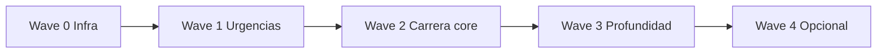

# Análisis exhaustivo — Lógica porteable Crew Chief V4 → Vantare

**Repositorio CC:** [gitlab.com/mr_belowski/CrewChiefV4](https://gitlab.com/mr_belowski/CrewChiefV4) (MIT)  
**Alcance LMU:** Le Mans Ultimate (shared memory rFactor2/LMU + REST :6397)  
**Fuentes Vantare:** `.omo/evidence/cc-behavior-parity-matrix.yaml` (LMU-01…48), `lmu-data-availability.md`, `docs/crewchief-comparison.md`, código `backend/src/intelligence/`  
**Fecha:** Jun 2026

> **Plan de ejecución completo:** [`docs/superpowers/plans/2026-06-07-crewchief-complete-port.md`](../superpowers/plans/2026-06-07-crewchief-complete-port.md) (Tasks 0–48, Definition of Done, anti-fork).

---

## 1. Resumen ejecutivo

### 1.1 Objetivo del port

Portar **condición + timing + cooldown + canal de voz** de Crew Chief, no el binario C#. El audio en Vantare será **plantilla TTS en español** (`.omo/evidence/cc-message-templates-p0.md`), no WAV Jim/Jerry.

### 1.2 Estado actual (matriz LMU-01…48)

Actualizado tras Tasks 1–14 (jun 2026): suite `crewchief_events` @ 20 Hz, routing IMMEDIATE, módulos P0 (flags, penalties, rain, damage, fuel, timings, opponents), pit menu write (dry-run), PTT tool-first.

| Paridad | Count | Significado |
|---------|-------|-------------|
| **MATCH** | 6 | Spotter lateral core (LMU-01–05), keepQuiet (LMU-35) |
| **PARTIAL** | 22 | Lógica + tests unitarios; falta validación LMU en vivo (ver checklist) |
| **MISMATCH** | 20 | Comportamiento distinto o ausente; gap de percepción restante |

Eventos P0 con tests pero aún **PARTIAL** (no MATCH): LMU-09, 13, 15, 20, 30, 33, 34, 48 — ver `evidencia_vantare` en matriz y [cc-parity-validation-checklist.md](../../.omo/evidence/cc-parity-validation-checklist.md).

### 1.3 Conclusión estratégica

| Pregunta | Respuesta |
|----------|-----------|
| ¿Es porteable la lógica CC a Vantare? | **Sí**, ~70 % de módulos Events/Spotter son portables con datos LMU actuales |
| ¿Es beneficioso vs fork CC? | **Sí** para producto Vantare (ES, Tauri, LLM PTT); fork solo si abandonáis el stack |
| ¿Qué bloquea paridad hoy? | **Arquitectura** (batch 3–8 s, 0.5 Hz), no falta de spec CC |
| ¿Qué bloquea paridad en datos? | Pit penalty **tipo**, engine/tranny damage desglosado, driver stint countdown, REST write pit menu |

### 1.4 ROI por oleada (recomendado)

| Oleada | Semanas est. | Impacto “suena a CC” |
|--------|--------------|----------------------|
| **0** Infra (GameState 20 Hz, sin batch, immediate routing) | 1–2 | Base obligatoria |
| **1** P0 urgencias (LMU-09,13,15,20,30,33) | 2–3 | **Muy alto** |
| **2** Carrera core (Timings, Position, PushNow, SessionEnd, Penalties polish) | 3–4 | Alto |
| **3** Profundidad (LapTimes sectors, WatchedOpponents, Fuel persist, FCY spotter pause) | 4–6 | Medio |
| **4** Cosmético / bajo ROI (beeps, rants, ambiance, NumberReader) | opcional | Bajo |

---

## 2. Arquitectura Crew Chief (mapa de portabilidad)

Basado en árbol documentado en `docs/crewchief-comparison.md` y repo GitLab.

### 2.1 Capas y destino Vantare

| Capa CC | Archivos clave | ¿Portar? | Destino Vantare |
|---------|----------------|----------|-----------------|
| **GameState** | `GameState/GameStateData.cs`, `*GameStateMapper.cs` | Parcial | Ya: `TelemetryFrame` + sidecar. Falta: `TimingData` condition-aware, start position |
| **LMU plugin** | `LMU/LMU_REST_API.cs`, `LMUPitMenu*.cs` | Parcial | `lmu_api.py` read-only; pit menu **gap** |
| **Spotter geom** | `NoisyCartesianCoordinateSpotter.cs`, `RF2/RF2Spotter.cs` | **Sí** | `spotter.py`, `spotter_state.py`, `cartesian_spotter.py` |
| **Events (~42)** | `Events/*.cs` | **Sí** (módulo a módulo) | Nuevo `engineer_events/` o refactor `proactive_monitors` |
| **Audio** | `PlaybackModerator.cs`, `AudioPlayer.cs`, `QueuedMessage.cs` | Parcial | `priorityAudioQueue.ts` + reglas en backend |
| **Speech** | `SpeechCommands.cs`, `CommandManager.cs` | Parcial | Fast-path ES + PTT LLM |
| **Sounds** | `Sounds.cs`, `SoundCache.cs` | No (WAV) | TTS + `ttsCache.ts` equivalente funcional |
| **Overlay** | `Overlay/*.cs` | **No** | Fuera de producto Vantare |
| **PitManager** | `*PitMenuController.cs`, `*PitMenuManager.cs` | Fase 2 | Requiere REST write + state machine |
| **MQTT** | `Events/Mqtt.cs` | Opcional | Ya `mqtt_service.py` |
| **CoDriver/Rally** | `CoDriver.cs` | **N/A** | LMU circuit |

### 2.2 Loop CC vs loop Vantare (deuda a corregir antes de portar módulos)

| | Crew Chief | Vantare hoy | Objetivo port |
|--|------------|-------------|---------------|
| Frecuencia evaluación | Cada GameState (~10–60 Hz) | 0.5 Hz engineer + 20 Hz spotter | **20 Hz** ambos canales |
| Salida ingeniero | 1 mensaje → cola | Batch 3–8 s | **1 evento → 1 mensaje** |
| Proactivo LLM | No existe | Triggers stream | **Plantillas**; LLM solo PTT |
| Estado | Monolito | Sidecar 2 s + backend | Frame canónico único |

---

## 3. Inventario completo Events/*.cs (42 módulos)

Clasificación: **P** = portar prioritario, **O** = opcional, **N** = no portar / N/A LMU, **∂** = parcial por datos LMU.

| Módulo CC | Función conductual | P/O/N/∂ | Datos LMU | Vantare hoy | Beneficio port | Esfuerzo |
|-----------|-------------------|---------|-----------|-------------|----------------|----------|
| **AbstractEvent.cs** | Base triggerInternal | P | — | Patrón `BaseTrigger` | Alto (unificar API) | M |
| **Position.cs** | P{n}, overtake, being overtaken, race start quality, reminders | **P** | ✅ gaps, place, lap times | MISMATCH LMU-20,23 | **Muy alto** | L |
| **Timings.cs** | Gap sector-based, trend, delayed validation, corner al landmark | **P** | ✅ gaps, sector | MISMATCH LMU-22 | **Muy alto** | L |
| **LapTimes.cs** | Sector deltas, fast lap, consistency 5 laps | **P** | ✅ sector times | MISMATCH LMU-32 | Alto | L |
| **LapCounter.cs** | Vuelta N, last lap | **P** | ✅ | PARTIAL LMU-08,21 | Medio | S |
| **Fuel.cs** | Niveles, fumes, about to run out, persisted usage | **P** | ✅ fuel; persist local | PARTIAL LMU-06,14,45 | Alto | M |
| **FlagsMonitor.cs** | FCY phases, yellow, blue, green | **P** | ✅ mYellowFlagState | MISMATCH LMU-15 | **Muy alto** | M |
| **Penalties.cs** | New penalty, 3-2-1, pit now, served | **P** | ∂ num_penalties only | MISMATCH LMU-13 | **Muy alto** | M |
| **DamageReporting.cs** | Impact, puncture, components, are you OK | **P** | ∂ dent/flat/REST | MISMATCH LMU-09 | **Muy alto** | L |
| **PitStops.cs** | Pit entry/exit, window, prediction | **P** | ✅ pits, strategy | PARTIAL LMU-16,17 | Alto | M |
| **PushNow.cs** | End race push win/hold/improve | **P** | ✅ best laps | MISMATCH LMU-19 | Alto | M |
| **SessionEndMessages.cs** | Won/podium/good finish/rant/disqualified | **P** | ✅ session end | MISMATCH LMU-28 | Alto | M |
| **Opponents.cs** | Tracking rivals, pit, position | **P** | ✅ competitors | PARTIAL LMU-26 | Alto | M |
| **OpponentMessages.cs** | Frases rivales | **P** | ✅ | commentary batch | Medio | S |
| **WatchedOpponents.cs** | Watch voice, PB lap, pit exit delta | **P** | ✅ | MISMATCH LMU-34 | Medio-alto | M |
| **ConditionsMonitor.cs** | Rain levels, temp track/air | **P** | ✅ mRaining | MISMATCH LMU-30 | **Muy alto** | M |
| **TyreMonitor.cs** | Wear, temps, compound | **P** | ✅ wear/temp | MISMATCH LMU-18 | Medio | M |
| **EngineMonitor.cs** | Water/oil warnings | **O** | ∂ temp | PARTIAL LMU-29 | Bajo-medio | S |
| **Battery.cs** | Hybrid SOC (Hypercar) | **O** | ✅ hybrid fields | `HybridDeployMapTrigger` | Medio LMU | S |
| **MulticlassWarnings.cs** | Lapping / class messages | **P** | ✅ class | PARTIAL LMU-12 | Medio | S |
| **FrozenOrderMonitor.cs** | Red flag frozen order | **P** | ✅ game phase | proactive frozen | Medio | S |
| **DriverSwaps.cs** | Stint countdown 15/10/5/2 min | **∂** | ❌ stint seconds | MISMATCH LMU-25 | Medio (solo name change) | S–L |
| **OvertakingAidsMonitor.cs** | DRS / push-to-pass | **O** | ∂ DRS LMU | partial | Bajo LMU | S |
| **PearlsOfWisdom.cs** | Encouragement tied to position | **O** | — | PARTIAL LMU-24 | Bajo | S |
| **RaceTime.cs** | Time remaining reports | **O** | ✅ | lap_complete partial | Medio | S |
| **Strategy.cs** | High-level strategy messages | **P** | ✅ strategy advice | mezclado LLM | Medio | M |
| **Spotter.cs** (Events) | Grid side, global spotter rules | **∂** | ✅ positions | LMU-36 missing | Medio | M |
| **Timings_legacy.cs** | Legacy | **N** | — | — | — | — |
| **Fuel_legacy.cs** | Legacy | **N** | — | — | — | — |
| **Opponents_legacy.cs** | Legacy | **N** | — | — | — | — |
| **LapTimes_legacy.cs** | Legacy | **N** | — | — | — | — |
| **WatchedOpponents_legacy.cs** | Legacy | **N** | — | — | — | — |
| **OverlayController.cs** | Voice overlay control | **N** | — | — | — | — |
| **VROverlayController.cs** | VR overlay | **N** | — | — | — | — |
| **CoDriver.cs** | Rally pace notes | **N** | N/A | — | — | — |
| **AlarmClock.cs** | Real-world alarm | **N** | N/A | — | — | — |
| **IRacingBroadcastMessageEvent.cs** | iRacing only | **N** | N/A | — | — | — |
| **Ratings.cs** | iRating etc. | **N** | N/A | — | — | — |
| **Mqtt.cs** | Telemetry publish | **O** | — | mqtt_service | Bajo | S |
| **CommonActions.cs** | Shared actions | **P** | — | disperso | Medio | S |
| **CommonDataContainers.cs** | DTOs | **P** | — | models | Medio | S |
| **NullEvent.cs** | Placeholder | **N** | — | — | — | — |
| **SmokeTest.cs** | Internal test | **N** | — | tests pytest | — | — |

**Leyenda esfuerzo:** S = días, M = 1–2 sem, L = 2–4 sem (con tests + LMU validation).

---

## 4. Spotter y geometría (fuera de Events/)

| Componente CC | LMU IDs | Paridad | Portar | Notas |
|---------------|---------|---------|--------|-------|
| `NoisyCartesianCoordinateSpotter.cs` | LMU-01–03 | MATCH/P1 | **Sí** | Refinar histéresis line-astern (LMU-03 P1) |
| Pit limiter logic | LMU-04–05 | MATCH | Mantener | Ya en `spotter.py` / `pit_limiter_monitor.py` |
| FCY spotter pause | LMU-40 | MISMATCH | **Sí P1** | `CrewChief.cs` cooldown 10–30 s |
| Grid side | LMU-36 | MISMATCH | Opcional P2 | Mejora race start (LMU-23) |
| Fuel on spotter channel | LMU-06 | PARTIAL | **Mover** a Fuel.cs engineer | CC canal ingeniero p10 |

---

## 5. Audio / Playback (port parcial, alto impacto)

| Componente CC | LMU ID | Portar | Beneficio | Implementación Vantare |
|---------------|--------|--------|-----------|----------------------|
| `playMessageImmediately` | LMU-33 | **Sí P0** | Críticos <100 ms | `ImmediateAlert` → no batch |
| Priority 0–15 | LMU-31,38 | **Sí P1** | Orden fino | IMMEDIATE/HIGH/NORMAL |
| `DelayedMessage` re-validation | LMU-22,38 | **Sí P1** | No gaps stale | Pre-play check gap/opponent |
| Message expiry 2 s | LMU-02,38 | **Sí P1** | No clear tardío | TTL en cola |
| `maxPermittedQueueLength` | LMU-31 | **Sí P2** | Anti-flood | Max queue config |
| Radio beeps | LMU-43 | Opcional | Cosmético F1 | WAV beep + TTS |
| Background ambiance | LMU-39 | **No** | Bajo | — |
| SoundCache WAV | LMU-37 | **No** | — | `ttsCache.ts` suficiente |
| Rants | LMU-44 | Opcional | Humor CC | Pool TTS desactivable |
| NumberReader | LMU-46 | Opcional | TTS determinista | `time_format.py` extend |

---

## 6. Speech / CommandManager

| Área CC | Portar | Beneficio | Vantare |
|---------|--------|-----------|---------|
| 100+ grammar commands | **Parcial** | Precisión PTT | LLM hoy |
| "spot" / "don't spot" | **Sí** | <100 ms | `spotterCommands` ✓ |
| "how's my fuel" etc. | **Fast-path P1** | CC-like instant | LLM lento |
| Pit voice ("add 10 litres") | **Fase 2** | Gap crítico CC | ❌ sin PitManager |
| Driver name training | **No** | — | fuzzy names ✓ |

**Recomendación:** portar **10–15 comandos** más frecuentes como plantillas + datos ticker; resto LLM.

---

## 7. LMU-specific (CrewChiefV4/LMU/)

| Componente CC | Portar | Datos | Vantare |
|---------------|--------|-------|---------|
| `LMU_REST_API.cs` read | **Sí** | ✅ :6397 | `lmu_api.py` ✓ |
| `LMUPitMenuController` write | **Fase 2** | REST write | read-only LMU-48 |
| Pit menu abstraction | **Fase 2** | — | Mayor gap vs CC |
| JSON schemas | Referencia | ✅ | dev dummy posible |

---

## 8. Matriz LMU-01…48 — tabla consolidada portabilidad

| ID | Módulo CC | Paridad | Portar | Prioridad | Bloqueo datos |
|----|-----------|---------|--------|-----------|---------------|
| 01 | Spotter L/R | MATCH | Refinar | P2 | — |
| 02 | Spotter clear | MATCH | TTL expiry | P2 | — |
| 03 | Three-wide | MATCH | Line-astern | P1 | — |
| 04–05 | Pit limiter | MATCH | — | — | — |
| 06 | Fuel critical | PARTIAL | Fuel.cs logic | P1 | — |
| 07 | SC/FCY basic | PARTIAL | FlagsMonitor | P1 | — |
| 08 | Last lap | PARTIAL | LapCounter | P1 | — |
| 09 | Damage | MISMATCH | DamageReporting | **P0** | ∂ no engine/tranny |
| 10 | Gap timer spotter | MISMATCH | Timings optional | P1 | toggle |
| 11 | Brakes 80% | PARTIAL | TyreMonitor/brakes | P1 | REST only → backend |
| 12 | Multiclass | PARTIAL | MulticlassWarnings | P1 | — |
| 13 | Penalties | MISMATCH | Penalties.cs | **P0** | ∂ no penalty type |
| 14 | Fuel engineer | PARTIAL | Fuel.cs | P1 | — |
| 15 | Flags full FCY | MISMATCH | FlagsMonitor | **P0** | ✅ mYellowFlagState |
| 16–17 | Pit window | PARTIAL | PitStops.cs | P2 | — |
| 18 | Tyre temp | MISMATCH | TyreMonitor | P1 | ✅ temps |
| 19 | PushNow | MISMATCH | PushNow.cs | P1 | ✅ best lap |
| 20 | Position/overtake | MISMATCH | Position.cs | **P0** | ✅ |
| 21 | Lap complete | PARTIAL | LapTimes+Timings | P1 | — |
| 22 | Gap Timings | MISMATCH | Timings.cs | P1 | — |
| 23 | Race start quality | MISMATCH | Position.cs | P1 | ✅ start pos derivable |
| 24 | Pearls | PARTIAL | PearlsOfWisdom | P2 | — |
| 25 | Driver swap | MISMATCH | ∂ DriverSwaps | P1 | ❌ stint timer |
| 26 | Competitor pit | PARTIAL | Opponents | P1 | — |
| 27 | Gap closed battle | PARTIAL | Timings | P2 | — |
| 28 | Session end | MISMATCH | SessionEndMessages | P1 | — |
| 29 | Engine monitor | PARTIAL | EngineMonitor | P2 | ∂ |
| 30 | Rain | MISMATCH | ConditionsMonitor | **P0** | ✅ mRaining |
| 31–38 | Playback queue | PARTIAL/MISMATCH | AudioPlayer | P1–P2 | — |
| 33 | Critical latency | MISMATCH | Architecture | **P0** | — |
| 34 | Watched opponents | MISMATCH | WatchedOpponents | P1 | — |
| 35 | keepQuiet | MATCH | — | — | — |
| 36 | Grid side | MISMATCH | Spotter.cs | P2 | — |
| 37 | WAV cache | MISMATCH | No | P2 | N/A TTS |
| 39 | Ambiance | MISMATCH | No | — | — |
| 40 | FCY spotter pause | MISMATCH | CrewChief.cs | P1 | — |
| 41 | Per-class msgs | MISMATCH | Low ROI LMU | P2 | — |
| 42 | Condition-aware timing | MISMATCH | GameState TimingData | P1 | ∂ wetness |
| 43–44 | Beeps/rants | MISMATCH | Opcional | P2 | — |
| 45 | Fuel persist | MISMATCH | Fuel.cs | P1 | local JSON |
| 46 | NumberReader | MISMATCH | Opcional | P2 | — |
| 47 | 6s session delay | MISMATCH | CrewChief.cs | P1 | — |
| 48 | Pit menu RW | MISMATCH | Fase 2 | P1 | REST write |

---

## 9. Qué NO portar (o posponer indefinidamente)

| Área | Razón |
|------|--------|
| Overlay / Charts / VR | Producto distinto |
| CoDriver / Rally | N/A LMU |
| iRacing Ratings / broadcast | N/A |
| Legacy `*_legacy.cs` | Usar versión moderna |
| 17 juegos mappers | Solo LMU/RF2 path |
| WiX installer / AutoUpdater | Tauri update strategy |
| Grammar SAPI completa | ROI bajo vs fast-path + LLM |
| PitManager completo (20+ archivos) | Proyecto aparte; beta+ |
| WAV SoundCache | TTS es decisión producto |

---

## 10. Metodología de port (por módulo CC)

1. **Leer** `Events/X.cs` + propiedades `UserSettings` relacionadas en CC repo.
2. **Extraer** de matriz YAML: dispara / no dispara / repetición / canal / prioridad.
3. **Verificar** `lmu-data-availability.md` — marcar ∂ si fallback.
4. **Implementar** en Python:
   - `class XEventEngineerModule` con `evaluate(prev_state, curr_state) -> list[EngineerMessage]`
   - Sin LLM; texto desde templates P0 ES.
5. **Enrutar** salida: `playMessageImmediately` → `AlertMessage` IMMEDIATE; resto → cola NORMAL **sin batch**.
6. **Test** unitario con fixture telemetría + test integración `verify_*`.
7. **Validar** LMU una sesión; actualizar YAML `paridad: MATCH`.

### Patrones CC a portar explícitamente

| Patrón CC | Descripción | Vantare target |
|-----------|-------------|----------------|
| `triggerInternal(prev, curr)` | Edge detection | Estado previo en módulo |
| `DelayedMessage` + callback | Re-validar antes de hablar | Pre-TTS hook |
| `isMessageStillValid()` | in_pits, FCY, session | Gates compartidos |
| `enable_*` flags | User toggles | `config_update` WS |
| Sector-based frequency | Randomness 1–10 | Config UI |
| `minSessionParticipationTime` | 6 s warmup | engine startup |
| Opponent key tracking | Overtake detection | dict driver_index |

---

## 11. Mapeo Vantare actual → acción de port

| Archivo Vantare | Rol actual | Acción port CC |
|-----------------|------------|----------------|
| `proactive_monitors.py` | Monolito + batch | **Split** en módulos Events; quitar batch |
| `triggers.py` | LLM automático | **Reclasificar**: ALERT/template vs LLM-only PTT |
| `commentary_orchestrator.py` | Debounce 3–8 s | **Degradar** a opt-in summary |
| `commentary_llm_formatter.py` | LLM batch | No usar en proactivo CC |
| `flags_monitor.py` | Transiciones | **Extender** FCY phases LMU-15 |
| `penalty_tracker.py` | Básico | **Extender** 3-2-1 LMU-13 |
| `pit_prediction.py` | Template | Integrar PitStops.cs timing |
| `spotter.py` | 20 Hz | FCY pause LMU-40; mover fuel/damage canal |
| `rain_monitor.py` | Parcial | Alinear ConditionsMonitor levels |
| `damage_report.py` | Parcial | DamageReporting.cs LMU-09 |
| `sector_analysis.py` | Fuel sectors | ≠ LapTimes.cs — port sector deltas |
| `shared-strategy/*` | Cálculo | **Mantener** — alimenta Events, no reemplaza |
| `priorityAudioQueue.ts` | 2 niveles | 3 niveles + expiry LMU-38 |

---

## 12. Beneficio vs esfuerzo (matriz 2×2)

### Cuadrante A — **Portar ya** (alto beneficio, bajo-medio esfuerzo)

- LMU-33 Immediate routing (infra)
- LMU-15 FlagsMonitor FCY phases
- LMU-30 Rain real-time (mRaining ya en frame)
- LMU-13 Penalties countdown (con tracker vueltas)
- LMU-47 Session 6 s delay
- LMU-40 FCY spotter pause
- LMU-06/14 Fuel messages engineer channel

### Cuadrante B — **Portar planificado** (alto beneficio, alto esfuerzo)

- LMU-20 Position + overtake detection
- LMU-22 Timings gap sector-based
- LMU-09 Damage multicomponente (∂ datos)
- LMU-19 PushNow determinista
- LMU-28 SessionEnd evaluation
- LMU-32 Sector deltas LapTimes

### Cuadrante C — **Portar si hay tiempo**

- LMU-34 Watched opponents + PTT
- LMU-45 Fuel persistence
- LMU-23 Race start quality
- LMU-24 Pearls slider
- LMU-38 Queue delayed validation

### Cuadrante D — **No portar** (bajo beneficio)

- LMU-39 ambiance, LMU-44 rants, LMU-43 beeps (opcional polish)
- LMU-41 per-class (LMU solo 3 clases)
- LMU-37 WAV system
- Overlays, CoDriver, iRacing

---

## 13. Restricciones LMU (no inventar en port)

Documentado en `lmu-data-availability.md`:

| CC asume | LMU | Estrategia port |
|----------|-----|-----------------|
| Penalty type DT/SG | Solo `num_penalties` | Conteo vueltas genérico |
| Engine/tranny damage % | No SM | Dent + REST; omitir tranny |
| Driver stint countdown | No SM | Solo `driver_name` change |
| Brake wear en tick | REST 3 s | Backend poll, no sidecar-only |
| Pit menu voice control | REST RW | Fase 2 separada |

---

## 14. Licencia y fork

Crew Chief V4 es **MIT**. Podéis:

- Copiar lógica (traducida) con atribución
- Consultar C# como spec ejecutable
- No copiar assets WAV (licencia pack aparte)

Fork completo del repo **no es necesario** para port modular.

---

## 15. Referencias cruzadas

| Documento | Uso |
|-----------|-----|
| [pipelines/README.md](./architecture/pipelines/README.md) | Arquitectura objetivo voz |
| [00-parity-charter.md](./architecture/pipelines/00-parity-charter.md) | Definition of Done |
| `.omo/evidence/cc-behavior-parity-matrix.yaml` | Spec por mensaje |
| `.omo/evidence/cc-message-templates-p0.md` | Texto TTS ES |
| `.omo/evidence/cc-p0-wave1-locked.md` | Wave 1 histórico |
| `.omo/evidence/lmu-data-availability.md` | Factibilidad datos |
| `docs/crewchief-comparison.md` | Árbol CC completo |

---

## 16. Veredicto final

**Portar lógica concreta módulo a módulo es viable, beneficioso y preferible al fork** para Vantare Ingeniero, siempre que:

1. Se porte **comportamiento** (triggerInternal + timings), no archivos C#.
2. Se corrija **infra primero** (LMU-33: sin batch, 20 Hz, immediate).
3. Se priorice **Cuadrante A + B** de la sección 12.
4. Se acepte **∂** en datos LMU con fallbacks documentados.
5. Se mantenga **LLM fuera del proactivo** CC-like.

El techo restante será **timbre TTS** y **PitManager voz** — no la lógica de cuándo hablar, que es portables al ~90 % con datos LMU actuales.
