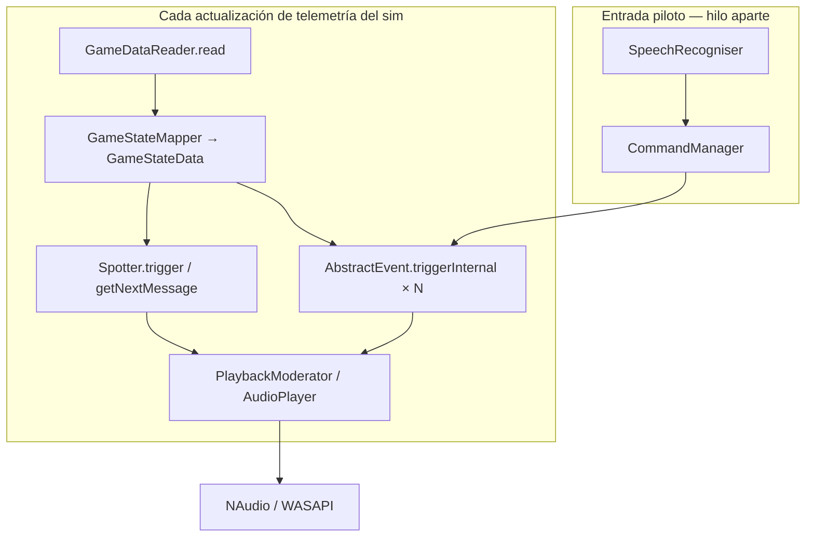

# Arquitectura de referencia — Crew Chief V4

Documento de **estructura CC** para entender qué debe imitar Vantare a nivel conductual. No es un plan de portar C# a Python.

## Loop principal (`CrewChief.cs`)

En CC todo cuelga de un **bucle de lectura del juego** (por sim/plugin):

**Propiedades clave:**

- **Un solo `GameStateData`** por tick — spotter e ingeniero ven lo mismo.
- **Sin capa “strategy service” separada** — fuel, pits, gaps viven en `Events/*.cs`.
- **Sin LLM** — respuestas = WAV + TTS Windows + plantillas.
- **Sin batch de narración** — cada evento encola (o reproduce) su mensaje.

## Capas del repositorio CC

| Carpeta / archivo | Función | Equivalente Vantare (objetivo) |
|-------------------|---------|--------------------------------|
| `AllGames/GameDataReader.cs` | Lee datos crudos del sim | `shared-telemetry` + sidecar |
| `*GameStateMapper.cs` | Normaliza a `GameStateData` | `StrategyRunner` → `TelemetryFrame` |
| `NoisyCartesianCoordinateSpotter.cs` | Lateral, 3-wide, clear | `spotter.py` + `spotter_state.py` |
| `Spotter.cs` | Reglas globales spotter | Constantes + gates en `spotter.py` |
| `Events/*.cs` (~42) | Ingeniero proactivo | `proactive_monitors` + `triggers` (**reorganizar**) |
| `Audio/PlaybackModerator.cs` | Prioridades, colas, corte | `priorityAudioQueue.ts` |
| `Audio/Sounds.cs` | Carga WAV, TTS fallback | TTS backend + `spotter_phrases` |
| `SpeechCommands.cs` + `CommandManager.cs` | Comandos piloto | `usePTT` + LLM (**delta**) |
| `UserSettings.cs` / propiedades | Toggles `enable_*` | `ConfigTab` + WS `config_update` |

## Spotter vs ingeniero en CC

No es solo “rápido vs lento”. Es **rol + canal de playback**:

| Aspecto | Spotter | Ingeniero (Events) |
|---------|---------|-------------------|
| Archivos | `*Spotter.cs`, limiter en callbacks | `Fuel.cs`, `Position.cs`, `Timings.cs`, … |
| Típico `SoundType` | `IMPORTANT_MESSAGE` | Normal / `IMPORTANT_MESSAGE` si urgente |
| Reproducción | A menudo `playMessageImmediately` | Cola con prioridad numérica |
| Repetición | hold-repeat 3 s, clear 150 ms | Por módulo (fuel 5 s, gap por sector) |
| Qualifying | `spotterOffQualifying`, timetrial off | Varios `applicableSessionTypes` |

**Errores frecuentes al portar:** meter FCY, fuel crítico o last lap solo en spotter cuando CC los trata como **ingeniero** (prioridad 10) — la matriz YAML indica el canal CC por ítem LMU-xx.

## PlaybackModerator — prioridades (concepto)

CC usa prioridades numéricas y tipos de sonido. Mapeo conceptual a Vantare:

| CC | Comportamiento | Vantare |
|----|----------------|---------|
| `playMessageImmediately` | Salta cola | `enqueueImmediate` / alert CRITICAL |
| Prioridad alta (15, 10) | Daño, FCY, penalización | IMMEDIATE o HIGH alert |
| Prioridad media (5) | Gaps, push, timings | NORMAL (pero **sin batch**) |
| Prioridad baja (3) | DRS, info | NORMAL + verbosidad |
| Spotter durante mensaje largo | Interrumpe ingeniero | IMMEDIATE preempt NORMAL |
| `message expiry` ~2 s | No hablar si tarde | `ttl` en alert (**parcial**) |

## Módulos Events relevantes para LMU (ingeniero)

Lista de referencia para pipeline 03 — no exhaustiva del repo multi-juego:

| Módulo CC | Qué dice / cuándo | IDs matriz |
|-----------|-------------------|------------|
| `Position.cs` | P{n}, overtake, being overtaken, race start quality | LMU-20 |
| `Timings.cs` | Gap adelante/detrás por sector, corner names al landmark | LMU-21, LMU-22 |
| `LapTimes.cs` / `LapCounter.cs` | Vuelta N, fast lap, last lap | LMU-08, LMU-21 |
| `Fuel.cs` | Niveles, fumes, about to run out | LMU-06 |
| `PitStops.cs` | Ventana, parada, predicción salida | LMU-23+ |
| `Opponents.cs` / `OpponentMessages.cs` | Rival en boxes, cambios | LMU-24+ |
| `FlagsMonitor.cs` | FCY fases, yellow, blue, green | LMU-07, LMU-15 |
| `Penalties.cs` | 3-2-1, pit now, served | LMU-13 |
| `PushNow.cs` | Final carrera, hold/improve/win | LMU-19 |
| `SessionEndMessages.cs` | Fin sesión, posición final | LMU-08, LMU-28 |
| `DamageReporting.cs` | Componentes, puncture, are you OK | LMU-09 |
| `ConditionsMonitor.cs` | Lluvia, tráfico | LMU-25+ |
| `PearlsOfWisdom.cs` | Ánimo / comeback | Perlas Vantare |
| `MulticlassWarnings.cs` | Doblando / doblado | LMU-26+ |
| `FrozenOrderMonitor.cs` | Orden congelado | frozen_order |
| `DriverSwaps.cs` | Endurance swaps | driver_swaps |

## Propiedades CC (= timings conductuales)

Muchos “timings” de paridad son **UserSettings / properties**, no hardcode:

| Propiedad CC | Default típico | Uso |
|--------------|----------------|-----|
| `min_speed_for_spotter` | 10 m/s | Gate lateral |
| `spotter_hold_repeat_frequency` | 3 s | Reanuncio lateral |
| `spotter_clear_delay` | 150 ms | Clear left/right |
| `spotter_overlap_delay` | 2000 ms | 3-wide bounce |
| `time_after_race_start_for_spotter` | 20 s | Silencio salida |
| `enable_gap_messages` | true | Timings gap voz |
| `frequency_of_gap_ahead_reports` | 1–10 | Sectores entre gaps |
| `enable_position_messages` | true | Position en sesión |
| `fuelStatusCheckInterval` | 5 s | Fuel check |
| `timeToWaitForDamageToSettle` | 3 s | Daño post-impacto |

Vantare expone análogos vía `config_update` → `SpotterService.apply_runtime_config()` y flags en monitors.

## Frecuencia real en CC

- **No hay “0.5 Hz ingeniero”** — los Events se evalúan cuando llega `GameState` nuevo (típicamente cada tick de telemetría del plugin, comparable a **10–60 Hz** según sim).
- El **spotter** corre en el mismo ciclo o en callback ligado al mismo estado.
- La percepción de “cada pocos segundos” en fuel/gap viene de **cooldowns internos**, no de un loop lento global.

**Implicación para Vantare:** el sidecar @ 2 s y `evaluate_cycle` @ 0.5 Hz son **deuda de implementación**, no objetivo de paridad.

## Qué CC no tiene (extensiones Vantare)

Ver [06-vantare-implementation-deltas.md](./06-vantare-implementation-deltas.md): LLM, RAG, sidecar dual-process, `shared-strategy`, MessagePack UI, etc.
