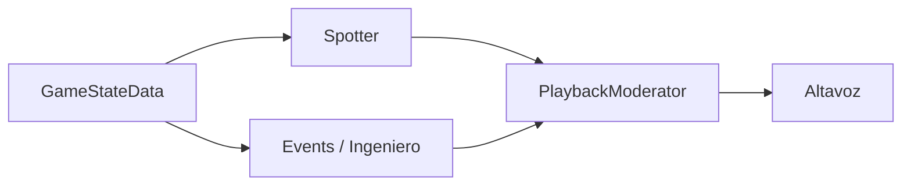

# Carta de paridad — Ingeniero y Spotter como Crew Chief

## Objetivo (una frase)

**El piloto debe percibir el mismo ingeniero y el mismo spotter que en Crew Chief V4 en LMU:** mismos momentos de habla, mismas reglas de repetición, mismos silencios — **solo cambia el timbre** (TTS en español en lugar de WAV/Jim/Jerry).

Esto **no** significa copiar el repo C# ni sus 450 archivos. Significa **paridad conductual verificable** contra la matriz `.omo/evidence/cc-behavior-parity-matrix.yaml`.

## Qué es paridad

| Dimensión | Paridad = | No es paridad |
|-----------|-----------|---------------|
| **Cuándo** | Mismo trigger (flanco, sector, vuelta, fase FCY, umbral gap) | “Más o menos cuando tiene sentido” |
| **Qué** | Mismo tipo de mensaje (clear left, pits open, P3, fuel fumes) | Texto LLM que resume tres hechos distintos |
| **Cadencia** | hold-repeat 3 s, clear 150 ms, gap por sector, edge-once por vuelta | Batch debounce 3–8 s uniendo eventos |
| **Canal** | Spotter interrumpe; ingeniero encola con prioridad CC | Todo por `commentary_end` NORMAL |
| **Sesión** | Practice/quali/race según flags CC (`enable_*`, `applicableSessionTypes`) | Inferir “race” por string stale |
| **Voz** | TTS / Edge / Piper | WAV pregrabado |

## Dos voces (modelo Crew Chief)

Crew Chief no tiene “un pipeline de audio”. Tiene **dos roles** que comparten un moderador:

| Rol CC | Responsabilidad | Latencia objetivo | Vantare hoy |
|--------|-----------------|-------------------|-------------|
| **Spotter** | Lateral, three-wide, limiter, algunos urgentes | `playMessageImmediately` / IMPORTANT_MESSAGE | `SpotterService` @ 20 Hz → `alert` IMMEDIATE |
| **Ingeniero** | Fuel, posición, pits, rivales, banderas, timings | Cola con prioridad 3–10; algunos immediate | `ProactiveMonitorSuite` + `triggers` → batch/LLM (**desalineado**) |

## Definition of Done (paridad)

Un mensaje está en paridad cuando en la matriz YAML:

- `paridad: MATCH` o `PARTIAL` con plan de cierre acordado
- Test CI o script `verify_*` reproduce el trigger
- Validación LMU documentada en `.omo/evidence/`

Un mensaje está **fuera de paridad** cuando:

- Pasa por `CommentaryOrchestrator` debounce sin equivalente CC
- Usa LLM donde CC usa WAV determinista (`PushNow`, status completo)
- Timing distinto (p. ej. gap cada 45 s vs sector-based en `Timings.cs`)

## Anti-patrones Vantare (evitar en implementación)

1. **`commentary_end` batch como vía principal del ingeniero** — CC no junta “Subiste a P1 + parada + gap” en una frase.
2. **Evaluar ingeniero a 0.5 Hz** — CC evalúa eventos en cada actualización de `GameState` (≈ frecuencia del sim).
3. **Spotter e ingeniero con telemetría distinta** — CC: un solo `GameStateData`.
4. **LLM en lugar de plantilla** para mensajes que en CC son fijos (penalty 3-2-1, FCY phases, position P{n}).
5. **Gating por string `session_type`** sin `session_type_int` (mSession).

## Documentos de esta carpeta

| Doc | Pregunta que responde |
|-----|------------------------|
| [00-crewchief-reference-architecture.md](./00-crewchief-reference-architecture.md) | ¿Cómo está organizado CC por dentro? |
| [01-game-state-ingest.md](./01-game-state-ingest.md) | ¿De dónde sale el GameState? |
| [02-spotter-channel.md](./02-spotter-channel.md) | ¿Cuándo habla el spotter y con qué timings? |
| [03-engineer-events-channel.md](./03-engineer-events-channel.md) | ¿Cuándo habla el ingeniero y qué módulo CC corresponde? |
| [04-playback-moderator.md](./04-playback-moderator.md) | ¿Quién interrumpe a quién? |
| [05-pilot-commands.md](./05-pilot-commands.md) | ¿Cómo responde a la voz del piloto? |
| [06-vantare-implementation-deltas.md](./06-vantare-implementation-deltas.md) | ¿Qué añade Vantare que CC no tiene? |

## Fuente de verdad conductual

1. **Matriz YAML** — `.omo/evidence/cc-behavior-parity-matrix.yaml` (LMU-01 … LMU-45+)
2. **Templates P0** — `.omo/evidence/cc-message-templates-p0.md`
3. **Auditoría** — `.omo/evidence/cc-audit-2026-06.md`
4. **Código CC** — GitLab `CrewChiefV4` (referencia, no fork)
