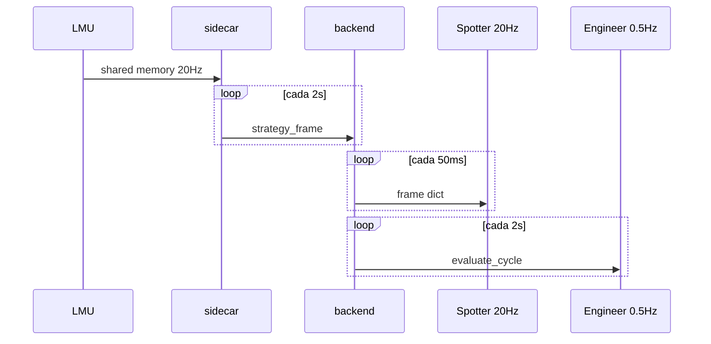

# Pipeline — GameState / ingest (LMU → frame canónico)

## Rol en paridad CC

Equivalente a **`GameDataReader` + `*GameStateMapper` → `GameStateData`**. Sin un GameState correcto y único, spotter e ingeniero **no pueden** hablar como CC.

## CC vs Vantare

| CC | Vantare |
|----|---------|
| Un reader por plugin LMU | `TelemetryReader` en sidecar (`offline=False`) |
| `RF2GameStateMapper` / LMU mapper | `StrategyRunner.process_cycle()` → `TelemetryFrame` |
| Estado en memoria en proceso CC | `strategy_frame` WS → `latest_strategy_frame` |

## Frecuencia

| | CC (objetivo conductual) | Vantare (implementación) | Gap |
|--|--------------------------|---------------------------|-----|
| Lectura sim | Cada tick telemetría | 20 Hz en sidecar reader | OK |
| Estado visible para voz | Mismo tick | Sidecar publica **2 s**; spotter relay **20 Hz** último frame | **Ingeniero ve datos más viejos que spotter si no comparten frame** |

**Objetivo paridad:** todos los consumidores de voz leen el **mismo** snapshot actualizado a la máxima frecuencia disponible (ideal: 20 Hz en Windows).

## Contrato — campos críticos para voz

Ver `shared-strategy/models.py` → `TelemetryFrame`.

| Campo | LMU | Por qué importa a CC-parity |
|-------|-----|----------------------------|
| `session_type_int` | mSession | Gates practice/quali/race (`Position`, `Timings`) |
| `competitors[]` + pos/path | vehicles | Spotter lateral |
| `time_gap_car_ahead/behind` | scoring | Timings, GapClosed |
| `yellow_flag_state`, phases | scoring | FlagsMonitor |
| `raining_intensity` | mRaining | ConditionsMonitor |
| `tyre_flat_*`, damage fields | wheels | DamageReporting |
| `num_penalties`, sector | scoring | Penalties |
| `session_laps_left`, `session_time_left` | session | PushNow, SessionEnd |

## Flujo Vantare

## Archivos

- `sidecar/src/sidecar/strategy_runner.py` — productor Windows
- `shared-telemetry/` — reader
- `backend/src/routers/websocket.py` — `/ws/sidecar`, `_enrich_frame_session`
- `shared-telemetry/shared_telemetry/session_kind.py` — mSession → kind

## Reglas de paridad

1. **`session_type_int` obligatorio** en cada frame de producción.
2. **No** clasificar sesión solo por string `session_type` si contradice mSession.
3. Sidecar caído → fallback offline solo en dev; en pista CC siempre tiene sim real.

## Verificación

- `scripts/verify_session_pipeline.py`
- `shared-telemetry/tests/test_session_kind.py`

## Deuda → objetivo

| Deuda | Objetivo CC-like |
|-------|------------------|
| Publicación 2 s | Mantener cálculo estrategia @ 2 s OK; **voz** debe evaluar @ 20 Hz o en cada frame nuevo |
| Dos productores (sidecar + StrategyService) | Un productor en Windows |
| Frame stale en ingeniero | `evaluate_cycle` en cada tick telemetría o frame 20 Hz |

---

*Documento anterior: `01-ingest-canonical-frame.md` — renombrado/enfocado a GameState CC.*
