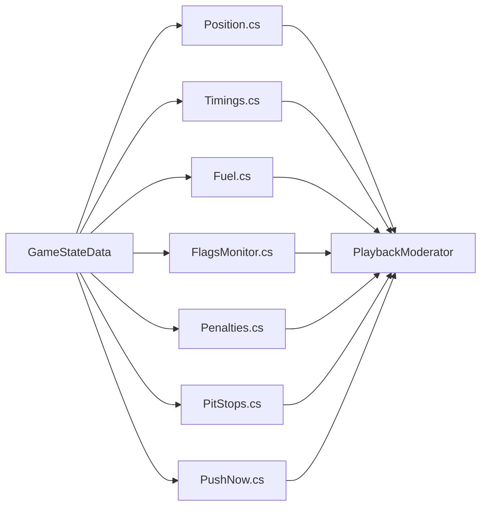
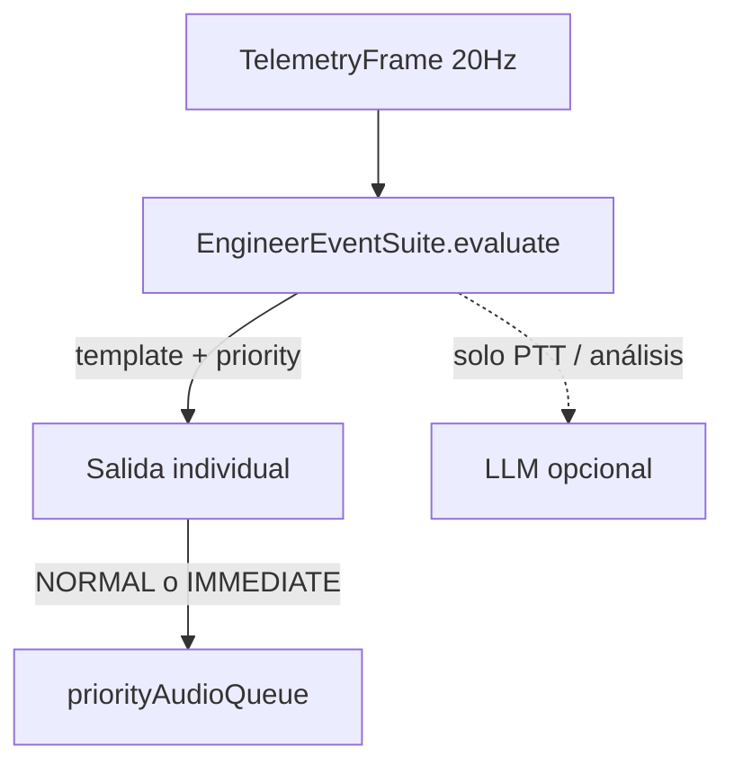

# Pipeline — Canal Ingeniero / Events (paridad CC)

## Objetivo de paridad

Reproducir el comportamiento agregado de **`Events/*.cs`**: el ingeniero habla **mensaje a mensaje**, con las **prioridades, cooldowns y gates de sesión** de Crew Chief — **sin** batch LLM que una “Subiste a P1 + parada + gap”.

Este es el pipeline **más desalineado hoy** en Vantare.

## CC: cómo habla el ingeniero

Cada módulo:

1. Implementa `triggerInternal(GameStateData previous, GameStateData current)`
2. Decide **si** habla (session type, `enable_*`, in_pits, FCY)
3. Encola **un** mensaje (o immediate) con **prioridad numérica**
4. Aplica **cooldown / edge-once** interno

**No existe** `CommentaryOrchestrator` ni debounce 3–8 s en CC.

## Vantare hoy (mapeo honesto)

| CC Events | Vantare | Problema paridad |
|-----------|---------|-------------------|
| Position, Timings, LapTimes | `proactive_monitors.py` | → `commentary_end` batch (**ANTI-CC**) |
| Fuel (report) | triggers + spotter + monitors | Triple vía, solapamiento |
| FlagsMonitor | `flags_monitor.py` + spotter | Fases FCY incompletas LMU-15 |
| Penalties | `penalty_tracker.py` | Conteo 3-2-1 parcial LMU-13 |
| PitStops / strategy | `pit_prediction.py` + shared-strategy | Race gating; timing batch |
| PushNow | `PushNowTrigger` + LLM | **MISMATCH** — CC determinista LMU-19 |
| Opponents | `evaluate_monitored_events` | OK concepto; batch delay |
| SessionEnd | `SessionEndTrigger` + monitors | Duplicado last lap |
| ConditionsMonitor | `rain_monitor.py` | Parcial |
| DamageReporting | `damage_report.py` | Parcial LMU-09 |

## Frecuencia — gap crítico

| | CC | Vantare hoy | Objetivo |
|--|-----|-------------|----------|
| Evaluación Events | **Cada GameState** (~10–60 Hz) | **0.5 Hz** `evaluate_cycle` | Evaluar en **cada frame 20 Hz** o al menos cada vuelta/sector sin batch |
| Entrega mensaje | Individual, cola prioridad | Debounce 3–8 s batch | **Eliminar batch como vía principal** |
| Corner names | Al **mid-point** landmark (Timings) | Resumen fin de vuelta batch | Immediate al cruzar LMU-21 |

## Tabla conductual — mensajes clave

Referencia `.omo/evidence/cc-behavior-parity-matrix.yaml`.

| ID | CC módulo | Cuándo (CC) | Repetición CC | Vantare | Paridad |
|----|-----------|-------------|---------------|---------|---------|
| LMU-20 | Position | Cambio posición / overtake | edge lap; OT min 20 s | position_change batch | **MISMATCH** |
| LMU-21 | LapTimes + Timings | Vuelta + corner al landmark | cada lap / landmark | lap_complete batch | **PARTIAL** |
| LMU-22 | Timings | Gap por **sector** + random | sector wait 1–10+frequency | 45 s / muerto | **MISMATCH** |
| LMU-07/15 | FlagsMonitor | FCY fases + green | edge fase | SC once | **PARTIAL** |
| LMU-13 | Penalties | 3-2-1 pit now | edge penalización | tracker parcial | **PARTIAL** |
| LMU-19 | PushNow | bestLap vs rival, win/P2/hold | edge fin carrera | LLM trigger | **MISMATCH** |
| LMU-23+ | PitStops | ventana / exit prediction | cooldown | pit_stops batch | **PARTIAL** |

## Sesión (cuándo silenciar)

CC usa `applicableSessionTypes` + flags por módulo:

| Mensaje | CC practice | CC quali | CC race | Vantare objetivo |
|---------|-------------|----------|---------|------------------|
| Position / gap / pit prediction | configurable | configurable | sí | **Silencio fuera race** (decisión Wave1; toggle futuro) |
| Flags / rain | sí | sí | sí | sí |
| Lap time / fast lap | menos detalle | menos | sí | sí con verbosidad |

Fuente autoritativa: `session_type_int` (mSession), no string stale.

## Arquitectura objetivo (Vantare)

Reglas:

1. **Un evento = un mensaje encolado** (como CC `QueuedMessage`).
2. `CommentaryOrchestrator` batch solo si **explícitamente** no hay equivalente CC (futuro “resumen piloto”).
3. Mensajes CC fijos → **plantillas** (`cc-message-templates-p0.md`), no LLM.
4. `ImmediateAlert` solo para equivalentes `playMessageImmediately` (race start, FCY crítico, penalty pit now).

## Archivos a converger

| Hoy | Rol futuro CC-parity |
|-----|----------------------|
| `proactive_monitors.py` | Módulos tipo Events (split lógico interno OK) |
| `triggers.py` | Solo lo que CC haría vía LLM= N/A → convertir a ALERT/template |
| `commentary_orchestrator.py` | **Degradar** — no vía principal |
| `commentary_llm_formatter.py` | Opt-in, no default |
| `engine.enqueue_commentary` | Cola ingeniero con gate sesión |
| `event_registry.py` | Prioridades estilo CC |

## Prioridades CC → Vantare

| Prioridad CC | Ejemplos | Canal Vantare |
|--------------|----------|---------------|
| Immediate / 15 | Daño severo, blue | IMMEDIATE |
| 10 | Position, FCY, session | NORMAL (sin batch) o IMMEDIATE si CC immediate |
| 5 | Gap, push | NORMAL |
| 3 | DRS, info | NORMAL + verbosity LOW |

## Verificación

- `backend/tests/test_session_race_gating.py`
- `backend/tests/test_proactive_monitors*.py`
- `scripts/verify_audio_pipeline.py`
- `.omo/evidence/cc-audit-2026-06.md` sección ingeniero
- Por ítem: test + fila YAML `paridad: MATCH`

## Plan de cierre (orden)

1. **Quitar batch** para Position, Pit prediction, Gap (LMU-20, 22, 23).
2. **FCY fases** completas (LMU-15).
3. **Penalties 3-2-1** (LMU-13).
4. **PushNow determinista** (LMU-19) — quitar LLM para este mensaje.
5. **Timings sector-based** gaps (LMU-22).
6. **Corner immediate** (LMU-21).
7. Subir frecuencia evaluación a 20 Hz o por evento (lap cross, sector change).

## Lo que NO es paridad CC (pero existe hoy)

- `commentary_llm_formatter` reformulando batch
- Triggers LLM streaming (`advice_*`) — ver [05-pilot-commands.md](./05-pilot-commands.md) y [06-vantare-implementation-deltas.md](./06-vantare-implementation-deltas.md)
