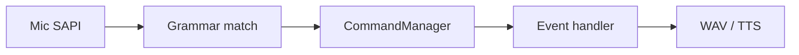
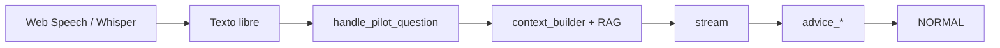

# Pipeline — Comandos del piloto (CC vs Vantare)

## Objetivo de paridad

En CC, el piloto habla con **gramática fija** (`SpeechCommands.cs` → `CommandManager.cs` → handler del Event correspondiente). Respuesta **determinista** (WAV/TTS plantilla), latencia mínima.

Vantare **no puede ser 1:1** en mecanismo (free-form + LLM), pero **sí en intenciones** que CC cubre con comandos.

## CC: flujo

Ejemplos CC:

- `"how's my fuel"` → `Fuel.cs`
- `"where am I faster"` → `Timings.cs` / strategy
- `"spot"` / `"don't spot"` → propiedad spotter (**sin LLM**)
- `"pitstop add 10 litres"` → PitManager (**gap crítico CC**)

## Vantare: flujo

## Paridad por tipo de comando

| Intención CC | CC respuesta | Vantare | Paridad |
|--------------|--------------|---------|---------|
| Fuel status | Determinista | LLM + ticker | **Funcional**, no conductual |
| Tyre wear | Determinista | LLM | Delta |
| Damage report | Determinista | LLM / damage_report | Parcial |
| Spot / don't spot | Propiedad instant | `spotter_command` WS | ✓ rápido |
| Pit add fuel | PitManager | **No implementado** | **GAP** |
| Competitor query | Opponents + grammar | `competitor_queries` + LLM | Parcial |

## Spot / Don't spot (paridad explícita)

CC: grammar → toggle propiedad, **sin voz de respuesta** obligatoria.

Vantare: `parseSpotterCommand` → WS → ack UI (`category=spotter`, sin TTS). ✓ alineado auditoría #22.

## Triggers automáticos ≠ comandos piloto

Los `triggers.py` @ 0.5 Hz **imitan** algunos Events CC (FuelCritical, PitWindow) pero disparan **LLM** donde CC usaría WAV.

**Para paridad conductual:** triggers automáticos deben migrar a **plantillas ingeniero** (pipeline 03), reservando LLM para PTT y análisis no cubierto por CC.

## Archivos

| Rol | Ruta |
|-----|------|
| PTT frontend | `hooks/usePTT.ts` |
| WS pregunta | `websocket.py` |
| Engine | `engine.handle_pilot_question` → `pilot_ptt_agent.handle_pilot_ptt` |
| Agent PTT | `pilot_ptt_agent.py`, `pilot_tool_executor.py` |
| LLM turno 1 | `llm_client.ask_with_tools` |
| Tools schema | `prompt_templates.get_pilot_ptt_tools()` |
| Circuit breaker | `crewchief_events/commands.py` (solo speak_only) |
| Comandos spotter | `spotter_toggle` tool + circuit breaker (`commands.py`); WS `spotter_command` legacy |

## Objetivo híbrido (Task 13 — acordado)

Como sugiere `crewchief-comparison.md`, pero con **tool-first LLM** en lugar de grammar regex como path principal:

1. **PTT turno 1:** LLM razona + elige tool del catálogo → handler determinista → `voice_response`.
   Catálogo: speak_only, spotter, fuel, gap, damage, tires, verbosity, braking mute, monitor rival, pit fuel (dry-run), query_competitor.
2. **PTT sin tool:** streaming LLM con ticker (preguntas abiertas).
3. **Circuit breaker:** regex solo para `speak_only` / spotter si el modelo no llama tool.
4. **Catálogo CC restante:** master plan Task 44.

Ver Task 13 en [`2026-06-07-crewchief-parity-port.md`](../../superpowers/plans/2026-06-07-crewchief-parity-port.md).

## Verificación

- PTT manual en pista
- `test_preemption`, competitor query tests
- Spotter command tests

---

*No existía en la versión anterior de pipelines; CC lo trata como pipeline de entrada separado.*
