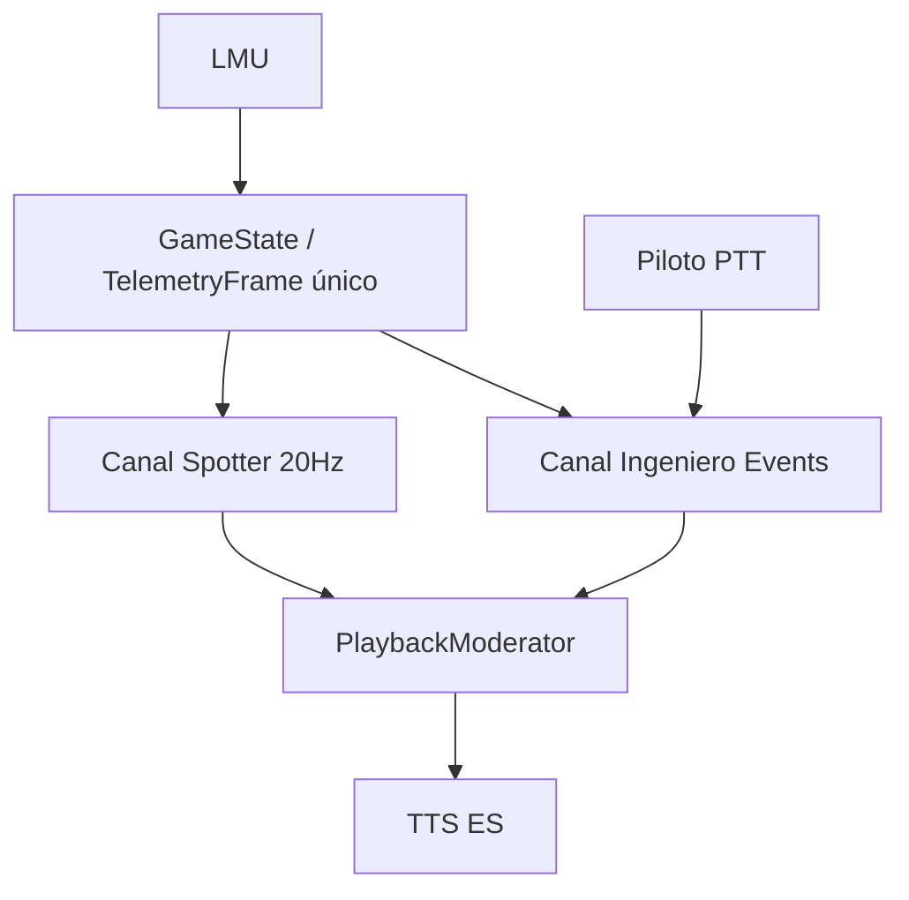

# Pipelines — Paridad Crew Chief → Vantare

Documentación orientada a **paridad conductual**: el spotter y el ingeniero deben **hablar en los mismos momentos y con la misma cadencia** que Crew Chief V4 en LMU; solo cambia la voz (TTS).

**Leer primero:** [00-parity-charter.md](./00-parity-charter.md) · [00-crewchief-reference-architecture.md](./00-crewchief-reference-architecture.md) · [Mapa archivos CC→Vantare §3](../../superpowers/plans/2026-06-07-crewchief-complete-port.md#3-target-file-structure--pipelines-cc--vantare) · [Task 49 native telemetry](../../superpowers/plans/2026-06-07-native-windows-no-sidecar.md) · [Decisions sprint](../../superpowers/plans/2026-06-07-crewchief-decisions.md) · [Plantilla tests pipeline](../../superpowers/plans/2026-06-07-crewchief-pipeline-test-template.md)

## Mapa CC → documentos

Crew Chief no organiza “pipelines” como microservicios. Organiza **GameState + dos voces + PlaybackModerator**. Nosotros documentamos eso así:

| # | Pipeline (paridad CC) | CC | Hz objetivo voz |
|---|---------------------|-----|-----------------|
| 01 | [GameState / ingest](./01-game-state-ingest.md) | GameDataReader + Mapper | 20 Hz estado |
| 02 | [Canal Spotter](./02-spotter-channel.md) | Spotter.cs + NoisyCartesian… | 20 Hz eval |
| 03 | [Canal Ingeniero / Events](./03-engineer-events-channel.md) | Events/*.cs (~42) | **Cada GameState** (no 0.5 Hz) |
| 04 | [PlaybackModerator](./04-playback-moderator.md) | PlaybackModerator + Sounds | event-driven |
| 05 | [Comandos piloto](./05-pilot-commands.md) | SpeechCommands + CommandManager | on-demand |
| 06 | [Deltas Vantare](./06-vantare-implementation-deltas.md) | — (sidecar, LLM, batch) | implementación |

## Diagrama paridad (objetivo)

## Lo que NO es paridad CC (hoy en código)

| Patrón Vantare | Por qué rompe paridad |
|----------------|----------------------|
| `CommentaryOrchestrator` debounce 3–8 s | CC no batching |
| `evaluate_cycle` @ 0.5 Hz solo | CC evalúa Events cada tick |
| LLM en PushNow, status, batch | CC usa WAV/plantilla |
| `commentary_end` mezclando P1+pit+gap | CC tres mensajes separados |

Detalle: [03-engineer-events-channel.md](./03-engineer-events-channel.md), [06-vantare-implementation-deltas.md](./06-vantare-implementation-deltas.md)

## Fuente de verdad conductual

| Artefacto | Uso |
|-----------|-----|
| [**crewchief-complete-port.md**](../../superpowers/plans/2026-06-07-crewchief-complete-port.md) | **Plan maestro** — Tasks 0–48, registry, Definition of Done, anti-fork |
| [**crewchief-decisions.md**](../../superpowers/plans/2026-06-07-crewchief-decisions.md) | Sprint 14 d, normas N1–N4, smoke LMU |
| [**pipeline-test-template.md**](../../superpowers/plans/2026-06-07-crewchief-pipeline-test-template.md) | **Cómo testear** telemetría → trigger → TTS (L1–L6) |
| [crewchief-parity-port.md](../../superpowers/plans/2026-06-07-crewchief-parity-port.md) | TDD detallado Tasks 1–14 |
| [cc-portable-logic-analysis.md](../cc-portable-logic-analysis.md) | **Inventario completo** módulos CC portables, ROI, oleadas |
| [crewchief-porting-notes.md](../crewchief-porting-notes.md) | Segundo análisis del repo CrewChiefV4 y riesgos ocultos |
| `.omo/evidence/cc-behavior-parity-matrix.yaml` | Por mensaje: cuándo, repetición, canal, paridad MATCH/PARTIAL/MISMATCH |
| `.omo/evidence/cc-parity-validation-checklist.md` | Checklist A/B CC-like para sesiones LMU (Task 14) |
| `.omo/evidence/cc-message-templates-p0.md` | Texto TTS objetivo |
| `.omo/evidence/cc-audit-2026-06.md` | Estado auditoría |
| `scripts/verify_spotter_pipeline.py` | Spotter |
| `scripts/verify_audio_pipeline.py` | Playback + routing |

## Checklist pre-sesión LMU

- [ ] Sidecar + backend versión alineada (`session_type_int` presente)
- [ ] En **práctica**: sin position/pit/gap ingeniero (race-only)
- [ ] Spotter lateral coherente (LMU-01)
- [ ] FCY: fases pits closed/open/green (LMU-15) cuando implementado
- [ ] Ningún batch tipo “Subiste a P1. Tras parada… Adelante…” en no-race

## Docs legacy (supersedidos)

Estos archivos reflejaban la arquitectura **Vantare-first** (6 pipelines técnicos), no CC-first:

- ~~`01-ingest-canonical-frame.md`~~ → [01-game-state-ingest.md](./01-game-state-ingest.md)
- ~~`02-strategy-deterministic.md`~~ → cálculo en [06-vantare-implementation-deltas.md](./06-vantare-implementation-deltas.md)
- ~~`03-spotter-immediate.md`~~ → [02-spotter-channel.md](./02-spotter-channel.md)
- ~~`04-proactive-commentary.md`~~ → [03-engineer-events-channel.md](./03-engineer-events-channel.md)
- ~~`05-triggers-llm-pilot.md`~~ → [03](./03-engineer-events-channel.md) + [05](./05-pilot-commands.md)
- ~~`06-playback-tts.md`~~ → [04-playback-moderator.md](./04-playback-moderator.md)

## Orden de implementación (paridad)

1. GameState único + sesión (01)
2. Spotter timings + lateral (02)
3. **Ingeniero sin batch + frecuencia** (03) — crítico para “suena a CC”
4. Playback expiry + routing (04)
5. Fast-path comandos (05) opcional
