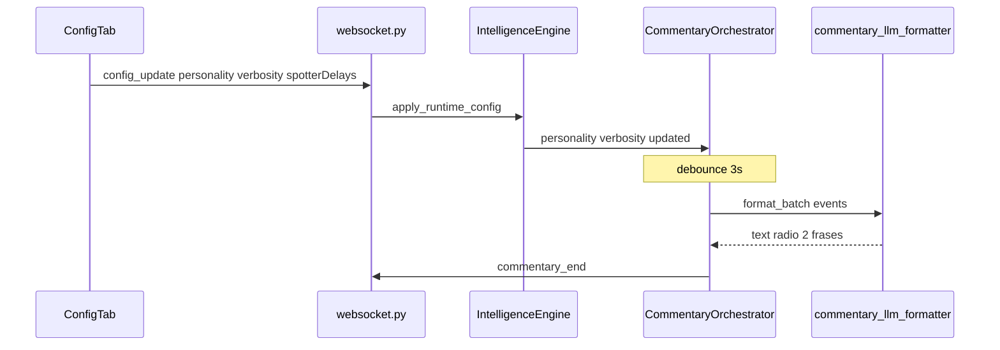

# Cierre Alpha Crew Chief Parity — Implementation Plan

> **For agentic workers:** REQUIRED SUB-SKILL: Use superpowers:subagent-driven-development (recommended) or superpowers:executing-plans to implement this plan task-by-task. Steps use checkbox (`- [ ]`) syntax for tracking.

**Goal:** Cerrar alpha A0–A8 con Definition of Done verificable: LLM batch para narración proactiva, config UI sincronizada al backend, tests/gates CI completos, checklist LMU documentado.

**Architecture:** Monitores deterministas (`ProactiveMonitorSuite`) emiten hechos → `CommentaryOrchestrator` debounce → **nuevo** `commentary_llm_formatter` (LLM JSON corto + fallback determinista) → `commentary_end` → TTS NORMAL. Spotter sigue canned IMMEDIATE. Config runtime vía `config_update` WS → `engine.apply_runtime_config()` + `SpotterService.apply_runtime_config()`.

**Tech Stack:** Python 3.12 / FastAPI / pytest · React 19 / TypeScript / Vitest · OpenAI-compatible LLM (`llm_client.py`) · Tauri 2 · WebSocket `:8008`

**Spec refs:** [paridad_crew_chief plan](c:\Users\isaac\.cursor\plans\paridad_crew_chief_22a9ebbf.plan.md) · [crewchief-comparison.md](docs/crewchief-comparison.md) · [audio-lmu-validation.md](.omo/evidence/audio-lmu-validation.md)

**Save target (writing-plans):** `docs/superpowers/plans/2026-06-07-cierre-alpha-crew-chief-parity.md`

---

## File structure (decomposition)

| File | Responsibility |
|------|----------------|
| **Create** `backend/src/intelligence/commentary_llm_formatter.py` | Prompt compacto + parse JSON `{speak,text,priority}` + fallback join |
| **Modify** `backend/src/intelligence/commentary_orchestrator.py` | `flush()` async LLM via formatter; inject `llm_client` |
| **Modify** `backend/src/intelligence/engine.py` | `apply_runtime_config()`; pass LLM ref to orchestrator |
| **Modify** `backend/src/routers/websocket.py` | Ampliar `config_update` handler |
| **Modify** `backend/src/intelligence/spotter.py` | `apply_runtime_config()` para delays/gap/car_length |
| **Create** `backend/src/data/spotter_phrases_es.json` | Overrides por perfil (formal/standard/aggressive) |
| **Modify** `backend/src/intelligence/personality_pack.py` | Cargar `spotter_phrases` del JSON |
| **Modify** `frontend/src/hooks/useWebSocket.ts` | Enviar config completa on connect + helper `sendConfigUpdate` |
| **Modify** `frontend/src/components/ConfigTab.tsx` | Llamar `sendConfigUpdate` al guardar; campo `spotterCarLengthM` |
| **Create** `frontend/src/services/spotterPhraseResolver.ts` | Resolver prefetch por perfil |
| **Modify** `frontend/src/services/alertVoice.ts` | (sin cambio si tests se alinean a priority 2) |
| **Create** `scripts/verify_alpha_parity.py` | Gate smoke engine cycle |
| **Modify** `scripts/verify_audio_pipeline.py` | Incluir nuevos tests + invocar spotter gate |



---

## Definition of Done (alpha cerrado)

- [ ] `python scripts/verify_audio_pipeline.py` verde
- [ ] `python scripts/verify_spotter_pipeline.py` verde
- [ ] `python scripts/verify_alpha_parity.py` verde
- [ ] Cambiar perfil/verbosidad/delays en UI afecta backend (test WS)
- [ ] Batch 2+ eventos → **una** frase LLM (mock test), no join crudo
- [ ] Perlas con `audio_priority: "2"` suenan; tests alineados
- [ ] Checklist LMU 22 filas marcadas en ≥3 circuitos (manual, evidencia en `.omo/evidence/`)
- [ ] `docs/crewchief-comparison.md` stats honestas

**Out of scope:** beta (Gemini TTS prod, overlays, pit write, inglés), paridad CC 100% feature-for-feature.

---

### Task 1: Alinear tests pearl (P0)

**Files:**
- Modify: [frontend/src/__tests__/alertVoice.test.ts](frontend/src/__tests__/alertVoice.test.ts)
- Modify: [frontend/src/__tests__/audioPipeline.integration.test.ts](frontend/src/__tests__/audioPipeline.integration.test.ts)
- Create: [backend/tests/test_pearls_voice.py](backend/tests/test_pearls_voice.py)

**Context:** Engine emite perlas con `audio_priority="2"` ([engine.py:205](backend/src/intelligence/engine.py)). `shouldVoiceAlert` ya permite priority >= 2. Tests frontend contradicen la matriz (`expectVoice: true` en [audioTriggerMatrix.ts:137](frontend/src/__tests__/fixtures/audioTriggerMatrix.ts)).

- [ ] **Step 1: Fix frontend alertVoice test**

```typescript
// frontend/src/__tests__/alertVoice.test.ts — reemplazar test "sin voz para alertas system/pearl"
it("sin voz solo para system; pearl audible con priority >= 2", () => {
  expect(shouldVoiceAlert({ category: "system", severity: "CRITICAL", audio_priority: "CRITICAL" })).toBe(false);
  expect(shouldVoiceAlert({ category: "pearl", severity: "INFO", audio_priority: "2" })).toBe(true);
  expect(shouldVoiceAlert({ category: "pearl", severity: "INFO", audio_priority: "1" })).toBe(false);
});
```

- [ ] **Step 2: Fix audioPipeline integration test**

```typescript
// frontend/src/__tests__/audioPipeline.integration.test.ts
it("gaps sin voz; pearl con priority 2 sí entra en TTS", () => {
  expect(shouldVoiceAlert({ category: "gaps", severity: "INFO", audio_priority: "1" })).toBe(false);
  expect(shouldVoiceAlert({ category: "pearl", severity: "INFO", audio_priority: "2" })).toBe(true);
});
```

- [ ] **Step 3: Write failing backend pearl test**

```python
# backend/tests/test_pearls_voice.py
import uuid
from unittest.mock import MagicMock
from src.intelligence.engine import IntelligenceEngine
from src.intelligence.pearls_of_wisdom import PearlType
from src.models.messages import AlertMessage

def test_emit_pearl_uses_audio_priority_2():
    sent = []
    eng = IntelligenceEngine(broadcast_callback=sent.append)
    eng.verbosity.set_level("normal")
    eng.sweary_messages = False
    eng.pearls.reset_session()
    eng._emit_pearl(PearlType.FAST_LAP)
    assert len(sent) == 1
    alert = sent[0]
    assert isinstance(alert, AlertMessage)
    assert alert.category == "pearl"
    assert alert.audio_priority == "2"

def test_silent_verbosity_blocks_pearls():
    sent = []
    eng = IntelligenceEngine(broadcast_callback=sent.append)
    eng.apply_set_verbosity("silent")
    eng._emit_pearl(PearlType.STANDARD)
    assert sent == []
```

- [ ] **Step 4: Run tests**

Run: `cd backend && python -m pytest tests/test_pearls_voice.py -v`
Expected: PASS

Run: `cd frontend && npm test -- alertVoice.test.ts audioPipeline.integration.test.ts --run`
Expected: PASS

- [ ] **Step 5: Commit**

```bash
git add frontend/src/__tests__/alertVoice.test.ts frontend/src/__tests__/audioPipeline.integration.test.ts backend/tests/test_pearls_voice.py
git commit -m "test: align pearl voice contract with engine audio_priority 2"
```

---

### Task 2: Engine apply_runtime_config (P1 backend)

**Files:**
- Modify: [backend/src/intelligence/engine.py](backend/src/intelligence/engine.py):171-184
- Create: [backend/tests/test_engine_runtime_config.py](backend/tests/test_engine_runtime_config.py)

- [ ] **Step 1: Write failing test**

```python
# backend/tests/test_engine_runtime_config.py
from src.intelligence.engine import IntelligenceEngine

def test_apply_runtime_config_updates_personality_and_verbosity():
    eng = IntelligenceEngine(broadcast_callback=lambda m: None)
    eng.apply_runtime_config({
        "personalityProfileId": "aggressive",
        "verbosityLevel": "detailed",
    })
    assert eng.personality.profile_id == "aggressive"
    assert eng.verbosity.level.value == "detailed"

def test_apply_runtime_config_ignores_unknown_keys():
    eng = IntelligenceEngine(broadcast_callback=lambda m: None)
    before = eng.personality.profile_id
    eng.apply_runtime_config({"unknownKey": True})
    assert eng.personality.profile_id == before
```

- [ ] **Step 2: Run test — expect FAIL**

Run: `cd backend && python -m pytest tests/test_engine_runtime_config.py -v`
Expected: FAIL `AttributeError: apply_runtime_config`

- [ ] **Step 3: Implement on IntelligenceEngine**

```python
# backend/src/intelligence/engine.py — after apply_set_verbosity
def apply_runtime_config(self, cfg: dict) -> None:
    """Aplica config runtime desde WS config_update (frontend ConfigTab)."""
    if not cfg:
        return
    if "personalityProfileId" in cfg:
        self.personality.set_profile(str(cfg["personalityProfileId"]))
        self.commentary.personality = self.personality
    if "verbosityLevel" in cfg:
        self.verbosity.set_level(str(cfg["verbosityLevel"]))
        self.commentary.verbosity = self.verbosity
    if "brakingZonesMute" in cfg:
        self.verbosity.set_braking_zones_mute(bool(cfg["brakingZonesMute"]))
```

- [ ] **Step 4: Run test — expect PASS**

- [ ] **Step 5: Commit**

```bash
git commit -m "feat: engine apply_runtime_config for personality and verbosity"
```

---

### Task 3: SpotterService apply_runtime_config (P1 spotter)

**Files:**
- Modify: [backend/src/intelligence/spotter.py](backend/src/intelligence/spotter.py):73-77
- Create: [backend/tests/test_spotter_runtime_config.py](backend/tests/test_spotter_runtime_config.py)

- [ ] **Step 1: Write failing test**

```python
from src.intelligence.spotter import SpotterService

def test_spotter_apply_runtime_config_updates_delays():
    spotter = SpotterService(broadcast_callback=lambda m: None)
    spotter.apply_runtime_config({
        "spotterClearDelayS": 2.5,
        "spotterOverlapDelayS": 3.0,
        "spotterGapFrequencyS": 45.0,
        "spotterCarLengthM": 5.2,
    })
    assert spotter._proximity_state.clear_delay_s == 2.5
    assert spotter._proximity_state.overlap_delay_s == 3.0
    assert spotter._gap_frequency_s == 45.0
    assert spotter._car_length_m == 5.2
```

- [ ] **Step 2: Run — FAIL**

- [ ] **Step 3: Implement**

```python
# spotter.py — in __init__, after line 73:
self._car_length_m = settings.SPOTTER_CAR_LENGTH_M

# new method:
def apply_runtime_config(self, cfg: dict) -> None:
    if "spotterClearDelayS" in cfg:
        self._proximity_state.clear_delay_s = float(cfg["spotterClearDelayS"])
    if "spotterOverlapDelayS" in cfg:
        self._proximity_state.overlap_delay_s = float(cfg["spotterOverlapDelayS"])
    if "spotterGapFrequencyS" in cfg:
        self._gap_frequency_s = float(cfg["spotterGapFrequencyS"])
    if "spotterCarLengthM" in cfg:
        self._car_length_m = float(cfg["spotterCarLengthM"])
    if "spotterOffQualifying" in cfg:
        self.spotter_off_qualifying = bool(cfg["spotterOffQualifying"])
    if "spotterExcludeStopped" in cfg:
        self.spotter_exclude_stopped = bool(cfg["spotterExcludeStopped"])
```

Wire `_car_length_m` into `detect_cartesian_overlap(..., car_length_m=self._car_length_m)` call sites in same file.

- [ ] **Step 4: Run — PASS**

- [ ] **Step 5: Commit**

---

### Task 4: WebSocket config_update handler (P1 WS)

**Files:**
- Modify: [backend/src/routers/websocket.py](backend/src/routers/websocket.py):313-326
- Create: [backend/tests/test_config_sync_ws.py](backend/tests/test_config_sync_ws.py)

- [ ] **Step 1: Write failing test** (unit test handler logic via engine mock on app_state)

```python
# backend/tests/test_config_sync_ws.py
from src.intelligence.engine import IntelligenceEngine

def test_config_payload_fields_engine_and_spotter():
    eng = IntelligenceEngine(broadcast_callback=lambda m: None)
    from src.intelligence.spotter import SpotterService
    spotter = SpotterService(broadcast_callback=lambda m: None)
    cfg = {
        "personalityProfileId": "formal",
        "verbosityLevel": "silent",
        "spotterClearDelayS": 2.0,
        "spotterOverlapDelayS": 2.5,
        "spotterGapFrequencyS": 60.0,
        "spotterCarLengthM": 4.5,
        "swearyMessages": True,
    }
    eng.apply_runtime_config(cfg)
    eng.sweary_messages = bool(cfg["swearyMessages"])
    spotter.apply_runtime_config(cfg)
    assert eng.personality.profile_id == "formal"
    assert spotter._gap_frequency_s == 60.0
```

- [ ] **Step 2: Extend websocket handler**

```python
# websocket.py — inside elif event == "config_update":
engine = getattr(app_state, "intelligence_engine", None)
if engine is not None:
    if "swearyMessages" in cfg:
        app_state.sweary_messages = bool(cfg["swearyMessages"])
        engine.sweary_messages = app_state.sweary_messages
    engine.apply_runtime_config(cfg)
spotter = getattr(app_state, "spotter_service", None)
if spotter is not None:
    spotter.apply_runtime_config(cfg)
    # keep existing spotterOffQualifying / spotterExcludeStopped if not in apply_runtime_config
```

- [ ] **Step 3: Run tests — PASS**

- [ ] **Step 4: Commit**

---

### Task 5: Frontend sendConfigUpdate (P1 frontend)

**Files:**
- Modify: [frontend/src/hooks/useWebSocket.ts](frontend/src/hooks/useWebSocket.ts):350-358
- Modify: [frontend/src/components/ConfigTab.tsx](frontend/src/components/ConfigTab.tsx):330
- Create: [frontend/src/__tests__/configUpdatePayload.test.ts](frontend/src/__tests__/configUpdatePayload.test.ts)

- [ ] **Step 1: Extract payload builder (testable)**

```typescript
// frontend/src/services/configUpdatePayload.ts
import type { AppConfig } from "../store/config";

export function buildConfigUpdatePayload(cfg: AppConfig): Record<string, unknown> {
  return {
    swearyMessages: cfg.swearyMessages ?? false,
    spotterOffQualifying: cfg.spotterOffQualifying ?? true,
    spotterExcludeStopped: cfg.spotterExcludeStopped ?? true,
    personalityProfileId: cfg.personalityProfileId ?? "standard",
    verbosityLevel: cfg.verbosityLevel ?? "normal",
    spotterClearDelayS: cfg.spotterClearDelayS ?? 1.5,
    spotterOverlapDelayS: cfg.spotterOverlapDelayS ?? 2.0,
    spotterGapFrequencyS: cfg.spotterGapFrequencyS ?? 30.0,
    spotterCarLengthM: cfg.spotterCarLengthM ?? 4.8,
    brakingZonesMute: cfg.brakingZonesMute ?? false,
  };
}
```

- [ ] **Step 2: Write failing test**

```typescript
import { describe, it, expect } from "vitest";
import { buildConfigUpdatePayload } from "../services/configUpdatePayload";

it("includes personality and spotter delays", () => {
  const p = buildConfigUpdatePayload({
    personalityProfileId: "aggressive",
    verbosityLevel: "detailed",
    spotterClearDelayS: 2.1,
    spotterOverlapDelayS: 3.2,
    spotterGapFrequencyS: 40,
    spotterCarLengthM: 5.0,
  } as any);
  expect(p.personalityProfileId).toBe("aggressive");
  expect(p.spotterClearDelayS).toBe(2.1);
});
```

- [ ] **Step 3: Use in useWebSocket onopen + export sendConfigUpdate(ws)**

```typescript
// useWebSocket.ts onopen:
ws.send(JSON.stringify({ event: "config_update", data: buildConfigUpdatePayload(cfg) }));
```

```typescript
// ConfigTab.tsx — after updateConfig(buildConfigPayload()):
const ws = useAppStore.getState().connectivity.ws; // or expose sendConfigUpdate from hook
// Prefer: export function sendConfigUpdateFromStore() from useWebSocket module
```

- [ ] **Step 4: Add spotterCarLengthM to AppConfig in [config.ts](frontend/src/store/config.ts) default 4.8 + ConfigTab number input**

- [ ] **Step 5: Run vitest — PASS**

- [ ] **Step 6: Commit**

---

### Task 6: commentary_llm_formatter module (P2 LLM batch)

**Files:**
- Create: [backend/src/intelligence/commentary_llm_formatter.py](backend/src/intelligence/commentary_llm_formatter.py)
- Create: [backend/tests/test_commentary_llm_formatter.py](backend/tests/test_commentary_llm_formatter.py)

- [ ] **Step 1: Write failing tests (no network — inject formatter fn)**

```python
import json
import pytest
from src.intelligence.commentary_llm_formatter import (
    CommentaryBatchInput,
    parse_llm_commentary_response,
    format_batch_deterministic,
    format_commentary_batch,
)

def test_parse_valid_json():
    raw = '{"speak": true, "text": "P3, gap +1.2. Buen ritmo.", "priority": "NORMAL"}'
    out = parse_llm_commentary_response(raw)
    assert out.speak is True
    assert "P3" in out.text

def test_fallback_on_invalid_json():
    events = [("position_change", "Subiste a P3.", "MEDIUM")]
    out = format_batch_deterministic(events, tone="directo")
    assert "Subiste a P3." in out

@pytest.mark.asyncio
async def test_format_commentary_batch_uses_llm_when_provided():
    async def fake_llm(prompt: str) -> str:
        return '{"speak": true, "text": "Radio unificada.", "priority": "NORMAL"}'
    text = await format_commentary_batch(
        events=[("lap_complete", "Vuelta 5.", "LOW"), ("gap_update", "Gap +1s.", "LOW")],
        personality_tone="estilo radio",
        llm_complete=fake_llm,
        timeout_s=2.0,
    )
    assert text == "Radio unificada."
```

- [ ] **Step 2: Run — FAIL**

- [ ] **Step 3: Implement formatter**

```python
# commentary_llm_formatter.py
from dataclasses import dataclass
import asyncio
import json
import logging
from typing import Awaitable, Callable, Optional, Sequence, Tuple

logger = logging.getLogger("vantare.commentary_llm")
EventTuple = Tuple[str, str, str]

@dataclass
class ParsedCommentary:
    speak: bool
    text: str
    priority: str = "NORMAL"

def format_batch_deterministic(events: Sequence[EventTuple], tone: str = "") -> str:
    parts = [e[1] for e in events if e[1].strip()]
    body = " ".join(parts)
    return body[:280] if len(body) <= 280 else body[:277] + "..."

def parse_llm_commentary_response(raw: str) -> ParsedCommentary:
    data = json.loads(raw.strip())
    return ParsedCommentary(
        speak=bool(data.get("speak", True)),
        text=str(data.get("text", "")).strip(),
        priority=str(data.get("priority", "NORMAL")).upper(),
    )

def build_commentary_prompt(events: Sequence[EventTuple], personality_tone: str) -> str:
    bullets = "\n".join(f"- [{eid}] {summary}" for eid, summary, _prio in events)
    return (
        "Eres ingeniero de pista en Le Mans Ultimate. Redacta UN mensaje de radio en español.\n"
        f"Tono: {personality_tone}\n"
        "Máximo 2 frases. Sin markdown. Responde SOLO JSON:\n"
        '{"speak": true, "text": "...", "priority": "NORMAL|LOW"}\n'
        f"Hechos:\n{bullets}"
    )

async def format_commentary_batch(
    events: Sequence[EventTuple],
    personality_tone: str,
    llm_complete: Optional[Callable[[str], Awaitable[str]]] = None,
    timeout_s: float = 2.0,
) -> str:
    if not events:
        return ""
    fallback = format_batch_deterministic(events, personality_tone)
    if llm_complete is None:
        return fallback
    prompt = build_commentary_prompt(events, personality_tone)
    try:
        raw = await asyncio.wait_for(llm_complete(prompt), timeout=timeout_s)
        parsed = parse_llm_commentary_response(raw)
        if parsed.speak and parsed.text:
            return parsed.text[:280]
    except Exception as exc:
        logger.warning("LLM commentary batch fallback: %s", exc)
    return fallback
```

- [ ] **Step 4: Run — PASS**

- [ ] **Step 5: Commit**

---

### Task 7: Wire LLM into CommentaryOrchestrator (P2)

**Files:**
- Modify: [backend/src/intelligence/commentary_orchestrator.py](backend/src/intelligence/commentary_orchestrator.py):95-126
- Modify: [backend/src/intelligence/engine.py](backend/src/intelligence/engine.py):122-126
- Modify: [backend/tests/test_commentary_orchestrator.py](backend/tests/test_commentary_orchestrator.py)

- [ ] **Step 1: Add failing async LLM test**

```python
@pytest.mark.asyncio
async def test_flush_uses_llm_formatter_when_configured():
    sent = []
    async def fake_llm(prompt: str) -> str:
        return '{"speak": true, "text": "Mensaje radio LLM.", "priority": "NORMAL"}'
    orch = CommentaryOrchestrator(
        broadcast_callback=sent.append,
        llm_complete=fake_llm,
        debounce_s=0.01,
    )
    orch.enqueue("position_change", "Subiste a P3.")
    msg = await orch.flush()
    assert msg.full_text == "Mensaje radio LLM."
```

- [ ] **Step 2: Modify orchestrator**

```python
# commentary_orchestrator.py — add to __init__:
llm_complete: Optional[Callable[[str], Awaitable[str]]] = None,

# flush() change:
text = await self._format_batch_async(batch)

async def _format_batch_async(self, batch: List[PendingCommentaryEvent]) -> str:
    from src.intelligence.commentary_llm_formatter import format_commentary_batch
    events = [(e.event_id, e.summary, e.priority) for e in batch]
    return await format_commentary_batch(
        events,
        self._personality.engineer_system_suffix(),
        llm_complete=self._llm_complete,
    )
```

- [ ] **Step 3: Add llm_client helper**

```python
# llm_client.py — new method on VLLMClient:
async def complete_text(self, prompt: str, max_tokens: int = 120) -> str:
    client = self._get_client()
    resp = await client.chat.completions.create(
        model=self._model,
        messages=[{"role": "user", "content": prompt}],
        max_tokens=max_tokens,
        temperature=0.4,
        extra_body=self._stepfun_extra_body(),
    )
    return (resp.choices[0].message.content or "").strip()
```

- [ ] **Step 4: Engine wires LLM**

```python
# engine.py after creating self.commentary:
if hasattr(self, "llm_client") and self.llm_client:
    self.commentary._llm_complete = self.llm_client.complete_text
```

Note: pass `llm_client` into `IntelligenceEngine.__init__` if not already — check existing constructor and main.py wiring.

- [ ] **Step 5: Update `test_batch_joins_multiple_summaries`** — with `llm_complete=None` behavior unchanged; new test covers LLM path.

- [ ] **Step 6: Run pytest commentary tests — PASS**

- [ ] **Step 7: Commit**

---

### Task 8: Spotter phrases by profile (P4 A1)

**Files:**
- Create: [backend/src/data/spotter_phrases_es.json](backend/src/data/spotter_phrases_es.json)
- Modify: [backend/src/intelligence/personality_pack.py](backend/src/intelligence/personality_pack.py)
- Create: [frontend/src/services/spotterPhraseResolver.ts](frontend/src/services/spotterPhraseResolver.ts)
- Modify: [frontend/src/hooks/useWebSocket.ts](frontend/src/hooks/useWebSocket.ts) prefetchSpotterTts

- [ ] **Step 1: JSON structure**

```json
{
  "standard": {
    "hold_line": "Mantén la línea, coche por {side}.",
    "closing_fast": "¡Viene rápido por {side}!"
  },
  "aggressive": {
    "hold_line": "¡Aguanta! Coche por {side}.",
    "closing_fast": "¡Viene muy rápido por {side}!"
  },
  "formal": {
    "hold_line": "Mantenga la trayectoria, vehículo por {side}.",
    "closing_fast": "Aproximación rápida por {side}."
  }
}
```

- [ ] **Step 2: personality_pack method**

```python
def spotter_phrase(self, key: str, **kwargs: str) -> str:
    # load from JSON once at module level
    template = _SPOTTER_PHRASES.get(self._profile_id, {}).get(key, "")
    return template.format(**kwargs) if template else ""
```

- [ ] **Step 3: Frontend resolver + test**

```typescript
export function spotterPrefetchPhrases(profileId: string): string[] {
  const base = SPOTTER_PREFETCH_PHRASES;
  if (profileId === "aggressive") return [...base, "¡Aguanta! Coche por derecha."];
  if (profileId === "formal") return [...base, "Mantenga la trayectoria, vehículo por derecha."];
  return base;
}
```

- [ ] **Step 4: prefetchSpotterTts uses spotterPrefetchPhrases(configState.personalityProfileId)**

- [ ] **Step 5: Commit**

---

### Task 9: braking_zones_mute wiring (P5)

**Files:**
- Modify: [backend/src/intelligence/prompt_templates.py](backend/src/intelligence/prompt_templates.py) — tool `set_braking_zones_mute`
- Modify: [backend/src/intelligence/engine.py](backend/src/intelligence/engine.py)
- Modify: [frontend/src/hooks/useWebSocket.ts](frontend/src/hooks/useWebSocket.ts) enqueueTtsText
- Create: [backend/tests/test_braking_zones_mute.py](backend/tests/test_braking_zones_mute.py)

- [ ] **Step 1: Test verbosity controller**

```python
from src.intelligence.verbosity_controller import VerbosityController
def test_should_mute_for_braking():
    vc = VerbosityController()
    vc.set_braking_zones_mute(True)
    assert vc.should_mute_for_braking(0.2) is True
    assert vc.should_mute_for_braking(0.05) is False
```

- [ ] **Step 2: Frontend skip NORMAL TTS when braking**

```typescript
// enqueueTtsText — before enqueue:
if (resolvedPriority === "NORMAL") {
  const brake = Number(latestTelemetryRef.current?.brake ?? latestTelemetryRef.current?.brake_pressure ?? 0);
  const cfg = useAppStore.getState().config;
  if (cfg.brakingZonesMute && brake >= 0.15) return false;
}
```

- [ ] **Step 3: engine.apply_set_braking_zones_mute + llm tool handler** (mirror `apply_set_verbosity`)

- [ ] **Step 4: Commit**

---

### Task 10: Extended proactive monitor tests (P3)

**Files:**
- Create: [backend/tests/test_proactive_monitors_extended.py](backend/tests/test_proactive_monitors_extended.py)
- Create: [backend/tests/test_pit_prediction.py](backend/tests/test_pit_prediction.py)

- [ ] **Step 1: pit_prediction tests**

```python
from src.intelligence.pit_prediction import estimate_position_after_pit_stop, format_pit_exit_prediction

def test_estimate_position_after_pit():
    assert estimate_position_after_pit_stop(5, competitors_ahead_in_pits=2, competitors_behind_passing=1) == 4

def test_format_pit_exit_with_window():
    msg = format_pit_exit_prediction(5, 7, pit_window_open=True)
    assert msg is not None
    assert "Ventana de boxes" in msg
    assert "P7" in msg
```

- [ ] **Step 2: proactive tests — flags, frozen, fuel, opponents** (one test per `_eval_*` con fixture mínima)

```python
def test_frozen_order_announced_once():
    suite = ProactiveMonitorSuite()
    t = {"frozen_order": True, "session_stopped": False}
    e1 = suite._eval_frozen_order(t)
    assert any(x[0] == "frozen_order" for x in e1)
    e2 = suite._eval_frozen_order(t)
    assert e2 == []
```

- [ ] **Step 3: engine cycle integration**

```python
@pytest.mark.asyncio
async def test_evaluate_cycle_enqueues_race_start():
    sent = []
    eng = IntelligenceEngine(broadcast_callback=sent.append)
    await eng.evaluate_cycle(
        {"lap_number": 1, "standing_position": 5},
        {},
        {"phase": "RACE"},
    )
    await eng.commentary.flush()
    commentary_msgs = [m for m in sent if getattr(m, "event", "") == "commentary_end"]
    assert len(commentary_msgs) >= 1
```

- [ ] **Step 4: Run all new tests — PASS**

- [ ] **Step 5: Commit**

---

### Task 11: Multiclass proactive + pit timer (P6 A5/A7)

**Files:**
- Modify: [backend/src/intelligence/proactive_monitors.py](backend/src/intelligence/proactive_monitors.py)
- Modify: [backend/tests/test_proactive_monitors_extended.py](backend/tests/test_proactive_monitors_extended.py)

- [ ] **Step 1: Failing test multiclass faster class behind**

```python
def test_multiclass_proactive_warning():
    suite = ProactiveMonitorSuite()
    events = suite.evaluate(
        {"standing_position": 10, "driver_class": "GT3"},
        {"multiclass_faster_behind": {"class": "Hypercar", "gap_s": 0.8}},
        {"phase": "RACE"},
    )
    assert any("Hypercar" in e[1] for e in events)
```

- [ ] **Step 2: Implement `_eval_multiclass` reading strategy_dict key** (align with existing trigger data shape in [triggers.py](backend/src/intelligence/triggers.py) MulticlassWarningTrigger)

- [ ] **Step 3: Pit stop timer — track `_pit_enter_at` when `in_pits` transitions true; on exit emit `("pit_stops", f"Parada {duration:.0f} segundos.", "MEDIUM")` once**

- [ ] **Step 4: Tests + commit**

---

### Task 12: verify_alpha_parity.py gate (P7)

**Files:**
- Create: [scripts/verify_alpha_parity.py](scripts/verify_alpha_parity.py)
- Modify: [scripts/verify_audio_pipeline.py](scripts/verify_audio_pipeline.py)

- [ ] **Step 1: Create script**

```python
#!/usr/bin/env python3
"""Smoke gate: engine cycle + formatter + config apply without LMU."""
import asyncio
import subprocess
import sys
from pathlib import Path

ROOT = Path(__file__).resolve().parents[1]
sys.path.insert(0, str(ROOT / "backend"))

async def smoke():
    from src.intelligence.engine import IntelligenceEngine
    eng = IntelligenceEngine(broadcast_callback=lambda m: None)
    eng.apply_runtime_config({"personalityProfileId": "standard", "verbosityLevel": "normal"})
    await eng.evaluate_cycle({"lap_number": 1, "standing_position": 3}, {}, {"phase": "RACE"})
    msg = await eng.commentary.flush()
    assert msg is None or msg.event == "commentary_end"

if __name__ == "__main__":
    asyncio.run(smoke())
    subprocess.run([sys.executable, str(ROOT / "scripts" / "verify_spotter_pipeline.py")], check=True)
    print("=== Alpha parity smoke OK ===")
```

- [ ] **Step 2: Add to verify_audio_pipeline.py pytest list:**

`tests/test_pearls_voice.py`, `tests/test_engine_runtime_config.py`, `tests/test_commentary_llm_formatter.py`, `tests/test_pit_prediction.py`, `tests/test_proactive_monitors_extended.py`

- [ ] **Step 3: Run from repo root**

Run: `python scripts/verify_audio_pipeline.py && python scripts/verify_alpha_parity.py`
Expected: both OK

- [ ] **Step 4: Commit**

---

### Task 13: MQTT E2E smoke (P8 partial)

**Files:**
- Modify: [scripts/verify_mqtt_e2e.py](scripts/verify_mqtt_e2e.py)
- Document in [.omo/evidence/audio-lmu-validation.md](.omo/evidence/audio-lmu-validation.md)

- [ ] **Step 1: Document docker mosquitto one-liner in checklist appendix**

```powershell
docker run -d --name vantare-mqtt -p 1883:1883 eclipse-mosquitto:2
$env:MQTT_ENABLED="true"; python scripts/verify_mqtt_e2e.py
```

- [ ] **Step 2: Run manually when broker available — record PASS/FAIL in evidence file**

- [ ] **Step 3: Commit docs only if code unchanged**

---

### Task 14: LMU manual checklist + docs sync (P8)

**Files:**
- Modify: [.omo/evidence/audio-lmu-validation.md](.omo/evidence/audio-lmu-validation.md)
- Modify: [docs/crewchief-comparison.md](docs/crewchief-comparison.md)

- [ ] **Step 1: Add rows 23–24 for commentary_end and pearl audible**

- [ ] **Step 2: Play ≥3 sessions (Spa, Monza, Le Mans); mark OK column; add session date notes**

- [ ] **Step 3: Update comparison doc test counts and module table (% por módulo CC, not generic "A0-A8 done")**

- [ ] **Step 4: Commit evidence + docs**

---

## Self-review (spec coverage)

| Spec requirement | Task |
|------------------|------|
| LLM batch proactivo | Task 6, 7 |
| Config sync UI→backend | Task 2, 3, 4, 5 |
| Dual TTS voice (exists) | Task 5 prefetch by profile |
| Spotter phrases per profile | Task 8 |
| Pearls audible | Task 1 |
| braking_zones_mute | Task 9 |
| Proactive monitors tests | Task 10, 11 |
| Pit prediction + timer | Task 10, 11 |
| CI gates | Task 12 |
| LMU validation | Task 14 |
| MQTT E2E | Task 13 |
| Beta deferred | Out of scope |

**Placeholder scan:** No TBD steps. All code blocks are concrete.

**Type consistency:** `apply_runtime_config(cfg: dict)` used in engine, spotter, websocket. `format_commentary_batch` returns `str`; orchestrator `flush` returns `CommentaryEndMessage`.

---

## Execution handoff

**Plan complete.** Save copy to `docs/superpowers/plans/2026-06-07-cierre-alpha-crew-chief-parity.md` on first execution commit.

**Two execution options:**

1. **Subagent-Driven (recommended)** — fresh subagent per Task 1–14, review between tasks
2. **Inline Execution** — batch Tasks 1–5 (foundation), checkpoint, then 6–12, then 13–14 manual

**Recommended order:** Task 1 → 2 → 3 → 4 → 5 → 6 → 7 → 10 → 12 → 8 → 9 → 11 → 13 → 14

**Estimated effort:** 3–5 días agente full-time; LMU manual (Task 14) requiere usuario con juego.
