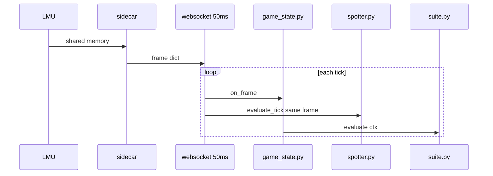
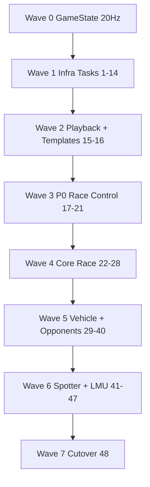

# Crew Chief Complete Port — Master Plan (LMU)

> **For agentic workers:** REQUIRED SUB-SKILL: Use superpowers:subagent-driven-development (recommended) or superpowers:executing-plans to implement this plan task-by-task. Steps use checkbox (`- [ ]`) syntax for tracking.
>
> **Detailed TDD steps for foundation Tasks 1–14:** [`2026-06-07-crewchief-parity-port.md`](./2026-06-07-crewchief-parity-port.md) (same repo folder). This document is the **single source of truth for scope and completion**. Do not mark the port done until every row in the Module Registry below is `DONE` or explicitly `NOT_PORTED`.

**Goal:** Reproduce **all LMU-relevant Crew Chief V4 behavior** in Vantare — same triggers, timing class, channel, suppression, and voice-command responses — using Spanish TTS and the existing desktop stack. **Not** a fork with a pretty UI over batch LLM commentary.

**Architecture:** One canonical `GameState` frame @ 20 Hz feeds **Spotter** and **CrewChiefEventSuite** (every portable `Events/*.cs` module). Both emit deterministic `CrewChiefMessage` → `AlertMessage` → `PlaybackModerator` (frontend + backend policy). LLM is **PTT / fallback only**. Legacy `ProactiveMonitorSuite`, `triggers.py` stream, and `CommentaryOrchestrator` batch are **retired per event_id** as modules cut over.

**Tech Stack:** Python 3.12 / FastAPI / Pydantic / Pytest; React 19 / TypeScript / Vitest / Tauri; LMU shared memory + REST `:6397`; CC reference clone `C:\Users\isaac\Desktop\CrewChiefV4-analysis`.

**Locked decisions (14-day sprint):** [`2026-06-07-crewchief-decisions.md`](./2026-06-07-crewchief-decisions.md) · **Tests pipeline:** [`2026-06-07-crewchief-pipeline-test-template.md`](./2026-06-07-crewchief-pipeline-test-template.md) · **Infra (no sidecar):** [`2026-06-07-native-windows-no-sidecar.md`](./2026-06-07-native-windows-no-sidecar.md) — **Task 49**

---

## 1. Definition of Done (no fork)

The port is **complete** when all of the following are true:

| # | Criterion | Verification |
|---|-----------|--------------|
| D1 | Every **LMU-01…48** row in `.omo/evidence/cc-behavior-parity-matrix.yaml` is `MATCH`, `PARTIAL` (with documented ceiling), or `NOT_PORTED` (with reason) | YAML + checklist |
| D2 | Every portable CC module in the **Module Registry** (§4) is implemented or `NOT_PORTED` | Registry status column |
| D3 | **Zero** parity `event_id` is emitted by `ProactiveMonitorSuite`, `triggers.py` proactive path, or `CommentaryOrchestrator` batch | Grep + integration test |
| D4 | Engineer + race-control events evaluate at **telemetry rate (20 Hz)**, not `evaluate_cycle` @ 0.5 Hz | `test_crewchief_tick_rate.py` |
| D5 | Spotter and engineer share **one frame context** (`CrewChiefFrameContext`) | `test_crewchief_frame_context.py` |
| D6 | Each `MATCH` row has **unit test + fixture or live LMU evidence** in `.omo/evidence/` | Task 48 |
| D7 | `docs/architecture/cc-permanent-ceilings.md` lists every **unavoidable PARTIAL** (LMU data / product scope) | Task 48 |

### Anti-fork rule (hard stop)

If any of these remain after claiming “done”, the product is a **wrapper fork**, not Crew Chief parity:

1. Proactive engineer messages still batched 3–8 s via `CommentaryOrchestrator`.
2. Parity events still evaluated only in `IntelligenceEngine.evaluate_cycle` @ 0.5 Hz.
3. LLM formats proactive flags, penalties, gaps, position, fuel, or session-end messages.
4. `ProactiveMonitorSuite` still owns an `event_id` that the registry assigns to `crewchief_events/modules/*`.

---

## 2. Honest ceiling — permanent PARTIAL / NOT_PORTED

These will **never** be literal CC clones. Implement closest behavior; document in `cc-permanent-ceilings.md`:

| LMU ID | Topic | Ceiling | Implement anyway |
|--------|-------|---------|------------------|
| LMU-13 | Penalty type (DT/SG/black) | LMU: `mNumPenalties` only | Generic + lap countdown |
| LMU-09 | 5-component damage | No engine/tranny SM fields | dent + REST aero/brakes/susp + puncture |
| LMU-25 | Driver stint countdown | No `driver_stint_seconds_remaining` | Name-change swap only |
| LMU-37 | WAV SoundCache | Product: TTS | Semantic templates |
| LMU-39 | Background ambiance | Out of product scope | **NOT_PORTED** |
| LMU-41 | Per-class message packs | Low ROI LMU | **NOT_PORTED** unless user enables |
| LMU-43–44 | Beeps / rants | Optional cosmetic | PARTIAL (toggle off default) |
| LMU-46 | NumberReader | TTS numerals | PARTIAL (acceptable) |
| LMU-33 | Sub-100 ms critical | TTS + network latency | PARTIAL (architecture minimized) |

Everything else in LMU-01…48 is **achievable MATCH** with this plan.

---

## 3. Target file structure & pipelines (CC → Vantare)

Mapa concreto de **cada pipeline CC** a rutas Vantare. Spec conductual detallada: [`docs/architecture/pipelines/`](../architecture/pipelines/README.md).

**Leyenda:** **CREATE** = nuevo en el port · **KEEP** = existe · **MODIFY** = cambiar · **🗑️** = retirar emisores de paridad tras Task 48.

### 3.1 Master map — capas CC → repos Vantare

```mermaid
flowchart TB
  subgraph cc [Crew Chief V4]
    GDR[GameDataReader]
    GSM[GameStateMapper]
    GSD[GameStateData]
    SPOT_C[NoisyCartesianSpotter + Spotter.cs]
    EV_C[Events/*.cs]
    PM_C[PlaybackModerator]
    CMD_C[CommandManager]
    PIT_C[LMUPitMenuController]
    GDR --> GSM --> GSD
    GSD --> SPOT_C
    GSD --> EV_C
    SPOT_C --> PM_C
    EV_C --> PM_C
    CMD_C --> EV_C
    PIT_C --> CMD_C
  end

  subgraph vantare [Vantare target]
    ST[shared-telemetry — in-process @ 20 Hz]
    GS_V[crewchief_events/game_state.py]
    CTX[CrewChiefFrameContext]
    SPOT_V[intelligence/spotter/*]
    SUITE[crewchief_events/suite.py]
    MOD[crewchief_events/modules/*]
    PB[playback + delayed_queue]
    CMD_V[crewchief_events/commands/*]
    PIT_V[services/pit_menu_client.py]
    FE[priorityAudioQueue.ts]
    ST --> GS_V --> CTX
    CTX --> SPOT_V
    CTX --> SUITE --> MOD
    SPOT_V --> PB
    MOD --> PB
    CMD_V --> MOD
    PIT_V --> CMD_V
    PB --> FE
  end
```



| Capa CC | Ruta CC (clone local) | Doc pipeline | Rutas Vantare principales |
|---------|----------------------|--------------|---------------------------|
| GameState | `AllGames/GameDataReader.cs`, `LMU/*Mapper*` | [01-game-state](../architecture/pipelines/01-game-state-ingest.md) | `shared-telemetry/`, `backend` (`StrategyService`), `crewchief_events/game_state.py` — see [Task 49](./2026-06-07-native-windows-no-sidecar.md) |
| Spotter | `NoisyCartesianCoordinateSpotter.cs`, `Events/Spotter.cs` | [02-spotter](../architecture/pipelines/02-spotter-channel.md) | `spotter.py`, `spotter_state.py`, `cartesian_spotter.py` |
| Ingeniero | `Events/*.cs` | [03-engineer](../architecture/pipelines/03-engineer-events-channel.md) | `crewchief_events/modules/*.py` |
| Playback | `Audio/PlaybackModerator.cs` | [04-playback](../architecture/pipelines/04-playback-moderator.md) | `playback.py`, `priorityAudioQueue.ts` |
| Comandos | `CommandManager.cs` | [05-pilot-commands](../architecture/pipelines/05-pilot-commands.md) | `crewchief_events/commands/*` |
| LMU plugin | `LMU/LMU_REST_API.cs`, `LMUPitMenu*` | — | `lmu_api.py`, `pit_menu_client.py`, `lmu_context.py` |
| Deltas Vantare | — | [06-deltas](../architecture/pipelines/06-vantare-implementation-deltas.md) | `llm_client.py`, `commentary_orchestrator.py` (solo PTT) |

### 3.2 Árbol de directorios objetivo (post Task 48)

Columna **Task** por archivo: ver tabla §3.13. Inventario emisores legacy (qué apagar): §3.14–3.15.

```
backend/src/intelligence/
├── crewchief_events/                 # CREATE — núcleo CC en Python
│   ├── __init__.py
│   ├── types.py                      # CrewChiefMessage, FrameContext, Priority, Channel
│   ├── base.py                       # CrewChiefEventModule (triggerInternal)
│   ├── game_state.py                 # CrewChiefGameStateLoop @ 20 Hz
│   ├── frame_builder.py              # prev/curr → CrewChiefFrameContext
│   ├── session_gates.py              # formation lap, FCY, session_type_int
│   ├── session_delay.py              # mute 6 s arranque sesión (LMU-47)
│   ├── lmu_context.py                # damage/fuel multiplier REST
│   ├── suite.py                      # runner ordenado (lista events CC)
│   ├── templates.py                  # render_template(event_id, vars)
│   ├── playback.py                   # → AlertMessage, ttl, play_even_when_silenced
│   ├── delayed_queue.py              # hard-parts delay + isMessageStillValid
│   ├── cutover_registry.py           # event_ids portados; guard legacy
│   ├── properties.py                 # enable_* CC UserSettings
│   ├── modules/                      # ≈ un Events/*.cs por archivo
│   │   ├── flags.py                  # FlagsMonitor.cs
│   │   ├── penalties.py              # Penalties.cs
│   │   ├── damage.py                 # DamageReporting.cs
│   │   ├── rain.py                   # ConditionsMonitor.cs
│   │   ├── position.py               # Position.cs
│   │   ├── timings.py                # Timings.cs
│   │   ├── lap_times.py              # LapTimes.cs
│   │   ├── lap_counter.py            # LapCounter.cs
│   │   ├── push_now.py               # PushNow.cs
│   │   ├── session_end.py            # SessionEndMessages.cs
│   │   ├── fuel.py                   # Fuel.cs
│   │   ├── pit_stops.py              # PitStops.cs
│   │   ├── tyre_monitor.py           # TyreMonitor.cs
│   │   ├── engine_monitor.py         # EngineMonitor.cs
│   │   ├── battery.py                # Battery.cs
│   │   ├── overtaking_aids.py        # OvertakingAidsMonitor.cs
│   │   ├── multiclass.py             # MulticlassWarnings.cs
│   │   ├── frozen_order.py           # FrozenOrderMonitor.cs
│   │   ├── opponents.py              # Opponents.cs
│   │   ├── opponent_messages.py      # OpponentMessages.cs
│   │   ├── watched_opponents.py      # WatchedOpponents.cs
│   │   ├── strategy.py               # Strategy.cs
│   │   ├── pearls.py                 # PearlsOfWisdom.cs
│   │   ├── race_time.py              # RaceTime.cs
│   │   └── driver_swaps.py           # DriverSwaps.cs
│   └── commands/
│       ├── registry.py               # match_fast_command(text)
│       ├── fuel_commands.py
│       ├── gap_commands.py
│       ├── pit_commands.py
│       ├── flags_commands.py
│       ├── spotter_commands.py
│       ├── watch_commands.py
│       └── status_commands.py
│
├── spotter.py                        # KEEP — orquestador pipeline 02
├── spotter_state.py                  # KEEP — FSM lateral
├── spotter_adapter.py                # KEEP
├── cartesian_spotter.py              # KEEP
├── spotter_geometry.py               # KEEP
├── pit_limiter_monitor.py            # KEEP — LMU-04/05
├── engine.py                         # MODIFY — suite + tick; evaluate_cycle = PTT
├── immediate_alert.py                # KEEP
├── verbosity_controller.py           # MODIFY — auto-verbosity CC
├── personality_pack.py               # KEEP
├── driver_names.py                   # KEEP
├── time_format.py                    # KEEP — NumberReader analog
├── competitor_queries.py             # KEEP
├── corner_names.py                   # KEEP — Timings landmarks
├── track_spline.py                   # KEEP
├── sector_analysis.py                # KEEP
├── proactive_monitors.py             # 🗑️ SHRINK Task 48
├── triggers.py                       # 🗑️ SHRINK — solo PTT
├── flags_monitor.py                  # 🗑️ → modules/flags.py
├── rain_monitor.py                   # 🗑️ → modules/rain.py
├── damage_report.py                  # 🗑️ → modules/damage.py
├── penalty_tracker.py                # 🗑️ → modules/penalties.py
├── pit_prediction.py                 # 🗑️ → modules/pit_stops.py
├── fuel_safety.py                    # 🗑️ → modules/fuel.py
├── fuel_percentile.py                  # 🗑️ → modules/fuel.py
├── pearls_of_wisdom.py                 # 🗑️ → modules/pearls.py
├── commentary_orchestrator.py        # 🗑️ NO batch paridad
├── commentary_llm_formatter.py       # KEEP — PTT / resúmenes opt-in
└── llm_client.py                     # KEEP — fallback PTT

backend/src/services/
├── lmu_api.py                        # MODIFY
├── pit_menu_client.py                # CREATE — Task 43
└── strategy_service.py               # KEEP — frame, no voz

backend/src/data/
├── crewchief_templates_es.json       # CREATE — Task 15
├── spotter_phrases_es.json           # KEEP
└── fuel_usage.json                   # CREATE — LMU-45

backend/tests/
├── test_crewchief_*.py
├── fixtures/crewchief/<module>/
└── scripts/replay_trace.py

frontend/src/services/
├── priorityAudioQueue.ts             # MODIFY — pipeline 04
├── alertVoice.ts                     # MODIFY
├── spotterCommands.ts                # KEEP
├── ttsCache.ts                       # KEEP
└── configUpdatePayload.ts            # MODIFY — CC properties

shared-telemetry/shared_telemetry/session_kind.py   # KEEP
sidecar/src/sidecar/strategy_runner.py              # MODIFY — campos CC @ 20 Hz
```

### 3.3 Pipeline 01 — GameState / ingest

| Paso | CC | Archivo Vantare | Hz |
|------|-----|-----------------|-----|
| Leer sim | LMU shared memory reader | `shared-telemetry` / backend in-process ([Task 49](./2026-06-07-native-windows-no-sidecar.md)) | 20 |
| Normalizar | `*GameStateMapper` | `telemetry_frame_builder.py` → `TelemetryFrame` | 20 |
| Publicar | in-process | `websocket.py` `/ws` telemetry | 20 |
| Contexto CC | `GameStateData` prev/curr | `frame_builder.py` | **20** |
| Dispatch | `CrewChief.cs` loop | `game_state.py` `on_frame()` | **20** |



Campos obligatorios: ver `.omo/evidence/lmu-data-availability.md` y pipeline [01](../architecture/pipelines/01-game-state-ingest.md).

### 3.4 Pipeline 02 — Spotter

| Concern | CC | Vantare | WS |
|---------|-----|---------|-----|
| Lateral / clear / 3-wide | `NoisyCartesianCoordinateSpotter.cs` | `spotter_state.py`, `cartesian_spotter.py` | `alert` IMMEDIATE |
| Orquestación | `Spotter.cs` | `spotter.py` | `alert` |
| Frame → tick | mapper | `spotter_adapter.py` | — |
| Pit limiter | callbacks | `pit_limiter_monitor.py` | `alert` |
| FCY pause LMU-40 | `CrewChief.cs` | `spotter.py` + `session_gates.py` | — |
| Grid side LMU-36 | `Events/Spotter.cs` | `spotter.py` Task 41 | `alert` |
| Frases | WAV folders | `spotter_phrases_es.json` | — |

**Fuera del spotter (canal ingeniero):** fuel crítico, FCY voz, damage → `crewchief_events/modules/*`.

Config CC: `frontend/store/config.ts` → WS `config_update` → `spotter.apply_runtime_config()`.

### 3.5 Pipeline 03 — Ingeniero / Events

Cada fila del **Module Registry (§4)** es un `modules/<name>.py` + `test_crewchief_<name>_module.py`.

| CC `Events/*.cs` | Archivo Vantare | Test | Legacy 🗑️ |
|------------------|-----------------|------|------------|
| `FlagsMonitor.cs` | `modules/flags.py` | `test_crewchief_flags_module.py` | `flags_monitor.py` |
| `Penalties.cs` | `modules/penalties.py` | `test_crewchief_penalties_module.py` | `penalty_tracker.py` |
| `DamageReporting.cs` | `modules/damage.py` | `test_crewchief_damage_module.py` | `damage_report.py`, spotter `_eval_damage` |
| `ConditionsMonitor.cs` | `modules/rain.py` | `test_crewchief_rain_module.py` | `rain_monitor.py` |
| `Position.cs` | `modules/position.py` | `test_crewchief_position_module.py` | `proactive_monitors` position |
| `Timings.cs` | `modules/timings.py` | `test_crewchief_timings_module.py` | gap triggers |
| `LapTimes.cs` | `modules/lap_times.py` | `test_crewchief_lap_times_module.py` | lap triggers |
| `LapCounter.cs` | `modules/lap_counter.py` | `test_crewchief_lap_counter_module.py` | last lap en spotter |
| `PushNow.cs` | `modules/push_now.py` | `test_crewchief_push_now_module.py` | `PushNowTrigger` LLM |
| `SessionEndMessages.cs` | `modules/session_end.py` | `test_crewchief_session_end_module.py` | `SessionEndTrigger` |
| `Fuel.cs` | `modules/fuel.py` | `test_crewchief_fuel_module.py` | `fuel_safety`, spotter fuel |
| `PitStops.cs` | `modules/pit_stops.py` | `test_crewchief_pit_stops_module.py` | `pit_prediction.py` |
| `TyreMonitor.cs` | `modules/tyre_monitor.py` | `test_crewchief_tyre_monitor_module.py` | — |
| `EngineMonitor.cs` | `modules/engine_monitor.py` | `test_crewchief_engine_monitor_module.py` | — |
| `Battery.cs` | `modules/battery.py` | `test_crewchief_battery_module.py` | hybrid trigger |
| `MulticlassWarnings.cs` | `modules/multiclass.py` | `test_crewchief_multiclass_module.py` | proactive multiclass |
| `FrozenOrderMonitor.cs` | `modules/frozen_order.py` | `test_crewchief_frozen_order_module.py` | — |
| `Opponents.cs` | `modules/opponents.py` | `test_crewchief_opponents_module.py` | proactive opponents |
| `OpponentMessages.cs` | `modules/opponent_messages.py` | `test_crewchief_opponent_messages_module.py` | — |
| `WatchedOpponents.cs` | `modules/watched_opponents.py` | `test_crewchief_watched_opponents_module.py` | — |
| `Strategy.cs` | `modules/strategy.py` | `test_crewchief_strategy_module.py` | strategy LLM proactive |
| `PearlsOfWisdom.cs` | `modules/pearls.py` | `test_crewchief_pearls_module.py` | `pearls_of_wisdom.py` |
| `RaceTime.cs` | `modules/race_time.py` | `test_crewchief_race_time_module.py` | — |
| `DriverSwaps.cs` | `modules/driver_swaps.py` | `test_crewchief_driver_swaps_module.py` | — |
| `OvertakingAidsMonitor.cs` | `modules/overtaking_aids.py` | `test_crewchief_overtaking_aids_module.py` | — |

Flujo salida (sin batch):

```
modules/*.py → CrewChiefMessage
  → playback.map_message_to_alert()
  → AlertMessage(event=alert)
  → websocket → priorityAudioQueue
```

Infra compartida: `base.py`, `session_gates.py`, `templates.py`, `suite.py`, `playback.py`.

🗑️ `commentary_end` batch **no** es vía de paridad.

### 3.6 Pipeline 04 — PlaybackModerator

| Comportamiento CC | Backend | Frontend |
|-------------------|---------|----------|
| Prioridad / immediate | `playback.py`, `messages.py` | `priorityAudioQueue.ts` |
| Expiry 1–2 s | `ttl_ms` | drop expired |
| playEvenWhenSilenced | `playback.py` | `alertVoice.ts` |
| speakOnlyWhenSpokenTo | `verbosity_controller.py` | `config.ts` |
| Auto-verbosity dinámica | `verbosity_controller.py` | — |
| Delay hard-parts | `delayed_queue.py` | `delayedUntilMs` |
| isMessageStillValid | `delayed_queue.py` | optional |
| maxPermittedQueueLength | config | `priorityAudioQueue.ts` |
| Spotter preempts | — | `enqueueImmediate` |
| Duck sim | — | Tauri `duck_lmu` |
| Beeps LMU-43 | optional | `public/sounds/` |

### 3.7 Pipeline 05 — Comandos piloto

| Dominio | CC | Vantare | Target latencia |
|---------|-----|---------|-----------------|
| spot / don't spot | propiedad | `commands/spotter_commands.py` + `spotterCommands.ts` | <100 ms |
| fuel | `Fuel.cs` | `fuel_commands.py` | <200 ms |
| gap / lap | `Timings.cs` | `gap_commands.py` | <200 ms |
| pit fuel/tyres/VE | `LMUPitMenuController` | `pit_commands.py` + `pit_menu_client.py` | <500 ms |
| watch rival | `WatchedOpponents.cs` | `watch_commands.py` | <200 ms |
| texto libre | — | `llm_client.py` | fallback |

Entrada: `commands/registry.py` → `match_fast_command(text)`.

### 3.8 Pipeline 06 — LMU + deltas Vantare

| CC | Vantare | Paridad |
|----|---------|---------|
| REST read | `lmu_api.py` | ✓ |
| Pit menu write | `pit_menu_client.py` | Task 43 |
| Session settings | `lmu_context.py` | Task 47 |
| LLM/RAG | `llm_client.py` | Delta — PTT only |
| Overlay/VR | — | NOT_PORTED |

### 3.9 Contrato WebSocket (routing paridad)

| `event` | Pipeline | Uso post-port |
|---------|----------|---------------|
| `alert` | 02 + 03 urgent | **Salida principal paridad** |
| `commentary_end` | 06 delta | No mensajes CC deterministas |
| `advice_*` | 05 PTT LLM | Mantener |
| `config_ack` | UserSettings | Mantener |
| `telemetry` | 01 | UI |

Un mensaje CC = un WS frame. Nunca merge.

### 3.10 Tests y evidencia por pipeline

**Plantilla obligatoria (L1–L6, fixtures, informe piloto):** [`2026-06-07-crewchief-pipeline-test-template.md`](./2026-06-07-crewchief-pipeline-test-template.md)

| Pipeline | Tests | Fixtures | Evidencia live |
|----------|-------|----------|----------------|
| 01 | `test_crewchief_tick_rate.py` | `fixtures/crewchief/frame_*.json` | telemetry validation |
| 02 | `test_spotter*.py` | `fixtures/spotter/*.json` | `spotter-lmu-validation.md` |
| 03 | `test_crewchief_*_module.py` | `fixtures/crewchief/<mod>/` | checklist LMU |
| 04 | `test_crewchief_playback*.py`, vitest | — | `audio-lmu-validation.md` |
| 05 | `test_crewchief_commands*.py` | text → message | PTT manual |
| Replay | `scripts/replay_trace.py` | `data/traces/*.trace` | Task 48 JSON |

### 3.11 Orden en `suite.py` (lista CC)

1. `session_delay` (gate global)
2. `flags` → `frozen_order` → `penalties` → `damage` → `rain`
3. `position` → `timings` → `lap_times` → `lap_counter` → `race_time`
4. `fuel` → `pit_stops` → `tyre_monitor` → `engine_monitor` → `battery`
5. `multiclass` → `overtaking_aids` → `opponents` → `opponent_messages` → `watched_opponents`
6. `push_now` → `session_end` → `strategy` → `pearls` → `driver_swaps`

Spotter: pipeline 02, **fuera** del suite, mismo `CrewChiefFrameContext`.

### 3.12 Diagrama E2E — LMU shared memory → TTS

Flujo **objetivo** tras Task 0 + Task 48 (sin batch ni 0.5 Hz para paridad):

```mermaid
flowchart TB
  subgraph ingest [Pipeline 01 — 20 Hz]
    LMU[LMU shared memory]
    SC[sidecar strategy_runner]
    WS[websocket telemetry_sender_loop 50ms]
    FB[frame_builder.py]
    LMU --> SC --> WS --> FB
  end

  subgraph voices [Mismo frame dict]
    FB --> SPOT[spotter.py evaluate_tick]
    FB --> GS[game_state.py on_frame]
    GS --> SUITE[suite.py evaluate]
    SUITE --> MOD[modules/*.py]
  end

  subgraph out [Pipeline 04]
    SPOT --> PB[playback.py map_message_to_alert]
    MOD --> PB
    PB --> IMM[immediate_alert / AlertMessage]
    IMM --> BROADCAST[broadcaster.send]
  end

  subgraph fe [Frontend]
    BROADCAST --> WSFE[useWebSocket alert]
    WSFE --> AV[alertVoice.ts filter]
    AV --> PAQ[priorityAudioQueue.ts]
    PAQ --> TTS[/tts API → altavoz]
  end

  subgraph delta [Pipeline 06 — no paridad CC]
    PTT[Piloto PTT] --> CMD[commands/registry.py]
    CMD -->|match| MOD
    CMD -->|no match| LLM[llm_client advice_*]
    LLM --> PAQ
    MONlegacy[evaluate_cycle 0.5Hz] -.->|retirar| BATCH[commentary_end batch]
  end
```

**Hoy (deuda):** spotter @ 20 Hz; ingeniero vía `strategy_sender_loop` @ **0.5 Hz** → `ProactiveMonitorSuite` + `triggers` → mezcla `alert` + `commentary_end` batch 3–8 s.

### 3.13 Mapa archivo → Task (referencia rápida)

Complementa el árbol §3.2. Rutas relativas a `backend/src/intelligence/` salvo indicación.

| Archivo | Task | Pipeline | Estado post-port |
|---------|------|----------|------------------|
| `crewchief_events/game_state.py` | 0 | 01 | CREATE |
| `crewchief_events/frame_builder.py` | 0 | 01 | CREATE |
| `crewchief_events/types.py` … `base.py` | 1 | 03 | CREATE |
| `crewchief_events/session_gates.py` | 2 | 03 | CREATE |
| `crewchief_events/suite.py` | 3 | 03 | CREATE |
| `crewchief_events/playback.py` | 4 | 04 | CREATE |
| `engine.py` (wire suite, PTT only) | 5 | 01/03 | MODIFY |
| `../routers/websocket.py` (tick) | 0, 5 | 01 | MODIFY |
| `crewchief_events/templates.py` + `../data/crewchief_templates_es.json` | 15 | 03 | CREATE |
| `crewchief_events/delayed_queue.py` | 16 | 04 | CREATE |
| `crewchief_events/modules/flags.py` | 17 | 03 | CREATE |
| `crewchief_events/modules/penalties.py` | 18 | 03 | CREATE |
| `crewchief_events/modules/damage.py` | 19 | 03 | CREATE |
| `crewchief_events/modules/rain.py` | 20 | 03 | CREATE |
| `crewchief_events/modules/position.py` | 21 | 03 | CREATE |
| `crewchief_events/modules/timings.py` | 22 | 03 | CREATE |
| `crewchief_events/modules/lap_times.py` | 23 | 03 | CREATE |
| `crewchief_events/modules/lap_counter.py` | 24 | 03 | CREATE |
| `crewchief_events/modules/push_now.py` | 25 | 03 | CREATE |
| `crewchief_events/modules/session_end.py` | 26 | 03 | CREATE |
| `crewchief_events/modules/fuel.py` | 27 | 03 | CREATE |
| `crewchief_events/modules/pit_stops.py` | 28 | 03 | CREATE |
| `crewchief_events/modules/tyre_monitor.py` | 29 | 03 | CREATE |
| `crewchief_events/modules/engine_monitor.py` | 30 | 03 | CREATE |
| `crewchief_events/modules/battery.py` | 31 | 03 | CREATE |
| `crewchief_events/modules/overtaking_aids.py` | 32 | 03 | CREATE |
| `crewchief_events/modules/multiclass.py` | 33 | 03 | CREATE |
| `crewchief_events/modules/frozen_order.py` | 34 | 03 | CREATE |
| `crewchief_events/modules/opponents.py` | 35 | 03 | CREATE |
| `crewchief_events/modules/opponent_messages.py` | 36 | 03 | CREATE |
| `crewchief_events/modules/watched_opponents.py` | 37 | 03 | CREATE |
| `crewchief_events/modules/strategy.py` | 38 | 03 | CREATE |
| `crewchief_events/modules/pearls.py` | 39 | 03 | CREATE |
| `crewchief_events/modules/race_time.py` | 40 | 03 | CREATE |
| `crewchief_events/modules/driver_swaps.py` | 41 | 03 | CREATE |
| `spotter.py` (grid side) | 42 | 02 | MODIFY |
| `spotter_state.py`, `cartesian_spotter.py` | 43 | 02 | MODIFY |
| `../services/pit_menu_client.py` | 43–44 | 06 | CREATE |
| `crewchief_events/commands/*` | 44–45 | 05 | CREATE |
| `crewchief_events/session_delay.py` | 46 | 03 | CREATE |
| `crewchief_events/lmu_context.py` | 47 | 06 | CREATE |
| `crewchief_events/cutover_registry.py` | 48 | — | CREATE |
| `frontend/.../priorityAudioQueue.ts` | 6, 16 | 04 | MODIFY |
| `frontend/.../alertVoice.ts` | 6, 7 | 04 | MODIFY |

### 3.14 Inventario de emisores actuales (legacy) — qué hace cada uno y hasta dónde llega

Documento vivo para saber **qué test cubre qué** y **qué apagar** en cutover. Frecuencia ingeniero = **`strategy_sender_loop` @ 0.5 Hz** (`websocket.py`, cada ~2 s). Spotter = **`telemetry_sender_loop` @ 20 Hz**.

#### Leyenda de rutas de salida

| Ruta | Cadena | WS `event` | Frontend | ¿Paridad CC? |
|------|--------|------------|----------|--------------|
| **A — Immediate alert** | `ImmediateAlert` / `AlertMessage` | `alert` | `alertVoice` → `enqueueImmediate` o cola | ✓ objetivo urgencias |
| **B — Commentary batch** | `enqueue_commentary` → debounce 3–8 s → LLM formatter | `commentary_end` | `priorityAudioQueue` NORMAL | ✗ anti-CC |
| **C — Trigger LLM** | `TriggerAction.LLM_REQUIRED` → `_run_llm_stream` | `advice_start` / `advice_end` | stream TTS | Delta (PTT-like) |
| **D — Trigger alert** | `TriggerAction.ALERT_ONLY` → `AlertMessage` | `alert` | igual que A | ✓ parcial |
| **E — Pearl direct** | `_emit_pearl` → `AlertMessage` | `alert` (`category=pearl`) | TTS | Delta CC |

#### A. `triggers.py` — `engine.evaluate_cycle` @ 0.5 Hz

Evaluados en orden de prioridad; **solo el primer `LLM_REQUIRED` activo** detiene el resto en ese ciclo.

| Clase | Acción | Condición resumida | Cooldown | Salida | CC module destino | Tests existentes | Task cutover |
|-------|--------|-------------------|----------|--------|-------------------|------------------|--------------|
| `FuelCriticalTrigger` | LLM (C) | <3 vueltas combustible | 15 s | advice stream | `Fuel.cs` | `test_triggers.py`, `test_audio_trigger_matrix.py` | 27 |
| `FlagsMonitorTrigger` | LLM (C) | transición banderas vía `flags_monitor` | 10 s | advice stream | `FlagsMonitor.cs` | `test_fcy_wave1.py`, matrix | 17 |
| `BrakeWearCriticalTrigger` | Alert (D) | brake wear >80% | 20 s | alert | `TyreMonitor`/brakes | `test_braking_zones_mute.py`? | 29 |
| `TiresThermalOverheatingTrigger` | LLM (C) | tyre temp >105°C | 30 s | advice | `TyreMonitor.cs` | `test_preemption.py` | 29 |
| `TyreDegAccelTrigger` | LLM (C) | avg wear >25% | 30 s | advice | `TyreMonitor.cs` | — | 29 |
| `HybridDeployMapTrigger` | LLM (C) | SOC <20% descarga | 30 s | advice | `Battery.cs` | — | 31 |
| `MulticlassWarningTrigger` | Alert (D) | clase rápida/lenta gap | 8 s | alert | `MulticlassWarnings.cs` | `test_proactive_monitors*.py` | 33 |
| `DriverSwapTrigger` | Alert (D) | cambio `driver_name` | 30 s | alert | `DriverSwaps.cs` | — | 41 |
| `PenaltyMonitorTrigger` | — | **siempre False** (delegado) | — | — | `Penalties.cs` | — | 18 |
| `WeatherChangeTrigger` | LLM (C) | forecast lluvia >30% | 120 s | advice | Conditions (forecast) | — | 20 (live rain only) |
| `PitWindowOpenedTrigger` | LLM (C) | pit_window_open | 30 s | advice | `PitStops.cs` | — | 28 |
| `PitWindowClosingTrigger` | LLM (C) | ≤2 vueltas ventana | 15 s | advice | `PitStops.cs` | — | 28 |
| `CompetitorPittedTrigger` | LLM (C) | rival adyacente entra boxes | 15 s | advice | `Opponents.cs` | — | 35 |
| `GapClosedTrigger` | LLM (C) | gap <1.5 s | 10 s | advice | `Timings.cs` | — | 22 |
| `PushNowTrigger` | LLM (C) | undercut o ≤3 vueltas | 45 s | advice | `PushNow.cs` | `test_overtake_wave1.py`? | 25 |
| `SessionEndTrigger` | LLM (C) | fin sesión / última vuelta | 60 s | advice | `SessionEndMessages.cs` | — | 26 |
| `PhaseChangedTrigger` | LLM (C) | cambio fase sesión | 5 s | advice | — | — | — |
| `PilotQuestionTrigger` | LLM (C) | PTT manual | 0 | advice | CommandManager | `test_engine.py` | 44 (mantener LLM fallback) |

#### B. `proactive_monitors.py` — `ProactiveMonitorSuite.evaluate` @ 0.5 Hz

Llamado desde `engine._run_proactive_monitors`. Tupla `(event_id, summary, priority)` → ruta **B** salvo `ImmediateAlert` → ruta **A**.

| event_id / origen | Método | Cuándo dispara | Cooldown | Ruta | CC destino | Tests | Task |
|-------------------|--------|----------------|----------|------|------------|-------|------|
| `race_start` | `evaluate` | race lap≤1, once | — | **A** | Position/SessionStart | `test_engine_proactive_cycle.py` | 21 |
| `session_end` | `evaluate` | session_over | — | **B** | SessionEndMessages | same | 26 |
| `position_change` | `evaluate` | standing/class pos change | — | **B** | Position.cs | `test_proactive_monitors.py` | 21 |
| `lap_complete` | `_on_lap_complete` | fin vuelta | — | **B** | LapCounter/LapTimes | `test_commentary_orchestrator.py` | 23–24 |
| `fast_lap` | `_on_lap_complete` / competitor | PB lap | — | **B** | LapTimes.cs | — | 23 |
| `gap_update` | `_on_lap_complete` | tiempo restante (no gap sector!) | — | **B** | Timings.cs | — | 22 |
| `flags_*` | `_eval_flags` | transición bandera | — | **A** | FlagsMonitor | `test_fcy_wave1.py`, `test_flags*` | 17 |
| `penalty_*` | `_eval_penalties` → `PenaltyTracker` | num_penalties SM | — | **A** | Penalties.cs | `test_penalty_wave1.py` | 18 |
| `rain_*` | `_eval_rain` → `RainLevelMonitor` | mRaining level change | 120 s | **A** | ConditionsMonitor | `test_rain_wave1.py` | 20 |
| `overtake` / `being_overtaken` | `_detect_overtakes` | rival key change + gap | 20 s | **A** | Position.cs | `test_overtake_wave1.py` | 21 |
| `drs` | `_eval_drs` | flap edge | — | **B** | OvertakingAids | — | 32 |
| `frozen_order` | `_eval_frozen_order` | frozen flag edge | — | **B** | FrozenOrderMonitor | — | 34 |
| `tyre_monitor` | `_eval_car_monitors` | avg wear ≥75% | 120 s | **B** | TyreMonitor | — | 29 |
| `brake_wear` | `_eval_car_monitors` | max brake ≥80% | 120 s | **B** | TyreMonitor/brakes | — | 29 |
| `fuel` | `_eval_car_monitors` | autonomy critical / percentile | 90 s | **B** | Fuel.cs | `test_fuel_*` | 27 |
| `engine_monitor` | `_eval_car_monitors` | water/oil >105 | 90 s | **B** | EngineMonitor | — | 30 |
| `damage_summary` | `_eval_car_monitors` | dent/aero | 120 s | **B** | DamageReporting | `test_damage_wave1.py` | 19 |
| `opponents` | `_eval_competitors` | pit entry/exit, pos, gap | 45 s | **B** | Opponents.cs | `test_proactive_monitors_extended.py` | 35 |
| `pit_stops` | `_eval_strategy` / `_eval_pit_timing` | predicción / duración parada | 90 s | **B** | PitStops.cs | `test_pit_prediction.py` | 28 |
| `strategy` | `_eval_strategy` | sector fuel analysis | 60 s | **B** | Strategy.cs | — | 38 |
| `push_now` | `_eval_strategy` | strategy.push_now flag | 60 s | **B** | PushNow.cs | — | 25 |
| `driver_swaps` | `_eval_driver_swap` | swap flag telemetry | 120 s | **B** | DriverSwaps.cs | — | 41 |
| `fast_lap` (rival) | `_eval_competitor_fast_laps` | rival PB | — | **B** | OpponentMessages | — | 36 |

**Nota:** `_format_gap_update` y `GAP_REPORT_INTERVAL_S=45` existen pero **no hay caller activo** en `evaluate()` — deuda / código muerto; Timings sector-based reemplaza en Task 22.

`PenaltyTracker` event_ids: `penalty_new`, `penalty_2_laps`, `penalty_1_lap`, `penalty_pit_now`, `penalty_served`, `penalty_not_served`, `penalty_disqualified`.

#### C. `spotter.py` — `evaluate_tick` @ 20 Hz

Todos → ruta **A** (`AlertMessage` `event=alert`). Varios deberían migrar a **ingeniero** (canal CC).

| Método | category | Cuándo | TTL típico | CC canal correcto | LMU | Tests | Task |
|--------|----------|--------|------------|-------------------|-----|-------|------|
| `_eval_pit_limiters` | limiter | entrada/salida boxes | — | Spotter ✓ | 04–05 | `test_spotter*.py` | KEEP 02 |
| `_eval_gaps` | gaps | gap <0.5 s (UI) | 3 s | Timings (ingeniero) | 10 | `test_spotter_audio_contract.py` | 22 / toggle off |
| `_eval_damage` | damage | impacto REST | — | DamageReporting | 09 | `test_damage_wave1.py` | 19 → engineer |
| `_eval_puncture` | damage | mFlat | — | DamageReporting | 09 | — | 19 |
| `_eval_crash` | damage | are you OK | — | DamageReporting | 09 | — | 19 |
| `_eval_proximity` | proximity | lateral L/R, 3-wide | 1–2 s | Spotter ✓ | 01–03 | `test_spotter_cc_parity.py` | 43 |
| `_eval_last_lap` | session | última vuelta | — | LapCounter/SessionEnd | 08 | — | 24/26 |
| `_eval_fcy_phases` | safety_car | FCY subfases | — | FlagsMonitor (ingeniero) | 15 | `test_fcy_wave1.py` | 17 |
| `_eval_fuel_critical` | fuel | crítico | — | Fuel.cs (ingeniero) | 06 | — | 27 |

#### D. Perlas — `engine.py` @ 0.5 Hz

| Origen | PearlType | Ruta | CC | Task |
|--------|-----------|------|-----|------|
| `_maybe_emit_pearls` | OVERTAKE, COMEBACK | E alert | PearlsOfWisdom | 39 |
| `_check_fast_lap_pearl` | FAST_LAP | E | Pearls | 39 |
| cada 12 vueltas (detailed verbosity) | STANDARD | E | Pearls | 39 |

#### E. `commentary_orchestrator.py` — destino de ruta B

| Paso | Qué hace | Test |
|------|----------|------|
| `enqueue` | acumula `PendingCommentaryEvent`, respeta `event_registry` verbosity | `test_commentary_orchestrator.py` |
| debounce 3 s / max 8 s | agrupa N eventos en uno | `test_commentary_debounce.py` |
| `format_commentary_batch` | LLM o determinista → un texto | `test_commentary_llm_formatter.py` |
| `flush` | `commentary_end` WS | `test_engine_proactive_cycle.py` |

**Post-port:** solo eventos **no** listados en `cutover_registry` (resúmenes opt-in).

#### F. `event_registry.py` — metadatos de ruta B

Registra `verbosity_min` y `priority` para event_ids de commentary. Ampliar al portar; destino final: metadata en `crewchief_events/properties.py`.

### 3.15 Mapa de tests → pipeline → emisor → destino post-port

| Test file | Qué valida hoy | Emisor bajo test | Pipeline | Tras port (migrar a) |
|-----------|----------------|------------------|----------|----------------------|
| `test_spotter*.py`, `test_cartesian_spotter.py` | lateral, 3-wide, limiter | spotter @ 20 Hz | 02 | KEEP + Task 43 |
| `test_spotter_cc_parity.py`, `test_spotter_e2e.py` | contrato audio LMU-01–05 | spotter | 02 | KEEP |
| `test_fcy_wave1.py`, `test_flags*` | FCY/banderas | proactive + spotter + triggers | 02/03 | `test_crewchief_flags_module.py` |
| `test_penalty_wave1.py` | countdown penalización | proactive → PenaltyTracker | 03 | `test_crewchief_penalties_module.py` |
| `test_damage_wave1.py` | daño impacto/puncture | spotter + proactive | 02/03 | `test_crewchief_damage_module.py` |
| `test_rain_wave1.py` | lluvia live | proactive → RainLevelMonitor | 03 | `test_crewchief_rain_module.py` |
| `test_fuel_*.py` | combustible | proactive + triggers | 03 | `test_crewchief_fuel_module.py` |
| `test_overtake_wave1.py` | adelantamiento | proactive ImmediateAlert | 03 | `test_crewchief_position_module.py` |
| `test_pit_prediction.py` | ventana pits | proactive | 03 | `test_crewchief_pit_stops_module.py` |
| `test_proactive_monitors*.py` | suite proactivo | ProactiveMonitorSuite | 03 | split per module tests |
| `test_engine_proactive_cycle.py` | batch race_start | engine cycle | 03/06 | `test_crewchief_no_legacy_emitters.py` |
| `test_commentary_*.py` | debounce/LLM batch | CommentaryOrchestrator | 06 | KEEP solo opt-in |
| `test_immediate_routing.py` | alert vs commentary | engine | 04 | `test_crewchief_playback_policy.py` |
| `test_preemption.py` | prioridad spotter/LLM | triggers + spotter | 04 | FE vitest + playback |
| `test_audio_trigger_matrix.py` | matriz LMU audio | engine cycle end-to-end | ALL | `replay_trace.py` + checklist |
| `test_triggers.py` | condiciones trigger | triggers.py | 03 | retirar o PTT-only |
| `test_session_race_gating.py` | mSession gates | enqueue_commentary | 01 | `test_crewchief_session_gates.py` |
| `test_config_sync_ws.py` | runtime config | spotter/engine | 02/05 | KEEP |
| `test_crewchief_*.py` (futuros) | módulos CC | crewchief_events | 03 | **fuente CI paridad** |
| `priorityAudioQueue*.test.ts` | cola FE | WS alert/commentary | 04 | Task 6, 16 |

**Regla para nuevos tests:** un test por `event_id` portado en `backend/tests/test_crewchief_<module>_module.py`; no añadir cobertura de paridad CC en `test_proactive_monitors.py` tras cutover del módulo. Ver capas L1–L3 en [pipeline-test-template](./2026-06-07-crewchief-pipeline-test-template.md).

---

Status values: `PENDING` | `IN_PROGRESS` | `DONE` | `NOT_PORTED`

| Task | CC source | Vantare module file | LMU IDs | Cutover: retire from | Max parity |
|------|-----------|---------------------|---------|----------------------|------------|
| **0** | GameState mappers | `crewchief_events/game_state.py` | 42, 47 | — | MATCH |
| **1–14** | Infra (see parity-port.md) | `crewchief_events/*` | 31–38, 33, 35 | partial | MATCH/PARTIAL |
| **15** | `templates.py` + P0 annex | `crewchief_events/templates.py` | all P0 text | triggers templates | MATCH |
| **16** | `PlaybackModerator.cs` delayed queue | `crewchief_events/delayed_queue.py` + FE | 22, 38 | braking mute only | MATCH |
| **17** | `FlagsMonitor.cs` full | `modules/flags.py` | 07, 15 | `flags_monitor.py` emit | MATCH |
| **18** | `Penalties.cs` full | `modules/penalties.py` | 13 | `penalty_tracker` emit | PARTIAL |
| **19** | `DamageReporting.cs` full | `modules/damage.py` | 09 | `damage_report` emit | PARTIAL |
| **20** | `ConditionsMonitor.cs` | `modules/rain.py` | 30 | `rain_monitor` emit | MATCH |
| **21** | `Position.cs` full | `modules/position.py` | 20, 23, 27 | proactive position | MATCH |
| **22** | `Timings.cs` full | `modules/timings.py` | 10, 22, 27 | gap triggers | MATCH |
| **23** | `LapTimes.cs` | `modules/lap_times.py` | 21, 32 | lap triggers | MATCH |
| **24** | `LapCounter.cs` | `modules/lap_counter.py` | 08, 21 | lap_complete partial | MATCH |
| **25** | `PushNow.cs` | `modules/push_now.py` | 19 | — | MATCH |
| **26** | `SessionEndMessages.cs` | `modules/session_end.py` | 28 | — | MATCH |
| **27** | `Fuel.cs` full + persist | `modules/fuel.py` | 06, 14, 45 | fuel monitors | MATCH |
| **28** | `PitStops.cs` full | `modules/pit_stops.py` | 16, 17 | `pit_prediction` emit | MATCH |
| **29** | `TyreMonitor.cs` | `modules/tyre_monitor.py` | 11, 18 | — | MATCH |
| **30** | `EngineMonitor.cs` | `modules/engine_monitor.py` | 29 | — | PARTIAL |
| **31** | `Battery.cs` | `modules/battery.py` | — | hybrid trigger | MATCH |
| **32** | `OvertakingAidsMonitor.cs` | `modules/overtaking_aids.py` | — | — | PARTIAL |
| **33** | `MulticlassWarnings.cs` full | `modules/multiclass.py` | 12 | — | MATCH |
| **34** | `FrozenOrderMonitor.cs` full | `modules/frozen_order.py` | 07 | — | MATCH |
| **35** | `Opponents.cs` | `modules/opponents.py` | 26 | — | MATCH |
| **36** | `OpponentMessages.cs` | `modules/opponent_messages.py` | — | LLM rivals | MATCH |
| **37** | `WatchedOpponents.cs` + Snip | `modules/watched_opponents.py` | 34 | — | MATCH |
| **38** | `Strategy.cs` | `modules/strategy.py` | — | strategy LLM proactive | MATCH |
| **39** | `PearlsOfWisdom.cs` | `modules/pearls.py` | 24 | `pearls_of_wisdom` | MATCH |
| **40** | `RaceTime.cs` | `modules/race_time.py` | — | — | MATCH |
| **41** | `DriverSwaps.cs` | `modules/driver_swaps.py` | 25 | — | PARTIAL |
| **42** | `Events/Spotter.cs` rules | `spotter.py` + config | 36 | — | MATCH |
| **43** | `NoisyCartesianCoordinateSpotter.cs` | `spotter_state.py` | 01–03, 40 | — | MATCH |
| **44** | `LMUPitMenu*` write | `services/pit_menu_client.py` | 48 | — | MATCH (dry-run gate) |
| **45** | `CommandManager` / speech | `crewchief_events/commands/*` | 35, PTT | — | PARTIAL |
| **46** | `CrewChief.cs` session delay | `crewchief_events/session_delay.py` | 47 | — | MATCH |
| **47** | LMU session settings | `crewchief_events/lmu_context.py` | 09, 14, 29 | — | MATCH |
| **48** | Cutover + validation | tests + `.omo/evidence/` | ALL | **delete** legacy emitters | — |

**Explicit NOT_PORTED (do not implement):**

| CC module | Reason |
|-----------|--------|
| `CoDriver.cs`, `AlarmClock.cs` | N/A circuit |
| `IRacingBroadcastMessageEvent.cs`, `Ratings.cs` | N/A LMU |
| `OverlayController.cs`, `VROverlayController.cs` | Product scope |
| `*_legacy.cs` (5 files) | Use modern module only |
| `NullEvent.cs`, `SmokeTest.cs` | Internal |
| `Mqtt.cs` | Optional; Vantare has `mqtt_service.py` — **NOT_PORTED** unless user requests |

---

## 5. Execution waves (order is mandatory)



| Wave | Tasks | Outcome |
|------|-------|---------|
| 0 | 0 | Single GameState @ 20 Hz; engineer events on telemetry tick |
| 1 | 1–14 | Types, gates, suite, playback base, engine wire, FE expiry, verbosity, P0/P1 skeleton, pit menu, frozen/multiclass, fast commands — **follow parity-port.md** |
| 2 | 15–16 | Full template catalog + delayed message queue |
| 3 | 17–21 | Full P0 race-control modules (replace legacy emitters) |
| 4 | 22–28 | Timings, lap times, push, session end, fuel, pits — **core “sounds like CC”** |
| 5 | 29–40 | Tyres, engine, battery, opponents, watched, pearls, race time |
| 6 | 41–47 | Spotter polish, pit menu production, full command catalog, session delay |
| 7 | 48 | Legacy retirement, matrix closure, replay harness |

**Estimated effort:** 16–24 weeks one developer, or 8–12 weeks with parallel subagents per task (review between tasks).

---

## Task 0: Canonical GameState @ 20 Hz (BLOCKING)

**Why first:** CC evaluates every `Events/*.cs` module on every GameState update. Without this, Tasks 22+ (Timings, LapTimes) cannot reach MATCH.

**Files:**
- Create: `backend/src/intelligence/crewchief_events/game_state.py`
- Create: `backend/src/intelligence/crewchief_events/frame_builder.py`
- Modify: `backend/src/routers/websocket.py` (`telemetry_sender_loop`)
- Modify: `backend/src/intelligence/engine.py`
- Modify: `backend/src/intelligence/spotter.py` (optional: accept shared context)
- Test: `backend/tests/test_crewchief_tick_rate.py`
- Test: `backend/tests/test_crewchief_frame_context.py`

Tests L1 según [pipeline-test-template §3–5](./2026-06-07-crewchief-pipeline-test-template.md).

- [ ] **Step 1: Write failing tick-rate test**

```python
# backend/tests/test_crewchief_tick_rate.py
import asyncio
from unittest.mock import MagicMock

from src.intelligence.crewchief_events.game_state import CrewChiefGameStateLoop


def test_suite_runs_on_every_telemetry_tick_not_evaluate_cycle():
    engine = MagicMock()
    engine.crewchief_suite = MagicMock()
    loop = CrewChiefGameStateLoop(engine=engine)
    frame_a = {"lap_number": 1, "session_type_int": 3}
    frame_b = {"lap_number": 1, "session_type_int": 3, "speed": 42.0}

    loop.on_frame(frame_a, now=1.0)
    loop.on_frame(frame_b, now=1.05)

    assert engine.crewchief_suite.evaluate.call_count == 2
    engine.evaluate_cycle.assert_not_called()
```

- [ ] **Step 2: Run test — expect FAIL**

```powershell
cd "C:\Users\isaac\Desktop\Vantare-Ingeniero\backend"; python -m pytest tests/test_crewchief_tick_rate.py -v
```

- [ ] **Step 3: Implement `CrewChiefGameStateLoop`**

```python
# backend/src/intelligence/crewchief_events/game_state.py
from __future__ import annotations

from dataclasses import dataclass, field
from typing import Any, Optional

from .frame_builder import build_frame_context
from .types import CrewChiefFrameContext


@dataclass
class CrewChiefGameStateLoop:
    engine: Any
    _previous: Optional[dict] = field(default=None, init=False)

    def on_frame(self, frame: dict, *, now: float, strategy: Optional[dict] = None) -> None:
        ctx = build_frame_context(
            previous=self._previous,
            current=frame,
            strategy=strategy or {},
            now_monotonic=now,
        )
        self._previous = dict(frame)
        suite = getattr(self.engine, "crewchief_suite", None)
        if suite is not None:
            suite.evaluate(ctx)
```

```python
# backend/src/intelligence/crewchief_events/frame_builder.py
from __future__ import annotations

from typing import Any, Optional

from .types import CrewChiefFrameContext


def build_frame_context(
    *,
    previous: Optional[dict],
    current: dict,
    strategy: dict,
    now_monotonic: float,
) -> CrewChiefFrameContext:
    session = {
        "phase": current.get("game_phase"),
        "session_type_int": current.get("session_type_int"),
        "manual_formation_lap": current.get("on_manual_formation_lap", False),
        "session_time_left": current.get("session_time_left"),
    }
    return CrewChiefFrameContext(
        previous=previous or {},
        current=current,
        strategy=strategy,
        session=session,
        now_monotonic=now_monotonic,
    )
```

- [ ] **Step 4: Wire `telemetry_sender_loop` in `websocket.py`**

After spotter evaluation on each 50 ms tick, call:

```python
cc_loop = getattr(app_state, "crewchief_game_state_loop", None)
if cc_loop and state_dict:
    cc_loop.on_frame(state_dict, now=time.monotonic(), strategy=strategy_dict)
```

Initialize in `main.py` lifespan:

```python
from src.intelligence.crewchief_events.game_state import CrewChiefGameStateLoop
app.state.crewchief_game_state_loop = CrewChiefGameStateLoop(engine=intelligence_engine)
```

- [ ] **Step 5: Remove parity evaluation from `evaluate_cycle`**

`evaluate_cycle` may keep **LLM PTT / non-parity** work only. Add assertion test that `crewchief_suite.evaluate` is not called from `evaluate_cycle`.

- [ ] **Step 6: Extend `TelemetryFrame` / native telemetry for CC fields**

Required fields for downstream modules (add to shared-telemetry / `telemetry_frame_builder` if missing):

- `game_phase`, `yellow_flag_state`, `sector_flags[3]`, `on_manual_formation_lap`
- `start_standing_position` (capture first race tick)
- `condition_wetness` / `mRaining`
- `timing_data` sector splits if available

Reference: `.omo/evidence/lmu-data-availability.md`

- [ ] **Step 7: Run tests — expect PASS**

```powershell
cd "C:\Users\isaac\Desktop\Vantare-Ingeniero\backend"; python -m pytest tests/test_crewchief_tick_rate.py tests/test_crewchief_frame_context.py -v
```

- [ ] **Step 8: Commit**

```powershell
git add backend/src/intelligence/crewchief_events/game_state.py backend/src/intelligence/crewchief_events/frame_builder.py backend/src/routers/websocket.py backend/src/main.py backend/tests/test_crewchief_tick_rate.py
git commit -m "feat: evaluate Crew Chief events at telemetry rate"
```

---

## Tasks 1–14: Foundation (detailed steps)

Execute in order from [`2026-06-07-crewchief-parity-port.md`](./2026-06-07-crewchief-parity-port.md).

**Amendments to parity-port.md when executing:**

| Original | Change |
|----------|--------|
| Task 5: suite on `evaluate_cycle` | Suite primary path is **Task 0** tick; `evaluate_cycle` only for non-parity |
| Task 8–9: simplified modules | Treat as **stubs**; Wave 3–4 tasks **replace** with full CC ports |
| Task 14: matrix closure | Defer to **Task 48**; Task 14 only adds interim checklist |

---

## Task 15: Template Catalog (all P0/P1 messages)

**Files:**
- Create: `backend/src/data/crewchief_templates_es.json` (generated from annex)
- Modify: `backend/src/intelligence/crewchief_events/templates.py`
- Test: `backend/tests/test_crewchief_templates.py`

**Source:** `.omo/evidence/cc-message-templates-p0.md` + CC `UserSettings` message folders (reference only).

- [ ] **Step 1: Failing test — every P0 event_id resolves text**

```python
P0_EVENTS = [
    "damage_impact", "damage_puncture", "damage_are_you_ok",
    "penalty_new", "penalty_countdown", "penalty_pit_now", "penalty_served",
    "fcy_pits_closed", "fcy_pits_open", "fcy_prepare_green", "fcy_green",
    "position_overtake", "position_lost", "rain_increasing", "rain_heavy",
]

def test_all_p0_templates_exist():
    from src.intelligence.crewchief_events.templates import render_template
    for eid in P0_EVENTS:
        text = render_template(eid, {})
        assert text and len(text) < 120
```

- [ ] **Step 2–5:** Build JSON catalog; implement `render_template(event_id, vars)` with personality interpolation; extend to P1 (gap, push, session end, fuel).

- [ ] **Step 6: Commit** `feat: add Crew Chief Spanish template catalog`

---

## Task 16: Delayed Message Queue (PlaybackModerator parity)

**Files:**
- Create: `backend/src/intelligence/crewchief_events/delayed_queue.py`
- Modify: `backend/src/intelligence/crewchief_events/playback.py`
- Modify: `frontend/src/services/priorityAudioQueue.ts`
- Test: `backend/tests/test_crewchief_delayed_queue.py`
- Test: `frontend/src/__tests__/priorityAudioQueue.delayed.test.ts`

**CC reference:** `PlaybackModerator.cs` (`enable_delayed_messages_on_hardparts`), `QueuedMessage.cs` (`isMessageStillValid`, expiry = delay + 10s).

- [ ] **Step 1: Failing test — message delayed until hard part ends**

```python
def test_gap_message_delayed_during_hard_part_then_validates():
    from src.intelligence.crewchief_events.delayed_queue import DelayedMessageQueue
    q = DelayedMessageQueue()
    msg = make_gap_message(gap_ahead=1.2)
    q.enqueue(msg, hard_part_active=True)
    assert q.ready(now=1.0) == []
    q.set_hard_part_active(False)
    assert q.ready(now=2.0)[0].text.startswith("Gap")
```

- [ ] **Step 2: Implement validation callback** — before play, re-check gap/opponent still valid (port `Timings.cs:isMessageStillValid` logic).

- [ ] **Step 3: Frontend** — honor `delayedUntilMs`, `validationKey`, drop if expired.

- [ ] **Step 4: Wire** `brakingZonesMute` → delay (not drop) for NORMAL engineer messages.

- [ ] **Step 5: Commit** `feat: Crew Chief delayed message queue with pre-play validation`

---

## Tasks 17–21: Full P0 race-control modules

Each task follows the **same sub-steps** (repeat per module):

1. Read CC `triggerInternal` + helper methods in local clone.
2. Write fixture JSON from CC unit tests or synthetic LMU traces.
3. Failing pytest per matrix row `test_sugerido`.
4. Implement module; register in `suite.py` **in CC order** (see `CrewChief.cs` event list).
5. **Cutover:** add `LEGACY_EVENT_MAP` entry; disable emitter in legacy file.
6. Commit one module per commit.

### Task 17: `modules/flags.py` — `FlagsMonitor.cs`

**LMU:** 07, 15 | **Legacy cutover:** `flags_monitor.py`, `proactive_monitors` FCY

Port completely:
- FCY phases via `mYellowFlagState` (2–7)
- Local yellow / sector flags
- Blue flag, green flag edge
- Session-type gates (`enable_*`)

**Test:** `backend/tests/test_crewchief_flags_module.py` (extend parity-port stubs)

### Task 18: `modules/penalties.py` — `Penalties.cs`

**LMU:** 13 | **Ceiling:** PARTIAL (no penalty type)

Port:
- New penalty edge on `num_penalties` increase
- 3-2-1 lap countdown, pit now, served/expired
- Internal lap counter until penalty cleared
- Cut track: probe `mTrackLimitsSteps` (if invalid → document in ceilings)

### Task 19: `modules/damage.py` — `DamageReporting.cs`

**LMU:** 09 | **Ceiling:** PARTIAL (no engine/tranny)

Port:
- Impact settle 3s, severity tiers
- Puncture via `mFlat`
- Are-you-OK 3 attempts @ 0/8/16s
- REST brakes/suspension poll @ 3s for wear alerts (LMU-11)

### Task 20: `modules/rain.py` — `ConditionsMonitor.cs`

**LMU:** 30

Port: live `mRaining` thresholds, increasing/decreasing edges, heavy rain — **no forecast LLM**.

### Task 21: `modules/position.py` — `Position.cs`

**LMU:** 20, 23, 27

Port:
- `checkForNewOvertakes` with opponent keys + gap samples
- Being overtaken / defensive
- Race start quality (capture start position Task 0)
- Position reminders (verbosity-gated)
- Manual formation gate (Task 2)

---

## Tasks 22–28: Core race (non-negotiable for “CC feel”)

### Task 22: `modules/timings.py` — `Timings.cs` (L effort)

**LMU:** 10, 22, 27

Port in full:
- Sector-based gap announcements (not fixed 45s timer)
- Gap increasing/decreasing/holding
- Landmark/corner preference from track map (or lap_distance buckets if no map)
- `DelayedMessage` integration (Task 16)
- Opponent closing in battle (LMU-27)

**Test:** `backend/tests/test_crewchief_timings_module.py` + fixture `tests/fixtures/timings/sector_gap_sequence.json`

### Task 23: `modules/lap_times.py` — `LapTimes.cs`

**LMU:** 21, 32

Port: sector deltas vs best, personal best lap, consistency last 5 laps, invalid lap handling.

### Task 24: `modules/lap_counter.py` — `LapCounter.cs`

**LMU:** 08, 21

Port: lap N announcement, last lap edge, white flag alignment.

### Task 25: `modules/push_now.py` — `PushNow.cs`

**LMU:** 19

Port: end-race push win/hold/improve using opponent best laps — **deterministic templates only**.

### Task 26: `modules/session_end.py` — `SessionEndMessages.cs`

**LMU:** 28

Port: won/podium/good/bad/disqualified/DNF templates; start position comparison.

### Task 27: `modules/fuel.py` — `Fuel.cs`

**LMU:** 06, 14, 45

Port:
- Critical fumes / about to run out
- Fuel per lap persistence (`data/fuel_usage.json`)
- Session fuel multiplier from Task 47
- **Channel engineer only** (not spotter — fix LMU-06)

### Task 28: `modules/pit_stops.py` — `PitStops.cs`

**LMU:** 16, 17

Port: pit entry/exit, window open/closed, undercut/overcut context, integrate `pit_prediction.py` logic into module.

---

## Tasks 29–40: Vehicle, opponents, pearls

| Task | Module | Key port focus |
|------|--------|----------------|
| 29 | `tyre_monitor.py` | Hot/cooking thresholds, wear, compound change |
| 30 | `engine_monitor.py` | Water/oil warnings (PARTIAL if data thin) |
| 31 | `battery.py` | Hypercar SOC deploy/harvest |
| 32 | `overtaking_aids.py` | DRS/PTP if LMU exposes flags |
| 33 | `multiclass.py` | Predictive settle windows (expand Task 12) |
| 34 | `frozen_order.py` | Full lane/column + voice re-query (expand Task 12) |
| 35 | `opponents.py` | Pit exit, position battles, fuel inference |
| 36 | `opponent_messages.py` | Deterministic rival phrases |
| 37 | `watched_opponents.py` | Watch voice workflow, PB lap, pit delta, anti-spam |
| 38 | `strategy.py` | High-level deterministic strategy lines (no LLM proactive) |
| 39 | `pearls.py` | Position-tied encouragement, verbosity gates |
| 40 | `race_time.py` | Time remaining reports |

Each task: one test file `backend/tests/test_crewchief_<name>_module.py`, cutover entry in `backend/src/intelligence/crewchief_events/cutover_registry.py`.

---

## Tasks 41–47: Spotter, LMU, commands

### Task 41: `Events/Spotter.cs` engineer rules

**LMU:** 36 — grid side announcement at race start.

### Task 42: Spotter geometry polish

**LMU:** 01–03, 40

- Line-astern vs three-wide (`use3WideLeftAndRight` config)
- FCY spotter pause 10–30s (`CrewChief.cs`)
- Clear message expiry enforcement on FE (LMU-02)

Files: `spotter_state.py`, `spotter.py`, `cartesian_spotter.py`

### Task 43: Pit menu production

**LMU:** 48

Expand Task 10:
- Tyre type/category write
- Production enable flag + confirmation prompt
- Hypercar VE + fuel ratio

### Task 44: Full command catalog

**LMU:** 35 + PTT parity

**Prerequisito:** Task 13A/B en [`2026-06-07-crewchief-parity-port.md`](./2026-06-07-crewchief-parity-port.md) (PTT tool-first MVP + loop).

- Generate inventory: scan `C:\Users\isaac\Desktop\CrewChiefV4-analysis\CrewChiefV4\SpeechRecogniser\**` for LMU-applicable commands
- Extend `get_pilot_ptt_tools()` / `PilotToolExecutor` — one handler per domain (fuel, gaps, pits, flags, spotter, watch)
- Tool-first &lt;500 ms; unmatched → streaming LLM PTT
- Target: **≥80% of CC race-session commands** used in LMU (document remainder as NOT_PORTED in ceilings)

### Task 45: Session start delay

**LMU:** 47 — port `CrewChief.cs` 6s session startup mute for non-critical messages.

### Task 46: LMU session settings

Expand Task 11: damage enabled, fuel multiplier → gates in damage/fuel modules.

### Task 47: Session settings REST

Same as Task 46 if split; ensure `lmu_context.py` cached @ 5s.

---

## Task 48: Legacy cutover, matrix closure, replay harness

**Files:**
- Create: `backend/src/intelligence/crewchief_events/cutover_registry.py`
- Create: `backend/tests/test_crewchief_no_legacy_emitters.py`
- Create: `backend/tests/fixtures/replay/README.md`
- Create: `.omo/evidence/cc-parity-validation-checklist.md`
- Create: `docs/architecture/cc-permanent-ceilings.md`
- Modify: `.omo/evidence/cc-behavior-parity-matrix.yaml`
- Delete or gut: proactive paths in `proactive_monitors.py`, `triggers.py` for ported IDs

- [ ] **Step 1: `test_crewchief_no_legacy_emitters`**

```python
PORTED_EVENT_IDS = [...]  # from cutover_registry

def test_proactive_monitors_do_not_emit_ported_events():
    from src.intelligence.proactive_monitors import ProactiveMonitorSuite
    suite = ProactiveMonitorSuite(...)
    # run canned frames; assert no AlertMessage with event_id in PORTED_EVENT_IDS
```

- [ ] **Step 2: Replay harness**

Script `backend/scripts/replay_trace.py` feeds `.trace` files @ 20Hz through `CrewChiefGameStateLoop`; outputs message timeline JSON for diff against CC session notes.

- [ ] **Step 3: Live LMU checklist** — expand Task 14 checklist to **all 48 LMU IDs**.

- [ ] **Step 4: Update matrix** — only `MATCH` with test + (replay OR live) evidence path documented per row.

- [ ] **Step 5: Mark `CommentaryOrchestrator` proactive path deprecated** in code comments + config default off for engineer parity.

- [ ] **Step 6: Commit** `chore: complete Crew Chief port cutover and validation`

---

## Task 49: Native Windows telemetry — remove sidecar (infra)

**Why:** Sidecar exists for legacy “Linux backend + Windows LMU”. Product is **Windows + LMU only**; StepFun LLM stays in backend. Merging telemetry in-process gives **fresher 20 Hz frames** for spotter/Crew Chief and **one fewer dev process**.

**When:** After **Task 0** (GameState loop wired). Run **parallel to Tasks 17–21** (P0 modules). **Do not delete sidecar (Task 49-S9)** until pilot smoke in 49-S7 passes.

**Full TDD steps:** [`2026-06-07-native-windows-no-sidecar.md`](./2026-06-07-native-windows-no-sidecar.md)

| Subtask | Summary |
|---------|---------|
| 49-S1 | `VANTARE_NATIVE_TELEMETRY` config + tests |
| 49-S2 | `TelemetryReader(offline=False)` on Windows in `main.py` |
| 49-S3 | Extract `shared_strategy/telemetry_frame_builder.py` (dedupe `StrategyRunner`) |
| 49-S4 | `StrategyService.snapshot_frame()` @ 20 Hz → `telemetry_sender_loop` |
| 49-S5 | `StateChangeDetector` in backend |
| 49-S6 | `strategy_sender_loop` uses in-process advice |
| 49-S7 | `scripts/dev.ps1` + pilot smoke (no sidecar) |
| 49-S8 | Tauri: skip `strategy-sidecar.exe` spawn in release |
| 49-S9 | Delete `sidecar/` + `/ws/sidecar` |

**Target dev (post S7):**

```powershell
# Terminal 1
cd backend; $env:VANTARE_NATIVE_TELEMETRY='1'; python run_dev.py --no-reload
# Terminal 2
cd frontend; npm run tauri dev
# Or: .\scripts\dev.ps1
```

**Anti-regression:** LLM (`LLM_BASE_URL` StepFun), TTS, and `CrewChiefGameStateLoop` paths are **unchanged** — only the telemetry **source** moves in-process.

---

## 6. Cutover protocol (every module task)

When a `crewchief_events/modules/*.py` task merges:

1. Add `event_id`(s) to `cutover_registry.py`.
2. In legacy emitter (`proactive_monitors.py`, `triggers.py`, `rain_monitor.py`, etc.), wrap emit in:

```python
if not cutover_registry.is_ported("penalty_new"):
    ...  # legacy emit
```

3. After Task 48, **delete** legacy branches (do not leave forever).

4. Run:

```powershell
cd backend; python -m pytest tests/test_crewchief_no_legacy_emitters.py -v
```

---

## 7. Verification commands (full suite)

After Wave 7:

```powershell
cd "C:\Users\isaac\Desktop\Vantare-Ingeniero\backend"
python -m pytest tests/test_crewchief_*.py tests/test_spotter*.py tests/test_session_race_gating.py tests/test_immediate_routing.py -v

cd "C:\Users\isaac\Desktop\Vantare-Ingeniero\frontend"
npm test -- priorityAudioQueue
```

Optional: `python backend/scripts/replay_trace.py backend/data/traces/*.trace`

---

## 8. Self-review (spec coverage)

| Spec section | Task(s) |
|--------------|---------|
| File & pipeline map (§3) | Tasks 0–48 (all paths defined) |
| Emitter inventory & test map (§3.14–3.15) | Cutover + CI migration |
| 48 LMU matrix rows | 0, 1–14, 15–47, 48 |
| 42 Events modules (modern) | Registry §4 |
| PlaybackModerator full | 1–14, 16, 48 |
| PitMenu LMU write | 10, 43 |
| CommandManager | 13, 44 |
| Spotter + FCY pause | 42, 43 |
| GameState 20 Hz | **0**, **49-S4** |
| Native Windows (no sidecar) | **49** ([detail](./2026-06-07-native-windows-no-sidecar.md)) |
| Templates P0/P1 | 15 |
| Permanent PARTIAL docs | §2, Task 48 |
| No fork (legacy off) | Task 48, Anti-fork §1 |

**Placeholder scan:** No TBD tasks. NOT_PORTED explicitly listed.

---

## Execution handoff

**Plan complete.** Foundation Tasks 1–14 retain line-by-line TDD in [`2026-06-07-crewchief-parity-port.md`](./2026-06-07-crewchief-parity-port.md). **This file** defines the full Crew Chief surface area and completion criteria.

**Two execution options:**

1. **Subagent-driven (recommended)** — one subagent per task (0, then 1…48), review between tasks.
2. **Inline** — execute waves sequentially in session with checkpoints after each wave.

**Which approach?**
