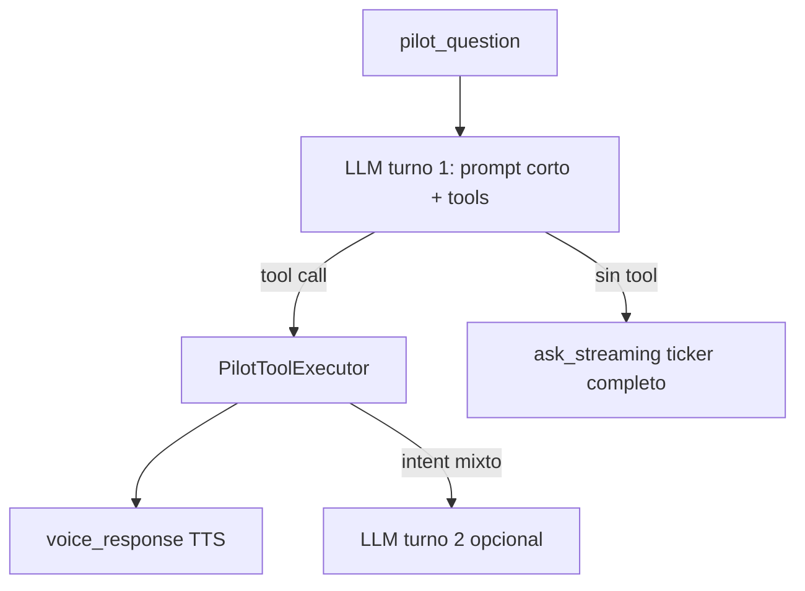

# CrewChief Parity Port — Foundation Tasks 1–14 (TDD detail)

> **Master plan (full scope, Tasks 0–48):** [`2026-06-07-crewchief-complete-port.md`](./2026-06-07-crewchief-complete-port.md)
>
> **Infra — native Windows, no sidecar (Task 49):** [`2026-06-07-native-windows-no-sidecar.md`](./2026-06-07-native-windows-no-sidecar.md)
>
> **Sprint locked + normas operativas:** [`2026-06-07-crewchief-decisions.md`](./2026-06-07-crewchief-decisions.md) (Tauri, rama `crewchief-parity`, ciclo por task)
>
> **Cómo testear cada eslabón (L1–L6):** [`2026-06-07-crewchief-pipeline-test-template.md`](./2026-06-07-crewchief-pipeline-test-template.md)
>
> **For agentic workers:** REQUIRED SUB-SKILL: Use superpowers:subagent-driven-development (recommended) or superpowers:executing-plans to implement this plan task-by-task. Steps use checkbox (`- [ ]`) syntax for tracking.
>
> Execute **Task 0** from the master plan before Task 5 here. Tasks 8–9 here are stubs replaced by master Tasks 17–28.

**Goal:** Port all LMU-relevant CrewChiefV4 behavior that Vantare can faithfully support, while documenting unavoidable PARTIAL parity caused by LMU data, TTS, or product-scope differences.

**Architecture:** Add a CrewChief-style deterministic event engine beside the existing `ProactiveMonitorSuite`, then migrate race engineer behavior module by module away from commentary batching. Keep spotter low-latency, add a playback moderator contract, and make LLM usage on-demand or fallback-only instead of the main proactive path.

**Tech Stack:** Python 3.12/FastAPI/Pydantic/Pytest for backend, React 19/TypeScript/Vitest/Tauri for frontend audio, LMU REST `:6397`, existing `shared-telemetry` and `shared-strategy` packages.

---

## Scope Check

This is intentionally a master plan because the user's goal is whole-system Crew Chief parity. During execution, each task should be run as an isolated subagent task and reviewed before moving to the next task.

The work spans independent subsystems:

- deterministic backend event engine,
- playback/audio queue semantics,
- P0 race events,
- P1 race context events,
- LMU PitMenu write,
- LMU session settings reads,
- frozen order and predictive multiclass race-control,
- PTT tool-first agent (MVP single-turn, luego loop corto),
- validation and documentation.

Each task below produces working, testable software on its own. Do not batch multiple tasks into a single large edit.

## Required References

Read these before implementation:

- [`2026-06-07-crewchief-decisions.md`](./2026-06-07-crewchief-decisions.md) — normas N1–N4, ciclo por task
- [`2026-06-07-crewchief-pipeline-test-template.md`](./2026-06-07-crewchief-pipeline-test-template.md) — L1–L3 obligatorios por módulo
- `docs/architecture/crewchief-porting-notes.md`
- `docs/architecture/cc-portable-logic-analysis.md`
- `docs/architecture/pipelines/00-parity-charter.md`
- `docs/architecture/pipelines/03-engineer-events-channel.md`
- `.omo/evidence/cc-behavior-parity-matrix.yaml`
- `.omo/evidence/cc-message-templates-p0.md`
- `.omo/evidence/lmu-data-availability.md`
- Local Crew Chief clone: `C:\Users\isaac\Desktop\CrewChiefV4-analysis`

## File Structure

### New Backend Package

- Create: `backend/src/intelligence/crewchief_events/__init__.py`
  - Public exports for the deterministic Crew Chief event engine.
- Create: `backend/src/intelligence/crewchief_events/types.py`
  - `CrewChiefPriority`, `CrewChiefChannel`, `CrewChiefMessage`, `CrewChiefFrameContext`.
- Create: `backend/src/intelligence/crewchief_events/session_gates.py`
  - Shared session, race, pit, manual formation, FCY, and hard-parts gates.
- Create: `backend/src/intelligence/crewchief_events/base.py`
  - `CrewChiefEventModule` base class matching `AbstractEvent.triggerInternal` semantics.
- Create: `backend/src/intelligence/crewchief_events/templates.py`
  - Spanish template lookup for deterministic messages.
- Create: `backend/src/intelligence/crewchief_events/suite.py`
  - Ordered module runner replacing the main proactive batch path incrementally.
- Create: `backend/src/intelligence/crewchief_events/playback.py`
  - Backend-side playback policy: expiry, `play_even_when_silenced`, queue class, silence mode.
- Create: `backend/src/intelligence/crewchief_events/modules/*.py`
  - One focused module per Crew Chief source event.

### Backend Files To Modify

- Modify: `backend/src/intelligence/engine.py`
  - Run `CrewChiefEventSuite` on each `evaluate_cycle`.
  - Send deterministic `AlertMessage` immediately.
  - Keep `CommentaryOrchestrator` only for opt-in summaries and non-parity fallback.
- Modify: `backend/src/models/messages.py`
  - Extend `AlertMessage` payload contract without breaking existing fields.
- Modify: `backend/src/intelligence/verbosity_controller.py`
  - Add dynamic Crew Chief auto-verbosity.
- Modify: `backend/src/services/lmu_api.py`
  - Add safe PitMenu read/write helpers after PitMenu task.
- Modify: `backend/src/routers/websocket.py`
  - Include runtime config toggles for speak-only, gap voice, and pit-menu dry-run where needed.

### Frontend Files To Modify

- Modify: `frontend/src/services/priorityAudioQueue.ts`
  - Add expiry, queue class, max queue length, and `playEvenWhenSilenced`.
- Modify: `frontend/src/services/alertVoice.ts`
  - Map Crew Chief event categories to TTS/silent behavior.
- Modify: `frontend/src/store/config.ts`
  - Add runtime toggles.
- Modify: relevant frontend tests under `frontend/src/__tests__/`.

### Tests To Create

- Create: `backend/tests/test_crewchief_event_types.py`
- Create: `backend/tests/test_crewchief_session_gates.py`
- Create: `backend/tests/test_crewchief_suite_engine.py`
- Create: `backend/tests/test_crewchief_playback_policy.py`
- Create: `backend/tests/test_crewchief_flags_module.py`
- Create: `backend/tests/test_crewchief_penalties_module.py`
- Create: `backend/tests/test_crewchief_damage_module.py`
- Create: `backend/tests/test_crewchief_position_module.py`
- Create: `backend/tests/test_crewchief_rain_module.py`
- Create: `backend/tests/test_lmu_pit_menu_write.py`
- Create: `backend/tests/test_lmu_session_settings.py`
- Create: `backend/tests/test_crewchief_frozen_order_module.py`
- Create: `backend/tests/test_crewchief_multiclass_module.py`
- Create: `frontend/src/__tests__/priorityAudioQueue.crewchief.test.ts`

---

## Task 1: Deterministic Event Types

**Files:**
- Create: `backend/src/intelligence/crewchief_events/__init__.py`
- Create: `backend/src/intelligence/crewchief_events/types.py`
- Test: `backend/tests/test_crewchief_event_types.py`

- [ ] **Step 1: Write the failing test**

```python
# backend/tests/test_crewchief_event_types.py
from src.intelligence.crewchief_events.types import (
    CrewChiefChannel,
    CrewChiefFrameContext,
    CrewChiefMessage,
    CrewChiefPriority,
)


def test_crewchief_message_defaults_are_safe_for_normal_engineer_event():
    msg = CrewChiefMessage(
        event_id="lap_complete",
        text="Vuelta 3. Tiempo 92.4.",
        priority=CrewChiefPriority.NORMAL,
        channel=CrewChiefChannel.ENGINEER,
    )

    assert msg.event_id == "lap_complete"
    assert msg.ttl_ms == 10000
    assert msg.play_even_when_silenced is False
    assert msg.immediate is False
    assert msg.payload == {}


def test_critical_spotter_message_is_immediate_and_short_lived():
    msg = CrewChiefMessage(
        event_id="car_left",
        text="Coche a la izquierda.",
        priority=CrewChiefPriority.CRITICAL,
        channel=CrewChiefChannel.SPOTTER,
        ttl_ms=1000,
        play_even_when_silenced=True,
    )

    assert msg.immediate is True
    assert msg.ttl_ms == 1000
    assert msg.play_even_when_silenced is True


def test_frame_context_exposes_previous_and_current_data():
    ctx = CrewChiefFrameContext(
        previous={"standing_position": 4},
        current={"standing_position": 3},
        strategy={"pit_window_open": False},
        session={"phase": "RACE"},
        now_monotonic=10.0,
    )

    assert ctx.previous_position == 4
    assert ctx.current_position == 3
```

- [ ] **Step 2: Run test to verify it fails**

Run:

```powershell
cd "C:\Users\isaac\Desktop\Vantare-Ingeniero\backend"; python -m pytest tests/test_crewchief_event_types.py -v
```

Expected: FAIL with `ModuleNotFoundError: No module named 'src.intelligence.crewchief_events'`.

- [ ] **Step 3: Create the package exports**

```python
# backend/src/intelligence/crewchief_events/__init__.py
"""Deterministic Crew Chief parity event engine."""

from .types import (
    CrewChiefChannel,
    CrewChiefFrameContext,
    CrewChiefMessage,
    CrewChiefPriority,
)

__all__ = [
    "CrewChiefChannel",
    "CrewChiefFrameContext",
    "CrewChiefMessage",
    "CrewChiefPriority",
]
```

- [ ] **Step 4: Implement the type model**

```python
# backend/src/intelligence/crewchief_events/types.py
from __future__ import annotations

from dataclasses import dataclass, field
from enum import Enum
from typing import Any


class CrewChiefPriority(str, Enum):
    LOW = "LOW"
    NORMAL = "NORMAL"
    IMPORTANT = "IMPORTANT"
    CRITICAL = "CRITICAL"

    @property
    def rank(self) -> int:
        return {
            CrewChiefPriority.LOW: 1,
            CrewChiefPriority.NORMAL: 2,
            CrewChiefPriority.IMPORTANT: 3,
            CrewChiefPriority.CRITICAL: 4,
        }[self]


class CrewChiefChannel(str, Enum):
    ENGINEER = "engineer"
    SPOTTER = "spotter"
    VOICE_RESPONSE = "voice_response"


@dataclass(frozen=True)
class CrewChiefMessage:
    event_id: str
    text: str
    priority: CrewChiefPriority
    channel: CrewChiefChannel
    ttl_ms: int = 10000
    delay_ms: int = 0
    play_even_when_silenced: bool = False
    can_interrupt: bool = True
    validation_key: str | None = None
    payload: dict[str, Any] = field(default_factory=dict)

    @property
    def immediate(self) -> bool:
        return self.channel == CrewChiefChannel.SPOTTER or self.priority.rank >= CrewChiefPriority.IMPORTANT.rank


@dataclass(frozen=True)
class CrewChiefFrameContext:
    previous: dict[str, Any] | None
    current: dict[str, Any]
    strategy: dict[str, Any]
    session: dict[str, Any]
    now_monotonic: float

    @property
    def previous_position(self) -> int | None:
        if not self.previous:
            return None
        raw = self.previous.get("standing_position")
        return int(raw) if raw is not None else None

    @property
    def current_position(self) -> int | None:
        raw = self.current.get("standing_position")
        return int(raw) if raw is not None else None
```

- [ ] **Step 5: Run test to verify it passes**

Run:

```powershell
cd "C:\Users\isaac\Desktop\Vantare-Ingeniero\backend"; python -m pytest tests/test_crewchief_event_types.py -v
```

Expected: PASS, 3 tests.

- [ ] **Step 6: Commit**

```powershell
git add backend/src/intelligence/crewchief_events/__init__.py backend/src/intelligence/crewchief_events/types.py backend/tests/test_crewchief_event_types.py
git commit -m "feat: add Crew Chief event message types"
```

---

## Task 2: Session Gates And Manual Formation Lap

**Files:**
- Create: `backend/src/intelligence/crewchief_events/session_gates.py`
- Test: `backend/tests/test_crewchief_session_gates.py`

- [ ] **Step 1: Write the failing test**

```python
# backend/tests/test_crewchief_session_gates.py
from src.intelligence.crewchief_events.session_gates import (
    is_hard_part,
    is_manual_formation_lap,
    is_racing_green,
    should_suppress_race_event,
)


def test_practice_suppresses_race_event_even_with_stale_race_string():
    telemetry = {"session_type": "race"}
    session = {"session_type_int": 3}

    assert should_suppress_race_event(telemetry, session) is True


def test_race_int_allows_race_event():
    telemetry = {"session_type": "practice"}
    session = {"session_type_int": 10}

    assert should_suppress_race_event(telemetry, session) is False


def test_manual_formation_lap_blocks_race_engineer_modules():
    assert is_manual_formation_lap({"manual_formation_lap": True}, {}) is True
    assert is_manual_formation_lap({"lap_number": 0}, {"phase": "RACE"}) is True


def test_fcy_is_not_racing_green():
    assert is_racing_green({"full_course_yellow_active": True}, {"phase": "RACE"}) is False
    assert is_racing_green({"yellow_flag_active": False}, {"phase": "RACE"}) is True


def test_braking_zone_counts_as_hard_part():
    assert is_hard_part({"brake_pressure": 0.4, "speed_ms": 55.0}) is True
    assert is_hard_part({"brake_pressure": 0.0, "speed_ms": 55.0}) is False
```

- [ ] **Step 2: Run test to verify it fails**

Run:

```powershell
cd "C:\Users\isaac\Desktop\Vantare-Ingeniero\backend"; python -m pytest tests/test_crewchief_session_gates.py -v
```

Expected: FAIL with `ModuleNotFoundError` for `session_gates`.

- [ ] **Step 3: Implement gates**

```python
# backend/src/intelligence/crewchief_events/session_gates.py
from __future__ import annotations

from shared_telemetry.session_kind import is_race_session


def should_suppress_race_event(telemetry: dict, session: dict) -> bool:
    return not is_race_session(telemetry, session)


def is_manual_formation_lap(telemetry: dict, session: dict) -> bool:
    if bool(telemetry.get("manual_formation_lap") or session.get("manual_formation_lap")):
        return True
    phase = str(session.get("phase") or telemetry.get("session_type") or "").strip().lower()
    lap = int(telemetry.get("lap_number") or telemetry.get("completed_laps") or 0)
    return phase == "race" and lap <= 0


def is_racing_green(telemetry: dict, session: dict) -> bool:
    if should_suppress_race_event(telemetry, session):
        return False
    if bool(telemetry.get("full_course_yellow_active") or telemetry.get("safety_car_active")):
        return False
    if bool(telemetry.get("yellow_flag_active") or telemetry.get("red_flag_active")):
        return False
    if is_manual_formation_lap(telemetry, session):
        return False
    return True


def is_hard_part(telemetry: dict) -> bool:
    brake = float(telemetry.get("brake_pressure") or telemetry.get("brake") or 0.0)
    speed = float(telemetry.get("speed_ms") or telemetry.get("speed") or 0.0)
    steering = abs(float(telemetry.get("steering") or 0.0))
    return speed > 25.0 and (brake >= 0.15 or steering >= 0.35)
```

- [ ] **Step 4: Run test to verify it passes**

Run:

```powershell
cd "C:\Users\isaac\Desktop\Vantare-Ingeniero\backend"; python -m pytest tests/test_crewchief_session_gates.py -v
```

Expected: PASS, 5 tests.

- [ ] **Step 5: Commit**

```powershell
git add backend/src/intelligence/crewchief_events/session_gates.py backend/tests/test_crewchief_session_gates.py
git commit -m "feat: add Crew Chief session gates"
```

---

## Task 3: Event Module Base And Suite Runner

**Files:**
- Create: `backend/src/intelligence/crewchief_events/base.py`
- Create: `backend/src/intelligence/crewchief_events/suite.py`
- Modify: `backend/src/intelligence/crewchief_events/__init__.py`
- Test: `backend/tests/test_crewchief_suite_engine.py`

- [ ] **Step 1: Write the failing test**

```python
# backend/tests/test_crewchief_suite_engine.py
from src.intelligence.crewchief_events.base import CrewChiefEventModule
from src.intelligence.crewchief_events.suite import CrewChiefEventSuite
from src.intelligence.crewchief_events.types import (
    CrewChiefChannel,
    CrewChiefFrameContext,
    CrewChiefMessage,
    CrewChiefPriority,
)


class PositionGainModule(CrewChiefEventModule):
    event_name = "position_gain"

    def evaluate(self, ctx: CrewChiefFrameContext):
        if ctx.previous_position is None or ctx.current_position is None:
            return []
        if ctx.current_position < ctx.previous_position:
            return [
                CrewChiefMessage(
                    event_id="position_gain",
                    text=f"Subiste a P{ctx.current_position}.",
                    priority=CrewChiefPriority.IMPORTANT,
                    channel=CrewChiefChannel.ENGINEER,
                )
            ]
        return []


def test_suite_passes_previous_frame_to_modules():
    suite = CrewChiefEventSuite([PositionGainModule()])
    first = suite.evaluate({"standing_position": 4, "session_type": "race"}, {}, {"phase": "RACE"}, now_monotonic=1.0)
    second = suite.evaluate({"standing_position": 3, "session_type": "race"}, {}, {"phase": "RACE"}, now_monotonic=2.0)

    assert first == []
    assert [m.text for m in second] == ["Subiste a P3."]


def test_suite_clear_state_resets_previous_frame():
    suite = CrewChiefEventSuite([PositionGainModule()])
    suite.evaluate({"standing_position": 4, "session_type": "race"}, {}, {"phase": "RACE"}, now_monotonic=1.0)
    suite.clear_state()
    messages = suite.evaluate({"standing_position": 3, "session_type": "race"}, {}, {"phase": "RACE"}, now_monotonic=2.0)

    assert messages == []
```

- [ ] **Step 2: Run test to verify it fails**

Run:

```powershell
cd "C:\Users\isaac\Desktop\Vantare-Ingeniero\backend"; python -m pytest tests/test_crewchief_suite_engine.py -v
```

Expected: FAIL with missing `base` or `suite` module.

- [ ] **Step 3: Implement base class**

```python
# backend/src/intelligence/crewchief_events/base.py
from __future__ import annotations

from abc import ABC, abstractmethod

from .types import CrewChiefFrameContext, CrewChiefMessage


class CrewChiefEventModule(ABC):
    event_name = "abstract"

    def clear_state(self) -> None:
        """Reset module-local state at session boundaries."""

    def is_message_still_valid(self, message: CrewChiefMessage, ctx: CrewChiefFrameContext) -> bool:
        return True

    @abstractmethod
    def evaluate(self, ctx: CrewChiefFrameContext) -> list[CrewChiefMessage]:
        raise NotImplementedError
```

- [ ] **Step 4: Implement suite runner**

```python
# backend/src/intelligence/crewchief_events/suite.py
from __future__ import annotations

from collections.abc import Iterable

from .base import CrewChiefEventModule
from .types import CrewChiefFrameContext, CrewChiefMessage


class CrewChiefEventSuite:
    def __init__(self, modules: Iterable[CrewChiefEventModule] | None = None) -> None:
        self.modules = list(modules or [])
        self._previous_frame: dict | None = None

    def clear_state(self) -> None:
        self._previous_frame = None
        for module in self.modules:
            module.clear_state()

    def evaluate(
        self,
        telemetry: dict,
        strategy: dict,
        session: dict,
        *,
        now_monotonic: float,
    ) -> list[CrewChiefMessage]:
        ctx = CrewChiefFrameContext(
            previous=self._previous_frame,
            current=telemetry,
            strategy=strategy,
            session=session,
            now_monotonic=now_monotonic,
        )
        messages: list[CrewChiefMessage] = []
        for module in self.modules:
            messages.extend(module.evaluate(ctx))
        self._previous_frame = dict(telemetry)
        return messages
```

- [ ] **Step 5: Export suite types**

```python
# backend/src/intelligence/crewchief_events/__init__.py
"""Deterministic Crew Chief parity event engine."""

from .base import CrewChiefEventModule
from .suite import CrewChiefEventSuite
from .types import (
    CrewChiefChannel,
    CrewChiefFrameContext,
    CrewChiefMessage,
    CrewChiefPriority,
)

__all__ = [
    "CrewChiefChannel",
    "CrewChiefEventModule",
    "CrewChiefEventSuite",
    "CrewChiefFrameContext",
    "CrewChiefMessage",
    "CrewChiefPriority",
]
```

- [ ] **Step 6: Run test to verify it passes**

Run:

```powershell
cd "C:\Users\isaac\Desktop\Vantare-Ingeniero\backend"; python -m pytest tests/test_crewchief_suite_engine.py -v
```

Expected: PASS, 2 tests.

- [ ] **Step 7: Commit**

```powershell
git add backend/src/intelligence/crewchief_events backend/tests/test_crewchief_suite_engine.py
git commit -m "feat: add Crew Chief event suite"
```

---

## Task 4: Backend Playback Policy

**Files:**
- Create: `backend/src/intelligence/crewchief_events/playback.py`
- Modify: `backend/src/models/messages.py`
- Test: `backend/tests/test_crewchief_playback_policy.py`

- [ ] **Step 1: Write the failing test**

```python
# backend/tests/test_crewchief_playback_policy.py
from src.intelligence.crewchief_events.playback import map_message_to_alert
from src.intelligence.crewchief_events.types import (
    CrewChiefChannel,
    CrewChiefMessage,
    CrewChiefPriority,
)
from src.models.messages import AlertMessage


def test_map_critical_message_to_alert_payload():
    msg = CrewChiefMessage(
        event_id="damage_major",
        text="Daño grave.",
        priority=CrewChiefPriority.CRITICAL,
        channel=CrewChiefChannel.ENGINEER,
        ttl_ms=3000,
        play_even_when_silenced=True,
        validation_key="damage:major",
    )

    alert = map_message_to_alert(msg)

    assert isinstance(alert, AlertMessage)
    assert alert.event == "alert"
    assert alert.category == "engineer"
    assert alert.audio_priority == "4"
    assert alert.ttl == 3
    assert alert.payload["event_id"] == "damage_major"
    assert alert.payload["play_even_when_silenced"] is True
    assert alert.payload["validation_key"] == "damage:major"


def test_map_spotter_message_uses_spotter_category():
    msg = CrewChiefMessage(
        event_id="car_right",
        text="Coche a la derecha.",
        priority=CrewChiefPriority.CRITICAL,
        channel=CrewChiefChannel.SPOTTER,
        ttl_ms=1000,
    )

    alert = map_message_to_alert(msg)

    assert alert.category == "spotter"
    assert alert.payload["queue_class"] == "IMMEDIATE"
```

- [ ] **Step 2: Run test to verify it fails**

Run:

```powershell
cd "C:\Users\isaac\Desktop\Vantare-Ingeniero\backend"; python -m pytest tests/test_crewchief_playback_policy.py -v
```

Expected: FAIL with missing `playback` module.

- [ ] **Step 3: Implement mapper**

```python
# backend/src/intelligence/crewchief_events/playback.py
from __future__ import annotations

import uuid

from src.models.messages import AlertMessage

from .types import CrewChiefChannel, CrewChiefMessage


def _priority_to_audio_rank(message: CrewChiefMessage) -> str:
    return str(message.priority.rank)


def _category_for(message: CrewChiefMessage) -> str:
    if message.channel == CrewChiefChannel.SPOTTER:
        return "spotter"
    if message.channel == CrewChiefChannel.VOICE_RESPONSE:
        return "voice_response"
    return "engineer"


def map_message_to_alert(message: CrewChiefMessage) -> AlertMessage:
    ttl_seconds = max(1, int(round(message.ttl_ms / 1000)))
    payload = dict(message.payload)
    payload.update(
        {
            "event_id": message.event_id,
            "queue_class": "IMMEDIATE" if message.immediate else "NORMAL",
            "ttl_ms": message.ttl_ms,
            "delay_ms": message.delay_ms,
            "play_even_when_silenced": message.play_even_when_silenced,
            "can_interrupt": message.can_interrupt,
            "validation_key": message.validation_key,
        }
    )
    return AlertMessage(
        event="alert",
        alert_id=str(uuid.uuid4()),
        category=_category_for(message),
        message=message.text,
        audio_priority=_priority_to_audio_rank(message),
        severity=message.priority.value,
        ttl=ttl_seconds,
        dismissable=not message.play_even_when_silenced,
        payload=payload,
    )
```

- [ ] **Step 4: Run test to verify it passes**

Run:

```powershell
cd "C:\Users\isaac\Desktop\Vantare-Ingeniero\backend"; python -m pytest tests/test_crewchief_playback_policy.py -v
```

Expected: PASS, 2 tests.

- [ ] **Step 5: Commit**

```powershell
git add backend/src/intelligence/crewchief_events/playback.py backend/tests/test_crewchief_playback_policy.py
git commit -m "feat: map Crew Chief messages to alerts"
```

---

## Task 5: Engine Integration Without Commentary Batch

**Files:**
- Modify: `backend/src/intelligence/engine.py`
- Test: `backend/tests/test_crewchief_suite_engine.py`

- [ ] **Step 1: Add failing integration test**

Append this to `backend/tests/test_crewchief_suite_engine.py`:

```python
import pytest

from src.intelligence.engine import IntelligenceEngine
from src.models.messages import AlertMessage, CommentaryEndMessage


@pytest.mark.asyncio
async def test_crewchief_suite_alert_does_not_enter_commentary_batch():
    sent = []
    engine = IntelligenceEngine(broadcast_callback=sent.append)

    await engine.evaluate_cycle(
        {"lap_number": 1, "standing_position": 4, "session_type": "race"},
        {},
        {"phase": "RACE"},
    )
    await engine.evaluate_cycle(
        {"lap_number": 1, "standing_position": 3, "session_type": "race"},
        {},
        {"phase": "RACE"},
    )

    alerts = [m for m in sent if isinstance(m, AlertMessage)]
    assert any("P3" in a.message for a in alerts)
    assert not any(isinstance(m, CommentaryEndMessage) and "P3" in m.full_text for m in sent)
```

- [ ] **Step 2: Run test to verify it fails**

Run:

```powershell
cd "C:\Users\isaac\Desktop\Vantare-Ingeniero\backend"; python -m pytest tests/test_crewchief_suite_engine.py::test_crewchief_suite_alert_does_not_enter_commentary_batch -v
```

Expected: FAIL because position changes still enter `CommentaryOrchestrator`.

- [ ] **Step 3: Add a first built-in position module for integration**

Create `backend/src/intelligence/crewchief_events/modules/position.py`:

```python
from __future__ import annotations

from src.intelligence.driver_names import shorten_driver_name

from ..base import CrewChiefEventModule
from ..session_gates import is_racing_green
from ..types import (
    CrewChiefChannel,
    CrewChiefFrameContext,
    CrewChiefMessage,
    CrewChiefPriority,
)


class PositionEvent(CrewChiefEventModule):
    event_name = "position"

    def evaluate(self, ctx: CrewChiefFrameContext) -> list[CrewChiefMessage]:
        if not is_racing_green(ctx.current, ctx.session):
            return []
        previous = ctx.previous_position
        current = ctx.current_position
        if previous is None or current is None or previous == current:
            return []
        if current < previous:
            text = f"Subiste a P{current}."
            event_id = "overtake_position_gain"
        else:
            text = f"Bajaste a P{current}."
            event_id = "position_loss"
        opponent = ctx.current.get("last_overtake_driver") or ctx.current.get("driver_ahead_name")
        if opponent:
            text = f"{text} Con {shorten_driver_name(str(opponent))}."
        return [
            CrewChiefMessage(
                event_id=event_id,
                text=text,
                priority=CrewChiefPriority.IMPORTANT,
                channel=CrewChiefChannel.ENGINEER,
                ttl_ms=5000,
                play_even_when_silenced=False,
                validation_key=f"position:{current}",
            )
        ]
```

Create `backend/src/intelligence/crewchief_events/modules/__init__.py`:

```python
"""Crew Chief event modules ported to Python."""

from .position import PositionEvent

__all__ = ["PositionEvent"]
```

- [ ] **Step 4: Wire the suite into `IntelligenceEngine`**

In `backend/src/intelligence/engine.py`, import and initialize the suite in `__init__`:

```python
from src.intelligence.crewchief_events.modules import PositionEvent
from src.intelligence.crewchief_events.playback import map_message_to_alert
from src.intelligence.crewchief_events.suite import CrewChiefEventSuite

self.crewchief_events = CrewChiefEventSuite([PositionEvent()])
```

In `evaluate_cycle`, after telemetry/session sync and before `_run_proactive_monitors`, add:

```python
        cc_messages = self.crewchief_events.evaluate(
            telemetry_dict,
            strategy_dict,
            session_dict,
            now_monotonic=time.monotonic(),
        )
        for cc_message in cc_messages:
            self.broadcaster.send(map_message_to_alert(cc_message))
```

Remove or guard the old `position_change` emission in `ProactiveMonitorSuite` during this task by adding a config-independent suppression in `engine.py`:

```python
        self._cc_owned_event_ids = {"position_change", "overtake", "being_overtaken"}
```

In `_run_proactive_monitors`, skip tuple events owned by the new suite:

```python
            else:
                event_id, summary, priority = evt
                if event_id in self._cc_owned_event_ids:
                    continue
                self.enqueue_commentary(event_id, summary, priority)
```

- [ ] **Step 5: Run test to verify it passes**

Run:

```powershell
cd "C:\Users\isaac\Desktop\Vantare-Ingeniero\backend"; python -m pytest tests/test_crewchief_suite_engine.py tests/test_immediate_routing.py -v
```

Expected: PASS. Update `test_position_change_still_in_batch` in `test_immediate_routing.py` to assert the new behavior:

```python
@pytest.mark.asyncio
async def test_position_change_goes_immediate_not_batch():
    sent = []
    eng = IntelligenceEngine(broadcast_callback=sent.append)
    eng.apply_runtime_config({"verbosityLevel": "normal"})
    await eng.evaluate_cycle(
        {"lap_number": 2, "standing_position": 8, "session_type": "race"},
        {},
        {"phase": "RACE"},
    )
    await eng.evaluate_cycle(
        {"lap_number": 2, "standing_position": 6, "session_type": "race"},
        {},
        {"phase": "RACE"},
    )
    alerts = [m for m in sent if isinstance(m, AlertMessage) and "P6" in m.message]
    assert alerts
    msg = await eng.commentary.flush()
    assert msg is None or "P6" not in msg.full_text
```

- [ ] **Step 6: Commit**

```powershell
git add backend/src/intelligence/engine.py backend/src/intelligence/crewchief_events backend/tests/test_crewchief_suite_engine.py backend/tests/test_immediate_routing.py
git commit -m "feat: route Crew Chief events outside commentary batch"
```

---

## Task 6: Frontend Queue Expiry And Crew Chief Audio Contract

**Files:**
- Modify: `frontend/src/services/priorityAudioQueue.ts`
- Test: `frontend/src/__tests__/priorityAudioQueue.crewchief.test.ts`

- [ ] **Step 1: Write failing tests**

```typescript
// frontend/src/__tests__/priorityAudioQueue.crewchief.test.ts
import { describe, it, expect, beforeEach, vi } from "vitest";
import { priorityAudioQueue, type AudioItem } from "../services/priorityAudioQueue";

function item(overrides: Partial<AudioItem>): AudioItem {
  return {
    text: "mensaje",
    url: "blob:message",
    priority: "NORMAL",
    preemptible: true,
    source: "test",
    expiresAt: undefined,
    playEvenWhenSilenced: false,
    ...overrides,
  };
}

describe("Crew Chief priorityAudioQueue behavior", () => {
  beforeEach(() => {
    priorityAudioQueue.stopAll();
    vi.restoreAllMocks();
  });

  it("drops expired items before playback", async () => {
    const played: string[] = [];
    const originalAudio = globalThis.Audio;
    class MockAudio {
      volume = 1;
      preload = "auto";
      onended: (() => void) | null = null;
      onerror: (() => void) | null = null;
      constructor(public url: string) {}
      async play() {
        played.push(this.url);
        queueMicrotask(() => this.onended?.());
      }
      pause() {}
    }
    // @ts-expect-error test mock
    globalThis.Audio = MockAudio;

    priorityAudioQueue.enqueue(item({ url: "blob:expired", expiresAt: Date.now() - 1 }));
    priorityAudioQueue.enqueue(item({ url: "blob:fresh", expiresAt: Date.now() + 5000 }));

    await new Promise((resolve) => setTimeout(resolve, 50));
    expect(played).toEqual(["blob:fresh"]);

    globalThis.Audio = originalAudio;
  });

  it("keeps immediate messages when normal queue is stopped", () => {
    priorityAudioQueue.enqueue(item({ priority: "IMMEDIATE", preemptible: false, url: "blob:imm" }));
    priorityAudioQueue.enqueue(item({ priority: "NORMAL", url: "blob:norm" }));

    priorityAudioQueue.stopNormal();

    expect(priorityAudioQueue.debugSnapshot().immediate).toBe(1);
    expect(priorityAudioQueue.debugSnapshot().normal).toBe(0);
  });
});
```

- [ ] **Step 2: Run test to verify it fails**

Run:

```powershell
cd "C:\Users\isaac\Desktop\Vantare-Ingeniero\frontend"; npm test -- priorityAudioQueue.crewchief.test.ts
```

Expected: FAIL because `AudioItem` lacks `expiresAt`, `debugSnapshot`, and expiry behavior.

- [ ] **Step 3: Extend `AudioItem` and add expiry filtering**

In `frontend/src/services/priorityAudioQueue.ts`, update the interface:

```typescript
export interface AudioItem {
  text: string;
  url: string;
  priority: TtsPriority;
  preemptible: boolean;
  source: string;
  expiresAt?: number;
  playEvenWhenSilenced?: boolean;
}
```

Add this method inside `PriorityAudioQueue`:

```typescript
  debugSnapshot(): { immediate: number; normal: number; playing: boolean } {
    return {
      immediate: this.immediateQueue.length,
      normal: this.normalQueue.length,
      playing: this.playing,
    };
  }
```

Replace `pickNext()` with:

```typescript
  private isExpired(item: AudioItem): boolean {
    return typeof item.expiresAt === "number" && item.expiresAt <= Date.now();
  }

  private pickNext(): AudioItem | null {
    while (this.immediateQueue.length > 0) {
      const next = this.immediateQueue.shift()!;
      if (!this.isExpired(next)) return next;
      URL.revokeObjectURL(next.url);
    }
    while (this.normalQueue.length > 0) {
      const next = this.normalQueue.shift()!;
      if (!this.isExpired(next)) return next;
      URL.revokeObjectURL(next.url);
    }
    return null;
  }
```

Update `enqueueLegacy` to set optional fields:

```typescript
      expiresAt: undefined,
      playEvenWhenSilenced: priority === "IMMEDIATE",
```

- [ ] **Step 4: Export `debugSnapshot` through singleton**

At the bottom of `priorityAudioQueue.ts`, keep `priorityAudioQueue` as the exported singleton. No facade change is required unless tests import through `audioQueue`.

- [ ] **Step 5: Run tests**

Run:

```powershell
cd "C:\Users\isaac\Desktop\Vantare-Ingeniero\frontend"; npm test -- priorityAudioQueue.test.ts priorityAudioQueue.crewchief.test.ts
```

Expected: PASS.

- [ ] **Step 6: Commit**

```powershell
git add frontend/src/services/priorityAudioQueue.ts frontend/src/__tests__/priorityAudioQueue.crewchief.test.ts
git commit -m "feat: add Crew Chief audio expiry semantics"
```

---

## Task 7: Dynamic Verbosity And Speak-Only Mode

**Files:**
- Modify: `backend/src/intelligence/verbosity_controller.py`
- Modify: `backend/src/intelligence/engine.py`
- Modify: `backend/src/routers/websocket.py`
- Test: `backend/tests/test_verbosity_controller.py`
- Test: `backend/tests/test_crewchief_playback_policy.py`

- [ ] **Step 1: Add failing tests**

Append to `backend/tests/test_verbosity_controller.py`:

```python
def test_auto_verbosity_drops_low_priority_in_close_traffic():
    from src.intelligence.verbosity_controller import VerbosityController

    controller = VerbosityController(level="detailed")
    controller.update_auto_context(
        {
            "speed_ms": 55.0,
            "session_type": "race",
            "time_gap_car_ahead": 0.8,
            "time_gap_car_behind": 1.1,
        },
        {"phase": "RACE"},
    )

    assert controller.should_emit_priority("LOW") is False
    assert controller.should_emit_priority("HIGH") is True


def test_speak_only_when_spoken_to_blocks_regular_engineer_messages():
    from src.intelligence.verbosity_controller import VerbosityController

    controller = VerbosityController(level="detailed")
    controller.set_speak_only_when_spoken_to(True)

    assert controller.should_emit_crewchief_category("engineer", "NORMAL", False) is False
    assert controller.should_emit_crewchief_category("voice_response", "LOW", False) is True
    assert controller.should_emit_crewchief_category("spotter", "LOW", False) is True
    assert controller.should_emit_crewchief_category("engineer", "LOW", True) is True
```

- [ ] **Step 2: Run tests to verify failure**

Run:

```powershell
cd "C:\Users\isaac\Desktop\Vantare-Ingeniero\backend"; python -m pytest tests/test_verbosity_controller.py -v
```

Expected: FAIL because new methods do not exist.

- [ ] **Step 3: Extend `VerbosityController`**

Add fields in `__init__`:

```python
        self._auto_floor_rank = 1
        self._speak_only_when_spoken_to = False
```

Add methods:

```python
    def set_speak_only_when_spoken_to(self, enabled: bool) -> None:
        self._speak_only_when_spoken_to = bool(enabled)

    @property
    def speak_only_when_spoken_to(self) -> bool:
        return self._speak_only_when_spoken_to

    def update_auto_context(self, telemetry: dict, session: dict) -> None:
        self._auto_floor_rank = 1
        speed = float(telemetry.get("speed_ms") or telemetry.get("speed") or 0.0)
        phase = str(session.get("phase") or telemetry.get("session_type") or "").lower()
        if speed <= 5:
            return
        if phase == "race":
            ahead = float(telemetry.get("time_gap_car_ahead") or telemetry.get("gap_ahead") or 999.0)
            behind = float(telemetry.get("time_gap_car_behind") or telemetry.get("gap_behind") or 999.0)
            very_close = (0 < ahead < 1.0) or (0 < behind < 1.0)
            close = (0 < ahead < 2.0) or (0 < behind < 2.0)
            if very_close:
                self._auto_floor_rank = _PRIORITY_RANK["HIGH"]
            elif close:
                self._auto_floor_rank = _PRIORITY_RANK["MEDIUM"]

    def should_emit_crewchief_category(self, category: str, priority: str, play_even_when_silenced: bool) -> bool:
        if play_even_when_silenced:
            return True
        if self._speak_only_when_spoken_to and category not in {"spotter", "voice_response"}:
            return False
        rank = _PRIORITY_RANK.get((priority or "LOW").upper(), 1)
        return self.should_emit_priority(priority) and rank >= self._auto_floor_rank
```

Update `should_emit_priority`:

```python
        configured = _PRIORITY_RANK["LOW"]
        if self._level == VerbosityLevel.SILENT:
            configured = _PRIORITY_RANK["CRITICAL"]
        elif self._level == VerbosityLevel.NORMAL:
            configured = _PRIORITY_RANK["MEDIUM"]
        return rank >= max(configured, self._auto_floor_rank)
```

- [ ] **Step 4: Update engine runtime config**

In `engine.py`, add `"speakOnlyWhenSpokenTo"` to `_RUNTIME_CONFIG_KEYS`, include it in `runtime_config_snapshot`, and apply it:

```python
        "speakOnlyWhenSpokenTo",
```

```python
            "speakOnlyWhenSpokenTo": self.verbosity.speak_only_when_spoken_to,
```

```python
        if "speakOnlyWhenSpokenTo" in cfg:
            self.verbosity.set_speak_only_when_spoken_to(bool(cfg["speakOnlyWhenSpokenTo"]))
```

In `evaluate_cycle`, call:

```python
        self.verbosity.update_auto_context(telemetry_dict, session_dict)
```

- [ ] **Step 5: Run tests**

Run:

```powershell
cd "C:\Users\isaac\Desktop\Vantare-Ingeniero\backend"; python -m pytest tests/test_verbosity_controller.py tests/test_engine_runtime_config.py -v
```

Expected: PASS.

- [ ] **Step 6: Commit**

```powershell
git add backend/src/intelligence/verbosity_controller.py backend/src/intelligence/engine.py backend/tests/test_verbosity_controller.py backend/tests/test_engine_runtime_config.py
git commit -m "feat: add Crew Chief dynamic verbosity"
```

---

## Task 8: P0 Crew Chief Event Modules

**Files:**
- Create: `backend/src/intelligence/crewchief_events/modules/flags.py`
- Create: `backend/src/intelligence/crewchief_events/modules/penalties.py`
- Create: `backend/src/intelligence/crewchief_events/modules/rain.py`
- Create: `backend/src/intelligence/crewchief_events/modules/damage.py`
- Modify: `backend/src/intelligence/crewchief_events/modules/__init__.py`
- Modify: `backend/src/intelligence/engine.py`
- Test: `backend/tests/test_crewchief_flags_module.py`
- Test: `backend/tests/test_crewchief_penalties_module.py`
- Test: `backend/tests/test_crewchief_rain_module.py`
- Test: `backend/tests/test_crewchief_damage_module.py`

- [ ] **Step 1: Write flags module test**

```python
# backend/tests/test_crewchief_flags_module.py
from src.intelligence.crewchief_events.modules.flags import FlagsEvent
from src.intelligence.crewchief_events.types import CrewChiefFrameContext


def test_fcy_pits_closed_message_is_critical():
    module = FlagsEvent()
    ctx = CrewChiefFrameContext(
        previous={"fcy_phase": 0, "session_type": "race"},
        current={"fcy_phase": 2, "full_course_yellow_active": True, "session_type": "race"},
        strategy={},
        session={"phase": "RACE"},
        now_monotonic=1.0,
    )

    messages = module.evaluate(ctx)

    assert [m.event_id for m in messages] == ["flags_fcy_pits_closed"]
    assert "boxes cerrado" in messages[0].text.lower()
    assert messages[0].play_even_when_silenced is True
```

- [ ] **Step 2: Write penalties module test**

```python
# backend/tests/test_crewchief_penalties_module.py
from src.intelligence.crewchief_events.modules.penalties import PenaltiesEvent
from src.intelligence.crewchief_events.types import CrewChiefFrameContext


def test_new_penalty_starts_three_lap_countdown():
    module = PenaltiesEvent()
    ctx = CrewChiefFrameContext(
        previous={"num_penalties": 0, "lap_number": 5, "session_type": "race"},
        current={"num_penalties": 1, "lap_number": 5, "sector": 1, "session_type": "race"},
        strategy={},
        session={"phase": "RACE"},
        now_monotonic=1.0,
    )

    messages = module.evaluate(ctx)

    assert messages[0].event_id == "penalty_new"
    assert "3 vueltas" in messages[0].text
    assert messages[0].play_even_when_silenced is True
```

- [ ] **Step 3: Write rain module test**

```python
# backend/tests/test_crewchief_rain_module.py
from src.intelligence.crewchief_events.modules.rain import RainEvent
from src.intelligence.crewchief_events.types import CrewChiefFrameContext


def test_rain_start_uses_current_raining_not_forecast():
    module = RainEvent()
    ctx = CrewChiefFrameContext(
        previous={"raining": 0.0, "session_type": "practice"},
        current={"raining": 0.35, "session_type": "practice"},
        strategy={"weather_forecast": {"rain_chance": 0}},
        session={"phase": "PRACTICE"},
        now_monotonic=1.0,
    )

    messages = module.evaluate(ctx)

    assert messages[0].event_id == "rain_light"
    assert "lluvia" in messages[0].text.lower()
```

- [ ] **Step 4: Write damage module test**

```python
# backend/tests/test_crewchief_damage_module.py
from src.intelligence.crewchief_events.modules.damage import DamageEvent
from src.intelligence.crewchief_events.types import CrewChiefFrameContext


def test_big_impact_asks_if_driver_is_ok_after_settle_time():
    module = DamageEvent()
    module._last_damage_change_at = -10.0
    ctx = CrewChiefFrameContext(
        previous={"impact_magnitude": 0.0, "session_type": "race"},
        current={"impact_magnitude": 45.0, "in_pits": False, "session_type": "race"},
        strategy={},
        session={"phase": "RACE"},
        now_monotonic=10.0,
    )

    messages = module.evaluate(ctx)

    assert messages[0].event_id == "damage_big_impact"
    assert "estás bien" in messages[0].text.lower()
    assert messages[0].priority.value == "CRITICAL"
```

- [ ] **Step 5: Run tests to verify failure**

Run:

```powershell
cd "C:\Users\isaac\Desktop\Vantare-Ingeniero\backend"; python -m pytest tests/test_crewchief_flags_module.py tests/test_crewchief_penalties_module.py tests/test_crewchief_rain_module.py tests/test_crewchief_damage_module.py -v
```

Expected: FAIL because the modules do not exist.

- [ ] **Step 6: Implement flags module**

```python
# backend/src/intelligence/crewchief_events/modules/flags.py
from __future__ import annotations

from ..base import CrewChiefEventModule
from ..types import CrewChiefChannel, CrewChiefFrameContext, CrewChiefMessage, CrewChiefPriority


class FlagsEvent(CrewChiefEventModule):
    event_name = "flags"

    def evaluate(self, ctx: CrewChiefFrameContext) -> list[CrewChiefMessage]:
        prev_phase = int((ctx.previous or {}).get("fcy_phase") or 0)
        curr_phase = int(ctx.current.get("fcy_phase") or 0)
        if prev_phase == curr_phase:
            return []
        phase_messages = {
            2: ("flags_fcy_pits_closed", "Full course yellow. Boxes cerrado.", CrewChiefPriority.CRITICAL),
            4: ("flags_fcy_pits_open", "Full course yellow. Boxes abierto.", CrewChiefPriority.IMPORTANT),
            6: ("flags_fcy_resume", "Prepárate, bandera verde al final de esta vuelta.", CrewChiefPriority.CRITICAL),
        }
        data = phase_messages.get(curr_phase)
        if not data:
            return []
        event_id, text, priority = data
        return [
            CrewChiefMessage(
                event_id=event_id,
                text=text,
                priority=priority,
                channel=CrewChiefChannel.ENGINEER,
                ttl_ms=5000,
                play_even_when_silenced=True,
            )
        ]
```

- [ ] **Step 7: Implement penalties module**

```python
# backend/src/intelligence/crewchief_events/modules/penalties.py
from __future__ import annotations

from ..base import CrewChiefEventModule
from ..session_gates import should_suppress_race_event
from ..types import CrewChiefChannel, CrewChiefFrameContext, CrewChiefMessage, CrewChiefPriority


class PenaltiesEvent(CrewChiefEventModule):
    event_name = "penalties"

    def __init__(self) -> None:
        self._penalty_lap: int | None = None
        self._last_laps_remaining: int | None = None

    def clear_state(self) -> None:
        self._penalty_lap = None
        self._last_laps_remaining = None

    def evaluate(self, ctx: CrewChiefFrameContext) -> list[CrewChiefMessage]:
        if should_suppress_race_event(ctx.current, ctx.session):
            return []
        previous_count = int((ctx.previous or {}).get("num_penalties") or 0)
        current_count = int(ctx.current.get("num_penalties") or 0)
        lap = int(ctx.current.get("lap_number") or 0)
        sector = int(ctx.current.get("sector") or ctx.current.get("mSector") or 1)
        if current_count <= 0:
            if previous_count > 0:
                self.clear_state()
                return [self._message("penalty_served", "Penalización cumplida.", CrewChiefPriority.IMPORTANT)]
            self.clear_state()
            return []
        if current_count > previous_count or self._penalty_lap is None:
            self._penalty_lap = lap
            self._last_laps_remaining = 3
            return [self._message("penalty_new", "Penalización. Tienes 3 vueltas para cumplirla.", CrewChiefPriority.CRITICAL)]
        laps_remaining = max(0, 3 - max(0, lap - self._penalty_lap))
        if sector == 0 and laps_remaining <= 1:
            return [self._message("penalty_pit_now", "Entra a boxes ahora para cumplir la penalización.", CrewChiefPriority.CRITICAL)]
        if laps_remaining != self._last_laps_remaining:
            self._last_laps_remaining = laps_remaining
            return [self._message(f"penalty_{laps_remaining}_laps", f"Penalización pendiente. Quedan {laps_remaining} vueltas.", CrewChiefPriority.IMPORTANT)]
        return []

    @staticmethod
    def _message(event_id: str, text: str, priority: CrewChiefPriority) -> CrewChiefMessage:
        return CrewChiefMessage(
            event_id=event_id,
            text=text,
            priority=priority,
            channel=CrewChiefChannel.ENGINEER,
            ttl_ms=6000,
            play_even_when_silenced=True,
        )
```

- [ ] **Step 8: Implement rain module**

```python
# backend/src/intelligence/crewchief_events/modules/rain.py
from __future__ import annotations

from ..base import CrewChiefEventModule
from ..types import CrewChiefChannel, CrewChiefFrameContext, CrewChiefMessage, CrewChiefPriority


class RainEvent(CrewChiefEventModule):
    event_name = "rain"

    def evaluate(self, ctx: CrewChiefFrameContext) -> list[CrewChiefMessage]:
        prev = float((ctx.previous or {}).get("raining") or (ctx.previous or {}).get("rain_intensity") or 0.0)
        curr = float(ctx.current.get("raining") or ctx.current.get("rain_intensity") or 0.0)
        if prev <= 0.05 < curr:
            if curr >= 0.7:
                event_id, text = "rain_heavy", "Lluvia fuerte en pista."
            else:
                event_id, text = "rain_light", "Empieza la lluvia."
            return [CrewChiefMessage(event_id, text, CrewChiefPriority.IMPORTANT, CrewChiefChannel.ENGINEER, ttl_ms=8000)]
        if prev > 0.05 and curr <= 0.05:
            return [CrewChiefMessage("rain_stopped", "La lluvia se ha detenido.", CrewChiefPriority.IMPORTANT, CrewChiefChannel.ENGINEER, ttl_ms=8000)]
        return []
```

- [ ] **Step 9: Implement damage module**

```python
# backend/src/intelligence/crewchief_events/modules/damage.py
from __future__ import annotations

from ..base import CrewChiefEventModule
from ..types import CrewChiefChannel, CrewChiefFrameContext, CrewChiefMessage, CrewChiefPriority


class DamageEvent(CrewChiefEventModule):
    event_name = "damage"

    def __init__(self) -> None:
        self._last_damage_change_at = -9999.0
        self._last_reported_level = 0

    def clear_state(self) -> None:
        self._last_damage_change_at = -9999.0
        self._last_reported_level = 0

    def evaluate(self, ctx: CrewChiefFrameContext) -> list[CrewChiefMessage]:
        if bool(ctx.current.get("in_pits") or ctx.current.get("in_garage")):
            return []
        impact = float(ctx.current.get("impact_magnitude") or 0.0)
        if impact >= 40.0 and ctx.now_monotonic - self._last_damage_change_at >= 3.0:
            self._last_damage_change_at = ctx.now_monotonic
            return [
                CrewChiefMessage(
                    "damage_big_impact",
                    "Golpe fuerte. ¿Estás bien?",
                    CrewChiefPriority.CRITICAL,
                    CrewChiefChannel.ENGINEER,
                    ttl_ms=4000,
                    play_even_when_silenced=True,
                )
            ]
        aero = float(ctx.current.get("aero_damage") or ctx.current.get("damage_aero") or 0.0)
        level = 2 if aero >= 0.5 else 1 if aero >= 0.2 else 0
        if level > self._last_reported_level:
            self._last_reported_level = level
            text = "Daño aerodinámico grave." if level == 2 else "Daño aerodinámico leve."
            priority = CrewChiefPriority.CRITICAL if level == 2 else CrewChiefPriority.IMPORTANT
            return [CrewChiefMessage("damage_aero", text, priority, CrewChiefChannel.ENGINEER, ttl_ms=6000, play_even_when_silenced=level == 2)]
        return []
```

- [ ] **Step 10: Export and register modules**

Update `backend/src/intelligence/crewchief_events/modules/__init__.py`:

```python
"""Crew Chief event modules ported to Python."""

from .damage import DamageEvent
from .flags import FlagsEvent
from .penalties import PenaltiesEvent
from .position import PositionEvent
from .rain import RainEvent

__all__ = ["DamageEvent", "FlagsEvent", "PenaltiesEvent", "PositionEvent", "RainEvent"]
```

Update engine suite initialization:

```python
self.crewchief_events = CrewChiefEventSuite([
    FlagsEvent(),
    PenaltiesEvent(),
    DamageEvent(),
    RainEvent(),
    PositionEvent(),
])
```

- [ ] **Step 11: Run tests**

Run:

```powershell
cd "C:\Users\isaac\Desktop\Vantare-Ingeniero\backend"; python -m pytest tests/test_crewchief_flags_module.py tests/test_crewchief_penalties_module.py tests/test_crewchief_rain_module.py tests/test_crewchief_damage_module.py tests/test_crewchief_suite_engine.py -v
```

Expected: PASS.

- [ ] **Step 12: Commit**

```powershell
git add backend/src/intelligence/crewchief_events/modules backend/src/intelligence/engine.py backend/tests/test_crewchief_*_module.py backend/tests/test_crewchief_suite_engine.py
git commit -m "feat: port P0 Crew Chief event modules"
```

---

## Task 9: Fuel, Lap, Timing, And Opponent P1 Modules

**Files:**
- Create: `backend/src/intelligence/crewchief_events/modules/fuel.py`
- Create: `backend/src/intelligence/crewchief_events/modules/lap_times.py`
- Create: `backend/src/intelligence/crewchief_events/modules/timings.py`
- Create: `backend/src/intelligence/crewchief_events/modules/opponents.py`
- Modify: `backend/src/intelligence/crewchief_events/modules/__init__.py`
- Test: `backend/tests/test_crewchief_fuel_module.py`
- Test: `backend/tests/test_crewchief_timings_module.py`
- Test: `backend/tests/test_crewchief_opponents_module.py`

- [ ] **Step 1: Add fuel test**

```python
# backend/tests/test_crewchief_fuel_module.py
from src.intelligence.crewchief_events.modules.fuel import FuelEvent
from src.intelligence.crewchief_events.types import CrewChiefFrameContext


def test_sector_three_about_to_run_out_message():
    module = FuelEvent()
    ctx = CrewChiefFrameContext(
        previous={"fuel_laps_remaining": 0.7, "session_type": "race"},
        current={"fuel_laps_remaining": 0.4, "sector": 0, "session_type": "race"},
        strategy={},
        session={"phase": "RACE"},
        now_monotonic=10.0,
    )

    messages = module.evaluate(ctx)

    assert messages[0].event_id == "fuel_about_to_run_out"
    assert "combustible" in messages[0].text.lower()
    assert messages[0].play_even_when_silenced is True
```

- [ ] **Step 2: Add timing test**

```python
# backend/tests/test_crewchief_timings_module.py
from src.intelligence.crewchief_events.modules.timings import TimingsEvent
from src.intelligence.crewchief_events.types import CrewChiefFrameContext


def test_gap_in_front_decreasing_uses_sector_gate():
    module = TimingsEvent()
    ctx = CrewChiefFrameContext(
        previous={"time_gap_car_ahead": 2.0, "sector": 1, "session_type": "race"},
        current={"time_gap_car_ahead": 1.2, "sector": 2, "session_type": "race"},
        strategy={},
        session={"phase": "RACE"},
        now_monotonic=30.0,
    )

    messages = module.evaluate(ctx)

    assert messages[0].event_id == "gap_ahead_decreasing"
    assert "delante" in messages[0].text.lower()
```

- [ ] **Step 3: Add opponent test**

```python
# backend/tests/test_crewchief_opponents_module.py
from src.intelligence.crewchief_events.modules.opponents import OpponentsEvent
from src.intelligence.crewchief_events.types import CrewChiefFrameContext


def test_opponent_pitting_from_position():
    module = OpponentsEvent()
    ctx = CrewChiefFrameContext(
        previous={
            "competitors": [{"driver_index": 7, "driver_name": "Rival Uno", "in_pits": False, "standing_position": 3}],
            "session_type": "race",
        },
        current={
            "competitors": [{"driver_index": 7, "driver_name": "Rival Uno", "in_pits": True, "standing_position": 3}],
            "session_type": "race",
        },
        strategy={},
        session={"phase": "RACE"},
        now_monotonic=12.0,
    )

    messages = module.evaluate(ctx)

    assert messages[0].event_id == "opponent_pitting"
    assert "Rival" in messages[0].text
    assert "P3" in messages[0].text
```

- [ ] **Step 4: Run tests to verify failure**

Run:

```powershell
cd "C:\Users\isaac\Desktop\Vantare-Ingeniero\backend"; python -m pytest tests/test_crewchief_fuel_module.py tests/test_crewchief_timings_module.py tests/test_crewchief_opponents_module.py -v
```

Expected: FAIL because modules do not exist.

- [ ] **Step 5: Implement fuel module**

```python
# backend/src/intelligence/crewchief_events/modules/fuel.py
from __future__ import annotations

from ..base import CrewChiefEventModule
from ..session_gates import should_suppress_race_event
from ..types import CrewChiefChannel, CrewChiefFrameContext, CrewChiefMessage, CrewChiefPriority


class FuelEvent(CrewChiefEventModule):
    event_name = "fuel"

    def __init__(self) -> None:
        self._warned_about_to_run_out = False

    def clear_state(self) -> None:
        self._warned_about_to_run_out = False

    def evaluate(self, ctx: CrewChiefFrameContext) -> list[CrewChiefMessage]:
        if should_suppress_race_event(ctx.current, ctx.session):
            return []
        laps = float(ctx.current.get("fuel_laps_remaining") or 99.0)
        sector = int(ctx.current.get("sector") or ctx.current.get("mSector") or 1)
        if not self._warned_about_to_run_out and laps < 0.5 and sector == 0:
            self._warned_about_to_run_out = True
            return [
                CrewChiefMessage(
                    "fuel_about_to_run_out",
                    "Combustible crítico. Entra a boxes ahora.",
                    CrewChiefPriority.CRITICAL,
                    CrewChiefChannel.ENGINEER,
                    ttl_ms=5000,
                    play_even_when_silenced=True,
                )
            ]
        return []
```

- [ ] **Step 6: Implement timings module**

```python
# backend/src/intelligence/crewchief_events/modules/timings.py
from __future__ import annotations

from ..base import CrewChiefEventModule
from ..session_gates import is_racing_green
from ..types import CrewChiefChannel, CrewChiefFrameContext, CrewChiefMessage, CrewChiefPriority


class TimingsEvent(CrewChiefEventModule):
    event_name = "timings"

    def __init__(self) -> None:
        self._last_gap_sector: int | None = None

    def clear_state(self) -> None:
        self._last_gap_sector = None

    def evaluate(self, ctx: CrewChiefFrameContext) -> list[CrewChiefMessage]:
        if not is_racing_green(ctx.current, ctx.session) or not ctx.previous:
            return []
        prev_gap = float(ctx.previous.get("time_gap_car_ahead") or 999.0)
        curr_gap = float(ctx.current.get("time_gap_car_ahead") or 999.0)
        sector = int(ctx.current.get("sector") or 1)
        if self._last_gap_sector == sector:
            return []
        if 0.05 < curr_gap < 3.0 and prev_gap - curr_gap >= 0.5:
            self._last_gap_sector = sector
            return [
                CrewChiefMessage(
                    "gap_ahead_decreasing",
                    f"El coche de delante está más cerca. Gap {curr_gap:.1f}.",
                    CrewChiefPriority.NORMAL,
                    CrewChiefChannel.ENGINEER,
                    ttl_ms=8000,
                    validation_key="gap:ahead",
                )
            ]
        return []
```

- [ ] **Step 7: Implement opponents module**

```python
# backend/src/intelligence/crewchief_events/modules/opponents.py
from __future__ import annotations

from src.intelligence.driver_names import shorten_driver_name

from ..base import CrewChiefEventModule
from ..session_gates import should_suppress_race_event
from ..types import CrewChiefChannel, CrewChiefFrameContext, CrewChiefMessage, CrewChiefPriority


class OpponentsEvent(CrewChiefEventModule):
    event_name = "opponents"

    def evaluate(self, ctx: CrewChiefFrameContext) -> list[CrewChiefMessage]:
        if should_suppress_race_event(ctx.current, ctx.session) or not ctx.previous:
            return []
        prev = {str(c.get("driver_index")): c for c in ctx.previous.get("competitors") or []}
        messages: list[CrewChiefMessage] = []
        for comp in ctx.current.get("competitors") or []:
            key = str(comp.get("driver_index"))
            before = prev.get(key)
            if not before:
                continue
            if not before.get("in_pits") and comp.get("in_pits"):
                name = shorten_driver_name(str(comp.get("driver_name") or "Rival"))
                pos = int(comp.get("standing_position") or 0)
                messages.append(
                    CrewChiefMessage(
                        "opponent_pitting",
                        f"{name} entra en boxes desde P{pos}.",
                        CrewChiefPriority.NORMAL,
                        CrewChiefChannel.ENGINEER,
                        ttl_ms=8000,
                    )
                )
        return messages[:1]
```

- [ ] **Step 8: Register modules and run tests**

Add `FuelEvent`, `TimingsEvent`, and `OpponentsEvent` to `modules/__init__.py` and engine suite after P0 modules.

Run:

```powershell
cd "C:\Users\isaac\Desktop\Vantare-Ingeniero\backend"; python -m pytest tests/test_crewchief_fuel_module.py tests/test_crewchief_timings_module.py tests/test_crewchief_opponents_module.py tests/test_session_race_gating.py -v
```

Expected: PASS.

- [ ] **Step 9: Commit**

```powershell
git add backend/src/intelligence/crewchief_events/modules backend/tests/test_crewchief_fuel_module.py backend/tests/test_crewchief_timings_module.py backend/tests/test_crewchief_opponents_module.py
git commit -m "feat: port Crew Chief race context events"
```

---

## Task 10: Safe LMU PitMenu Write

**Files:**
- Modify: `backend/src/services/lmu_api.py`
- Create: `backend/src/intelligence/crewchief_events/pit_menu.py`
- Test: `backend/tests/test_lmu_pit_menu_write.py`

- [ ] **Step 1: Write failing test**

```python
# backend/tests/test_lmu_pit_menu_write.py
import pytest

from src.intelligence.crewchief_events.pit_menu import PitMenuClient


class FakeLMUApi:
    def __init__(self):
        self.posted = None
        self.menu = [
            {
                "name": "FUEL:",
                "currentSetting": 0,
                "settings": [{"text": "10"}, {"text": "20"}, {"text": "30"}],
            }
        ]

    async def get_pit_menu(self):
        return self.menu

    async def post_pit_menu(self, menu):
        self.posted = menu
        return True


@pytest.mark.asyncio
async def test_set_fuel_level_posts_smallest_sufficient_choice():
    api = FakeLMUApi()
    client = PitMenuClient(api, dry_run=False)

    result = await client.set_fuel_level(18)

    assert result == "Fuel level set to 20 litres."
    assert api.posted[0]["currentSetting"] == 1


@pytest.mark.asyncio
async def test_dry_run_does_not_post():
    api = FakeLMUApi()
    client = PitMenuClient(api, dry_run=True)

    result = await client.set_fuel_level(18)

    assert result == "Dry run: fuel level would be set to 20 litres."
    assert api.posted is None


@pytest.mark.asyncio
async def test_set_virtual_energy_posts_percentage_choice():
    api = FakeLMUApi()
    api.menu = [
        {
            "name": "VIRTUAL ENERGY:",
            "currentSetting": 0,
            "settings": [{"text": "0"}, {"text": "50"}, {"text": "100"}],
        }
    ]
    client = PitMenuClient(api, dry_run=False)

    result = await client.set_virtual_energy(50)

    assert result == "Virtual energy set to 50 percent."
    assert api.posted[0]["currentSetting"] == 1


@pytest.mark.asyncio
async def test_set_fuel_ratio_posts_percentage_offset():
    api = FakeLMUApi()
    api.menu = [
        {
            "name": "FUEL RATIO:",
            "currentSetting": 0,
            "settings": [{"text": "5"}, {"text": "6"}, {"text": "7"}],
        }
    ]
    client = PitMenuClient(api, dry_run=False)

    result = await client.set_fuel_ratio(7)

    assert result == "Fuel ratio set to 7 percent."
    assert api.posted[0]["currentSetting"] == 2
```

- [ ] **Step 2: Run test to verify failure**

Run:

```powershell
cd "C:\Users\isaac\Desktop\Vantare-Ingeniero\backend"; python -m pytest tests/test_lmu_pit_menu_write.py -v
```

Expected: FAIL because `pit_menu.py` does not exist.

- [ ] **Step 3: Implement pit menu client**

```python
# backend/src/intelligence/crewchief_events/pit_menu.py
from __future__ import annotations


def _parse_litres(text: str) -> int | None:
    digits = "".join(ch for ch in str(text) if ch.isdigit())
    return int(digits) if digits else None


class PitMenuClient:
    def __init__(self, lmu_api, *, dry_run: bool = True) -> None:
        self._lmu_api = lmu_api
        self._dry_run = dry_run

    async def set_fuel_level(self, required_litres: int) -> str:
        menu = await self._lmu_api.get_pit_menu()
        fuel = next((item for item in menu if item.get("name") == "FUEL:"), None)
        if not fuel:
            return "Fuel menu is not available."
        settings = list(fuel.get("settings") or [])
        selected_index = None
        selected_litres = None
        for index, setting in enumerate(settings):
            litres = _parse_litres(setting.get("text", ""))
            if litres is not None and litres >= required_litres:
                selected_index = index
                selected_litres = litres
                break
        if selected_index is None:
            selected_index = max(0, len(settings) - 1)
            selected_litres = _parse_litres(settings[selected_index].get("text", "")) or required_litres
        fuel["currentSetting"] = selected_index
        if self._dry_run:
            return f"Dry run: fuel level would be set to {selected_litres} litres."
        ok = await self._lmu_api.post_pit_menu(menu)
        if not ok:
            return "LMU rejected the pit menu update."
        return f"Fuel level set to {selected_litres} litres."

    async def set_virtual_energy(self, percentage: int) -> str:
        return await self._set_numeric_category("VIRTUAL ENERGY:", percentage, "Virtual energy", "percent")

    async def set_fuel_ratio(self, percentage: int) -> str:
        return await self._set_numeric_category("FUEL RATIO:", percentage, "Fuel ratio", "percent")

    async def _set_numeric_category(self, category: str, required: int, label: str, unit: str) -> str:
        menu = await self._lmu_api.get_pit_menu()
        item = next((entry for entry in menu if entry.get("name") == category), None)
        if not item:
            return f"{label} menu is not available."
        selected_index = None
        selected_value = None
        for index, setting in enumerate(item.get("settings") or []):
            value = _parse_litres(setting.get("text", ""))
            if value == required:
                selected_index = index
                selected_value = value
                break
        if selected_index is None:
            return f"{label} value {required} {unit} is not available."
        item["currentSetting"] = selected_index
        if self._dry_run:
            return f"Dry run: {label.lower()} would be set to {selected_value} {unit}."
        ok = await self._lmu_api.post_pit_menu(menu)
        if not ok:
            return "LMU rejected the pit menu update."
        return f"{label} set to {selected_value} {unit}."
```

- [ ] **Step 4: Add LMU REST helpers**

In `backend/src/services/lmu_api.py`, add:

```python
async def get_pit_menu() -> list:
    async with httpx.AsyncClient() as client:
        resp = await client.get(f"{settings.LMU_REST_URL}/rest/garage/PitMenu/receivePitMenu", timeout=2.0)
        resp.raise_for_status()
        return resp.json()


async def post_pit_menu(menu: list) -> bool:
    async with httpx.AsyncClient() as client:
        resp = await client.post(f"{settings.LMU_REST_URL}/rest/garage/PitMenu/loadPitMenu", json=menu, timeout=2.0)
        return 200 <= resp.status_code < 300
```

- [ ] **Step 5: Run tests**

Run:

```powershell
cd "C:\Users\isaac\Desktop\Vantare-Ingeniero\backend"; python -m pytest tests/test_lmu_pit_menu_write.py tests/test_lmu_api.py -v
```

Expected: PASS.

- [ ] **Step 6: Commit**

```powershell
git add backend/src/services/lmu_api.py backend/src/intelligence/crewchief_events/pit_menu.py backend/tests/test_lmu_pit_menu_write.py
git commit -m "feat: add safe LMU pit menu writer"
```

---

## Task 11: LMU Session Settings Context

**Files:**
- Modify: `backend/src/services/lmu_api.py`
- Create: `backend/src/intelligence/crewchief_events/lmu_context.py`
- Test: `backend/tests/test_lmu_session_settings.py`

- [ ] **Step 1: Write failing test**

```python
# backend/tests/test_lmu_session_settings.py
from src.intelligence.crewchief_events.lmu_context import build_lmu_session_context


def test_session_context_reads_damage_and_fuel_multiplier():
    raw = {
        "SESSSET_Damage_Multi": {"currentValue": 0},
        "SESSSET_Fuel_Usage": {"currentValue": 2},
    }

    ctx = build_lmu_session_context(raw)

    assert ctx["damage_enabled"] is False
    assert ctx["fuel_multiplier"] == 2.0


def test_session_context_defaults_safe_when_missing():
    ctx = build_lmu_session_context({})

    assert ctx["damage_enabled"] is True
    assert ctx["fuel_multiplier"] == 1.0
```

- [ ] **Step 2: Run test to verify failure**

Run:

```powershell
cd "C:\Users\isaac\Desktop\Vantare-Ingeniero\backend"; python -m pytest tests/test_lmu_session_settings.py -v
```

Expected: FAIL because `lmu_context.py` does not exist.

- [ ] **Step 3: Implement context builder**

```python
# backend/src/intelligence/crewchief_events/lmu_context.py
from __future__ import annotations


def _scalar(node: object, default: float) -> float:
    if isinstance(node, dict):
        node = node.get("currentValue", default)
    try:
        return float(node)
    except (TypeError, ValueError):
        return default


def build_lmu_session_context(raw: dict) -> dict:
    damage_multi = _scalar(raw.get("SESSSET_Damage_Multi"), 1.0)
    fuel_usage = _scalar(raw.get("SESSSET_Fuel_Usage"), 1.0)
    return {
        "damage_enabled": damage_multi > 0,
        "fuel_multiplier": fuel_usage if fuel_usage > 0 else 1.0,
    }
```

- [ ] **Step 4: Add REST helper**

In `backend/src/services/lmu_api.py`, add:

```python
_session_settings_cache: dict = {}
_session_settings_updated: float = 0.0


def get_session_settings() -> dict:
    with _cache_lock:
        return _session_settings_cache.copy()
```

Extend `poll_api()` with a 30 second request to `/rest/sessions/getAllSessionSettings` and update `_session_settings_cache`.

- [ ] **Step 5: Run tests**

Run:

```powershell
cd "C:\Users\isaac\Desktop\Vantare-Ingeniero\backend"; python -m pytest tests/test_lmu_session_settings.py tests/test_lmu_api.py -v
```

Expected: PASS.

- [ ] **Step 6: Commit**

```powershell
git add backend/src/services/lmu_api.py backend/src/intelligence/crewchief_events/lmu_context.py backend/tests/test_lmu_session_settings.py
git commit -m "feat: add LMU session settings context"
```

---

## Task 12: Frozen Order And Predictive Multiclass

**Files:**
- Create: `backend/src/intelligence/crewchief_events/modules/frozen_order.py`
- Create: `backend/src/intelligence/crewchief_events/modules/multiclass.py`
- Modify: `backend/src/intelligence/crewchief_events/modules/__init__.py`
- Test: `backend/tests/test_crewchief_frozen_order_module.py`
- Test: `backend/tests/test_crewchief_multiclass_module.py`

- [ ] **Step 1: Write frozen-order test**

```python
# backend/tests/test_crewchief_frozen_order_module.py
from src.intelligence.crewchief_events.modules.frozen_order import FrozenOrderEvent
from src.intelligence.crewchief_events.types import CrewChiefFrameContext


def test_frozen_order_waits_for_stable_instruction():
    module = FrozenOrderEvent(stability_seconds=2.0)
    first = CrewChiefFrameContext(
        previous={"session_type": "race"},
        current={"frozen_order_active": True, "frozen_order_message": "Mantén la fila izquierda", "session_type": "race"},
        strategy={},
        session={"phase": "RACE"},
        now_monotonic=1.0,
    )
    second = CrewChiefFrameContext(
        previous=first.current,
        current=first.current,
        strategy={},
        session={"phase": "RACE"},
        now_monotonic=3.1,
    )

    assert module.evaluate(first) == []
    messages = module.evaluate(second)

    assert messages[0].event_id == "frozen_order_instruction"
    assert "izquierda" in messages[0].text.lower()
```

- [ ] **Step 2: Write multiclass test**

```python
# backend/tests/test_crewchief_multiclass_module.py
from src.intelligence.crewchief_events.modules.multiclass import MulticlassEvent
from src.intelligence.crewchief_events.types import CrewChiefFrameContext


def test_faster_class_warning_requires_stable_closing_context():
    module = MulticlassEvent(settle_seconds=3.0)
    frame = {
        "session_type": "race",
        "player_class": "GT3",
        "competitors": [
            {"driver_index": 8, "class_name": "Hypercar", "gap_to_player": -1.2, "relative_speed_ms": 12.0}
        ],
    }
    first = CrewChiefFrameContext(None, frame, {}, {"phase": "RACE"}, 10.0)
    second = CrewChiefFrameContext(frame, frame, {}, {"phase": "RACE"}, 13.2)

    assert module.evaluate(first) == []
    messages = module.evaluate(second)

    assert messages[0].event_id == "multiclass_faster_behind"
    assert "clase rápida" in messages[0].text.lower()
```

- [ ] **Step 3: Run tests to verify failure**

Run:

```powershell
cd "C:\Users\isaac\Desktop\Vantare-Ingeniero\backend"; python -m pytest tests/test_crewchief_frozen_order_module.py tests/test_crewchief_multiclass_module.py -v
```

Expected: FAIL because modules do not exist.

- [ ] **Step 4: Implement frozen-order module**

```python
# backend/src/intelligence/crewchief_events/modules/frozen_order.py
from __future__ import annotations

from ..base import CrewChiefEventModule
from ..types import CrewChiefChannel, CrewChiefFrameContext, CrewChiefMessage, CrewChiefPriority


class FrozenOrderEvent(CrewChiefEventModule):
    event_name = "frozen_order"

    def __init__(self, stability_seconds: float = 2.0) -> None:
        self._stability_seconds = stability_seconds
        self._candidate: str | None = None
        self._candidate_since = 0.0
        self._last_spoken: str | None = None

    def clear_state(self) -> None:
        self._candidate = None
        self._candidate_since = 0.0
        self._last_spoken = None

    def evaluate(self, ctx: CrewChiefFrameContext) -> list[CrewChiefMessage]:
        if not ctx.current.get("frozen_order_active"):
            self._candidate = None
            return []
        instruction = str(ctx.current.get("frozen_order_message") or "").strip()
        if not instruction:
            return []
        if instruction != self._candidate:
            self._candidate = instruction
            self._candidate_since = ctx.now_monotonic
            return []
        if instruction == self._last_spoken or ctx.now_monotonic - self._candidate_since < self._stability_seconds:
            return []
        self._last_spoken = instruction
        return [
            CrewChiefMessage(
                "frozen_order_instruction",
                instruction,
                CrewChiefPriority.CRITICAL,
                CrewChiefChannel.ENGINEER,
                ttl_ms=5000,
                play_even_when_silenced=True,
                validation_key="frozen_order",
            )
        ]
```

- [ ] **Step 5: Implement multiclass module**

```python
# backend/src/intelligence/crewchief_events/modules/multiclass.py
from __future__ import annotations

from ..base import CrewChiefEventModule
from ..session_gates import is_racing_green
from ..types import CrewChiefChannel, CrewChiefFrameContext, CrewChiefMessage, CrewChiefPriority


class MulticlassEvent(CrewChiefEventModule):
    event_name = "multiclass"

    def __init__(self, settle_seconds: float = 3.0) -> None:
        self._settle_seconds = settle_seconds
        self._candidate_key: str | None = None
        self._candidate_since = 0.0
        self._last_spoken_key: str | None = None

    def clear_state(self) -> None:
        self._candidate_key = None
        self._candidate_since = 0.0
        self._last_spoken_key = None

    def evaluate(self, ctx: CrewChiefFrameContext) -> list[CrewChiefMessage]:
        if not is_racing_green(ctx.current, ctx.session):
            return []
        player_class = str(ctx.current.get("player_class") or "")
        for comp in ctx.current.get("competitors") or []:
            class_name = str(comp.get("class_name") or "")
            gap = float(comp.get("gap_to_player") or 999.0)
            rel = float(comp.get("relative_speed_ms") or 0.0)
            if class_name and class_name != player_class and -3.0 < gap < 0.0 and rel > 5.0:
                key = f"faster:{comp.get('driver_index')}:{class_name}"
                if key != self._candidate_key:
                    self._candidate_key = key
                    self._candidate_since = ctx.now_monotonic
                    return []
                if key == self._last_spoken_key or ctx.now_monotonic - self._candidate_since < self._settle_seconds:
                    return []
                self._last_spoken_key = key
                return [
                    CrewChiefMessage(
                        "multiclass_faster_behind",
                        f"Coche de clase rápida detrás. Déjale espacio.",
                        CrewChiefPriority.IMPORTANT,
                        CrewChiefChannel.ENGINEER,
                        ttl_ms=6000,
                    )
                ]
        return []
```

- [ ] **Step 6: Register modules and run tests**

Add `FrozenOrderEvent` and `MulticlassEvent` to `modules/__init__.py` and engine suite after flags.

Run:

```powershell
cd "C:\Users\isaac\Desktop\Vantare-Ingeniero\backend"; python -m pytest tests/test_crewchief_frozen_order_module.py tests/test_crewchief_multiclass_module.py -v
```

Expected: PASS.

- [ ] **Step 7: Commit**

```powershell
git add backend/src/intelligence/crewchief_events/modules/frozen_order.py backend/src/intelligence/crewchief_events/modules/multiclass.py backend/tests/test_crewchief_frozen_order_module.py backend/tests/test_crewchief_multiclass_module.py
git commit -m "feat: add Crew Chief race control modules"
```

---

## Task 13: PTT Tool-First Agent (Crew Chief parity + LLM on demand)

**Estado en repo (Tasks 1–14):** catálogo PTT ampliado (Task 13), checklist + matriz actualizada (Task 14). Pendiente: commit 13.11/14.5 si lo pides, rebuild Tauri, validación LMU manual, catálogo CC completo → master Task 44.

**Decisión arquitectónica (acordada):**

- El LLM **razona** qué quiere el piloto y elige **tool(s)** del catálogo; no un clasificador enum rígido ni streaming largo en cada PTT.
- **Bug raíz a corregir:** en `llm_client.ask_streaming` las tools se procesan **después** del stream; el PTT debe ejecutar tools **antes** de emitir voz.
- **MVP = single-turn** (1 llamada no-streaming con tools). **Fase 2 = loop corto** (2 turnos solo para intents mixtos). Catálogo completo → master plan Task 44.

**Referencias:** [`pipelines/05-pilot-commands.md`](../architecture/pipelines/05-pilot-commands.md), `llm_client.py`, `prompt_templates.get_llm_tools`.



### Task 13A — MVP single-turn (implementar primero)

**Files:**
- Create: `backend/src/intelligence/pilot_ptt_agent.py`
- Create: `backend/src/intelligence/pilot_tool_executor.py`
- Modify: `backend/src/intelligence/llm_client.py` — `ask_with_tools()` + `_execute_tool_call()` compartido
- Modify: `backend/src/intelligence/prompt_templates.py` — `get_pilot_ptt_tools()`, `PILOT_PTT_SYSTEM_PROMPT`
- Modify: `backend/src/intelligence/engine.py` — `handle_pilot_question` delega al agent
- Test: `backend/tests/test_pilot_ptt_agent.py`

- [x] **Step 13.1: Write failing tests (MVP tools)**

```python
# backend/tests/test_pilot_ptt_agent.py
# Mock LLM: "cállate" → set_speak_only tool → voice_response, NO llm_pending largo
# Mock LLM: "¿cuánto combustible?" → get_fuel_status → voice_response con vueltas
# Mock LLM: "¿cómo va mi ritmo?" → sin tool → llm_pending + streaming
# Mock LLM: prosa sin tool para "cállate" → circuit breaker speak_only (Step 13.6)
```

- [x] **Step 13.2: Catálogo MVP en `get_pilot_ptt_tools()`**

Tools mínimas (acción + consulta):

| Tool | Tipo | Handler |
|------|------|---------|
| `set_speak_only` | acción | `verbosity.set_speak_only_when_spoken_to` |
| `get_fuel_status` | consulta | telemetría + strategy |
| `get_gap_status` | consulta | telemetría |
| `set_verbosity` | acción | `apply_set_verbosity` (ya existe) |
| `query_competitor` | consulta | `competitor_queries` (ya existe) |

Reutilizar schemas existentes donde aplique; añadir `set_speak_only` y consultas fuel/gap con descripciones ricas para que el modelo razone (no enum `route_pilot_intent`).

- [x] **Step 13.3: Implement `PilotToolExecutor`**

- `run(tool_call) -> ToolResult(ok, spoken_message?, data?)`
- Acciones puras: handler emite `_emit_voice_response` + `broadcast_config_ack`; **suprimir** texto del LLM.
- Consultas: handler devuelve datos; TTS con plantilla determinista (estilo Crew Chief) o mensaje corto fijo.

- [x] **Step 13.4: Implement `pilot_ptt_agent.handle_pilot_ptt`**

```python
# Pseudocódigo MVP
async def handle_pilot_ptt(engine, question):
    response = await llm.ask_with_tools(
        system=PILOT_PTT_SYSTEM_PROMPT,
        user=f"Piloto: {question}\n{engine.build_ptt_context_minimal()}",
        tools=get_pilot_ptt_tools(),
        tool_choice="auto",
    )
    if response.tool_calls:
        for tc in response.tool_calls:
            await executor.run(engine, tc)
        return  # acción/consulta resuelta sin streaming largo
    await engine._handle_free_form_question(question)  # flujo actual evaluate_cycle
```

- [x] **Step 13.5: Wire `engine.handle_pilot_question`**

Reemplazar llamada directa a `match_fast_command` + `evaluate_cycle(pilot_question=…)` por `pilot_ptt_agent.handle_pilot_ptt`. Extraer `_handle_free_form_question` del bloque actual en `evaluate_cycle`.

- [x] **Step 13.6: Circuit breaker (red de seguridad, no arquitectura principal)**

Implementado para `speak_only_on/off` únicamente (spotter → Task 13B).

- [x] **Step 13.7: Run tests MVP**

```powershell
cd "C:\Users\isaac\Desktop\Vantare-Ingeniero\backend"; python -m pytest tests/test_pilot_ptt_agent.py tests/test_pilot_ptt_tools_13c.py tests/test_crewchief_commands.py tests/test_engine.py -k "pilot_question" -v
```

Expected: PASS. `test_pilot_question_fuel_emits_llm_pending` debe **actualizarse**: fuel vía tool → `voice_response`, no `llm_pending`.

- [ ] **Step 13.8: Commit MVP**

```powershell
git add backend/src/intelligence/pilot_ptt_agent.py backend/src/intelligence/pilot_tool_executor.py backend/src/intelligence/llm_client.py backend/src/intelligence/prompt_templates.py backend/src/intelligence/engine.py backend/tests/test_pilot_ptt_agent.py backend/tests/test_engine.py
git commit -m "feat: PTT tool-first agent MVP (single-turn)"
```

### Task 13B — Loop corto para intents mixtos (después del MVP)

**Files:** `pilot_ptt_agent.py`, tests

- [x] **Step 13.9: Two-turn loop**

Si turno 1 invoca mezcla acción + consulta (ej. "cállate y dime el gap"): tools sin voz individual → `complete_from_messages` turno 2 → una `voice_response`. `is_pure_action()` cortocircuita sin turno 2.

- [x] **Step 13.10: Unificar spotter en backend**

Tool `spotter_toggle` + circuit breaker `match_spotter_fast_command`. [`App.tsx`](frontend/src/App.tsx) ya no usa `parseSpotterCommand`; todo va por `pilot_question`. WS `spotter_command` se mantiene por compatibilidad.

- [ ] **Step 13.11: Commit**

```powershell
git add backend/src/intelligence/pilot_ptt_agent.py backend/tests/test_pilot_ptt_agent.py frontend/src/App.tsx frontend/src/services/spotterCommands.ts
git commit -m "feat: PTT agent two-turn loop and backend spotter tool"
```

### Task 13C — Expansión catálogo (implementado)

- [x] **`get_damage_report`** — `damage_report.py` + handler PTT
- [x] **`get_tire_wear`** — telemetría + strategy fallback
- [x] **`set_braking_zones_mute`** — reutiliza `apply_set_braking_zones_mute`
- [x] **`monitor_competitor`** — reutiliza `apply_monitor_competitor`
- [x] **`set_pit_fuel`** — `PitMenuClient` con `dry_run=True` por defecto (`engine.pit_menu_dry_run()`)
- [x] Tests: [`test_pilot_ptt_tools_13c.py`](backend/tests/test_pilot_ptt_tools_13c.py)

Matriz YAML / validación LMU: marcar `PARTIAL` en Task 14.

### Criterios de éxito Task 13

- PTT "cállate" / "shhh" → tool `set_speak_only` → respuesta en &lt;500 ms, sin streaming largo.
- PTT "¿fuel?" → tool `get_fuel_status` → datos reales, no alucinación LLM.
- PTT pregunta abierta → streaming largo (valor añadido Vantare).
- Stepfun: fallback JSON si tools no disponibles (`_is_stepfun()`).
- Rebuild binario Tauri tras merge (sidecar empaquetado suele ir desactualizado).

---

## Task 14: Matrix, Validation, And Documentation Closure

**Files:**
- Modify: `.omo/evidence/cc-behavior-parity-matrix.yaml`
- Modify: `docs/architecture/cc-portable-logic-analysis.md`
- Modify: `docs/architecture/pipelines/README.md`
- Create: `.omo/evidence/cc-parity-validation-checklist.md`

- [x] **Step 1: Create validation checklist**

```markdown
# Crew Chief Parity Validation Checklist

## Required Runtime

- Backend restarted after code changes.
- Sidecar restarted after telemetry field changes.
- LMU REST API reachable at configured `LMU_REST_URL`.
- `session_type_int` visible in websocket telemetry.
- `speakOnlyWhenSpokenTo` off unless test case requires it.

## A/B Scenarios

### Practice Silence

- Start LMU practice.
- Verify no race-only position, pit, gap, or push-now messages.
- Verify flags and rain still speak.

### Race Start

- Start race.
- Verify spotter does not speak during manual formation lap.
- Verify race-start message once green.

### FCY

- Trigger FCY.
- Verify pits closed, pits open, prepare green, and green messages.

### Penalty

- Add penalty.
- Verify 3 laps, 2 laps, 1 lap, pit-now, served/expired messages.

### Damage

- Cause impact.
- Verify immediate "estas bien" and one damage summary after settle.

### Rain

- Change live raining value.
- Verify current rain speaks without depending on forecast.

### Position / Overtake

- Complete pass.
- Verify one deterministic message, not a batch.

### Playback

- Queue normal message, then immediate message.
- Verify immediate interrupts normal and expired messages do not play.

### PTT Tool-First (Task 13)

- PTT "cállate" / "shhh" → respuesta rápida, proactivos silenciados, sin streaming largo.
- PTT "¿cuánto combustible?" → datos reales (vueltas/litros), no alucinación.
- PTT "¿cómo va mi ritmo?" → streaming LLM (pregunta abierta).
- PTT "spot" / "don't spot" → ack spotter (backend tool tras Task 13B).
- Verificar binario Tauri reconstruido si se prueba empaquetado.
```

- [x] **Step 2: Update matrix statuses**

For every implemented event, change only entries validated by tests to:

```yaml
paridad: PARTIAL
evidencia_vantare: "Unit tests added; live LMU validation pending"
```

Only change to `MATCH` after live LMU validation or deterministic replay validation.

- [x] **Step 3: Update docs**

Add these links to `docs/architecture/pipelines/README.md` under "Fuente de verdad conductual":

```markdown
| [crewchief-porting-notes.md](../crewchief-porting-notes.md) | Segundo análisis del repo CrewChiefV4 y riesgos ocultos |
| `.omo/evidence/cc-parity-validation-checklist.md` | Checklist A/B CC-like para sesiones LMU |
```

- [x] **Step 4: Run full targeted verification**

Run:

```powershell
cd "C:\Users\isaac\Desktop\Vantare-Ingeniero\backend"; python -m pytest tests/test_crewchief_event_types.py tests/test_crewchief_session_gates.py tests/test_crewchief_suite_engine.py tests/test_crewchief_playback_policy.py tests/test_crewchief_flags_module.py tests/test_crewchief_penalties_module.py tests/test_crewchief_rain_module.py tests/test_crewchief_damage_module.py tests/test_crewchief_fuel_module.py tests/test_crewchief_timings_module.py tests/test_crewchief_opponents_module.py tests/test_lmu_pit_menu_write.py tests/test_pilot_ptt_agent.py tests/test_crewchief_commands.py tests/test_session_race_gating.py tests/test_immediate_routing.py -v
cd "C:\Users\isaac\Desktop\Vantare-Ingeniero\frontend"; npm test -- priorityAudioQueue.test.ts priorityAudioQueue.crewchief.test.ts
```

Expected: all selected backend and frontend tests pass.

- [ ] **Step 5: Commit**

```powershell
git add .omo/evidence/cc-behavior-parity-matrix.yaml .omo/evidence/cc-parity-validation-checklist.md docs/architecture/cc-portable-logic-analysis.md docs/architecture/pipelines/README.md
git commit -m "docs: add Crew Chief parity validation checklist"
```

---

## Execution Order

1. Task 1: event types.
2. Task 2: gates.
3. Task 3: suite.
4. Task 4: playback mapper.
5. Task 5: engine integration.
6. Task 6: frontend expiry.
7. Task 7: dynamic verbosity.
8. Task 8: P0 events.
9. Task 9: P1 race context.
10. Task 10: PitMenu write.
11. Task 11: LMU session settings context.
12. Task 12: frozen order and predictive multiclass.
13. Task 13: PTT tool-first agent (13A MVP → 13B loop → 13C defer Task 44).
14. Task 14: validation closure.

## Things To Watch During Execution

- Do not delete `ProactiveMonitorSuite` at the start. Migrate event ownership one event at a time.
- Do not mark YAML entries `MATCH` until replay/live validation exists.
- Do not make PitMenu write default-on. Use dry-run until a manual LMU test proves it safe.
- Do not route Crew Chief deterministic events through `CommentaryOrchestrator`.
- Do not put LLM formatting on the proactive path for P0/P1 parity messages.
- PTT: ejecutar tools **antes** de streaming; no depender de regex como path principal (solo circuit breaker speak_only/spotter).
- Do not revert unrelated dirty files; this repo already has many untracked and modified files.

## Expected End State

After Tasks 1-12:

- Vantare has a deterministic Crew Chief event engine.
- Race-critical messages bypass commentary batch.
- Playback respects expiry and immediate priority.
- Position, flags, penalties, rain, damage, fuel, timings, and opponent pit events have test coverage.
- PitMenu write exists behind safe dry-run semantics, including litres, virtual energy, and fuel ratio.
- LMU session settings inform damage and fuel behavior.
- Frozen order and multiclass warnings have explicit modules.
- PTT: comandos vía tool-first agent (MVP single-turn); preguntas abiertas siguen en streaming LLM.
- Documentation records which items are MATCH, PARTIAL, NOT_PORTED, and why.

## Self-Review

### Spec Coverage

- Re-analyze CrewChief repo: covered by `docs/architecture/crewchief-porting-notes.md`.
- Identify overlooked interesting logic: covered by PlaybackModerator, QueuedMessage expiry, manual formation, speak-only, hard-parts delay, PitMenu write, subtitles, `WatchedOpponentsSnip`.
- Create complete plan: this document defines exact tasks, files, tests, and commands.
- Create documentation: `docs/architecture/crewchief-porting-notes.md` plus validation checklist task.
- Answer whether Vantare can feel like CrewChief: yes, if deterministic event and playback tasks ship before template polish.

### Placeholder Scan

This plan intentionally avoids undefined task outcomes. Any module not implemented in this plan is explicitly assigned to validation or out-of-scope documentation rather than left as an unnamed future edit.

### Type Consistency

The same names are used across tasks:

- `CrewChiefMessage`
- `CrewChiefFrameContext`
- `CrewChiefEventModule`
- `CrewChiefEventSuite`
- `CrewChiefPriority`
- `CrewChiefChannel`
- `map_message_to_alert`
- `PitMenuClient`
- `match_fast_command`
