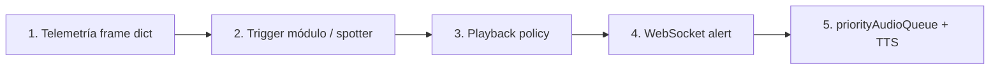

# Plantilla de tests — Pipeline telemetría → TTS (Crew Chief parity)

**Audiencia:** agentes que implementan Tasks 0–48. El piloto **no ejecuta pytest**; el agente demuestra verde y resume en lenguaje de pista.

**Referencias:** [decisions](./2026-06-07-crewchief-decisions.md) · [complete-port §3.10–3.14](./2026-06-07-crewchief-complete-port.md#310-tests-y-evidencia-por-pipeline) · [parity-port Tasks 1–14](./2026-06-07-crewchief-parity-port.md) · `scripts/verify_audio_pipeline.py`

---

## 1. Pirámide de calidad (por feature / módulo)

Cada `event_id` portado debe tener **al menos capas L1 + L2 + L3** antes de cerrar la task. L4–L5 según pipeline.

| Capa | Qué prueba | Quién ejecuta | Obligatorio |
|------|------------|---------------|-------------|
| **L1** | Módulo aislado: frame prev/curr → `CrewChiefMessage` | Agente (pytest) | Sí |
| **L2** | Playback: mensaje → `AlertMessage` (ttl, priority, channel) | Agente | Sí |
| **L3** | Slice pipeline: tick(s) → WS `alert` (sin batch) | Agente | Sí |
| **L4** | Frontend: payload → cola → elegibilidad TTS | Agente (vitest) | Si toca FE |
| **L5** | LMU manual 1 escenario | Piloto | Smoke §6 decisions |
| **L6** | Replay trace @ 20 Hz (opcional) | Agente | Task 48 / P0 |

**Regla anti-regresión:** si L1–L3 pasan y LMU falla, el bug está en **datos LMU** o **TTS/FE** — no cerrar task sin nota en evidencia.

---

## 2. Cadena del pipeline (5 eslabones)



| Eslabón | Archivos | Test típico |
|---------|----------|-------------|
| 1 Ingest | `frame_builder.py`, sidecar frame | `test_crewchief_frame_context.py` |
| 2 Trigger | `modules/<mod>.py`, `spotter.py` | `test_crewchief_<mod>_module.py` |
| 3 Playback | `playback.py`, `delayed_queue.py` | `test_crewchief_playback_policy.py` |
| 4 WS | `engine.py`, `messages.py` | `test_immediate_routing.py` (evolucionar) |
| 5 FE+TTS | `priorityAudioQueue.ts`, Edge | vitest + LMU oído |

---

## 3. Estructura de fixtures

```
backend/tests/fixtures/crewchief/
├── README.md
├── helpers.py              # load_frames, run_ticks, collect_alerts
└── <module>/
    ├── single_edge.json    # un flanco dispara 1 mensaje
    ├── no_fire.json        # condición negativa
    └── sequence.json       # lista de frames @ 20Hz (replay)
```

### Formato `single_edge.json`

```json
{
  "meta": {
    "module": "flags",
    "event_id": "fcy_pits_closed",
    "lmu_id": "LMU-15",
    "description": "mYellowFlagState 2 → pits closed"
  },
  "previous": {
    "session_type_int": 3,
    "game_phase": 6,
    "yellow_flag_state": 0,
    "lap_number": 4,
    "speed": 55.0,
    "in_pits": false
  },
  "current": {
    "session_type_int": 3,
    "game_phase": 6,
    "yellow_flag_state": 2,
    "lap_number": 4,
    "speed": 54.0,
    "in_pits": false
  },
  "expect": {
    "fires": true,
    "event_id": "fcy_pits_closed",
    "channel": "engineer",
    "immediate": true,
    "text_contains": ["boxes", "cerrad"]
  }
}
```

### Formato `sequence.json`

```json
{
  "meta": { "module": "timings", "ticks_hz": 20 },
  "frames": [
    { "lap_number": 5, "time_gap_car_ahead": 2.1, "current_sector": 1 },
    { "lap_number": 5, "time_gap_car_ahead": 1.8, "current_sector": 2 }
  ],
  "expect": {
    "min_messages": 1,
    "max_messages": 2,
    "event_ids": ["gap_ahead_decreasing"]
  }
}
```

---

## 4. Helpers compartidos (crear en Task 1–3)

```python
# backend/tests/fixtures/crewchief/helpers.py
from __future__ import annotations

import json
from pathlib import Path

from src.intelligence.crewchief_events.frame_builder import build_frame_context
from src.intelligence.crewchief_events.playback import map_message_to_alert

FIXTURES = Path(__file__).parent


def load_case(name: str, module: str) -> dict:
    path = FIXTURES / module / f"{name}.json"
    return json.loads(path.read_text(encoding="utf-8"))


def run_module_once(module, case: dict):
    ctx = build_frame_context(
        previous=case["previous"],
        current=case["current"],
        strategy=case.get("strategy", {}),
        now_monotonic=case.get("now", 1000.0),
    )
    return module.evaluate(ctx)


def assert_message_matches(msg, expect: dict) -> None:
    if not expect.get("fires", True):
        assert msg is None
        return
    assert msg is not None
    assert msg.event_id == expect["event_id"]
    if "text_contains" in expect:
        lower = msg.text.lower()
        assert any(s.lower() in lower for s in expect["text_contains"])
    alert = map_message_to_alert(msg)
    assert alert.event == "alert"
    if expect.get("immediate"):
        assert int(alert.audio_priority) >= 3
```

---

## 5. Plantilla L1 — test de módulo (copiar por cada `modules/*.py`)

```python
# backend/tests/test_crewchief_<module>_module.py
"""L1: <Module> — CC Events/<Module>.cs parity."""

import pytest

from src.intelligence.crewchief_events.modules.<module> import <Module>Module
from tests.fixtures.crewchief.helpers import load_case, run_module_once, assert_message_matches


@pytest.fixture
def mod():
    return <Module>Module()


def test_<event>_fires_on_edge(mod):
    case = load_case("single_edge", "<module>")
    msg = run_module_once(mod, case)
    assert_message_matches(msg, case["expect"])


def test_<event>_does_not_fire_when_gated(mod):
    case = load_case("no_fire", "<module>")
    msg = run_module_once(mod, case)
    assert msg is None
```

**Sustituir:** `<module>`, `<Module>`, `<event>`, nombres de fixture.

---

## 6. Plantilla L2 — playback + no batch

```python
# backend/tests/test_crewchief_playback_<module>.py
from src.intelligence.crewchief_events.playback import map_message_to_alert
from src.intelligence.crewchief_events.types import CrewChiefMessage, CrewChiefPriority, CrewChiefChannel


def test_<event_id>_maps_to_alert_not_commentary():
    msg = CrewChiefMessage(
        event_id="<event_id>",
        text="Texto radio breve.",
        priority=CrewChiefPriority.HIGH,
        channel=CrewChiefChannel.ENGINEER,
        ttl_ms=2000,
    )
    alert = map_message_to_alert(msg)
    assert alert.event == "alert"
    assert alert.payload.get("event_id") == "<event_id>"
    assert alert.ttl <= 12
    assert "commentary" not in alert.category
```

---

## 7. Plantilla L3 — slice pipeline (GameState loop + suite)

```python
# backend/tests/test_crewchief_pipeline_<module>.py
"""L3: frame sequence → suite → AlertMessage (sin commentary_end)."""

from unittest.mock import MagicMock

from src.intelligence.crewchief_events.game_state import CrewChiefGameStateLoop
from src.models.messages import AlertMessage, CommentaryEndMessage


def test_<module>_sequence_emits_alert_only():
    sent = []
    engine = MagicMock()
    engine.crewchief_suite = build_suite_with_<module>()  # o suite real
    engine.broadcaster.send = sent.append

    loop = CrewChiefGameStateLoop(engine=engine)
    for i, frame in enumerate(load_sequence_frames("<module>")):
        loop.on_frame(frame, now=1.0 + i * 0.05)

    alerts = [m for m in sent if isinstance(m, AlertMessage)]
    commentary = [m for m in sent if isinstance(m, CommentaryEndMessage)]
    assert any(a.payload.get("event_id") == "<event_id>" for a in alerts)
    assert not commentary
```

Patrón existente en repo: `test_spotter_e2e.py`, `test_immediate_routing.py`.

---

## 8. Plantilla L3 — spotter @ 20 Hz

```python
def test_spotter_<scenario>_ws_contract(mock_broadcast, broadcast_messages):
    from src.intelligence.spotter import SpotterService
    from src.intelligence.spotter_adapter import frame_to_spotter_tick
    from tests.fixtures.spotter.helpers import load_frame

    spotter = SpotterService(broadcast_callback=mock_broadcast, proximity_threshold_m=3.0)
    spotter.evaluate_tick(frame_to_spotter_tick(load_frame("<fixture>"), advice=None))

    alert = next(m for m in broadcast_messages if m.category == "<category>")
    assert alert.event == "alert"
    assert int(alert.audio_priority) >= 2
    assert alert.ttl is not None
```

---

## 9. Plantilla L4 — frontend cola (vitest)

```typescript
// frontend/src/__tests__/pipeline.<event_id>.test.ts
import { describe, it, expect } from "vitest";
import { PriorityAudioQueue } from "../services/priorityAudioQueue";

describe("pipeline <event_id>", () => {
  it("IMMEDIATE alert preempts NORMAL and respects ttl", async () => {
    const q = new PriorityAudioQueue({ maxQueueLength: 5 });
    q.enqueueNormal({ text: "Gap adelante 1.2", ttlMs: 5000 });
    q.enqueueImmediate({ text: "Coche derecha", ttlMs: 1000 });
    const next = await q.nextToSpeak();
    expect(next?.text).toContain("derecha");
  });

  it("drops expired before TTS", async () => {
    const q = new PriorityAudioQueue();
    q.enqueueNormal({ text: "Stale gap", ttlMs: 0, enqueuedAt: Date.now() - 5000 });
    expect(q.hasPendingNormal()).toBe(false);
  });
});
```

---

## 10. Checklist por task (agente — antes de marcar done)

Copiar en descripción de PR / mensaje al piloto:

```markdown
### Task N — <module> pipeline QA

- [ ] L1: `pytest tests/test_crewchief_<module>_module.py -v` PASS
- [ ] L2: playback mapping incluido (mismo PR o test dedicado) PASS
- [ ] L3: pipeline slice sin `commentary_end` PASS
- [ ] L4: vitest (si cambió priorityAudioQueue / alertVoice) PASS
- [ ] `cutover_registry`: event_id añadido; legacy guard
- [ ] `python scripts/verify_audio_pipeline.py` PASS (o subset documentado)
- [ ] Mensaje piloto: "En LMU cuando [X], dirá [Y] por radio"
```

---

## 11. Matriz mínima P0 (primera ola — días 5–13)

Cada fila = **un archivo L1 mínimo** + fixture JSON.

| event_id | Módulo | Fixture | LMU smoke # |
|----------|--------|---------|-------------|
| `fcy_pits_closed` | flags | `flags/single_edge.json` | 3 |
| `penalty_new` | penalties | `penalties/new_penalty.json` | 4 |
| `damage_impact` | damage | `damage/impact.json` | — |
| `rain_heavy` | rain | `rain/level_up.json` | 6 |
| `overtake` | position | `position/overtake.json` | 5 |
| `race_start` | position/lap | `position/race_start.json` | 2 |
| proximity | spotter | `fixtures/spotter/*` (ya existe) | 7 |
| PTT fuel | commands/LLM | `test_crewchief_commands.py` | 8 |

Ampliar matriz al portar Tasks 22–40.

---

## 12. Script gate (agente, cada día 3+)

Desde raíz del repo:

```powershell
cd backend; python -m pytest tests/test_crewchief_*.py tests/test_spotter_e2e.py tests/test_immediate_routing.py -v --tb=short
cd ..\frontend; npm test -- priorityAudioQueue
python scripts/verify_audio_pipeline.py
```

Todo verde antes de pedir al piloto sesión LMU.

---

## 13. Informe al piloto (plantilla — sin código)

Tras cada task, el agente envía:

```markdown
## Listo para probar — Task N (<nombre CC>)

**Qué deberías oír:** Cuando [situación en pista], el [spotter/ingeniero] dice algo como: "[frase ejemplo]".

**Cómo probar (Tauri):**
1. Abrir Vantare desde Tauri (build habitual).
2. LMU + sidecar en el mismo PC Windows.
3. [Pasos concretos: ej. "Provoca FCY en práctica"]

**Si falla:** anota qué esperabas oír y qué pasó (sin logs técnicos).

**Tests automáticos:** pasaron (agente).
```

---

## 14. Evolución post big-bang

| Archivo | Acción |
|---------|--------|
| `test_immediate_routing.py` | Actualizar: position/fuel **no** deben ir a batch |
| `test_audio_trigger_matrix.py` | Regenerar filas desde `crewchief_events`, no `triggers.py` |
| `test_crewchief_no_legacy_emitters.py` | Obligatorio CI |
| `scripts/verify_audio_pipeline.py` | Añadir `test_crewchief_*.py` al bundle |
