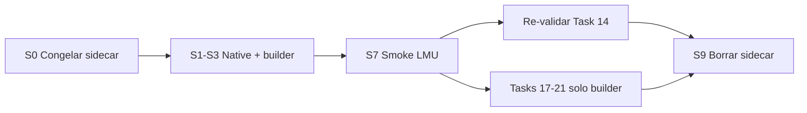

# Native Windows Telemetry (No Sidecar) Implementation Plan

> **Completion plan (S9 remaining):** [`2026-06-08-task49-sidecar-removal-completion.md`](./2026-06-08-task49-sidecar-removal-completion.md) — S0–S8 already merged; execute 49.1–49.8 for sidecar deletion.

> **For agentic workers:** REQUIRED SUB-SKILL: Use superpowers:subagent-driven-development (recommended) or superpowers:executing-plans to implement this plan task-by-task. Steps use checkbox (`- [ ]`) syntax for tracking.
>
> **Parent plans:**
> - [`2026-06-07-crewchief-complete-port.md`](./2026-06-07-crewchief-complete-port.md) — **Task 49** (infra; after Task 0, parallel to Tasks 17–21)
> - [`2026-06-07-crewchief-parity-port.md`](./2026-06-07-crewchief-parity-port.md) — Tasks 1–14 **implemented**; LMU validation assumes sidecar today
>
> **Supersedes:** [`2026-06-07-crewchief-decisions.md`](./2026-06-07-crewchief-decisions.md) §3 “reutiliza frame sidecar @ 2 s” once Task 49-S7 merges.

**Goal:** Run Vantare as **Windows-only, two-process dev** (backend + Tauri) by reading LMU shared memory **inside the backend**, eliminating the strategy sidecar, internal `/ws/sidecar`, and duplicate `StrategyRunner` — while keeping StepFun LLM and Crew Chief @ 20 Hz unchanged.

**Architecture:** `TelemetryReader(offline=False)` starts in `main.py` on Windows when `VANTARE_NATIVE_TELEMETRY=1`. Extract duplicated frame-building from `StrategyService` / `StrategyRunner` into one shared builder in `shared-strategy`. At **20 Hz**, `telemetry_sender_loop` calls `StrategyService.snapshot_frame()` (builder-only, **no REST**). At **2 Hz**, `_run_loop` runs full cycle including `get_additional_data("brakes")`, `compute_strategy`, and `StateChangeDetector`. Sidecar remains optional behind `SIDECAR_FALLBACK` until Task 49-S9 deletes it.

**Tech Stack:** Python 3.12 / FastAPI / `shared-telemetry` / `shared-strategy` / Pytest · Tauri 2 · StepFun LLM (unchanged, cloud API in backend)

---

## Contexto del repositorio (Jun 2026)

### Problema actual (cableado roto)

Tasks 1–14 (parity port) están **implementadas en el backend**, pero en LMU en vivo el frame @ 20 Hz viene del **sidecar**, no de `StrategyService`:

| Componente | Estado hoy | Consecuencia |
|------------|------------|--------------|
| [`backend/src/main.py`](../../backend/src/main.py) L71 | `TelemetryReader(offline=True)` siempre | Backend no lee SM en dev |
| [`backend/src/routers/websocket.py`](../../backend/src/routers/websocket.py) L113–127 | Prefiere `latest_strategy_frame` del sidecar | CC loop + spotter usan copia parcial |
| [`backend/src/services/strategy_service.py`](../../backend/src/services/strategy_service.py) | Tiene `num_penalties`, damage, rivals | **No llega** al loop @ 20 Hz en pista |
| [`sidecar/src/sidecar/strategy_runner.py`](../../sidecar/src/sidecar/strategy_runner.py) | ~330 líneas duplicadas | Se desincroniza (penalties rotas hasta fix reciente) |
| Fallback offline L127 | `reader.get_state().model_dump()` | **No** es `TelemetryFrame` CC — sin penalties, flags CC, etc. |

Este plan **cierra el gap operativo** del parity port: mismo código intelligence, fuente de datos correcta.

### Prerrequisitos cumplidos

- **Task 0** (GameState @ 20 Hz): [`backend/src/intelligence/crewchief_events/game_state.py`](../../backend/src/intelligence/crewchief_events/game_state.py) + [`backend/tests/test_crewchief_tick_rate.py`](../../backend/tests/test_crewchief_tick_rate.py) existen.
- **Tasks 1–14**: módulos CC, suite, cutover registry — código en repo; validación LMU manual pendiente ([`.omo/evidence/cc-parity-validation-checklist.md`](../../.omo/evidence/cc-parity-validation-checklist.md)).

### Orden vs master plan



- **No** añadir fixes CC en sidecar (salvo hotfix crítico pre-S3).
- **Tasks 17–21** del master plan: nuevos campos **solo** en `telemetry_frame_builder.py`.
- **Fase 7 (S9):** solo tras ~1 semana estable con `VANTARE_NATIVE_TELEMETRY=1`.

### Estimación

3–5 días implementación (S0–S8) + 1 sesión LMU smoke (S7) + re-validación Task 14.

---

## Scope check

Independent from Crew Chief module porting but **unblocks fresher GameState** for Tasks 17–21 and **fixes LMU bugs** caused by sidecar desync. Each task ships testable software. Do not merge S8/S9 until pilot LMU smoke passes.

## File structure (decomposition)

| File | Responsibility |
|------|----------------|
| **Create** [`backend/src/platform/runtime.py`](../../backend/src/platform/runtime.py) | `is_windows()`, `native_telemetry_enabled()` |
| **Create** [`shared-strategy/src/shared_strategy/telemetry_frame_builder.py`](../../shared-strategy/src/shared_strategy/telemetry_frame_builder.py) | Single `build_telemetry_frame_from_reader_state(...) -> TelemetryFrame` |
| **Create** [`backend/src/services/state_change_detector.py`](../../backend/src/services/state_change_detector.py) | Port of [`sidecar/src/sidecar/event_detector.py`](../../sidecar/src/sidecar/event_detector.py) |
| **Modify** [`backend/src/config.py`](../../backend/src/config.py) | `NATIVE_TELEMETRY`, `SIDECAR_FALLBACK` |
| **Modify** [`backend/src/main.py`](../../backend/src/main.py) | `TelemetryReader(offline=not native)` |
| **Modify** [`backend/src/services/strategy_service.py`](../../backend/src/services/strategy_service.py) | Shared builder; `snapshot_frame()` @ 20 Hz; lock; cached REST |
| **Modify** [`backend/src/routers/websocket.py`](../../backend/src/routers/websocket.py) | Prefer native frame; sidecar optional fallback |
| **Modify** [`backend/src/routers/health.py`](../../backend/src/routers/health.py) | `telemetry.source: native\|sidecar\|offline` |
| **Create** [`backend/tests/test_native_telemetry.py`](../../backend/tests/test_native_telemetry.py) | Config + frame source tests |
| **Create** [`backend/tests/test_telemetry_frame_builder.py`](../../backend/tests/test_telemetry_frame_builder.py) | CC field regression |
| **Create** [`backend/tests/test_native_telemetry_frame_source.py`](../../backend/tests/test_native_telemetry_frame_source.py) | 20 Hz path |
| **Create** [`scripts/dev.ps1`](../../scripts/dev.ps1) | Dev sin sidecar |
| **Modify** [`frontend/src-tauri/src/main.rs`](../../frontend/src-tauri/src/main.rs) | Skip sidecar spawn when native |
| **Delete (S9)** `sidecar/` package, `/ws/sidecar`, sidecar tests | After cutover |

---

## Target runtime (post Task 49-S9)

```
LMU shared memory
        │
        ▼
backend.exe (FastAPI)
  ├─ TelemetryReader @ 20 Hz (in-process, thread)
  ├─ StrategyService.snapshot_frame @ 20 Hz  → spotter + CrewChiefGameStateLoop
  ├─ StrategyService._process_cycle @ 2 Hz   → fuel / pit advice + REST brakes
  ├─ StateChangeDetector @ 2 Hz              → ChromaDB / events
  ├─ IntelligenceEngine + StepFun LLM
  └─ ws://127.0.0.1:8008/ws → Tauri + React
```

**LLM:** No changes. `LLM_BASE_URL` / `LLM_API_KEY` in `backend/.env` stay as today (StepFun).

---

### Task 49-S0: Congelar sidecar (política anti-deuda)

**Files:**
- Modify: [`AGENTS.md`](../../AGENTS.md)
- Modify: [`docs/superpowers/plans/2026-06-07-crewchief-decisions.md`](./2026-06-07-crewchief-decisions.md)
- Create: [`.omo/evidence/sidecar-freeze-policy.md`](../../.omo/evidence/sidecar-freeze-policy.md)

- [ ] **Step 1: Document freeze policy**

Create `.omo/evidence/sidecar-freeze-policy.md`:

```markdown
# Sidecar freeze policy (until Task 49-S9)

- `sidecar/` is LEGACY. No new CC fields, no parity fixes.
- All LMU telemetry fields → `shared-strategy/src/shared_strategy/telemetry_frame_builder.py`
- All intelligence fixes → `backend/src/intelligence/` (unchanged)
- Exception: P0 hotfix if native path (S1-S3) not yet merged and LMU blocked
- Dev default after S7: `VANTARE_NATIVE_TELEMETRY=1`, no sidecar terminal
```

- [ ] **Step 2: Update AGENTS.md dev startup**

Replace 3-process instructions with:

```markdown
## Dev (Windows, native — default after Task 49-S7)

Terminal 1: `cd backend; $env:VANTARE_NATIVE_TELEMETRY='1'; python run_dev.py --no-reload`
Terminal 2: `cd frontend; npm run tauri dev`
Or: `.\scripts\dev.ps1`

Legacy sidecar (until S9): set `VANTARE_SIDECAR=1` in Tauri release only.
```

- [ ] **Step 3: Update crewchief-decisions.md §3**

Add note: native telemetry supersedes sidecar frame @ 2 s once S7 merges.

- [ ] **Step 4: Commit**

```powershell
git add AGENTS.md docs/superpowers/plans/2026-06-07-crewchief-decisions.md .omo/evidence/sidecar-freeze-policy.md
git commit -m "docs: freeze sidecar; CC telemetry fixes go to shared builder only"
```

---

### Task 49-S1: Platform config and failing tests

**Files:**
- Create: `backend/src/platform/__init__.py`
- Create: `backend/src/platform/runtime.py`
- Modify: `backend/src/config.py`
- Modify: `backend/.env.example`
- Test: `backend/tests/test_native_telemetry.py`

- [ ] **Step 1: Write failing tests**

```python
# backend/tests/test_native_telemetry.py
import sys
from unittest.mock import patch

from src.platform.runtime import is_windows, native_telemetry_enabled


def test_is_windows_on_win32():
    with patch.object(sys, "platform", "win32"):
        assert is_windows() is True


def test_is_windows_false_on_linux():
    with patch.object(sys, "platform", "linux"):
        assert is_windows() is False


def test_native_telemetry_default_true_on_windows():
    with patch.object(sys, "platform", "win32"):
        with patch.dict("os.environ", {"VANTARE_NATIVE_TELEMETRY": "1"}, clear=False):
            assert native_telemetry_enabled() is True


def test_native_telemetry_can_be_disabled():
    with patch.object(sys, "platform", "win32"):
        with patch.dict("os.environ", {"VANTARE_NATIVE_TELEMETRY": "0"}, clear=False):
            assert native_telemetry_enabled() is False


def test_native_telemetry_false_on_linux_even_with_env():
    with patch.object(sys, "platform", "linux"):
        with patch.dict("os.environ", {"VANTARE_NATIVE_TELEMETRY": "1"}, clear=False):
            assert native_telemetry_enabled() is False
```

- [ ] **Step 2: Run test — expect FAIL**

```powershell
cd "C:\Users\isaac\Desktop\Vantare-Ingeniero\backend"
python -m pytest tests/test_native_telemetry.py -v
```

Expected: `ModuleNotFoundError` or `ImportError` for `src.platform.runtime`.

- [ ] **Step 3: Implement runtime + settings**

```python
# backend/src/platform/__init__.py
# (empty)

# backend/src/platform/runtime.py
from __future__ import annotations

import os
import sys

from src.config import settings


def is_windows() -> bool:
    return sys.platform == "win32"


def native_telemetry_enabled() -> bool:
    if not is_windows():
        return False
    env = os.getenv("VANTARE_NATIVE_TELEMETRY")
    if env is not None:
        return env.strip().lower() in ("1", "true", "yes")
    return bool(settings.NATIVE_TELEMETRY)
```

Add to `backend/src/config.py`:

```python
NATIVE_TELEMETRY: bool = True   # Windows: read LMU SM in backend process
SIDECAR_FALLBACK: bool = False  # If True, prefer /ws/sidecar when connected
```

Add to `backend/.env.example`:

```env
# Windows native telemetry (no sidecar). 0 = legacy sidecar path
VANTARE_NATIVE_TELEMETRY=1
# Optional: prefer sidecar frame when connected (legacy debug)
# VANTARE_SIDECAR_FALLBACK=1
```

- [ ] **Step 4: Run test — expect PASS**

```powershell
cd "C:\Users\isaac\Desktop\Vantare-Ingeniero\backend"
python -m pytest tests/test_native_telemetry.py -v
```

- [ ] **Step 5: Commit**

```powershell
git add backend/src/platform backend/src/config.py backend/.env.example backend/tests/test_native_telemetry.py
git commit -m "feat: add Windows native telemetry config flags"
```

---

### Task 49-S2: Start TelemetryReader online on Windows

**Files:**
- Modify: `backend/src/main.py`
- Modify: `backend/src/routers/health.py`
- Test: `backend/tests/test_native_telemetry.py` (append)

- [ ] **Step 1: Write failing test**

```python
# append to backend/tests/test_native_telemetry.py
from unittest.mock import MagicMock, patch


def test_main_uses_online_reader_when_native_enabled():
    with patch("src.main.native_telemetry_enabled", return_value=True):
        with patch("src.main.TelemetryReader") as reader_cls:
            reader_cls.return_value = MagicMock(offline=False)
            import importlib
            import src.main as main_mod
            importlib.reload(main_mod)
            reader_cls.assert_called()
            _, kwargs = reader_cls.call_args
            assert kwargs.get("offline") is False


def test_health_reports_native_source_when_connected():
    from fastapi import FastAPI
    from starlette.testclient import TestClient
    from src.routers.health import router as health_router

    app = FastAPI()
    app.include_router(health_router)
    reader = MagicMock()
    reader.offline = False
    reader.get_state.return_value = MagicMock(player=MagicMock(current_lap=2))
    app.state.telemetry_reader = reader
    app.state.latest_strategy_frame = None

    with patch("src.routers.health.native_telemetry_enabled", return_value=True):
        with TestClient(app) as client:
            data = client.get("/health").json()
            assert data["telemetry"]["source"] == "native"
```

- [ ] **Step 2: Run test — expect FAIL**

```powershell
cd "C:\Users\isaac\Desktop\Vantare-Ingeniero\backend"
python -m pytest tests/test_native_telemetry.py::test_main_uses_online_reader_when_native_enabled tests/test_native_telemetry.py::test_health_reports_native_source_when_connected -v
```

- [ ] **Step 3: Wire main.py**

At top of lifespan reader init in `backend/src/main.py`:

```python
from src.platform.runtime import native_telemetry_enabled

native = native_telemetry_enabled()
reader = TelemetryReader(offline=not native, poll_rate=settings.TELEMETRY_POLL_RATE)
reader.start()
app.state.telemetry_reader = reader
app.state.latest_client_frame = None
app.state.latest_strategy_frame = None  # legacy until S9
logger.info("TelemetryReader started (native=%s, offline=%s)", native, reader.offline)
```

Remove or update log line L93 that says "Esperando strategy_frame del sidecar..." — replace with:

```python
if native:
    logger.info("Native telemetry mode — reading LMU shared memory in-process.")
else:
    logger.info("Offline/legacy mode — sidecar or simulated telemetry.")
```

Update `backend/src/routers/health.py`:

```python
from src.platform.runtime import native_telemetry_enabled

# inside health_check, after shm_status computed:
sidecar_connected = getattr(request.app.state, "latest_strategy_frame", None) is not None
if native_telemetry_enabled() and shm_status == "connected":
    telemetry_source = "native"
elif sidecar_connected:
    telemetry_source = "sidecar"
else:
    telemetry_source = "offline"

return {
    "status": "ok",
    "telemetry": {
        "source": telemetry_source,
        "shared_memory_status": shm_status,
        "native_enabled": native_telemetry_enabled(),
    },
    "shared_memory": {
        "status": shm_status,
        "offline_mode": getattr(reader, "offline", True) if reader else True,
        "last_lap": last_lap,
    },
    # keep sidecar block for legacy until S9:
    "sidecar": {"connected": sidecar_connected},
    ...
}
```

- [ ] **Step 4: Run tests — expect PASS**

```powershell
cd "C:\Users\isaac\Desktop\Vantare-Ingeniero\backend"
python -m pytest tests/test_native_telemetry.py -v
```

- [ ] **Step 5: Commit**

```powershell
git add backend/src/main.py backend/src/routers/health.py backend/tests/test_native_telemetry.py
git commit -m "feat: use online TelemetryReader when native Windows mode enabled"
```

---

### Task 49-S3: Extract shared TelemetryFrame builder (dedupe + CC fields)

**Why critical:** `StrategyService` has richer logic but omits `game_phase` / `sector_flags` on the frame; sidecar has them. Builder must include **all** CC P0 fields for Tasks 17–21.

**Files:**
- Create: `shared-strategy/src/shared_strategy/telemetry_frame_builder.py`
- Modify: `backend/src/services/strategy_service.py` (cut L181–573 frame assembly)
- Modify: `sidecar/src/sidecar/strategy_runner.py` (thin wrapper until S9)
- Test: `backend/tests/test_telemetry_frame_builder.py`

- [ ] **Step 1: Write failing CC field regression tests**

```python
# backend/tests/test_telemetry_frame_builder.py
from shared_strategy.telemetry_frame_builder import (
    FrameBuildContext,
    build_telemetry_frame_from_reader_state,
)


def test_builder_returns_telemetry_frame_with_session_int(mock_race_state):
    ctx = FrameBuildContext(
        track_length=7004.0,
        sync=None,
        reader_offline=True,
        shmm_data=None,
        cached_brake_wear=None,
        lap_battery_drain=0.0,
        lap_battery_regen=0.0,
    )
    frame = build_telemetry_frame_from_reader_state(
        race_state=mock_race_state,
        ctx=ctx,
    )
    assert frame.lap_number >= 0
    assert frame.session_type_int == 4
    assert frame.num_penalties == 0
    assert frame.game_phase == 5  # default when offline/no scoring
    assert frame.sector_flags == []


def test_builder_accepts_explicit_game_phase_and_penalties(mock_race_state):
    ctx = FrameBuildContext(
        track_length=7004.0,
        sync=None,
        reader_offline=True,
        shmm_data=None,
        cached_brake_wear={"fl": 12.0, "fr": 11.0, "rl": 10.0, "rr": 9.0},
        lap_battery_drain=1.5,
        lap_battery_regen=0.5,
        game_phase=6,
        sector_flags=[0, 1, 0],
        num_penalties=2,
    )
    frame = build_telemetry_frame_from_reader_state(race_state=mock_race_state, ctx=ctx)
    assert frame.game_phase == 6
    assert frame.sector_flags == [0, 1, 0]
    assert frame.num_penalties == 2
    assert frame.brake_wear_fl == 12.0
    assert frame.yellow_flag_active is True  # game_phase 6 → FCY
```

Uses existing `mock_race_state` from `backend/tests/conftest.py`.

- [ ] **Step 2: Run test — expect FAIL**

```powershell
cd "C:\Users\isaac\Desktop\Vantare-Ingeniero\backend"
python -m pytest tests/test_telemetry_frame_builder.py -v
```

- [ ] **Step 3: Create builder module**

Create `shared-strategy/src/shared_strategy/telemetry_frame_builder.py`:

```python
from __future__ import annotations

import math
from dataclasses import dataclass, field
from typing import Any, Optional

from shared_strategy.models import CompetitorTelemetry, TelemetryFrame
from shared_telemetry.session_kind import session_kind_from_lmu_int
from shared_telemetry.lmu_damage import damage_fields_from_player_telemetry


def safe_float(val) -> float:
    try:
        f = float(val)
        return f if math.isfinite(f) else 0.0
    except (TypeError, ValueError):
        return 0.0


def safe_str(val) -> str:
    if isinstance(val, bytes):
        return val.decode("utf-8", errors="replace").rstrip("\0 ").rstrip()
    return str(val) if val is not None else ""


@dataclass
class FrameBuildContext:
    track_length: float
    sync: Any  # TelemetrySync | None
    reader_offline: bool
    shmm_data: Any  # ctypes snapshot | None
    cached_brake_wear: Optional[dict[str, float]] = None
    lap_battery_drain: float = 0.0
    lap_battery_regen: float = 0.0
    game_phase: int = 5
    sector_flags: list[int] = field(default_factory=list)
    num_penalties: int = 0


def build_telemetry_frame_from_reader_state(
    *,
    race_state,
    ctx: FrameBuildContext,
) -> TelemetryFrame:
    """Single source of truth for TelemetryFrame assembly (backend + legacy sidecar)."""
    player = race_state.player
    session = race_state.session
    session_type_int = session.session_type
    session_type_str = session_kind_from_lmu_int(session_type_int)

    # --- Move here the full block currently in StrategyService._process_cycle ---
    # Lines ~190-573: fuel ctypes, flags from scoring, competitors loop, damage, etc.
    # When ctx.reader_offline is False and ctx.shmm_data is set, read:
    #   game_phase, sector_flags, num_penalties from scoring (same as sidecar strategy_runner.py L244-258)
    # When offline, use ctx.game_phase / ctx.sector_flags / ctx.num_penalties overrides.

    # Use ctx.cached_brake_wear for brake_wear_* (never call REST here)

    frame = TelemetryFrame(
        session_type=session_type_str,
        session_type_int=session_type_int,
        lap_number=player.current_lap,
        num_penalties=ctx.num_penalties,
        game_phase=ctx.game_phase,
        sector_flags=list(ctx.sector_flags),
        # ... all remaining fields from current StrategyService assembly ...
    )
    return frame
```

**Implementation note for agent:** Cut-paste the working body from `backend/src/services/strategy_service.py` `_process_cycle` (from session/fuel extraction through `TelemetryFrame(...)`). Merge sidecar-only fields (`game_phase`, `sector_flags`) from `sidecar/src/sidecar/strategy_runner.py` L244-285. Do **not** call `get_additional_data` inside the builder — pass `cached_brake_wear` via context.

Refactor `StrategyService._process_cycle`:

```python
from shared_strategy.telemetry_frame_builder import FrameBuildContext, build_telemetry_frame_from_reader_state

def _make_frame_context(self, race_state, *, include_rest: bool) -> FrameBuildContext:
    cached = None
    game_phase, sector_flags, num_penalties = 5, [], 0
    shmm_data = None
    if not self.reader.offline and self.reader.shmm and self.reader.shmm.data:
        shmm_data = self.reader.shmm.data
        scoring_info = shmm_data.scoring.scoringInfo
        game_phase = int(scoring_info.mGamePhase)
        sector_flags = [int(scoring_info.mSectorFlag[i]) for i in range(3)]
        # num_penalties from player vehScoringInfo (same as strategy_service today)
    if include_rest:
        cached = self._fetch_brake_wear_from_rest()
        self._cached_brake_wear = cached
    else:
        cached = self._cached_brake_wear
    return FrameBuildContext(
        track_length=self.track.track_length,
        sync=self.sync,
        reader_offline=self.reader.offline,
        shmm_data=shmm_data,
        cached_brake_wear=cached,
        lap_battery_drain=self._lap_battery_drain,
        lap_battery_regen=self._lap_battery_regen,
        game_phase=game_phase,
        sector_flags=sector_flags,
        num_penalties=num_penalties,
    )

def _process_cycle(self) -> None:
    race_state = self.reader.get_state()
    if race_state is None or race_state.player is None:
        return
    ctx = self._make_frame_context(race_state, include_rest=True)
    frame = build_telemetry_frame_from_reader_state(race_state=race_state, ctx=ctx)
    advice, new_state = compute_strategy(frame, self.state, self.track)
    self.state = new_state
    self.latest_advice = advice
    self.latest_frame = frame
```

Refactor `StrategyRunner.process_cycle` to call the same builder with equivalent `FrameBuildContext`.

- [ ] **Step 4: Run tests — expect PASS**

```powershell
cd "C:\Users\isaac\Desktop\Vantare-Ingeniero\backend"
python -m pytest tests/test_telemetry_frame_builder.py tests/test_lmu_feedback_fixes.py tests/test_strategy_service.py tests/test_penalty_wave1.py tests/test_fcy_wave1.py -v
```

- [ ] **Step 5: Commit**

```powershell
git add shared-strategy/src/shared_strategy/telemetry_frame_builder.py backend/src/services/strategy_service.py sidecar/src/sidecar/strategy_runner.py backend/tests/test_telemetry_frame_builder.py
git commit -m "refactor: extract shared TelemetryFrame builder with CC P0 fields"
```

---

### Task 49-S3b: Builder regression gate (mandatory before S4)

**Prerequisite for S4.** Do not wire `snapshot_frame` until this gate passes.

- [ ] **Step 1: Run full builder regression suite**

```powershell
cd "C:\Users\isaac\Desktop\Vantare-Ingeniero\backend"
python -m pytest tests/test_telemetry_frame_builder.py tests/test_lmu_feedback_fixes.py tests/test_strategy_service.py tests/test_penalty_wave1.py tests/test_fcy_wave1.py tests/test_spotter_cc_parity.py -v
```

Expected: **all PASS**. If any fail, fix builder before continuing.

- [ ] **Step 2: Record gate in evidence**

Add pass/fail + date to `.omo/evidence/native-telemetry-smoke.md` under `## S3b gate`.

---

### Task 49-S4: 20 Hz snapshot_frame (builder-only, no REST)

**Critical design rule:** `snapshot_frame()` must **never** call `get_additional_data` (REST @ 6397). REST runs only in `_process_cycle` @ 2 Hz; snapshot reuses `_cached_brake_wear`.

**Files:**
- Modify: `backend/src/services/strategy_service.py`
- Modify: `backend/src/routers/websocket.py`
- Test: `backend/tests/test_native_telemetry_frame_source.py`

- [ ] **Step 1: Write failing tests**

```python
# backend/tests/test_native_telemetry_frame_source.py
import asyncio
import threading
from unittest.mock import MagicMock, patch

import pytest


@pytest.mark.asyncio
async def test_telemetry_loop_uses_strategy_service_snapshot_when_native():
    from src.routers import websocket as ws_mod

    app_state = MagicMock()
    strategy = MagicMock()
    strategy.snapshot_frame.return_value = {
        "lap_number": 3,
        "speed": 55.0,
        "session_type_int": 10,
        "num_penalties": 0,
    }
    app_state.strategy_service = strategy
    app_state.latest_strategy_frame = {"frame": {"lap_number": 99}}  # stale sidecar
    app_state.spotter_service = None
    app_state.crewchief_game_state_loop = None
    app_state.telemetry_reader = MagicMock()

    with patch.object(ws_mod, "native_telemetry_enabled", return_value=True):
        with patch.object(ws_mod, "mp_encode", return_value=b""):
            task = asyncio.create_task(
                ws_mod.telemetry_sender_loop(MagicMock(), app_state)
            )
            await asyncio.sleep(0.12)
            task.cancel()
            try:
                await task
            except asyncio.CancelledError:
                pass

    assert strategy.snapshot_frame.call_count >= 2


def test_snapshot_frame_does_not_call_rest(monkeypatch):
    from src.services.strategy_service import StrategyService

    reader = MagicMock()
    reader.get_state.return_value = MagicMock(player=MagicMock(current_lap=1, in_pits=False))
    reader.offline = True
    svc = StrategyService(reader)
    svc._cached_brake_wear = {"fl": 0.0, "fr": 0.0, "rl": 0.0, "rr": 0.0}

    rest_called = {"n": 0}

    def _boom(endpoint):
        rest_called["n"] += 1
        raise AssertionError("REST must not run at 20 Hz")

    monkeypatch.setattr("src.services.strategy_service.get_additional_data", _boom)
    result = svc.snapshot_frame()
    assert result is not None
    assert rest_called["n"] == 0


def test_snapshot_and_process_cycle_use_frame_lock():
    from src.services.strategy_service import StrategyService

    reader = MagicMock()
    reader.get_state.return_value = MagicMock(player=MagicMock(current_lap=1, in_pits=False))
    reader.offline = True
    svc = StrategyService(reader)
    assert isinstance(svc._frame_lock, type(threading.Lock()))
```

- [ ] **Step 2: Run test — expect FAIL**

```powershell
cd "C:\Users\isaac\Desktop\Vantare-Ingeniero\backend"
python -m pytest tests/test_native_telemetry_frame_source.py -v
```

- [ ] **Step 3: Implement snapshot_frame + websocket native path**

In `StrategyService.__init__` add:

```python
import threading

self._frame_lock = threading.Lock()
self._cached_brake_wear: dict[str, float] | None = None
```

Add methods:

```python
def _fetch_brake_wear_from_rest(self) -> dict[str, float]:
    brake_wear = {"fl": 0.0, "fr": 0.0, "rl": 0.0, "rr": 0.0}
    try:
        brakes_api = get_additional_data("brakes")
        # ... existing extraction from strategy_service.py L384-409 ...
    except Exception as e:
        logger.debug("Failed to extract brake wear: %s", e)
    return brake_wear


def snapshot_frame(self) -> dict | None:
    """20 Hz path: shared memory → TelemetryFrame dict. No REST, no compute_strategy."""
    race_state = self.reader.get_state()
    if race_state is None or race_state.player is None:
        return None
    with self._frame_lock:
        ctx = self._make_frame_context(race_state, include_rest=False)
        frame = build_telemetry_frame_from_reader_state(race_state=race_state, ctx=ctx)
        self.latest_frame = frame
        return frame.model_dump(mode="json")
```

Wrap `_process_cycle` frame update in `with self._frame_lock:` as well.

Wire `backend/src/routers/websocket.py` `telemetry_sender_loop`:

```python
from src.platform.runtime import native_telemetry_enabled
from src.config import settings

while True:
    sidecar_frame = getattr(app_state, "latest_strategy_frame", None)
    state_dict = None

    if native_telemetry_enabled():
        strategy_service = getattr(app_state, "strategy_service", None)
        if strategy_service:
            state_dict = strategy_service.snapshot_frame()
    elif settings.SIDECAR_FALLBACK and sidecar_frame and sidecar_frame.get("frame"):
        state_dict = sidecar_frame["frame"]
    elif sidecar_frame and sidecar_frame.get("frame"):
        state_dict = sidecar_frame["frame"]  # legacy default until S7
    else:
        state = reader.get_state()
        if state is not None:
            strategy_service = getattr(app_state, "strategy_service", None)
            if strategy_service and hasattr(strategy_service, "snapshot_frame"):
                state_dict = strategy_service.snapshot_frame()
            else:
                state_dict = state.model_dump(mode="json")

    if state_dict is None:
        await asyncio.sleep(0.05)
        continue

    # CC loop: use strategy_service advice when native
    strategy_dict: dict = {}
    if native_telemetry_enabled():
        svc = getattr(app_state, "strategy_service", None)
        advice = svc.get_latest_advice() if svc else None
        if advice is not None:
            strategy_dict = advice.model_dump(mode="json")
    elif sidecar_frame:
        advice = sidecar_frame.get("advice")
        if advice is not None:
            strategy_dict = advice if isinstance(advice, dict) else advice.model_dump(mode="json")
    # ... spotter + cc_loop.on_frame unchanged ...
```

After S7 default, flip order so native wins even if sidecar connected (remove middle legacy branch).

- [ ] **Step 4: Run tests — expect PASS**

```powershell
cd "C:\Users\isaac\Desktop\Vantare-Ingeniero\backend"
python -m pytest tests/test_native_telemetry_frame_source.py tests/test_crewchief_tick_rate.py tests/test_spotter_cc_parity.py -v
```

- [ ] **Step 5: Commit**

```powershell
git add backend/src/services/strategy_service.py backend/src/routers/websocket.py backend/tests/test_native_telemetry_frame_source.py
git commit -m "feat: 20 Hz native telemetry frames via snapshot_frame (no REST spam)"
```

---

### Task 49-S4b: snapshot_frame performance budget (optional tuning)

Run only if LMU shows lag or CPU spike after S4.

- [ ] **Step 1: Write timing test**

```python
# backend/tests/test_snapshot_frame_performance.py
import time
from unittest.mock import MagicMock

from src.services.strategy_service import StrategyService


def test_snapshot_frame_under_15ms(mock_race_state):
    reader = MagicMock()
    reader.get_state.return_value = mock_race_state
    reader.offline = True
    svc = StrategyService(reader)
    svc._cached_brake_wear = {"fl": 0.0, "fr": 0.0, "rl": 0.0, "rr": 0.0}
    start = time.perf_counter()
    for _ in range(20):
        svc.snapshot_frame()
    elapsed_ms = (time.perf_counter() - start) / 20 * 1000
    assert elapsed_ms < 15.0, f"snapshot_frame avg {elapsed_ms:.1f}ms exceeds 15ms budget"
```

- [ ] **Step 2: Run test**

```powershell
cd "C:\Users\isaac\Desktop\Vantare-Ingeniero\backend"
python -m pytest tests/test_snapshot_frame_performance.py -v
```

If FAIL in LMU dev (not CI): throttle competitor sync every 2nd tick in `snapshot_frame` and re-test.

---

### Task 49-S5: Move StateChangeDetector into backend

**Files:**
- Create: `backend/src/services/state_change_detector.py`
- Modify: `backend/src/services/strategy_service.py`
- Modify: `backend/src/routers/websocket.py` (index events from native path)
- Modify: `backend/src/persistence/event_store.py` (comment update)
- Test: `backend/tests/test_state_change_detector.py`

- [ ] **Step 1: Write failing test**

```python
# backend/tests/test_state_change_detector.py
from shared_strategy.models import TelemetryFrame
from src.services.state_change_detector import StateChangeDetector


def test_pit_entry_detected():
    det = StateChangeDetector()
    prev = TelemetryFrame(
        session_type="race", session_type_int=10, lap_number=2,
        in_pits=False, lap_distance=100.0,
    )
    curr = TelemetryFrame(
        session_type="race", session_type_int=10, lap_number=2,
        in_pits=True, lap_distance=100.0,
    )
    det.detect(prev)
    events = det.detect(curr)
    assert any(e["type"] == "pit_entry" for e in events)
```

- [ ] **Step 2: Run test — expect FAIL**

```powershell
cd "C:\Users\isaac\Desktop\Vantare-Ingeniero\backend"
python -m pytest tests/test_state_change_detector.py -v
```

- [ ] **Step 3: Port detector**

Copy `sidecar/src/sidecar/event_detector.py` → `backend/src/services/state_change_detector.py` (keep class name `StateChangeDetector`).

In `StrategyService.__init__`:

```python
self._state_detector: StateChangeDetector | None = None
self._latest_events: list[dict] = []
```

At end of `_process_cycle` (inside lock, after frame set):

```python
if self._state_detector is None:
    from src.services.state_change_detector import StateChangeDetector
    self._state_detector = StateChangeDetector()
self._latest_events = self._state_detector.detect(self.latest_frame)
```

Add `get_latest_events(self) -> list[dict]: return list(self._latest_events)`

In `websocket.py` `strategy_sender_loop`, when native, index events:

```python
if native_telemetry_enabled() and getattr(app_state, "event_store", None):
    events = strategy_service.get_latest_events()
    if events and frame is not None:
        frame_dict = frame if isinstance(frame, dict) else frame.model_dump(mode="json")
        asyncio.ensure_future(_index_events_async(app_state.event_store, frame_dict, events))
```

- [ ] **Step 4: Run tests — expect PASS**

```powershell
cd "C:\Users\isaac\Desktop\Vantare-Ingeniero\backend"
python -m pytest tests/test_state_change_detector.py -v
```

- [ ] **Step 5: Commit**

```powershell
git add backend/src/services/state_change_detector.py backend/src/services/strategy_service.py backend/src/routers/websocket.py backend/src/persistence/event_store.py backend/tests/test_state_change_detector.py
git commit -m "feat: run StateChangeDetector in backend strategy loop"
```

---

### Task 49-S6: Strategy sender uses native advice (drop sidecar preference)

**Files:**
- Modify: `backend/src/routers/websocket.py` (`strategy_sender_loop`)
- Test: `backend/tests/test_native_telemetry.py` (append)

- [ ] **Step 1: Write failing test**

```python
# append to backend/tests/test_native_telemetry.py
import asyncio
from unittest.mock import MagicMock, patch

import pytest
from shared_strategy.models import StrategyAdvice, FuelAdvice


@pytest.mark.asyncio
async def test_strategy_sender_prefers_strategy_service_when_native():
    from src.routers import websocket as ws_mod

    fuel = FuelAdvice(fuel_needed_to_finish=42.0, laps_remaining=10, fuel_per_lap=4.0)
    advice = StrategyAdvice(fuel=fuel, pit_window=None, tyre_strategy=None)
    strategy = MagicMock()
    strategy.get_latest_advice.return_value = advice
    strategy.latest_frame = {"lap_number": 5, "session_type_int": 10}

    app_state = MagicMock()
    app_state.strategy_service = strategy
    app_state.latest_strategy_frame = {
        "advice": {"fuel": {"fuel_needed_to_finish": 999.0}},
        "frame": {"lap_number": 1},
    }
    app_state.intelligence_engine = None
    ws_mod.manager.active_connections.add(MagicMock())

    with patch.object(ws_mod, "native_telemetry_enabled", return_value=True):
        task = asyncio.create_task(ws_mod.strategy_sender_loop(MagicMock(), app_state))
        await asyncio.sleep(0.05)
        task.cancel()
        try:
            await task
        except asyncio.CancelledError:
            pass

    strategy.get_latest_advice.assert_called()
    # Sidecar stale advice must not win — engine path uses strategy_service frame
```

- [ ] **Step 2: Run test — expect FAIL**

```powershell
cd "C:\Users\isaac\Desktop\Vantare-Ingeniero\backend"
python -m pytest tests/test_native_telemetry.py::test_strategy_sender_prefers_strategy_service_when_native -v
```

- [ ] **Step 3: Update strategy_sender_loop**

```python
from src.platform.runtime import native_telemetry_enabled
from src.config import settings

if native_telemetry_enabled():
    advice = strategy_service.get_latest_advice()
    frame = strategy_service.latest_frame
    if frame is not None and hasattr(frame, "model_dump"):
        frame = frame.model_dump(mode="json")
elif sidecar_frame and not settings.SIDECAR_FALLBACK:
    # legacy path during phased cutover
    ...
elif settings.SIDECAR_FALLBACK and sidecar_frame:
    ...
else:
    advice = strategy_service.get_latest_advice()
    frame = strategy_service.latest_frame
```

- [ ] **Step 4: Run native regression suite**

```powershell
cd "C:\Users\isaac\Desktop\Vantare-Ingeniero\backend"
python -m pytest tests/test_native_telemetry.py tests/test_native_telemetry_frame_source.py tests/test_engine_proactive_cycle.py tests/test_immediate_routing.py -v
```

- [ ] **Step 5: Commit**

```powershell
git add backend/src/routers/websocket.py backend/tests/test_native_telemetry.py
git commit -m "feat: strategy sender uses in-process advice in native mode"
```

---

### Task 49-S7: Dev ergonomics + pilot smoke + Task 14 revalidation

**Files:**
- Create: `scripts/dev.ps1`
- Create: `.omo/evidence/native-telemetry-smoke.md`
- Modify: `docs/arquitectura-shell-desktop.md`
- Modify: `.omo/evidence/cc-parity-validation-checklist.md`
- Modify: `AGENTS.md`

- [ ] **Step 1: Add dev script**

```powershell
# scripts/dev.ps1
param([switch]$NoTauri)
$Root = Split-Path -Parent $PSScriptRoot
Write-Host "Vantare dev — native telemetry (no sidecar)"
Start-Process powershell -ArgumentList "-NoExit", "-Command", "cd '$Root\backend'; `$env:VANTARE_NATIVE_TELEMETRY='1'; python run_dev.py --no-reload"
Start-Sleep -Seconds 2
if (-not $NoTauri) {
  Start-Process powershell -ArgumentList "-NoExit", "-Command", "cd '$Root\frontend'; npm run tauri dev"
}
Write-Host "LMU must be running (borderless/windowed). Health: http://127.0.0.1:8008/health"
```

- [ ] **Step 2: Create smoke checklist**

Create `.omo/evidence/native-telemetry-smoke.md`:

```markdown
# Native telemetry smoke (Task 49-S7)

## Automated pre-check
- [ ] `python -m pytest tests/test_native_telemetry.py tests/test_native_telemetry_frame_source.py tests/test_telemetry_frame_builder.py -v` PASS

## Health (no sidecar running)
- [ ] `(Invoke-RestMethod http://127.0.0.1:8008/health).telemetry.source` = `native`
- [ ] `shared_memory.status` = `connected` (LMU in session)
- [ ] `sidecar.connected` = `false`

## Sidecar vs native A/B (one session before S9)
- [ ] Run 5 min with sidecar (`VANTARE_NATIVE_TELEMETRY=0`) — note spotter latency, penalties
- [ ] Run 5 min native (`VANTARE_NATIVE_TELEMETRY=1`, no sidecar) — same scenarios
- [ ] Record deltas in this file (native should match or improve; frame updates @ 20 Hz vs stale @ 2 s)

## UI + audio (15 min pista)
- [ ] Telemetría viva: vel, vuelta, posición
- [ ] Spotter proximidad audible
- [ ] Banderas amarillas / FCY (módulo flags)
- [ ] Penalización audible (num_penalties en frame)
- [ ] PTT "no digas nada" → respuesta limpia, sin chain-of-thought
- [ ] Daño / lluvia si escenario disponible

## Task 14 revalidation (update cc-parity-validation-checklist.md)
- [ ] Replace "Sidecar reiniciado" with "Native telemetry; sidecar NOT running"
- [ ] Re-run A/B scenarios from checklist on 2-process stack
- [ ] Record pass/fail in cc-behavior-parity-matrix.yaml validation_closure
```

- [ ] **Step 3: Update cc-parity-validation-checklist.md Required Runtime**

Replace sidecar bullet with:

```markdown
- [ ] `VANTARE_NATIVE_TELEMETRY=1` en backend (no sidecar).
- [ ] `/health` → `telemetry.source` = `native`.
```

- [ ] **Step 4: Manual smoke in LMU** — fill checklist in `.omo/evidence/native-telemetry-smoke.md`

- [ ] **Step 5: Commit**

```powershell
git add scripts/dev.ps1 .omo/evidence/native-telemetry-smoke.md docs/arquitectura-shell-desktop.md .omo/evidence/cc-parity-validation-checklist.md AGENTS.md
git commit -m "docs: native Windows dev flow and LMU smoke checklist"
```

---

### Task 49-S8: Tauri release — skip sidecar spawn

**Files:**
- Modify: `frontend/src-tauri/src/main.rs`
- Modify: `frontend/src-tauri/tauri.conf.json` (document only; remove bundle in S9)
- Modify: `docs/arquitectura-shell-desktop.md`

- [ ] **Step 1: Gate sidecar spawn**

In `frontend/src-tauri/src/main.rs` release block (~L92):

```rust
let use_sidecar = std::env::var("VANTARE_SIDECAR")
    .map(|v| v == "1")
    .unwrap_or(false);

if use_sidecar {
    // existing strategy-sidecar spawn block
} else {
    println!("[Rust] Native telemetry mode — skipping strategy-sidecar spawn");
}
```

Ensure bundled backend gets native flag — in sidecar spawn alternative path, set env for backend child if applicable, or document that packaged `backend/.env` must include `VANTARE_NATIVE_TELEMETRY=1`.

- [ ] **Step 2: Rebuild backend binary for Tauri bundle**

```powershell
cd "C:\Users\isaac\Desktop\Vantare-Ingeniero\backend"
python build_backend.py
# Copies dist/backend → frontend/src-tauri/binaries/backend + renames backend-x86_64-pc-windows-msvc.exe
cd "C:\Users\isaac\Desktop\Vantare-Ingeniero\frontend"
npm run tauri build
```

Verify installer runs with **only** `backend.exe` + Tauri (no sidecar process in Task Manager).

- [ ] **Step 3: Release smoke**

Same checklist as S7 on **packaged** build, not just uvicorn dev.

- [ ] **Step 4: Commit**

```powershell
git add frontend/src-tauri/src/main.rs docs/arquitectura-shell-desktop.md
git commit -m "chore: skip sidecar spawn in native telemetry release builds"
```

---

### Task 49-S9: Remove sidecar package and `/ws/sidecar` (final cutover)

**Prerequisite:** S7 smoke green; `VANTARE_NATIVE_TELEMETRY=1` default for **1 week** of dev without sidecar.

**Files:**
- Delete: `sidecar/` (entire package)
- Delete: `frontend/src-tauri/binaries/sidecar/` (if present)
- Modify: `backend/src/routers/websocket.py` — remove `sidecar_endpoint`, `latest_strategy_frame` usage
- Modify: `backend/src/main.py` — remove sidecar state/comments
- Modify: `backend/src/routers/health.py` — remove `sidecar` block
- Delete or rewrite: `backend/tests/test_sidecar_integration.py` → `test_no_sidecar_endpoint.py`
- Delete: `sidecar/tests/`
- Modify: `docs/arquitectura-shell-desktop.md`, `docs/crewchief-comparison.md` diagrams
- Modify: `docs/superpowers/plans/2026-06-07-crewchief-complete-port.md` — strike sidecar references in Task 0 diagram

- [ ] **Step 1: Write guard tests**

```python
# backend/tests/test_no_sidecar_endpoint.py
def test_sidecar_ws_route_removed():
    from src.main import app
    paths = [getattr(r, "path", "") for r in app.routes]
    assert "/ws/sidecar" not in paths


def test_no_sidecar_imports_in_backend():
    import pathlib
    root = pathlib.Path(__file__).resolve().parents[1] / "src"
    for py in root.rglob("*.py"):
        text = py.read_text(encoding="utf-8")
        assert "sidecar/" not in text
        assert "latest_strategy_frame" not in text or "websocket" not in str(py)
```

- [ ] **Step 2: Remove sidecar code**

Delete folders and strip `sidecar_endpoint` from `websocket.py`. Remove `app.state.latest_strategy_frame` from `main.py`.

- [ ] **Step 3: Full regression**

```powershell
cd "C:\Users\isaac\Desktop\Vantare-Ingeniero\backend"
python -m pytest -q --ignore=tests/test_sidecar_integration.py
cd "C:\Users\isaac\Desktop\Vantare-Ingeniero\frontend"
npm test -- --run
```

- [ ] **Step 4: Commit**

```powershell
git add -A
git commit -m "chore: remove strategy sidecar; Windows native telemetry only"
```

---

## Out of scope (explicit)

- LLM, PTT agent, Crew Chief modules, React UI — unchanged except frame source
- PySide/Qt monolith migration — rejected
- `shared-telemetry` package — kept; only moves in-process
- Task 44 full CC catalog — separate track after S7

---

## Self-review (spec coverage)

| Requirement | Task |
|-------------|------|
| Close parity port runtime gap (Tasks 1–14) | S3–S4 |
| Freeze sidecar duplication | S0 |
| Windows-only two-process dev | S1–S7 |
| 20 Hz fresh CC/spotter frames | S4 |
| REST @ 2 Hz only (no 20 Hz spam) | S4 |
| Thread-safe snapshot vs process_cycle | S4 |
| game_phase + sector_flags on frame | S3 |
| StepFun LLM unchanged | all |
| Deduplicate StrategyRunner | S3 |
| StateChangeDetector in backend | S5 |
| Task 14 LMU revalidation | S7 |
| Single exe release | S8 |
| Delete sidecar | S9 |
| TDD each step | S1–S6 tests |

**Placeholder scan:** S3 Step 3 includes explicit cut-paste instruction for agent (body too large to inline); all test steps have complete code. S6 strategy_sender legacy branch documented with merge pattern from S4.

---

## Execution handoff

Plan saved to `docs/superpowers/plans/2026-06-07-native-windows-no-sidecar.md`.

**Two execution options:**

1. **Subagent-Driven (recommended)** — fresh subagent per task (S0 → S9), review between tasks; **mandatory checkpoint after S4 and S7 (LMU smoke)**.
2. **Inline Execution** — run tasks in one session with checkpoints after S3 (builder), S4 (20 Hz), S7 (pilot smoke).

**Which approach?**
