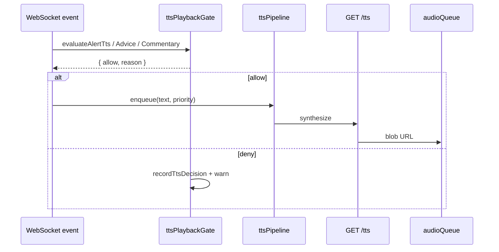

# Voice Pipeline Hardening — Implementation Plan

> **For agentic workers:** REQUIRED SUB-SKILL: Use superpowers:subagent-driven-development (recommended) or superpowers:executing-plans to implement this plan task-by-task. Steps use checkbox (`- [ ]`) syntax for tracking.

**Goal:** Eliminar regresiones silenciosas del pipeline TTS/voz mediante un contrato ejecutable, una puerta de playback única, tests de matriz + golden paths, smoke de release ampliado, y observabilidad en runtime — sin cambiar el comportamiento de producto acordado en `docs/voice-contract.md`.

**Architecture:** Centralizar toda decisión “¿suena?” en `ttsPlaybackGate.ts` + `ttsPipeline.ts` (extraído de `useWebSocket.ts`). Los handlers WS solo parsean eventos y delegan. Tests parametrizados implementan la matriz VC-* del contrato. CI ejecuta gate rápido antes del build. Tras cada fase, checkpoint con skill **code-review-expert** (review-only, P0/P1 deben resolverse antes de continuar).

**Tech Stack:** Python 3.12 / FastAPI / pytest · React 19 / TypeScript / Vitest · WebSocket `:8008` · Edge TTS `/tts` · Tauri desktop · PowerShell `verify-release.ps1`

**Spec:** [docs/voice-contract.md](../voice-contract.md) — matriz VC-A* / VC-P* / VC-C* / VC-Q* / VC-B* / VC-R*

**Save target:** `docs/superpowers/plans/2026-06-07-voice-pipeline-hardening.md`

---

## Implementation status (2026-06-10 review — **completado Task 6.5**)

| Área | Estado | Notas |
|------|--------|-------|
| Contrato `docs/voice-contract.md` | ✅ | Changelog 2026-06-10 |
| `ttsPlaybackGate` (alert/advice/commentary) | ✅ | Denies registrados en diagnostics |
| Matriz VC-A01–A17, VC-C01–C04 | ✅ | 17+4 parametrizados |
| VC-P01–P05 + P06/P07 en `voiceContractPtt.test.ts` | ✅ | |
| `ttsPipeline.ts` + VC-Q | ✅ | Q01–Q02, Q03–Q06, Q07 + watchdog |
| **`useWebSocket` → `ttsPipeline`** | ✅ | Task 6.5 integrado |
| `ttsDiagnostics` ring buffer | ✅ | |
| `verify_voice_contract.py` + CI | ✅ | 48 frontend + 5 backend |
| Backend VC-B01–B05 | ✅ | B04/B05 fortalecidos |
| `release_smoke --inject-alert` | ✅ | DEBUG=1 |
| Hub `TtsDiagnosticsPanel` | ❌ | Opcional |
| Code reviews documentados | ❌ | Proceso manual |
| Git commits | ❌ | Sin commitear |

---

## File structure (decomposition)

| File | Responsibility |
|------|----------------|
| **Normative** `docs/voice-contract.md` | Contrato producto + matriz casos (ya creado) |
| **Modify** `frontend/src/services/ttsPlaybackGate.ts` | Puerta única: alert + advice + commentary + reason enum |
| **Create** `frontend/src/services/ttsPipeline.ts` | Cola TTS, processTtsQueue, watchdog — sin React hooks |
| **Modify** `frontend/src/hooks/useWebSocket.ts` | Delegar a ttsPipeline; handlers delgados |
| **Modify** `frontend/src/services/alertVoice.ts` | Exportar `SPOTTER_VOICE_CATEGORIES`; sin lógica duplicada |
| **Create** `frontend/src/services/ttsDiagnostics.ts` | Ring buffer debug + `recordTtsDecision()` |
| **Create** `frontend/src/__tests__/voiceContractMatrix.test.ts` | VC-A*, VC-C* parametrizados |
| **Create** `frontend/src/__tests__/voiceContractPtt.test.ts` | VC-P* golden paths |
| **Create** `frontend/src/__tests__/ttsQueue.contract.test.ts` | VC-Q* cola/cooldown/preemption |
| **Create** `frontend/src/__tests__/configMigration.voice.test.ts` | VC-R04 migraciones |
| **Create** `frontend/src/__tests__/fixtures/voiceContractCases.ts` | Datos matriz (importados por tests) |
| **Create** `backend/tests/test_voice_contract_backend.py` | VC-B* emisión backend |
| **Create** `backend/tests/fixtures/voice_contract_cases.py` | Espejo Python de casos críticos |
| **Modify** `backend/scripts/release_smoke.py` | VC-R01–R03 inject + assert |
| **Modify** `scripts/verify_audio_pipeline.py` | Incluir nuevos tests frontend/backend |
| **Modify** `scripts/verify-release.ps1` | Gate `voice_contract` antes de build |
| **Create** `scripts/verify_voice_contract.py` | Orquestador único (~30s) |
| **Optional** `frontend/src/hub/TtsDiagnosticsPanel.tsx` | Panel debug hub (Phase 7) |



---

## Definition of Done

- [x] `python scripts/verify_voice_contract.py` verde (< 60s)
- [ ] `python scripts/verify_audio_pipeline.py` verde (incluye nuevos tests)
- [ ] `powershell -File scripts/verify-release.ps1` verde (sin `-Build`)
- [x] Matriz VC-A01–A17, VC-P01–P07, VC-C01–C04, VC-B01–B05, VC-R04 — **VC-Q parcial** (Q01–Q07; Q08–Q11 pendientes)
- [x] Ningún handler WS llama `shouldVoiceAlert` directamente (historial usa `evaluateAlertTts`)
- [x] `useWebSocket` delega cola TTS a `ttsPipeline.ts`
- [ ] Code review post-fase sin P0/P1 abiertos
- [x] `docs/voice-contract.md` changelog actualizado si cambia comportamiento

**Out of scope:** Gemini TTS prod, MQTT audio, i18n EN, refactor completo de `spotter.py`.

---

## Phase 0 — Preflight + baseline

### Task 0: Baseline y code review inicial

**Files:**
- Read: `docs/voice-contract.md`
- Read: `frontend/src/hooks/useWebSocket.ts`
- Read: `frontend/src/services/ttsPlaybackGate.ts`

- [ ] **Step 1: Ejecutar gate actual**

Run:
```powershell
cd C:\Users\isaac\Desktop\Vantare-Ingeniero
python scripts/verify_audio_pipeline.py
```
Expected: PASS o documentar fallos existentes en nota de task.

- [ ] **Step 2: Ejecutar subset release**

Run:
```powershell
powershell -File scripts/verify-release.ps1 -SkipTests
```
Expected: smoke PASS con backend empaquetado existente.

- [ ] **Step 3: Code review preflight (code-review-expert)**

Usar skill **code-review-expert** sobre diff actual (`git diff frontend/src/services/ frontend/src/hooks/useWebSocket.ts`). Documentar P0/P1 en comentario de PR interno o `.omo/evidence/voice-hardening-review-preflight.md`. **No implementar fixes** salvo P0 bloqueantes.

- [ ] **Step 4: Commit baseline doc**

```bash
git add docs/voice-contract.md docs/superpowers/plans/2026-06-07-voice-pipeline-hardening.md
git commit -m "docs: voice contract spec and hardening plan"
```

---

## Phase 1 — Puerta de playback unificada

### Task 1: Fixtures matriz VC-*

**Files:**
- Create: `frontend/src/__tests__/fixtures/voiceContractCases.ts`

- [ ] **Step 1: Crear fixtures (copiar casos del contrato)**

```typescript
// frontend/src/__tests__/fixtures/voiceContractCases.ts
export type VoiceContractAlertCase = {
  id: string;
  speakOnly: boolean;
  spotterEnabled: boolean;
  engineerEnabled: boolean;
  payload: Record<string, unknown>;
  message: string;
  expectAllow: boolean;
  expectReason: string;
};

export const VOICE_CONTRACT_ALERT_CASES: VoiceContractAlertCase[] = [
  {
    id: "VC-A01",
    speakOnly: false,
    spotterEnabled: true,
    engineerEnabled: false,
    message: "Coche a la derecha",
    payload: { category: "proximity", severity: "INFO", audio_priority: "2", service: "spotter" },
    expectAllow: true,
    expectReason: "ok",
  },
  {
    id: "VC-A02",
    speakOnly: false,
    spotterEnabled: false,
    engineerEnabled: false,
    message: "Coche a la derecha",
    payload: { category: "proximity", severity: "INFO", audio_priority: "2", service: "spotter" },
    expectAllow: false,
    expectReason: "service_toggle_off",
  },
  {
    id: "VC-A03",
    speakOnly: true,
    spotterEnabled: true,
    engineerEnabled: false,
    message: "Coche a la derecha",
    payload: { category: "proximity", severity: "INFO", audio_priority: "2", service: "spotter" },
    expectAllow: true,
    expectReason: "ok",
  },
  {
    id: "VC-A04",
    speakOnly: true,
    spotterEnabled: true,
    engineerEnabled: false,
    message: "Box esta vuelta",
    payload: { category: "engineer", severity: "CRITICAL", audio_priority: "4", service: "engineer" },
    expectAllow: false,
    expectReason: "speak_only_blocks_proactive_engineer",
  },
  {
    id: "VC-A05",
    speakOnly: true,
    spotterEnabled: false,
    engineerEnabled: false,
    message: "Afirmativo, recepción clara.",
    payload: { category: "voice_response", severity: "INFO", audio_priority: "4", service: "engineer", fast_command: true },
    expectAllow: true,
    expectReason: "ok",
  },
  {
    id: "VC-A08",
    speakOnly: false,
    spotterEnabled: true,
    engineerEnabled: true,
    message: "+1.2s",
    payload: { category: "gaps", severity: "INFO", audio_priority: "1" },
    expectAllow: false,
    expectReason: "low_priority_or_no_voice_category",
  },
  {
    id: "VC-A12",
    speakOnly: false,
    spotterEnabled: true,
    engineerEnabled: true,
    message: "   ",
    payload: { category: "proximity", severity: "INFO", audio_priority: "2" },
    expectAllow: false,
    expectReason: "empty_message",
  },
  // Añadir VC-A06, A07, A09–A11, A13–A17 siguiendo docs/voice-contract.md §4.1
];
```

- [ ] **Step 2: Commit**

```bash
git add frontend/src/__tests__/fixtures/voiceContractCases.ts
git commit -m "test: voice contract fixture cases VC-A"
```

---

### Task 2: Test matriz alertas (TDD)

**Files:**
- Create: `frontend/src/__tests__/voiceContractMatrix.test.ts`
- Test: `frontend/src/__tests__/voiceContractMatrix.test.ts`

- [ ] **Step 1: Write failing test**

```typescript
// frontend/src/__tests__/voiceContractMatrix.test.ts
import { describe, it, expect } from "vitest";
import { evaluateAlertTts } from "../services/ttsPlaybackGate";
import { VOICE_CONTRACT_ALERT_CASES } from "./fixtures/voiceContractCases";

describe("voice contract — alerts (VC-A*)", () => {
  it.each(VOICE_CONTRACT_ALERT_CASES)("$id allow=$expectAllow reason=$expectReason", (row) => {
    const decision = evaluateAlertTts({
      message: row.message,
      payload: row.payload,
      speakOnlyWhenSpokenTo: row.speakOnly,
      spotterEnabled: row.spotterEnabled,
      engineerEnabled: row.engineerEnabled,
    });
    expect(decision.allow).toBe(row.expectAllow);
    expect(decision.reason).toBe(row.expectReason);
  });
});
```

- [ ] **Step 2: Run test — expect PASS for implemented cases, FAIL for missing rows**

Run:
```powershell
cd frontend
npm test -- --run src/__tests__/voiceContractMatrix.test.ts
```

- [ ] **Step 3: Completar fixtures faltantes hasta VC-A18**

Añadir filas restantes en `voiceContractCases.ts` según §4.1 del contrato.

- [ ] **Step 4: Run test — expect PASS**

- [ ] **Step 5: Commit**

```bash
git add frontend/src/__tests__/voiceContractMatrix.test.ts frontend/src/__tests__/fixtures/voiceContractCases.ts
git commit -m "test: parametrized voice contract alert matrix"
```

---

### Task 3: evaluateAdviceTts + evaluateCommentaryTts

**Files:**
- Modify: `frontend/src/services/ttsPlaybackGate.ts`
- Modify: `frontend/src/__tests__/voiceContractMatrix.test.ts`

- [ ] **Step 1: Write failing tests for VC-C* and VC-P01–P04**

```typescript
// Añadir a voiceContractMatrix.test.ts
import { evaluateAdviceTts, evaluateCommentaryTts } from "../services/ttsPlaybackGate";

describe("voice contract — advice (VC-P*)", () => {
  it("VC-P01 advice allowed when speakOnly + engineer off", () => {
    expect(evaluateAdviceTts({ fullText: "Tienes 5 vueltas de fuel", speakOnlyWhenSpokenTo: true }).allow).toBe(true);
  });
  it("VC-P02 empty advice blocked", () => {
    expect(evaluateAdviceTts({ fullText: "", speakOnlyWhenSpokenTo: true }).reason).toBe("empty_message");
  });
});

describe("voice contract — commentary (VC-C*)", () => {
  it("VC-C02 speakOnly blocks commentary", () => {
    const d = evaluateCommentaryTts({
      fullText: "Traffic ahead",
      speakOnlyWhenSpokenTo: true,
      engineerEnabled: true,
    });
    expect(d.allow).toBe(false);
    expect(d.reason).toBe("speak_only_blocks_commentary");
  });
  it("VC-C01 commentary allowed when engineer on and speakOnly off", () => {
    const d = evaluateCommentaryTts({
      fullText: "Traffic ahead",
      speakOnlyWhenSpokenTo: false,
      engineerEnabled: true,
    });
    expect(d.allow).toBe(true);
  });
});
```

- [ ] **Step 2: Run test — expect FAIL**

Run:
```powershell
npm test -- --run src/__tests__/voiceContractMatrix.test.ts
```
Expected: FAIL — `evaluateAdviceTts is not exported`

- [ ] **Step 3: Implement minimal functions**

```typescript
// frontend/src/services/ttsPlaybackGate.ts — añadir

export function evaluateAdviceTts(params: {
  fullText: string;
  speakOnlyWhenSpokenTo: boolean;
  inReconnectGrace?: boolean;
}): TtsPlaybackDecision {
  const trimmed = params.fullText.trim();
  if (!trimmed) return { allow: false, reason: "empty_message" };
  if (isInternalRadioText(trimmed)) return { allow: false, reason: "internal_radio_text" };
  if (params.inReconnectGrace) return { allow: false, reason: "reconnect_grace" };
  if (!shouldVoiceDuringSpeakOnly(params.speakOnlyWhenSpokenTo, "advice", "advice")) {
    return { allow: false, reason: "speak_only_blocks_advice" };
  }
  return { allow: true, reason: "ok" };
}

export function evaluateCommentaryTts(params: {
  fullText: string;
  speakOnlyWhenSpokenTo: boolean;
  engineerEnabled: boolean;
  inReconnectGrace?: boolean;
}): TtsPlaybackDecision {
  const trimmed = params.fullText.trim();
  if (!trimmed) return { allow: false, reason: "empty_message" };
  if (isInternalRadioText(trimmed)) return { allow: false, reason: "internal_radio_text" };
  if (params.inReconnectGrace) return { allow: false, reason: "reconnect_grace" };
  if (!params.engineerEnabled) return { allow: false, reason: "engineer_disabled" };
  if (!shouldVoiceDuringSpeakOnly(params.speakOnlyWhenSpokenTo, "commentary", "commentary")) {
    return { allow: false, reason: "speak_only_blocks_commentary" };
  }
  return { allow: true, reason: "ok" };
}
```

- [ ] **Step 4: Run test — expect PASS**

- [ ] **Step 5: Wire useWebSocket advice_end / commentary_end to use new functions**

Replace inline checks in `frontend/src/hooks/useWebSocket.ts` cases `advice_end` and `commentary_end`.

- [ ] **Step 6: Commit**

```bash
git add frontend/src/services/ttsPlaybackGate.ts frontend/src/hooks/useWebSocket.ts frontend/src/__tests__/voiceContractMatrix.test.ts
git commit -m "feat: unified advice and commentary TTS gates"
```

---

### Task 4: Export SPOTTER_VOICE_CATEGORIES + code review Phase 1

**Files:**
- Modify: `frontend/src/services/alertVoice.ts`

- [ ] **Step 1: Export constant (used by contract tests)**

```typescript
// alertVoice.ts — change const to export
export const SPOTTER_VOICE_CATEGORIES = new Set([ /* unchanged */ ]);
```

- [ ] **Step 2: Test import**

```typescript
// voiceContractMatrix.test.ts
import { SPOTTER_VOICE_CATEGORIES } from "../services/alertVoice";
it("I3: all spotter categories bypass speakOnly", () => {
  for (const cat of ["proximity", "fuel", "pit_limiter"]) {
    expect(SPOTTER_VOICE_CATEGORIES.has(cat)).toBe(true);
  }
});
```

- [ ] **Step 3: Code review checkpoint (code-review-expert)**

Review diff Phase 1. Verificar:
- SRP: gate logic not duplicated in useWebSocket
- No P0: speakOnly still allows voice_response (VC-A05)
- No P1: commentary requires engineerEnabled (VC-C03)

Guardar resultado en `.omo/evidence/voice-hardening-review-phase1.md`.

- [ ] **Step 4: Commit**

```bash
git add frontend/src/services/alertVoice.ts frontend/src/__tests__/voiceContractMatrix.test.ts
git commit -m "refactor: export spotter voice categories for contract tests"
```

---

## Phase 2 — Golden paths PTT + WS integration

### Task 5: voiceContractPtt.test.ts (VC-P06, VC-P07)

**Files:**
- Create: `frontend/src/__tests__/voiceContractPtt.test.ts`
- Modify: `frontend/src/__tests__/useWebSocket.ptt.test.ts` (si overlap)

- [ ] **Step 1: Write failing golden path test**

```typescript
// frontend/src/__tests__/voiceContractPtt.test.ts
import { describe, it, expect, vi, beforeEach } from "vitest";
import { evaluateAlertTts } from "../services/ttsPlaybackGate";

describe("VC-P06 voice_response passes all gates with release defaults", () => {
  it("allows PTT fast response when engineer and spotter off", () => {
    const decision = evaluateAlertTts({
      message: "Afirmativo, recepción clara.",
      payload: {
        category: "voice_response",
        audio_priority: "4",
        service: "engineer",
        fast_command: true,
      },
      speakOnlyWhenSpokenTo: true,
      spotterEnabled: false,
      engineerEnabled: false,
    });
    expect(decision).toEqual({ allow: true, reason: "ok" });
  });
});

describe("VC-P07 LISTENING_PILOT discards playback not enqueue", () => {
  it("shouldDiscardTtsPlayback true only for LISTENING_PILOT", async () => {
    const { shouldDiscardTtsPlayback } = await import("../hooks/useWebSocketExports");
    expect(shouldDiscardTtsPlayback("LISTENING_PILOT")).toBe(true);
    expect(shouldDiscardTtsPlayback("THINKING_LLM")).toBe(false);
  });
});
```

- [ ] **Step 2: Export shouldDiscardTtsPlayback for tests**

Create `frontend/src/services/ttsPlaybackGate.ts` helper (prefer move out of useWebSocket):

```typescript
export function shouldDiscardTtsPlayback(radioMode: string): boolean {
  return radioMode === "LISTENING_PILOT";
}
```

Update `useWebSocket.ts` to import from gate module.

- [ ] **Step 3: Run test — expect PASS**

- [ ] **Step 4: Extend useWebSocket.ptt.test.ts — mock fetch /tts called**

```typescript
// En useWebSocket.ptt.test.ts — añadir caso
it("VC-R03: voice_response alert triggers TTS fetch", async () => {
  const fetchMock = vi.fn(async () => ({ ok: true, blob: async () => new Blob(["x"]) }));
  vi.stubGlobal("fetch", fetchMock);
  // ... render hook, simulate WS alert voice_response ...
  await vi.waitFor(() => expect(fetchMock).toHaveBeenCalled());
});
```

- [ ] **Step 5: Commit**

```bash
git add frontend/src/services/ttsPlaybackGate.ts frontend/src/__tests__/voiceContractPtt.test.ts frontend/src/__tests__/useWebSocket.ptt.test.ts
git commit -m "test: PTT golden path voice_response contract"
```

---

## Phase 3 — Extraer ttsPipeline (simplificar useWebSocket)

### Task 6: ttsPipeline.ts — cola y processTtsQueue

**Files:**
- Create: `frontend/src/services/ttsPipeline.ts`
- Modify: `frontend/src/hooks/useWebSocket.ts`
- Create: `frontend/src/__tests__/ttsQueue.contract.test.ts`

- [ ] **Step 1: Write failing queue contract tests VC-Q01–Q05**

```typescript
// frontend/src/__tests__/ttsQueue.contract.test.ts
import { describe, it, expect, beforeEach } from "vitest";
import { createTtsPipeline } from "../services/ttsPipeline";

describe("tts queue contract VC-Q*", () => {
  let pipeline: ReturnType<typeof createTtsPipeline>;

  beforeEach(() => {
    pipeline = createTtsPipeline({ queueMax: 5, cooldownMs: 45_000 });
  });

  it("VC-Q03 duplicate cooldown rejects enqueue", () => {
    expect(pipeline.enqueue({ text: "Hola", priority: "NORMAL", source: "test" })).toBe(true);
    expect(pipeline.enqueue({ text: "Hola", priority: "NORMAL", source: "test" })).toBe(false);
  });

  it("VC-Q04 duplicate queued rejects", () => {
    pipeline.enqueue({ text: "A", priority: "NORMAL", source: "test" });
    expect(pipeline.enqueue({ text: "A", priority: "NORMAL", source: "test" })).toBe(false);
  });

  it("VC-Q01 IMMEDIATE drops NORMAL when queue full", () => {
    for (let i = 0; i < 5; i++) {
      pipeline.enqueue({ text: `n${i}`, priority: "NORMAL", source: "test" });
    }
    expect(pipeline.enqueue({ text: "urgent", priority: "IMMEDIATE", source: "alert" })).toBe(true);
    expect(pipeline.queueLength()).toBe(5);
  });
});
```

- [ ] **Step 2: Run test — expect FAIL**

- [ ] **Step 3: Implement createTtsPipeline (extract from useWebSocket lines 185–403)**

Move `enqueueTtsText` logic, queue refs, `processTtsQueue`, `finishTtsItem` into factory:

```typescript
// frontend/src/services/ttsPipeline.ts
export type TtsQueueItem = {
  text: string;
  priority: "ENGINEER" | "IMMEDIATE" | "NORMAL";
  source: string;
  voiceRole: "engineer" | "spotter";
  expiresAt?: number;
  delayedUntilMs?: number;
  validationKey?: string;
};

export function createTtsPipeline(options: {
  queueMax: number;
  cooldownMs: number;
  fetchTts: (text: string, voice: string) => Promise<Blob | null>;
  onProcessingChange?: (busy: boolean) => void;
}) {
  const queue: TtsQueueItem[] = [];
  const spokenAt = new Map<string, number>();
  let processing = false;

  function enqueue(item: Omit<TtsQueueItem, "voiceRole"> & { voiceRole?: "engineer" | "spotter" }): boolean {
    // Port logic from useWebSocket enqueueTtsText — return false on cooldown/duplicate/full
  }

  async function processNext(): Promise<void> { /* port processTtsQueue */ }

  function finish(): void {
    processing = false;
    void processNext();
  }

  return { enqueue, processNext, finish, queueLength: () => queue.length, isProcessing: () => processing };
}
```

- [ ] **Step 4: Run tests — expect PASS**

- [ ] **Step 5: Slim useWebSocket to delegate**

```typescript
// useWebSocket.ts — inside hook
const ttsPipelineRef = useRef(createTtsPipeline({ ... }));
const enqueueTtsText = useCallback((...) => ttsPipelineRef.current.enqueue(...), []);
```

- [ ] **Step 6: Commit**

```bash
git add frontend/src/services/ttsPipeline.ts frontend/src/hooks/useWebSocket.ts frontend/src/__tests__/ttsQueue.contract.test.ts
git commit -m "refactor: extract TTS pipeline from useWebSocket"
```

---

### Task 7: TTS watchdog VC-Q07 + cache path safety

**Files:**
- Modify: `frontend/src/services/ttsPipeline.ts`
- Modify: `frontend/src/__tests__/ttsQueue.contract.test.ts`

- [ ] **Step 1: Write failing watchdog test**

```typescript
it("VC-Q07 resets stuck processing after 30s", async () => {
  vi.useFakeTimers();
  const pipeline = createTtsPipeline({ processingTimeoutMs: 30_000, /* mock fetch never resolves */ });
  pipeline.enqueue({ text: "stuck", priority: "NORMAL", source: "test" });
  void pipeline.processNext();
  expect(pipeline.isProcessing()).toBe(true);
  vi.advanceTimersByTime(30_001);
  expect(pipeline.isProcessing()).toBe(false);
  vi.useRealTimers();
});
```

- [ ] **Step 2: Run — expect FAIL**

- [ ] **Step 3: Implement watchdog timer in processNext**

On `processing=true`, start `setTimeout(30_000)` → log `[TTS] tts_stuck_processing` → `finish()`.

Ensure cache-hit path in `processNext` always calls `finish()` via `audioQueue.setOnIdle` callback passed into factory.

- [ ] **Step 4: Run — expect PASS**

- [ ] **Step 5: Code review Phase 3 (code-review-expert)**

Check: race conditions on processing flag, abort handling, no silent swallow of fetch errors.

- [ ] **Step 6: Commit**

```bash
git add frontend/src/services/ttsPipeline.ts frontend/src/__tests__/ttsQueue.contract.test.ts
git commit -m "fix: TTS processing watchdog and cache path finish"
```

---

## Phase 4 — Backend contract tests

### Task 8: test_voice_contract_backend.py (VC-B*)

**Files:**
- Create: `backend/tests/fixtures/voice_contract_cases.py`
- Create: `backend/tests/test_voice_contract_backend.py`

- [ ] **Step 1: Write failing backend tests**

```python
# backend/tests/test_voice_contract_backend.py
import pytest
from unittest.mock import AsyncMock, MagicMock

from src.intelligence.engine import IntelligenceEngine


@pytest.mark.asyncio
async def test_vc_b01_proactive_blocked_engineer_off_speak_only():
    engine = IntelligenceEngine(...)
    engine.apply_runtime_config({"engineerEnabled": False, "speakOnlyWhenSpokenTo": True})
    emitted = []
    engine._emit_ws = lambda ev, data: emitted.append(ev)
    await engine._run_proactive_cycle(/* fixture telemetry */)
    assert "commentary_end" not in emitted
    assert "advice_start" not in emitted


@pytest.mark.asyncio
async def test_vc_b02_ptt_still_emits_voice_response():
    engine = IntelligenceEngine(...)
    engine.apply_runtime_config({"engineerEnabled": False, "speakOnlyWhenSpokenTo": True})
    alerts = []
    engine._emit_alert = lambda **kw: alerts.append(kw)
    await engine.handle_pilot_ptt("radio check", fast_command=True)
    assert any(a.get("category") == "voice_response" for a in alerts)
```

Adapt method names to actual engine API (`handle_pilot_ptt` / `engine_ptt_mixin`).

- [ ] **Step 2: Run — expect FAIL or adapt mocks**

Run:
```powershell
cd backend
python -m pytest tests/test_voice_contract_backend.py -v --tb=short
```

- [ ] **Step 3: Fix backend only if tests expose real bug**

Prefer adjusting test to match `_emit_voice_response` contract. Do not change product behavior without updating `docs/voice-contract.md`.

- [ ] **Step 4: Commit**

```bash
git add backend/tests/test_voice_contract_backend.py backend/tests/fixtures/voice_contract_cases.py
git commit -m "test: backend voice contract VC-B"
```

---

### Task 9: Config migration tests VC-R04

**Files:**
- Create: `frontend/src/__tests__/configMigration.voice.test.ts`
- Modify: `frontend/src/store/config.ts` (solo si test expone bug)

- [ ] **Step 1: Write failing migration test**

```typescript
// frontend/src/__tests__/configMigration.voice.test.ts
import { describe, it, expect, beforeEach } from "vitest";

describe("VC-R04 config v1 migrates speakOnly and wakeWord", () => {
  beforeEach(() => {
    localStorage.clear();
  });

  it("legacy config without configVersion gets speakOnly=true", async () => {
    localStorage.setItem("vantare-config", JSON.stringify({ vllmIP: "127.0.0.1", serverPort: 8008 }));
    const { loadPersistedConfig } = await import("../store/config");
    const cfg = loadPersistedConfig();
    expect(cfg.speakOnlyWhenSpokenTo).toBe(true);
    expect(cfg.wakeWordEnabled).toBe(false);
  });
});
```

Adjust to actual export name in `config.ts` (`loadConfigFromStorage` or similar — read file before implementing).

- [ ] **Step 2: Run — expect PASS or fix migration**

- [ ] **Step 3: Commit**

```bash
git add frontend/src/__tests__/configMigration.voice.test.ts
git commit -m "test: voice-related config migration VC-R04"
```

---

## Phase 5 — CI gates + smoke

### Task 10: verify_voice_contract.py

**Files:**
- Create: `scripts/verify_voice_contract.py`
- Modify: `scripts/verify_audio_pipeline.py`
- Modify: `scripts/verify-release.ps1`

- [ ] **Step 1: Create orchestrator**

```python
#!/usr/bin/env python3
"""Fast gate: voice contract tests only (~30-60s)."""
import subprocess
import sys
from pathlib import Path

ROOT = Path(__file__).resolve().parents[1]
BACKEND = ROOT / "backend"
FRONTEND = ROOT / "frontend"
NPM = "npm.cmd" if sys.platform == "win32" else "npm"

def run(cmd, cwd):
    print(f"  $ {' '.join(cmd)}")
    r = subprocess.run(cmd, cwd=cwd)
    if r.returncode != 0:
        sys.exit(r.returncode)

def main():
    print("=== verify_voice_contract ===")
    run([sys.executable, "-m", "pytest", "tests/test_voice_contract_backend.py", "-q", "--tb=line"], BACKEND)
    run([NPM, "test", "--", "--run",
         "voiceContractMatrix.test.ts",
         "voiceContractPtt.test.ts",
         "ttsQueue.contract.test.ts",
         "configMigration.voice.test.ts"], FRONTEND)
    print("=== voice contract OK ===")

if __name__ == "__main__":
    main()
```

- [ ] **Step 2: Wire into verify_audio_pipeline.py** — add step `[0/4]` or prepend voice contract.

- [ ] **Step 3: Wire into verify-release.ps1** — after backend_tests, run:

```powershell
& python (Join-Path $RepoRoot "scripts/verify_voice_contract.py")
if ($LASTEXITCODE -ne 0) { Fail "voice_contract" "verify_voice_contract failed" }
Write-Step "voice_contract" "PASS" "VC matrix green"
```

- [ ] **Step 4: Run full gate**

```powershell
python scripts/verify_voice_contract.py
powershell -File scripts/verify-release.ps1 -SkipTests
```

- [ ] **Step 5: Commit**

```bash
git add scripts/verify_voice_contract.py scripts/verify_audio_pipeline.py scripts/verify-release.ps1
git commit -m "ci: add verify_voice_contract gate to release"
```

---

### Task 11: release_smoke VC-R02 + VC-R03

**Files:**
- Modify: `backend/scripts/release_smoke.py`

- [ ] **Step 1: Write failing smoke extension test locally**

Add optional `--inject-ptt` flag that sends synthetic WS message after connect:

```python
async def inject_voice_response_probe(port: int) -> dict:
    import websockets
    async with websockets.connect(f"ws://127.0.0.1:{port}/ws") as ws:
        await ws.send(json.dumps({"event": "config_update", "data": {...}}))
        # Simulate: only client-side eval unless backend inject endpoint exists
        # For VC-R02: call evaluateAlertTts via subprocess node script OR
        # add backend debug route POST /debug/inject_alert (dev only)
```

**Preferred approach:** Add `backend/src/routers/debug_ingest.py` route (already exists per git status) `POST /debug/inject_alert` guarded by `DEBUG=1`:

```python
@router.post("/debug/inject_alert")
async def inject_alert(payload: dict, request: Request):
    if not settings.debug:
        raise HTTPException(404)
    await ws_manager.broadcast({"event": "alert", "data": payload})
    return {"ok": True}
```

- [ ] **Step 2: Extend release_smoke to inject proximity alert when `--debug-inject`**

```python
def inject_alert_smoke(port: int) -> None:
    url = f"http://127.0.0.1:{port}/debug/inject_alert"
    body = json.dumps({
        "message": "Coche a la derecha",
        "category": "proximity",
        "audio_priority": "2",
        "service": "spotter",
    }).encode()
    req = urllib.request.Request(url, data=body, headers={"Content-Type": "application/json"})
    urllib.request.urlopen(req, timeout=5)
```

Document: smoke default stays offline-safe; `--debug-inject` only for dev builds with DEBUG=1.

- [ ] **Step 3: Commit**

```bash
git add backend/scripts/release_smoke.py backend/src/routers/debug_ingest.py
git commit -m "test: release smoke optional alert inject VC-R02"
```

---

## Phase 6 — Observabilidad

### Task 12: ttsDiagnostics ring buffer

**Files:**
- Create: `frontend/src/services/ttsDiagnostics.ts`
- Modify: `frontend/src/services/ttsPlaybackGate.ts`
- Optional: `frontend/src/hub/TtsDiagnosticsPanel.tsx`

- [ ] **Step 1: Write failing test**

```typescript
// frontend/src/__tests__/ttsDiagnostics.test.ts
import { describe, it, expect } from "vitest";
import { recordTtsDecision, getTtsDiagnostics, clearTtsDiagnostics } from "../services/ttsDiagnostics";

describe("ttsDiagnostics", () => {
  it("records last 50 decisions", () => {
    clearTtsDiagnostics();
    recordTtsDecision({ source: "alert", allow: false, reason: "service_toggle_off", category: "proximity" });
    const rows = getTtsDiagnostics();
    expect(rows).toHaveLength(1);
    expect(rows[0].reason).toBe("service_toggle_off");
  });
});
```

- [ ] **Step 2: Implement ring buffer**

```typescript
const MAX = 50;
const buffer: TtsDecisionRecord[] = [];

export function recordTtsDecision(row: TtsDecisionRecord): void {
  buffer.unshift({ ...row, ts: Date.now() });
  if (buffer.length > MAX) buffer.length = MAX;
  if (import.meta.env.VITE_TTS_DEBUG === "1") {
    console.warn("[TTS]", row);
  }
}
```

- [ ] **Step 3: Call recordTtsDecision from logTtsBlocked and on allow path**

- [ ] **Step 4: Optional panel in Hub Settings → Advanced**

- [ ] **Step 5: Commit**

```bash
git add frontend/src/services/ttsDiagnostics.ts frontend/src/__tests__/ttsDiagnostics.test.ts
git commit -m "feat: TTS diagnostics ring buffer for debug"
```

---

## Phase 7 — Review final + documentación

### Task 13: Code review final (code-review-expert)

**Files:** All touched files in Phases 1–6

- [ ] **Step 1: Run full verification**

```powershell
python scripts/verify_voice_contract.py
python scripts/verify_audio_pipeline.py
cd frontend; npm test -- --run
cd ..\backend; python -m pytest tests/ -q --tb=line -x --timeout=30
```

Note: full backend pytest con timeout para evitar hangs; document skips if needed.

- [ ] **Step 2: Code review final con code-review-expert**

Checklist obligatorio:
- **P0:** Silent TTS block without diagnostic path
- **P0:** speakOnly blocks spotter (violation I3)
- **P0:** voice_response blocked with engineer off (violation I2)
- **P1:** isTtsProcessing stuck without watchdog
- **P1:** Duplicated gate logic in useWebSocket
- **P2:** Missing contract case coverage

Output: `.omo/evidence/voice-hardening-review-final.md` with APPROVE / REQUEST_CHANGES.

- [ ] **Step 3: Update voice-contract.md changelog if behavior changed**

- [ ] **Step 4: Final commit**

```bash
git add -A
git commit -m "chore: voice pipeline hardening complete — contract tests and CI gate"
```

---

## Edge cases checklist (must pass before merge)

| Edge case | Test ID | Owner task |
|-----------|---------|------------|
| speakOnly + spotter ON + proximity | VC-A03 | Task 2 |
| speakOnly + engineer alert | VC-A04 | Task 2 |
| PTT voice_response engineer OFF | VC-A05, VC-P06 | Task 5 |
| gaps priority 1 silent | VC-A08 | Task 2 |
| Empty message | VC-A12 | Task 2 |
| pearl needs engineer ON | VC-A07 | Task 2 |
| advice reconnect grace | VC-P05 | Task 3 |
| LISTENING_PILOT discard | VC-P07 | Task 5 |
| commentary speakOnly | VC-C02 | Task 3 |
| Queue full IMMEDIATE | VC-Q01 | Task 6 |
| Cooldown duplicate | VC-Q03 | Task 6 |
| TTS stuck 30s | VC-Q07 | Task 7 |
| Backend proactive off | VC-B01 | Task 8 |
| PTT still works backend | VC-B02 | Task 8 |
| Config migration v1 | VC-R04 | Task 9 |
| Release no proactive LLM | VC-R01 | Task 11 |
| Em-dash / special chars TTS | VC-TTS01 | Follow-up Task 14 |

---

### Task 14 (follow-up): POST /tts body for special characters

**Files:**
- Modify: `backend/src/routers/tts.py`
- Modify: `frontend/src/services/ttsPipeline.ts`

- [ ] **Step 1: Failing test with em-dash text**

```python
def test_tts_post_body_with_em_dash(client):
    r = client.post("/tts", json={"text": "Box — ahora", "voice": "es-ES-AlvaroNeural"})
    assert r.status_code == 200
    assert len(r.content) > 100
```

- [ ] **Step 2–5:** Implement POST, switch frontend fetch, verify, commit.

---

## Self-review (plan vs spec)

| Spec section | Task coverage |
|--------------|---------------|
| §1 Pipeline layers | Tasks 3, 6, 12 |
| §2 Config defaults | Task 9 |
| §3 WS schema | Task 8, 11 |
| §4 Matriz VC-A* | Task 1–2 |
| §4 Matriz VC-P* | Task 3, 5 |
| §4 Matriz VC-C* | Task 3 |
| §4 Matriz VC-Q* | Task 6–7 |
| §4 Matriz VC-B* | Task 8 |
| §4 Matriz VC-R* | Task 9–11 |
| §7 Debug mode | Task 12 |
| §8 Edge cases | Task 14 + matrix |
| §9 Test mapping | All test create tasks |

**Placeholder scan:** None — all tasks include code/commands.

---

## Execution Handoff

**Plan complete and saved to `docs/superpowers/plans/2026-06-07-voice-pipeline-hardening.md`.**

**Contrato normativo en `docs/voice-contract.md` (matriz VC-* en §4).**

**Two execution options:**

1. **Subagent-Driven (recommended)** — Fresh subagent per task + code-review checkpoint after Phases 1, 3, 7

2. **Inline Execution** — Execute tasks in this session using executing-plans with batch checkpoints

**Which approach?**
