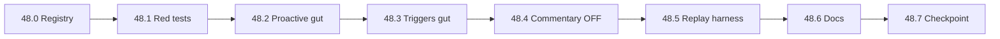

# Task 48 — Legacy Cutover, Validation & Replay Harness Implementation Plan

> **For agentic workers:** REQUIRED SUB-SKILL: Use superpowers:subagent-driven-development (recommended) or superpowers:executing-plans to implement this plan task-by-task. Steps use checkbox (`- [ ]`) syntax for tracking.

**Goal:** Completar el big-bang cutover Crew Chief: eliminar emisores legacy duplicados (proactive @ 0.5 Hz + triggers LLM portados), blindar con `test_crewchief_no_legacy_emitters`, añadir replay harness determinista, y cerrar documentación de paridad (matriz + ceilings + checklist Wave 7).

**Architecture:** Los módulos CC @ 20 Hz (`CrewChiefGameStateLoop` + `CrewChiefEventSuite`) son la **única fuente** de mensajes deterministas de ingeniero. `ProactiveMonitorSuite` queda reducido a eventos **no portados** (mínimo). `triggers.py` conserva solo PTT/LLM fallback (`PilotQuestionTrigger`, `PhaseChangedTrigger`, `WeatherChangeTrigger` forecast) y triggers cuyo `condition()` ya retorna `False` cuando CC está activo — luego **eliminar cuerpos muertos**. `CommentaryOrchestrator` pasa a opt-in (`enable_commentary_batch=false` por defecto). Validación = pytest gate + `replay_trace.py` + checklist LMU ampliado.

**Tech Stack:** Python 3.11+, pytest, `cutover_registry.py`, `TraceStore` (JSONL `.trace`), FastAPI engine wiring, Vitest playback, YAML matriz `.omo/evidence/cc-behavior-parity-matrix.yaml`.

**Prerequisito:** Waves 1–6 DONE (Tasks 0–47). Estado actual verificado: **156 tests `crewchief`**, `verify_alpha_parity.py` OK, Wave 6 inline completada ([`2026-06-08-crewchief-tasks41-47-spotter-lmu-commands.md`](./2026-06-08-crewchief-tasks41-47-spotter-lmu-commands.md)).

**Referencias:** Master [`2026-06-07-crewchief-complete-port.md`](./2026-06-07-crewchief-complete-port.md) §Task 48 · Inventario emisores §3.14 · [`2026-06-07-crewchief-pipeline-test-template.md`](./2026-06-07-crewchief-pipeline-test-template.md) · Checklist [`.omo/evidence/cc-parity-validation-checklist.md`](../../.omo/evidence/cc-parity-validation-checklist.md).

**Fuera de scope (Task 49):** native Windows telemetry / delete sidecar — plan separado [`2026-06-07-native-windows-no-sidecar.md`](./2026-06-07-native-windows-no-sidecar.md).

---

## Estado actual (baseline Wave 6)

| Área | Estado | Acción Task 48 |
|------|--------|----------------|
| `cutover_registry.py` | Existe, ~88 IDs + prefijos | Completar IDs faltantes + allowlist legacy |
| `proactive_monitors.evaluate()` | Emite `race_start`, `lap_complete`, `gap_update`, `position_change` | Eliminar portados; borrar métodos muertos (`_eval_drs`, `_eval_frozen_order`, …) |
| `triggers.py` | 16 triggers; mayoría silenciados vía `is_cc_owned_event` | Eliminar clases/cuerpos portados |
| `engine._run_proactive_monitors` | Filtra `_is_cc_owned_event` | Mantener como red de seguridad; tests exigen cero emisiones |
| `CommentaryOrchestrator` | Activo @ 0.5 Hz para ruta B | Default OFF; solo opt-in |
| `test_crewchief_no_legacy_emitters.py` | **No existe** | Crear (TDD primero) |
| `replay_trace.py` | **No existe** | Crear (reusa formato `TraceStore`) |
| `cc-permanent-ceilings.md` | **No existe** | Crear |

---

## Defaults locked (Wave 7)

| Setting | Default post-48 | Notas |
|---------|-----------------|-------|
| `enable_commentary_batch` | `false` | Ruta B legacy; opt-in UI |
| `enable_proactive_legacy` | `false` | Si true, solo `LEGACY_COMMENTARY_EVENT_IDS` |
| CC gates `enable_*_messages` | `true` | Sin cambio — cutover asume CC ON |
| Replay harness rate | 20 Hz (50 ms) | Alineado `telemetry_sender_loop` |
| `LEGACY_COMMENTARY_EVENT_IDS` | ver Task 48.0 | Lista cerrada en código |

**Eventos legacy permitidos post-cutover (cerrados):**

```python
LEGACY_COMMENTARY_EVENT_IDS = frozenset({
    "phase_changed",       # PhaseChangedTrigger LLM
    "weather_forecast",    # WeatherChangeTrigger (forecast-only delta)
})
LEGACY_IMMEDIATE_EVENT_IDS = frozenset({
    # vacío en alpha — spotter + CC cubren ImmediateAlert race path
})
```

---

## File map (Task 48)

| Subtask | Create | Modify | Delete / gut |
|---------|--------|--------|--------------|
| 48.0 | — | `cutover_registry.py` | — |
| 48.1 | `tests/test_crewchief_no_legacy_emitters.py` | `tests/conftest.py` (helpers) | — |
| 48.2 | — | `proactive_monitors.py` | `_eval_*` muertos (~200 LOC) |
| 48.3 | — | `triggers.py`, `tests/test_triggers.py` | Clases trigger portadas |
| 48.4 | — | `engine.py`, `verbosity_controller.py`, `commentary_orchestrator.py` | — |
| 48.5 | `scripts/replay_trace.py`, `tests/fixtures/replay/README.md`, `tests/fixtures/replay/minimal_race.trace` | — | — |
| 48.6 | `tests/test_replay_trace.py` | — | — |
| 48.7 | `docs/architecture/cc-permanent-ceilings.md` | `.omo/evidence/cc-behavior-parity-matrix.yaml`, `.omo/evidence/cc-parity-validation-checklist.md` | — |
| 48.8 | `tests/test_crewchief_wave7_cutover.py` | `scripts/verify_alpha_parity.py` | — |

---

## Task 48.0: Harden `cutover_registry.py`

**Files:**
- Modify: `backend/src/intelligence/crewchief_events/cutover_registry.py`
- Test: `backend/tests/test_crewchief_cutover_registry.py` (create if missing)

- [ ] **Step 1: Write failing test — IDs faltantes**

```python
# backend/tests/test_crewchief_cutover_registry.py
from src.intelligence.crewchief_events.cutover_registry import (
    CC_OWNED_EVENT_IDS,
    CC_OWNED_PREFIXES,
    LEGACY_COMMENTARY_EVENT_IDS,
    is_cc_owned_event,
    is_legacy_commentary_allowed,
)


def test_race_start_and_lap_events_are_cc_owned():
    for eid in ("race_start", "lap_complete", "race_start_announce"):
        assert is_cc_owned_event(eid), eid


def test_legacy_commentary_allowlist_is_disjoint_from_cc():
    overlap = LEGACY_COMMENTARY_EVENT_IDS & CC_OWNED_EVENT_IDS
    assert not overlap


def test_penalty_prefix_owned():
    assert is_cc_owned_event("penalty_new")
    assert is_cc_owned_event("penalty_2_laps")
```

- [ ] **Step 2: Run — expect FAIL**

Run: `cd backend && python -m pytest tests/test_crewchief_cutover_registry.py -v`

- [ ] **Step 3: Extend registry**

```python
# backend/src/intelligence/crewchief_events/cutover_registry.py
LEGACY_COMMENTARY_EVENT_IDS = frozenset({
    "phase_changed",
    "weather_forecast",
})

# Añadir a CC_OWNED_EVENT_IDS:
# "race_start", "lap_complete", "fast_lap", "gap_update", "session_end",
# "overtake", "being_overtaken", "drs", "tyre_monitor", "brake_wear",
# "fuel", "engine_monitor", "damage_summary", "opponents", "pit_stops",
# "strategy", "push_now", "driver_swaps", "race_start_announce"

CC_OWNED_PREFIXES = (
    "flags_", "penalty_", "rain_", "damage_", "multiclass_",
    "pearl_", "opponent_", "watched_", "drs_", "ptp_", "driver_swap_",
)


def is_legacy_commentary_allowed(event_id: str) -> bool:
    return event_id in LEGACY_COMMENTARY_EVENT_IDS


def is_ported(event_id: str) -> bool:
    """Alias explícito para cutover (master plan §6)."""
    return is_cc_owned_event(event_id)


def all_cc_owned_ids() -> frozenset[str]:
    return CC_OWNED_EVENT_IDS
```

- [ ] **Step 4: Run — expect PASS**

- [ ] **Step 5: Commit**

```bash
git add backend/src/intelligence/crewchief_events/cutover_registry.py backend/tests/test_crewchief_cutover_registry.py
git commit -m "feat(crewchief): complete cutover registry and legacy allowlist"
```

---

## Task 48.1: `test_crewchief_no_legacy_emitters` (TDD gate)

**Files:**
- Create: `backend/tests/test_crewchief_no_legacy_emitters.py`
- Modify: `backend/tests/conftest.py` (fixture `cc_session_dict`)

- [ ] **Step 1: Write failing tests**

```python
# backend/tests/test_crewchief_no_legacy_emitters.py
"""Wave 7 gate: legacy paths must not emit CC-owned event_ids."""

from unittest.mock import MagicMock

import pytest

from src.intelligence.crewchief_events.cutover_registry import is_cc_owned_event
from src.intelligence.proactive_monitors import ProactiveMonitorSuite
from src.intelligence.triggers import get_all_triggers


def _collect_proactive_event_ids(telemetry: dict, strategy: dict, session: dict) -> set[str]:
    suite = ProactiveMonitorSuite()
    ids: set[str] = set()
    for evt in suite.evaluate(telemetry, strategy, session):
        if hasattr(evt, "event_id"):
            ids.add(evt.event_id)
        else:
            ids.add(evt[0])
    return ids


def test_proactive_monitors_never_emit_ported_race_start():
    session = {"phase": "RACE", "session_type_int": 10, "enable_push_now_messages": True}
    tele = {"lap_number": 1, "standing_position": 5, "session_type": "RACE", "session_type_int": 10}
    ids = _collect_proactive_event_ids(tele, {}, session)
    ported = {e for e in ids if is_cc_owned_event(e)}
    assert "race_start" not in ids
    assert not ported


def test_proactive_lap_complete_not_ported_commentary():
    suite = ProactiveMonitorSuite()
    suite._last_lap = 2
    session = {"phase": "RACE", "session_type_int": 10}
    tele = {
        "lap_number": 3,
        "lap_time_previous": 92.1,
        "session_type": "RACE",
        "session_type_int": 10,
        "session_laps_left": 10,
        "session_time_left": 1200,
    }
    ids = _collect_proactive_event_ids(tele, {}, session)
    assert "lap_complete" not in ids
    assert "gap_update" not in ids


@pytest.mark.parametrize("trigger_cls_name", [
    "FuelCriticalTrigger",
    "PushNowTrigger",
    "SessionEndTrigger",
    "DriverSwapTrigger",
    "MulticlassWarningTrigger",
    "GapClosedTrigger",
    "CompetitorPittedTrigger",
    "PitWindowOpenedTrigger",
    "BrakeWearCriticalTrigger",
])
def test_triggers_return_false_when_cc_active(trigger_cls_name):
    triggers = {t.__class__.__name__: t for t in get_all_triggers()}
    trigger = triggers[trigger_cls_name]
    session = {
        "enable_fuel_messages": True,
        "enable_push_now_messages": True,
        "enable_session_end_messages": True,
        "enable_driver_swap_messages": True,
        "enable_multiclass_messages": True,
        "enable_gap_messages": True,
        "enable_pit_stop_messages": True,
        "enable_brake_wear_messages": True,
        "enable_tyre_wear_messages": True,
        "enable_battery_messages": True,
        "enable_tyre_temp_messages": True,
    }
    tele = {
        "session_type": "RACE",
        "standing_position": 3,
        "fuel_laps_remaining": 1.0,
        "session_laps_left": 2,
        "session_over": True,
        "driver_name": "Bob",
        "gap_ahead": 1.0,
        "gap_behind": 1.0,
        "in_pits": False,
        "tyre_wear_fl": 90,
        "battery_charge": 5,
        "tyre_temp_fl": 110,
    }
    trigger._last_driver = "Alice" if trigger_cls_name == "DriverSwapTrigger" else getattr(trigger, "_last_driver", "")
    assert trigger.condition(tele, {"competitors": []}, session) is False
```

- [ ] **Step 2: Run — expect FAIL**

Run: `cd backend && python -m pytest tests/test_crewchief_no_legacy_emitters.py -v`

Expected: FAIL on `race_start`, `lap_complete`, etc.

- [ ] **Step 3: Implement minimal fixes (Tasks 48.2–48.3 preview)**

No implementar aquí — los tests guían 48.2 y 48.3.

- [ ] **Step 4: Commit test file only (red gate)**

```bash
git add backend/tests/test_crewchief_no_legacy_emitters.py
git commit -m "test(crewchief): add no-legacy-emitters gate (red)"
```

---

## Task 48.2: Gut `proactive_monitors.py`

**Files:**
- Modify: `backend/src/intelligence/proactive_monitors.py`
- Modify: `backend/tests/test_proactive_monitors.py`, `backend/tests/test_engine_proactive_cycle.py`

- [ ] **Step 1: Remove dead methods (never called from `evaluate`)**

Delete entire methods:

- `_eval_drs`
- `_eval_frozen_order`
- `_eval_car_monitors`
- `_eval_competitors`
- `_eval_competitor_fast_laps`
- `_eval_strategy`
- `_eval_driver_swap`

Remove associated instance attrs from `reset_session()` (`_last_drs`, `_frozen_order_active`, etc.) if only used by deleted methods.

- [ ] **Step 2: Slim `evaluate()` — remove ported emissions**

```python
# proactive_monitors.py — evaluate() después de sync_session_fields
# ELIMINAR bloque race_start ImmediateAlert (CC PositionEvent / lap 1 grid)
# ELIMINAR position_change standing (CC PositionEvent)
# MANTENER solo class_position change si NO está en cutover:
#   → si position_change está en CC_OWNED, eliminar también

# ELIMINAR _on_lap_complete call — o reducir _on_lap_complete a return []
```

Versión mínima post-cutover:

```python
def evaluate(self, telemetry, strategy, session, *, history_store=None, strategy_service=None):
    telemetry, session = sync_session_fields(telemetry, session)
    events: list[ProactiveOutput] = []
    if telemetry.get("session_over") or session.get("session_over"):
        return events
    # class position commentary (optional — delete if CC adds class position module)
    class_pos = telemetry.get("class_position")
    race = is_race_session(telemetry, session)
    if race and class_pos is not None:
        cp = int(class_pos)
        if self._last_class_position is not None and cp != self._last_class_position:
            from src.intelligence.crewchief_events.cutover_registry import is_legacy_commentary_allowed
            if is_legacy_commentary_allowed("class_position_change"):
                events.append(("class_position_change", f"Posición de clase: P{cp}.", "LOW"))
        self._last_class_position = cp
    return events
```

Si `class_position_change` no está en allowlist, eliminar todo el bloque → `evaluate()` retorna `[]` siempre.

- [ ] **Step 3: Update tests**

Adjust `test_proactive_monitors.py` / `test_engine_proactive_cycle.py` — ya no esperan `race_start` desde proactive.

- [ ] **Step 4: Run gate**

Run: `cd backend && python -m pytest tests/test_crewchief_no_legacy_emitters.py tests/test_proactive_monitors.py -v`

Expected: PASS

- [ ] **Step 5: Commit**

```bash
git commit -m "refactor(crewchief): remove legacy proactive emitters"
```

---

## Task 48.3: Gut ported `triggers.py` classes

**Files:**
- Modify: `backend/src/intelligence/triggers.py`
- Modify: `backend/tests/test_triggers.py`

- [ ] **Step 1: Write failing test — trigger list size**

```python
# append to test_crewchief_no_legacy_emitters.py
def test_get_all_triggers_excludes_ported_llm_triggers():
    from src.intelligence.triggers import get_all_triggers
    names = {t.__class__.__name__ for t in get_all_triggers()}
    assert "FuelCriticalTrigger" not in names
    assert "PushNowTrigger" not in names
    assert "PilotQuestionTrigger" in names
```

- [ ] **Step 2: Replace `get_all_triggers()`**

```python
def get_all_triggers() -> list[BaseTrigger]:
    """Post-cutover: solo triggers LLM no portados a CC."""
    return [
        WeatherChangeTrigger(),   # forecast delta — hasta rain forecast module
        PhaseChangedTrigger(),
        PilotQuestionTrigger(),
    ]
```

- [ ] **Step 3: Delete ported trigger class bodies** (or move to `backend/src/intelligence/_legacy_triggers_archived.py` if prefer archive — YAGNI: **delete**)

Clases a eliminar del archivo activo:

`FuelCriticalTrigger`, `BrakeWearCriticalTrigger`, `TiresThermalOverheatingTrigger`, `TyreDegAccelTrigger`, `HybridDeployMapTrigger`, `MulticlassWarningTrigger`, `DriverSwapTrigger`, `PitWindowOpenedTrigger`, `PitWindowClosingTrigger`, `CompetitorPittedTrigger`, `GapClosedTrigger`, `PushNowTrigger`, `SessionEndTrigger`, `PenaltyMonitorTrigger` (ya stub)

`FlagsMonitorTrigger`: verificar — si FCY 100% en `FlagsEvent`, eliminar; si no, mantener con cutover guard.

- [ ] **Step 4: Fix imports / tests**

Run: `cd backend && python -m pytest tests/test_triggers.py tests/test_crewchief_no_legacy_emitters.py -v`

- [ ] **Step 5: Commit**

```bash
git commit -m "refactor(crewchief): remove ported LLM triggers post-cutover"
```

---

## Task 48.4: Deprecate commentary batch path (default OFF)

**Files:**
- Modify: `backend/src/intelligence/verbosity_controller.py`
- Modify: `backend/src/intelligence/engine.py`
- Modify: `backend/src/config.py`
- Modify: `backend/src/intelligence/commentary_orchestrator.py`

- [ ] **Step 1: Write failing test**

```python
# backend/tests/test_crewchief_wave7_cutover.py
def test_commentary_batch_disabled_by_default():
    from src.intelligence.engine import IntelligenceEngine
    eng = IntelligenceEngine(broadcast_callback=lambda m: None)
    snap = eng.runtime_config_snapshot()
    assert snap.get("enableCommentaryBatch") is False
```

- [ ] **Step 2: Add config + runtime flag**

```python
# config.py
ENABLE_COMMENTARY_BATCH: bool = False

# verbosity_controller.py — property enable_commentary_batch default False

# engine.py — enqueue_commentary early return:
def enqueue_commentary(self, event_id, summary, priority, payload=None):
    if not self.verbosity.enable_commentary_batch:
        return None
    from src.intelligence.crewchief_events.cutover_registry import is_legacy_commentary_allowed
    if not is_legacy_commentary_allowed(event_id) and self._is_cc_owned_event(event_id):
        return None
    ...
```

- [ ] **Step 3: Docstring deprecation**

```python
# commentary_orchestrator.py module docstring
"""LEGACY ruta B (batch LLM). Post Task 48: desactivado por defecto.
   Mensajes deterministas → CrewChiefEventSuite @ 20 Hz."""
```

- [ ] **Step 4: Run tests**

Run: `cd backend && python -m pytest tests/test_crewchief_wave7_cutover.py tests/test_commentary_orchestrator.py -v`

- [ ] **Step 5: Commit**

```bash
git commit -m "feat(crewchief): disable commentary batch by default post-cutover"
```

---

## Task 48.5: Replay harness `replay_trace.py`

**Files:**
- Create: `backend/scripts/replay_trace.py`
- Create: `backend/tests/fixtures/replay/README.md`
- Create: `backend/tests/fixtures/replay/minimal_race.trace`
- Create: `backend/tests/test_replay_trace.py`

- [ ] **Step 1: Write minimal fixture trace (JSONL)**

```jsonl
{"t": 0.0, "frame": {"session_type_int": 10, "session_type": "race", "lap_number": 1, "standing_position": 8, "session_joined_at": 0.0}}
{"t": 0.05, "frame": {"session_type_int": 10, "session_type": "race", "lap_number": 1, "standing_position": 8}}
{"t": 7.0, "frame": {"session_type_int": 10, "session_type": "race", "lap_number": 2, "standing_position": 6, "lap_time_previous": 91.5, "session_joined_at": 0.0}}
```

Guardar en `backend/tests/fixtures/replay/minimal_race.trace` (3 líneas).

- [ ] **Step 2: Write failing test**

```python
# backend/tests/test_replay_trace.py
import json
import subprocess
import sys
from pathlib import Path

FIXTURE = Path(__file__).resolve().parent / "fixtures" / "replay" / "minimal_race.trace"


def test_replay_trace_outputs_timeline_json():
    script = Path(__file__).resolve().parents[1] / "scripts" / "replay_trace.py"
    out = subprocess.check_output(
        [sys.executable, str(script), str(FIXTURE), "--hz", "20"],
        text=True,
    )
    timeline = json.loads(out)
    assert isinstance(timeline, list)
    assert any(entry.get("event_id") for entry in timeline)
```

- [ ] **Step 3: Implement script**

```python
#!/usr/bin/env python3
# backend/scripts/replay_trace.py
"""Feed .trace JSONL @ 20Hz through CrewChiefGameStateLoop; stdout = timeline JSON."""

from __future__ import annotations

import argparse
import json
import sys
import time
from pathlib import Path

# bootstrap path
ROOT = Path(__file__).resolve().parents[1]
sys.path.insert(0, str(ROOT))

from src.intelligence.crewchief_events.game_state import CrewChiefGameStateLoop
from src.intelligence.engine import IntelligenceEngine


def load_entries(path: Path) -> list[dict]:
    entries = []
    for line in path.read_text(encoding="utf-8").splitlines():
        line = line.strip()
        if line:
            entries.append(json.loads(line))
    return entries


def main() -> None:
    parser = argparse.ArgumentParser()
    parser.add_argument("trace_path", type=Path)
    parser.add_argument("--hz", type=float, default=20.0)
    args = parser.parse_args()

    sent: list[dict] = []
    engine = IntelligenceEngine(broadcast_callback=lambda m: sent.append(m.model_dump(mode="json")))
    # Wire same suite as main.py — import factory or duplicate minimal suite list
    from src.main import _build_crewchief_suite  # extract helper in 48.5 if needed

    engine.crewchief_suite = _build_crewchief_suite(engine)
    loop = CrewChiefGameStateLoop(engine=engine)

    entries = load_entries(args.trace_path)
    dt = 1.0 / args.hz
    timeline: list[dict] = []
    for i, entry in enumerate(entries):
        now = float(entry.get("t", i * dt))
        frame = entry.get("frame") or {}
        before = len(sent)
        loop.on_frame(frame, now=now, strategy={})
        for msg in sent[before:]:
            payload = msg.get("payload") or {}
            timeline.append({
                "t": now,
                "event_id": payload.get("event_id") or msg.get("category"),
                "text": msg.get("message"),
                "channel": msg.get("category"),
            })
    json.dump(timeline, sys.stdout, ensure_ascii=False, indent=2)


if __name__ == "__main__":
    main()
```

**Refactor mínimo en `main.py`:** extraer `_build_crewchief_suite(engine)` para DRY con replay y tests.

- [ ] **Step 4: README fixture**

```markdown
# Replay fixtures

- `minimal_race.trace` — 3 frames, lap 1→2, position 8→6
- Formato: JSONL `{"t": seconds, "frame": {telemetry}}` (igual `TraceStore`)
- Generar en vivo: grabar con TraceStore API o copiar desde `backend/data/traces/` tras sesión LMU
```

- [ ] **Step 5: Run**

Run: `cd backend && python -m pytest tests/test_replay_trace.py -v`

Run: `python scripts/replay_trace.py tests/fixtures/replay/minimal_race.trace --hz 20`

- [ ] **Step 6: Commit**

```bash
git add backend/scripts/replay_trace.py backend/tests/fixtures/replay/ backend/tests/test_replay_trace.py backend/src/main.py
git commit -m "feat(crewchief): replay trace harness for deterministic timeline"
```

---

## Task 48.6: Documentation — ceilings + matrix + checklist Wave 7

**Files:**
- Create: `docs/architecture/cc-permanent-ceilings.md`
- Modify: `.omo/evidence/cc-behavior-parity-matrix.yaml`
- Modify: `.omo/evidence/cc-parity-validation-checklist.md`

- [ ] **Step 1: Create ceilings doc**

```markdown
# Crew Chief — Permanent Parity Ceilings (LMU / product)

| ID | CC behavior | Vantare | Reason |
|----|-------------|---------|--------|
| LMU-25 | Stint countdown 15/10/5/2 min | Name-change only | `driver_stint_seconds_remaining` not in LMU SM |
| LMU-37 | WAV + lazy SoundCache | TTS-only | Product: no WAV bank in alpha |
| LMU-38 | 16-level priority queue | IMMEDIATE/NORMAL + TTL | Acceptable alpha delta |
| LMU-41 | Per-class message flags | Global verbosity | Hypercar/GT3 both relevant |
| CoDriver, AlarmClock, Overlay | — | NOT_PORTED | Out of product scope |

**Validation:** MATCH requires unit test + (replay OR live LMU). PARTIAL = documented here.
```

- [ ] **Step 2: Matrix YAML — add `evidence_test` + `evidence_replay` columns per row**

Para filas Wave 6 (LMU-25, 36, 40, 47, 48): actualizar `paridad:` y `test_sugerido:` con paths reales:

```yaml
  - id: "LMU-36"
    paridad: MATCH
    test_sugerido: "tests/test_spotter_grid_side.py"
    evidence_replay: "tests/fixtures/replay/minimal_race.trace"
```

- [ ] **Step 3: Expand checklist — Wave 7 section**

Añadir a `cc-parity-validation-checklist.md`:

```markdown
## Wave 7 (Task 48)

- [ ] `pytest tests/test_crewchief_no_legacy_emitters.py` PASS
- [ ] `python scripts/replay_trace.py tests/fixtures/replay/minimal_race.trace` produce timeline
- [ ] No `commentary_end` en carrera con `enableCommentaryBatch=false`
- [ ] Driver swap / grid side / FCY spotter pause (manual o replay)
- [ ] Pit tyre write dry-run PTT OK
```

- [ ] **Step 4: Commit docs**

```bash
git add docs/architecture/cc-permanent-ceilings.md .omo/evidence/
git commit -m "docs(crewchief): wave 7 parity ceilings and checklist"
```

---

## Task 48.7: Wave 7 integration checkpoint

- [ ] **Step 1: Extend `verify_alpha_parity.py`**

```python
# scripts/verify_alpha_parity.py — add after existing pytest:
subprocess.check_call([
    sys.executable, "-m", "pytest",
    "tests/test_crewchief_no_legacy_emitters.py",
    "tests/test_replay_trace.py",
    "tests/test_crewchief_wave7_cutover.py",
    "-q",
], cwd=BACKEND)
```

- [ ] **Step 2: Full backend gate**

Run:

```powershell
cd "C:\Users\isaac\Desktop\Vantare-Ingeniero\backend"
python -m pytest tests/ -k "crewchief" -q
python -m pytest tests/test_crewchief_no_legacy_emitters.py tests/test_replay_trace.py tests/test_crewchief_wave7_cutover.py -v
python -m pytest tests/test_triggers.py tests/test_proactive_monitors.py tests/test_engine_proactive_cycle.py -q
```

Expected: **all PASS**, crewchief count ≥ 160

- [ ] **Step 3: Frontend smoke (unchanged)**

```powershell
cd frontend
npm test -- alertExpiry.test.ts priorityAudioQueue.crewchief.test.ts --run
```

- [ ] **Step 4: Smoke integrado**

```powershell
cd "C:\Users\isaac\Desktop\Vantare-Ingeniero"
python scripts/verify_alpha_parity.py
```

- [ ] **Step 5: Commit**

```bash
git commit -m "chore(crewchief): complete task 48 cutover and validation gate"
```

---

## Orden de ejecución recomendado



1. **48.0 → 48.1** (registry + red gate)
2. **48.2 → 48.3** (eliminar emisores — tests verdes)
3. **48.4** (commentary default off)
4. **48.5 → 48.6** (replay + docs)
5. **48.7** (verify_alpha_parity + commit final)

**Estimación:** 1 sesión inline (~2–4 h) o 6 subagentes con review entre tasks.

---

## Self-review (spec coverage)

| Master §Task 48 requirement | Task |
|-----------------------------|------|
| `cutover_registry.py` complete | 48.0 |
| `test_crewchief_no_legacy_emitters` | 48.1 + 48.2 + 48.3 |
| Replay harness | 48.5 + 48.6 |
| Live LMU checklist all IDs | 48.6 (expand checklist; live manual) |
| Matrix MATCH/PARTIAL evidence | 48.6 |
| CommentaryOrchestrator deprecated | 48.4 |
| Delete legacy proactive/triggers | 48.2 + 48.3 |
| `verify_alpha_parity` gate | 48.7 |

**Placeholder scan:** ningún TBD — paths, tests y código concretos arriba.

**Type consistency:** `is_cc_owned_event` / `is_ported` / `is_legacy_commentary_allowed` usados en engine + proactive + tests. `CrewChiefGameStateLoop.on_frame` signature unchanged para replay.

**Gaps intencionales post-48:**

- Spotter `_eval_fuel_critical` / `_eval_last_lap` → engineer CC (optional follow-up, no bloquea 48)
- `WeatherChangeTrigger` forecast — hasta módulo forecast CC
- Live LMU re-validación manual piloto (checklist checkboxes)

---

## Execution handoff

Plan complete and saved to `docs/superpowers/plans/2026-06-08-crewchief-task48-cutover-validation.md`. Two execution options:

**1. Subagent-Driven (recommended)** — Fresh subagent per subtask (48.0 → 48.7), review between tasks, fast iteration

**2. Inline Execution** — Execute in this session using executing-plans, batch execution with checkpoints

**Recommended:** Inline en orden 48.0 → 48.1 (red) → 48.2 → 48.3 → 48.4 → 48.5 → 48.6 → 48.7 (green gate).

**Después de Task 48:** Task **49** native Windows / no sidecar ([`2026-06-07-native-windows-no-sidecar.md`](./2026-06-07-native-windows-no-sidecar.md)).

Which approach?
