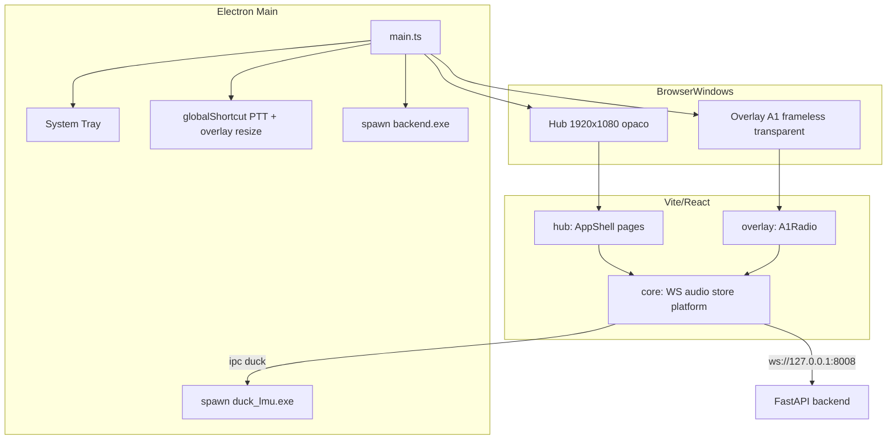

# Electron Hub + Overlay F1 (A1) — Implementation Plan

> **For agentic workers:** REQUIRED SUB-SKILL: Use superpowers:subagent-driven-development (recommended) or superpowers:executing-plans to implement this plan task-by-task. Steps use checkbox (`- [ ]`) syntax for tracking.

**Goal:** Migrar el shell desktop de Tauri a Electron con **dos ventanas**: un **hub de control** responsive (default 1920×1080) y un **overlay de radio F1** (variante A1) sobre el simulador, reutilizando hooks/servicios existentes y eliminando Tauri cuando el release Electron funcione.

**Architecture:** Reorganizar el frontend en `frontend/src/{core,hub,overlay,electron}`. `core/` conserva Zustand, WebSocket, audio y un adapter `platform.ts` (Tauri | Electron | browser). Electron main process gestiona spawn de backend, tray, shortcuts globales, ventanas hub/overlay e invocación de `duck_lmu.exe`. El hub usa layout inspirado en [Boro UI](https://www.figma.com/design/ZNWQ8ggxU9wtQe1YQpQZDP/Boro-UI-for-Apple-Watch-apps--Community-?node-id=0-1) (sidebar, cards, grid) con **tokens visuales A1** del prototipo `frontend/prototypes/f1-radio-a-variants.html`. El overlay es una ventana frameless transparente always-on-top, anclada derecha-centro, redimensionable solo con hotkey.

**Tech Stack:** React 19 · TypeScript · Vite 6 · Tailwind CSS v4 · shadcn/ui · Zustand · Electron 34+ · Vitest · electron-builder (fase final) · mini `duck_lmu.exe` (Rust WASAPI extraído)

**Decisions locked (2026-06-08):**

| Tema | Decisión |
|------|----------|
| Cutover Tauri | Paralelo 1–2 semanas; borrar Tauri cuando Electron release funcione |
| Hub ventana | Responsive desktop; default **1920×1080**; decorations, opaco, no always-on-top |
| Visual hub | Estructura Boro + tokens A1 (no oro Boro) |
| Overlay | A1 default; arquitectura switchable A2/A3 |
| Overlay posición | Derecha, centrado vertical |
| Overlay resize | Solo con combinación de teclas (modo edición temporal) |
| Audio duck | Mini `duck_lmu.exe` (extraer `audio_duck.rs`) |
| Estructura código | `frontend/src/{core,hub,overlay,electron}` |
| UI components | shadcn para forms; custom A1 para overlay |
| Release | Dev primero; `electron-builder` al final |
| Secciones hub | Inicio · Ingeniero · Spotter · Audio/PTT · Conexión · Perfiles · Avanzado · Historial |
| Admin | **Fuera de scope** |
| Historial | JSON persistido en disco por sesión/carrera |

**Supersedes:** `docs/superpowers/plans/2026-06-08-vantare-hub-boro-ui-phase1.md` (Tauri + oro Boro — obsoleto)

**Referencias:** `docs/arquitectura-shell-desktop.md` · `frontend/prototypes/f1-radio-a-variants.html` · `frontend/src/components/ConfigTab.tsx` · `frontend/src/store/config.ts`

---

## Mapa de archivos

| Acción | Ruta | Responsabilidad |
|--------|------|-----------------|
| Create | `frontend/electron/main.ts` | App Electron: ventanas, tray, spawn backend, shortcuts |
| Create | `frontend/electron/preload.ts` | `contextBridge` → API tipada |
| Create | `frontend/electron/windows/hubWindow.ts` | BrowserWindow hub 1920×1080 |
| Create | `frontend/electron/windows/overlayWindow.ts` | BrowserWindow overlay A1 |
| Create | `frontend/electron/ipc/handlers.ts` | duck, historial, overlay resize mode |
| Create | `frontend/electron/backend/spawnBackend.ts` | Spawn `backend.exe` en release |
| Create | `frontend/src/electron/vite-env.d.ts` | Tipos `window.vantare` |
| Create | `frontend/src/core/platform/index.ts` | Adapter Tauri/Electron/Web |
| Create | `frontend/src/core/platform/types.ts` | Interfaz `PlatformBridge` |
| Create | `frontend/src/core/styles/tokens-a1.css` | Tokens A1 en `@theme` |
| Create | `frontend/src/hub/AppShell.tsx` | Sidebar + header + outlet |
| Create | `frontend/src/hub/routes.tsx` | 8 secciones |
| Create | `frontend/src/hub/pages/*.tsx` | Páginas por dominio |
| Create | `frontend/src/overlay/OverlayApp.tsx` | Entry overlay |
| Create | `frontend/src/overlay/variants/A1Radio.tsx` | UI A1 del prototipo |
| Create | `frontend/src/overlay/variants/registry.ts` | Switch A1/A2/A3 |
| Create | `frontend/src/core/history/sessionHistory.ts` | Persistencia JSON |
| Create | `native/duck_lmu/` | Crate Rust standalone |
| Modify | `frontend/package.json` | electron, concurrently, shadcn deps |
| Modify | `frontend/vite.config.ts` | Multi-entry hub + overlay |
| Modify | `frontend/index.html` | Entry hub |
| Create | `frontend/overlay.html` | Entry overlay |
| Modify | `frontend/src/main.tsx` | Router hub vs overlay por query/hash |
| Move | `frontend/src/hooks/*` → `frontend/src/core/hooks/*` | (gradual, re-export) |
| Move | `frontend/src/services/*` → `frontend/src/core/services/*` | (gradual, re-export) |
| Move | `frontend/src/store/*` → `frontend/src/core/store/*` | (gradual, re-export) |
| Delete (fase 6) | `frontend/src-tauri/` | Tras release Electron OK |

---

## Diagrama de ventanas



---

## Fase 0 — Scaffold Electron

### Task 1: Dependencias y scripts npm

**Files:**
- Modify: `frontend/package.json`

- [ ] **Step 1: Añadir dependencias Electron**

```json
{
  "scripts": {
    "dev": "vite",
    "dev:electron": "concurrently -k \"vite\" \"wait-on http://127.0.0.1:1420 && electron .\"",
    "build": "tsc && vite build",
    "electron": "electron .",
    "test": "vitest run --config vitest.config.ts"
  },
  "devDependencies": {
    "concurrently": "^9.1.2",
    "electron": "^34.2.0",
    "wait-on": "^8.0.2"
  },
  "main": "electron/main.js"
}
```

- [ ] **Step 2: Instalar**

Run: `cd frontend && npm install`
Expected: lockfile actualizado sin errores peer

- [ ] **Step 3: Commit**

```bash
git add frontend/package.json frontend/package-lock.json
git commit -m "chore(frontend): add electron dev dependencies"
```

---

### Task 2: Main process mínimo (hub only)

**Files:**
- Create: `frontend/electron/main.ts`
- Create: `frontend/electron/tsconfig.json`

- [ ] **Step 1: tsconfig para electron**

```json
{
  "compilerOptions": {
    "target": "ES2022",
    "module": "CommonJS",
    "moduleResolution": "node",
    "outDir": "electron-dist",
    "rootDir": "electron",
    "strict": true,
    "esModuleInterop": true,
    "skipLibCheck": true
  },
  "include": ["electron/**/*.ts"]
}
```

- [ ] **Step 2: main.ts — ventana hub**

```typescript
import { app, BrowserWindow } from "electron";
import path from "node:path";

const isDev = !app.isPackaged;
const VITE_DEV_URL = "http://127.0.0.1:1420";

function createHubWindow(): BrowserWindow {
  const win = new BrowserWindow({
    width: 1920,
    height: 1080,
    minWidth: 1024,
    minHeight: 640,
    show: false,
    title: "Vantare Ingeniero",
    webPreferences: {
      preload: path.join(__dirname, "preload.js"),
      contextIsolation: true,
      nodeIntegration: false,
    },
  });
  win.once("ready-to-show", () => win.show());
  if (isDev) {
    void win.loadURL(VITE_DEV_URL);
    win.webContents.openDevTools({ mode: "detach" });
  } else {
    void win.loadFile(path.join(__dirname, "../dist/index.html"));
  }
  return win;
}

app.whenReady().then(() => {
  createHubWindow();
  app.on("activate", () => {
    if (BrowserWindow.getAllWindows().length === 0) createHubWindow();
  });
});

app.on("window-all-closed", () => {
  if (process.platform !== "darwin") app.quit();
});
```

- [ ] **Step 3: Compilar y probar**

Run: `cd frontend && npx tsc -p electron/tsconfig.json && npm run dev:electron`
Expected: ventana hub 1920×1080 con React actual

- [ ] **Step 4: Ajustar package.json main**

Set `"main": "electron-dist/main.js"` y script `"build:electron": "tsc -p electron/tsconfig.json"`

- [ ] **Step 5: Commit**

```bash
git add frontend/electron frontend/package.json
git commit -m "feat(electron): minimal hub window scaffold"
```

---

### Task 3: Preload + platform bridge stub

**Files:**
- Create: `frontend/electron/preload.ts`
- Create: `frontend/src/core/platform/types.ts`
- Create: `frontend/src/core/platform/index.ts`
- Create: `frontend/src/electron/vite-env.d.ts`

- [ ] **Step 1: Tipos PlatformBridge**

```typescript
// frontend/src/core/platform/types.ts
export interface PlatformBridge {
  isElectron: boolean;
  isTauri: boolean;
  openExternal(url: string): Promise<void>;
  duckLmu(active: boolean, level?: number): Promise<void>;
  saveSessionHistory(payload: SessionHistoryFile): Promise<string>;
  listSessionHistories(): Promise<string[]>;
  loadSessionHistory(filename: string): Promise<SessionHistoryFile>;
  setOverlayResizeMode(enabled: boolean): Promise<void>;
}

export interface SessionHistoryFile {
  sessionId: string;
  startedAt: string;
  endedAt?: string;
  track?: string;
  messages: Array<{ sender: "pilot" | "engineer"; text: string; timestamp: number }>;
}
```

- [ ] **Step 2: preload.ts**

```typescript
import { contextBridge, ipcRenderer } from "electron";

contextBridge.exposeInMainWorld("vantare", {
  isElectron: true,
  openExternal: (url: string) => ipcRenderer.invoke("shell:openExternal", url),
  duckLmu: (active: boolean, level = 0.65) =>
    ipcRenderer.invoke("audio:duckLmu", { active, level }),
  saveSessionHistory: (payload: unknown) =>
    ipcRenderer.invoke("history:save", payload),
  listSessionHistories: () => ipcRenderer.invoke("history:list"),
  loadSessionHistory: (filename: string) =>
    ipcRenderer.invoke("history:load", filename),
  setOverlayResizeMode: (enabled: boolean) =>
    ipcRenderer.invoke("overlay:setResizeMode", enabled),
});
```

- [ ] **Step 3: platform/index.ts con fallback web**

```typescript
import type { PlatformBridge } from "./types";

const webStub: PlatformBridge = {
  isElectron: false,
  isTauri: false,
  openExternal: async (url) => { window.open(url, "_blank"); },
  duckLmu: async () => {},
  saveSessionHistory: async () => "web-noop",
  listSessionHistories: async () => [],
  loadSessionHistory: async () => ({ sessionId: "", startedAt: "", messages: [] }),
  setOverlayResizeMode: async () => {},
};

export function getPlatform(): PlatformBridge {
  if (typeof window !== "undefined" && (window as any).vantare) {
    return { isElectron: true, isTauri: false, ...(window as any).vantare };
  }
  return webStub;
}
```

- [ ] **Step 4: vite-env.d.ts**

```typescript
interface Window {
  vantare?: import("./core/platform/types").PlatformBridge & { isElectron: true };
}
```

- [ ] **Step 5: Commit**

```bash
git add frontend/electron/preload.ts frontend/src/core/platform frontend/src/electron
git commit -m "feat(electron): preload bridge and platform adapter stub"
```

---

### Task 4: Dev script unificado

**Files:**
- Create: `scripts/dev-electron.ps1`
- Modify: `scripts/dev.ps1` (comentario pointer)

- [ ] **Step 1: dev-electron.ps1**

```powershell
param([switch]$NoBackend)
$Root = Split-Path -Parent $PSScriptRoot
if (-not $NoBackend) {
  Start-Process powershell -ArgumentList "-NoExit", "-Command", "cd '$Root\backend'; `$env:VANTARE_NATIVE_TELEMETRY='1'; python run_dev.py --no-reload"
  Start-Sleep -Seconds 2
}
Start-Process powershell -ArgumentList "-NoExit", "-Command", "cd '$Root\frontend'; npm run dev:electron"
Write-Host "Hub: Electron | Backend: http://127.0.0.1:8008/health"
```

- [ ] **Step 2: Smoke**

Run: `.\scripts\dev-electron.ps1` (con backend ya corriendo o script completo)
Expected: hub Electron + health 200

- [ ] **Step 3: Commit**

```bash
git add scripts/dev-electron.ps1 scripts/dev.ps1
git commit -m "chore(scripts): add dev-electron.ps1 launcher"
```

---

### Task 5: Multi-entry Vite (hub + overlay)

**Files:**
- Create: `frontend/overlay.html`
- Modify: `frontend/vite.config.ts`
- Create: `frontend/src/overlay/main.tsx`

- [ ] **Step 1: overlay.html**

```html
<!DOCTYPE html>
<html lang="es">
  <head>
    <meta charset="UTF-8" />
    <meta name="viewport" content="width=device-width, initial-scale=1.0" />
    <title>Vantare Overlay</title>
  </head>
  <body class="bg-transparent">
    <div id="root"></div>
    <script type="module" src="/src/overlay/main.tsx"></script>
  </body>
</html>
```

- [ ] **Step 2: vite.config.ts — build rollup inputs**

```typescript
import { defineConfig } from "vite";
import react from "@vitejs/plugin-react";
import tailwindcss from "@tailwindcss/vite";
import { resolve } from "node:path";

export default defineConfig({
  plugins: [react(), tailwindcss()],
  clearScreen: false,
  server: { port: 1420, strictPort: true, host: true },
  build: {
    rollupOptions: {
      input: {
        hub: resolve(__dirname, "index.html"),
        overlay: resolve(__dirname, "overlay.html"),
      },
    },
  },
});
```

- [ ] **Step 3: overlay/main.tsx placeholder**

```tsx
import React from "react";
import { createRoot } from "react-dom/client";
import "../index.css";
import { OverlayApp } from "./OverlayApp";

createRoot(document.getElementById("root")!).render(
  <React.StrictMode>
    <OverlayApp />
  </React.StrictMode>
);
```

- [ ] **Step 4: Verificar build**

Run: `cd frontend && npm run build`
Expected: `dist/index.html` y `dist/overlay.html`

- [ ] **Step 5: Commit**

```bash
git add frontend/vite.config.ts frontend/overlay.html frontend/src/overlay/main.tsx
git commit -m "feat(frontend): vite multi-entry for hub and overlay"
```

---

## Fase 1 — Tokens A1 + shadcn

### Task 6: Design tokens A1 (Tailwind v4)

**Files:**
- Create: `frontend/src/core/styles/tokens-a1.css`
- Modify: `frontend/src/index.css`

- [ ] **Step 1: tokens-a1.css**

```css
@import url("https://fonts.googleapis.com/css2?family=Space+Grotesk:wght@400;500;600;700&family=Inter:wght@400;500;600;700&display=swap");

@theme {
  --color-a1-bg: #09090b;
  --color-a1-surface: rgb(18 18 22 / 0.94);
  --color-a1-accent: #c42040;
  --color-a1-accent-dark: #9b1b32;
  --color-a1-accent-bright: #e63950;
  --color-a1-text: #f4f4f5;
  --color-a1-text-muted: rgb(244 244 245 / 0.45);
  --color-a1-border: rgb(237 237 240 / 0.05);
  --radius-a1: 5px;
  --font-a1-display: "Space Grotesk", system-ui, sans-serif;
  --font-a1-body: "Inter", system-ui, sans-serif;

  /* Hub (Boro structure, A1 palette) */
  --color-hub-sidebar: #0c0c0e;
  --color-hub-surface: #121216;
  --color-hub-card: rgb(255 255 255 / 0.04);
  --color-hub-border: rgb(255 255 255 / 0.06);
  --radius-hub-card: 12px;
}
```

- [ ] **Step 2: Import en index.css**

```css
@import "./core/styles/tokens-a1.css";
```

- [ ] **Step 3: Commit**

```bash
git add frontend/src/core/styles/tokens-a1.css frontend/src/index.css
git commit -m "feat(ui): A1 design tokens for hub and overlay"
```

---

### Task 7: Init shadcn/ui

**Files:**
- Create: `frontend/components.json`
- Create: `frontend/src/core/components/ui/*` (button, input, label, select, switch, tabs, card, separator, scroll-area)

- [ ] **Step 1: Init shadcn**

Run: `cd frontend && npx shadcn@latest init -y`
Choose: New York style, zinc base, CSS variables, `@/core/components`

- [ ] **Step 2: Override CSS variables con tokens A1**

En `frontend/src/index.css`, mapear `--primary` → `#c42040`, `--background` → `#09090b`, etc.

- [ ] **Step 3: Add components**

Run:
```bash
npx shadcn@latest add button input label select switch tabs card separator scroll-area badge
```

- [ ] **Step 4: Commit**

```bash
git add frontend/components.json frontend/src/core/components
git commit -m "feat(ui): shadcn primitives with A1 theme overrides"
```

---

### Task 8: Primitivos hub (Boro structure)

**Files:**
- Create: `frontend/src/hub/components/HubSidebar.tsx`
- Create: `frontend/src/hub/components/HubHeader.tsx`
- Create: `frontend/src/hub/components/HubCard.tsx`
- Create: `frontend/src/hub/components/StatusPill.tsx`

- [ ] **Step 1: HubSidebar — 8 nav items**

Secciones: `inicio`, `ingeniero`, `spotter`, `audio`, `conexion`, `perfiles`, `avanzado`, `historial`

Iconos: lucide-react (`Home`, `Bot`, `Radio`, `Mic`, `Plug`, `UserCog`, `SlidersHorizontal`, `History`)

- [ ] **Step 2: HubCard — glass + accent bar izquierda (3px #c42040)**

```tsx
export function HubCard({ title, children, className }: HubCardProps) {
  return (
    <section className={`rounded-[var(--radius-hub-card)] border border-hub-border bg-hub-card p-6 relative ${className ?? ""}`}>
      <div className="absolute left-0 top-4 bottom-4 w-[3px] rounded-full bg-a1-accent/70" />
      {title ? <h2 className="font-[family-name:var(--font-a1-display)] text-lg mb-4">{title}</h2> : null}
      {children}
    </section>
  );
}
```

- [ ] **Step 3: StatusPill — verde/rojo para health WS/LMU/LLM**

- [ ] **Step 4: Commit**

```bash
git add frontend/src/hub/components
git commit -m "feat(hub): Boro-structure shell primitives with A1 colors"
```

---

## Fase 2 — Hub AppShell + migración ConfigTab

### Task 9: AppShell y routing

**Files:**
- Create: `frontend/src/hub/AppShell.tsx`
- Create: `frontend/src/hub/routes.tsx`
- Modify: `frontend/src/main.tsx`

- [ ] **Step 1: routes.tsx**

```typescript
export type HubSection =
  | "inicio" | "ingeniero" | "spotter" | "audio"
  | "conexion" | "perfiles" | "avanzado" | "historial";

export const HUB_ROUTES: Record<HubSection, { label: string; Component: React.LazyExoticComponent<React.FC> }> = {
  inicio: { label: "Inicio", Component: lazy(() => import("./pages/InicioPage")) },
  ingeniero: { label: "Ingeniero", Component: lazy(() => import("./pages/IngenieroPage")) },
  spotter: { label: "Spotter", Component: lazy(() => import("./pages/SpotterPage")) },
  audio: { label: "Audio / PTT", Component: lazy(() => import("./pages/AudioPage")) },
  conexion: { label: "Conexión", Component: lazy(() => import("./pages/ConexionPage")) },
  perfiles: { label: "Perfiles", Component: lazy(() => import("./pages/PerfilesPage")) },
  avanzado: { label: "Avanzado", Component: lazy(() => import("./pages/AvanzadoPage")) },
  historial: { label: "Historial", Component: lazy(() => import("./pages/HistorialPage")) },
};
```

- [ ] **Step 2: AppShell — sidebar 260px + content max-w-6xl responsive grid**

- [ ] **Step 3: main.tsx — detect overlay vs hub**

```typescript
const isOverlay = window.location.pathname.endsWith("overlay.html")
  || new URLSearchParams(window.location.search).get("mode") === "overlay";
```

Hub carga `HubRoot`; overlay carga `OverlayApp` (Task 19).

- [ ] **Step 4: Commit**

```bash
git add frontend/src/hub frontend/src/main.tsx
git commit -m "feat(hub): AppShell with 8-section routing"
```

---

### Task 10: Extraer lógica compartida de ConfigTab

**Files:**
- Create: `frontend/src/hub/forms/useConfigForm.ts`
- Create: `frontend/src/hub/forms/configValidation.ts`

- [ ] **Step 1: Test validación spotter**

```typescript
// frontend/src/__tests__/configValidation.test.ts
import { describe, it, expect } from "vitest";
import { validateSpotterFields } from "../hub/forms/configValidation";

describe("validateSpotterFields", () => {
  it("rejects clear delay below 0.1", () => {
    expect(validateSpotterFields({ spotterClearDelayS: 0.05 }).ok).toBe(false);
  });
});
```

- [ ] **Step 2: Run test — expect FAIL**

Run: `cd frontend && npm test -- configValidation.test.ts`
Expected: FAIL module not found

- [ ] **Step 3: Implement configValidation.ts** (copiar reglas de `ConfigTab.tsx` líneas 368–384)

- [ ] **Step 4: useConfigForm.ts** — estado local + `updateConfig` + persist localStorage (misma lógica que ConfigTab)

- [ ] **Step 5: Run test — PASS**

- [ ] **Step 6: Commit**

```bash
git add frontend/src/hub/forms frontend/src/__tests__/configValidation.test.ts
git commit -m "refactor(hub): extract config form logic from ConfigTab"
```

---

### Task 11: Página Inicio (dashboard live)

**Files:**
- Create: `frontend/src/hub/pages/InicioPage.tsx`

- [ ] **Step 1: Grid 2×2** — Conectividad (StatusPill ×4), telemetría resumida, último mensaje ingeniero, última alerta spotter

- [ ] **Step 2: Botones** — "Mostrar overlay", "Ocultar overlay" → IPC `overlay:toggle` (Task 20)

- [ ] **Step 3: Reutilizar selectores Zustand** de `RadioOverlay.tsx` (speed, gear, fuel, lap, position, gaps)

- [ ] **Step 4: Commit**

```bash
git add frontend/src/hub/pages/InicioPage.tsx
git commit -m "feat(hub): Inicio dashboard with live telemetry"
```

---

### Task 12: Página Ingeniero

**Files:**
- Create: `frontend/src/hub/pages/IngenieroPage.tsx`

- [ ] **Step 1: Campos** — `personalityProfileId`, `verbosityLevel`, `speakOnlyWhenSpokenTo`, `swearyMessages`, `wakeWord`, `wakeWordEnabled`, `brakingZonesMute`

- [ ] **Step 2: shadcn Select + Switch**

- [ ] **Step 3: Guardar → `updateConfig` + WS sync existente**

- [ ] **Step 4: Commit**

```bash
git add frontend/src/hub/pages/IngenieroPage.tsx
git commit -m "feat(hub): Ingeniero settings page"
```

---

### Task 13: Página Spotter

**Files:**
- Create: `frontend/src/hub/pages/SpotterPage.tsx`

- [ ] **Step 1: Campos numéricos** — clear, hold, gap, car length, min speed, race start delay (de `AppConfig`)

- [ ] **Step 2: Toggles** — `spotterOffQualifying`, `spotterExcludeStopped`

- [ ] **Step 3: Validación con `configValidation.ts`**

- [ ] **Step 4: Commit**

```bash
git add frontend/src/hub/pages/SpotterPage.tsx
git commit -m "feat(hub): Spotter tuning page"
```

---

### Task 14: Página Audio/PTT

**Files:**
- Create: `frontend/src/hub/pages/AudioPage.tsx`

- [ ] **Step 1: Mic device select** — lazy `getUserMedia` solo al entrar (patrón ConfigTab)

- [ ] **Step 2: PTT hotkeys** — `pttHotkey`, `pttStopHotkey` con captura tecla

- [ ] **Step 3: TTS** — `ttsVoiceEngineer`, `ttsVoiceSpotter`, `ttsBackend`, `ttsVolumeBoost`

- [ ] **Step 4: Vúmetro** — reutilizar analyser de ConfigTab

- [ ] **Step 5: Commit**

```bash
git add frontend/src/hub/pages/AudioPage.tsx
git commit -m "feat(hub): Audio and PTT settings page"
```

---

### Task 15: Página Conexión

**Files:**
- Create: `frontend/src/hub/pages/ConexionPage.tsx`

- [ ] **Step 1: vllmIP, serverPort, mqtt fields**

- [ ] **Step 2: Botón "Probar conexión"** — `getHealth()` de `core/services/api`

- [ ] **Step 3: Commit**

```bash
git add frontend/src/hub/pages/ConexionPage.tsx
git commit -m "feat(hub): Connection settings page"
```

---

### Task 16: Página Perfiles

**Files:**
- Create: `frontend/src/hub/pages/PerfilesPage.tsx`

- [ ] **Step 1: Mover lógica profiles** de ConfigTab (load/save/delete vía API existente)

- [ ] **Step 2: shadcn Select + Input para nombre**

- [ ] **Step 3: Commit**

```bash
git add frontend/src/hub/pages/PerfilesPage.tsx
git commit -m "feat(hub): Profile management page"
```

---

### Task 17: Página Avanzado

**Files:**
- Create: `frontend/src/hub/pages/AvanzadoPage.tsx`

- [ ] **Step 1: Campos restantes** — `spotterOverlapDelayS`, sensitivity, speaker device, flags debug

- [ ] **Step 2: Toggle overlay variant** (A1/A2/A3) — guardar en localStorage `overlayVariant`

- [ ] **Step 3: Commit**

```bash
git add frontend/src/hub/pages/AvanzadoPage.tsx
git commit -m "feat(hub): Advanced settings and overlay variant picker"
```

---

### Task 18: HubRoot — wiring PTT/WS fuera de App.tsx monolítico

**Files:**
- Create: `frontend/src/hub/HubRoot.tsx`
- Modify: `frontend/src/App.tsx` (deprecate → re-export HubRoot)

- [ ] **Step 1: Mover efectos** de `App.tsx` (WebSocket, audio, PTT, health poll) a `HubRoot.tsx`

- [ ] **Step 2: App.tsx**

```tsx
export { HubRoot as default } from "./hub/HubRoot";
```

- [ ] **Step 3: Eliminar toggle screen dashboard/config** — navegación solo por sidebar

- [ ] **Step 4: Run tests existentes**

Run: `cd frontend && npm test`
Expected: all pass (ajustar imports si moviste paths)

- [ ] **Step 5: Commit**

```bash
git add frontend/src/hub/HubRoot.tsx frontend/src/App.tsx
git commit -m "refactor(hub): HubRoot owns WS/PTT lifecycle"
```

---

## Fase 3 — Overlay ventana A1

### Task 19: OverlayApp + variant registry

**Files:**
- Create: `frontend/src/overlay/OverlayApp.tsx`
- Create: `frontend/src/overlay/variants/registry.ts`
- Create: `frontend/src/overlay/variants/A1Radio.tsx`

- [ ] **Step 1: registry.ts**

```typescript
export type OverlayVariant = "a1" | "a2" | "a3";

export function getOverlayVariant(): OverlayVariant {
  const v = localStorage.getItem("overlayVariant");
  return v === "a2" || v === "a3" ? v : "a1";
}
```

- [ ] **Step 2: A1Radio.tsx** — port CSS del prototipo `.a1` a Tailwind + keyframes en `overlay.css`:
  - aurora, side-stripe, telemetry bar, wave bars, LIVE badge
  - estados radio: IDLE / ESCUCHANDO / PENSANDO / HABLANDO (colores A1)

- [ ] **Step 3: OverlayApp** — subscribe Zustand radio + telemetry @ selectors granulares (copiar patrón RadioOverlay)

- [ ] **Step 4: Commit**

```bash
git add frontend/src/overlay
git commit -m "feat(overlay): A1 radio variant from prototype"
```

---

### Task 20: Electron overlay window

**Files:**
- Create: `frontend/electron/windows/overlayWindow.ts`
- Modify: `frontend/electron/main.ts`

- [ ] **Step 1: overlayWindow.ts**

```typescript
export function createOverlayWindow(isDev: boolean): BrowserWindow {
  const { width, height } = screen.getPrimaryDisplay().workAreaSize;
  const win = new BrowserWindow({
    width: 540,
    height: 320,
    x: width - 560,
    y: Math.round((height - 320) / 2),
    frame: false,
    transparent: true,
    alwaysOnTop: true,
    resizable: false,
    skipTaskbar: true,
    hasShadow: false,
    webPreferences: { preload, contextIsolation: true, nodeIntegration: false },
  });
  const url = isDev ? "http://127.0.0.1:1420/overlay.html" : /* file overlay.html */;
  void win.loadURL(url);
  win.setIgnoreMouseEvents(false);
  return win;
}
```

- [ ] **Step 2: IPC overlay:toggle, overlay:show, overlay:hide**

- [ ] **Step 3: InicioPage botones conectados**

- [ ] **Step 4: Smoke sobre LMU borderless**

Expected: overlay visible derecha-centro, no bloquea clicks fuera si `setIgnoreMouseEvents(true, { forward: true })` en zonas transparentes (opcional fase 3b)

- [ ] **Step 5: Commit**

```bash
git add frontend/electron/windows/overlayWindow.ts frontend/electron/main.ts
git commit -m "feat(electron): separate always-on-top overlay window"
```

---

### Task 21: Overlay resize mode (hotkey)

**Files:**
- Modify: `frontend/electron/main.ts`
- Modify: `frontend/electron/ipc/handlers.ts`

- [ ] **Step 1: Default hotkey `Ctrl+Shift+O`** — toggle resize mode

- [ ] **Step 2: Cuando enabled** — `overlay.setResizable(true)`, borde debug 1px `#c42040`; cuando disabled — fijar tamaño, `setResizable(false)`

- [ ] **Step 3: Persist size** — `electron-store` key `overlayBounds`

- [ ] **Step 4: AvanzadoPage** — mostrar hotkey configurable

- [ ] **Step 5: Commit**

```bash
git add frontend/electron
git commit -m "feat(overlay): hotkey-gated resize mode with bounds persistence"
```

---

### Task 22: Click-through opcional (zona transparente)

**Files:**
- Modify: `frontend/electron/windows/overlayWindow.ts`
- Create: `frontend/src/overlay/hooks/useOverlayHitTest.ts`

- [ ] **Step 1: IPC `overlay:setIgnoreMouseEvents`** desde renderer cuando cursor fuera del panel `.a1`

- [ ] **Step 2: Solo activar en modo carrera (no en resize mode)**

- [ ] **Step 3: Commit**

```bash
git add frontend/electron frontend/src/overlay/hooks
git commit -m "feat(overlay): forward mouse events outside panel"
```

---

## Fase 4 — Paridad Tauri → Electron

### Task 23: Platform adapter — reemplazar imports Tauri

**Files:**
- Modify: `frontend/src/services/priorityAudioQueue.ts`
- Modify: `frontend/src/services/updateChecker.ts`
- Modify: `frontend/src/hooks/useHotkey.ts`
- Delete usage: `frontend/src/components/SystemTrayMenu.tsx` (tray nativo)

- [ ] **Step 1: priorityAudioQueue — duck via platform**

```typescript
import { getPlatform } from "../core/platform";

async function setLmuDuck(active: boolean): Promise<void> {
  await getPlatform().duckLmu(active, DUCK_LEVEL);
}
```

- [ ] **Step 2: updateChecker — openExternal via platform**

- [ ] **Step 3: useHotkey — rama Electron**

En Electron: escuchar evento IPC `ptt:down` / `ptt:up` desde main (globalShortcut).
En Tauri: mantener import lazy existente hasta fase 6.
En web: keyboard events locales.

- [ ] **Step 4: Test priorityAudioQueue sin Tauri mock**

```typescript
vi.stubGlobal("window", { vantare: { duckLmu: vi.fn(), isElectron: true } });
```

- [ ] **Step 5: Commit**

```bash
git add frontend/src/services/priorityAudioQueue.ts frontend/src/services/updateChecker.ts frontend/src/hooks/useHotkey.ts
git commit -m "refactor(platform): route duck/openExternal/hotkeys through adapter"
```

---

### Task 24: globalShortcut PTT en main

**Files:**
- Modify: `frontend/electron/main.ts`
- Create: `frontend/electron/shortcuts/ptt.ts`

- [ ] **Step 1: Leer hotkey** de config vía IPC `config:getPttHotkey` o archivo `%APPDATA%/Vantare/config.json`

- [ ] **Step 2: Registrar globalShortcut** — emitir a hub window `webContents.send("ptt:down")`

- [ ] **Step 3: Re-registrar** cuando usuario cambia hotkey en AudioPage

- [ ] **Step 4: Commit**

```bash
git add frontend/electron/shortcuts
git commit -m "feat(electron): global PTT shortcuts"
```

---

### Task 25: System tray

**Files:**
- Modify: `frontend/electron/main.ts`

- [ ] **Step 1: Tray menu** — Mostrar hub, Mostrar/ocultar overlay, Salir

- [ ] **Step 2: Close hub** → hide to tray (no quit) — patrón actual Tauri

- [ ] **Step 3: Commit**

```bash
git add frontend/electron/main.ts
git commit -m "feat(electron): system tray with hub and overlay controls"
```

---

### Task 26: duck_lmu.exe (Rust standalone)

**Files:**
- Create: `native/duck_lmu/Cargo.toml`
- Create: `native/duck_lmu/src/main.rs`
- Modify: `frontend/electron/ipc/handlers.ts`

- [ ] **Step 1: Copiar lógica** de `frontend/src-tauri/src/audio_duck.rs`

- [ ] **Step 2: CLI interface**

```rust
// duck_lmu.exe --active true --level 0.65
```

- [ ] **Step 3: Build script**

Create: `scripts/build-duck.ps1`
Run: `cargo build --release -p duck_lmu`
Output: `native/duck_lmu/target/release/duck_lmu.exe`

- [ ] **Step 4: Electron handler**

```typescript
import { spawn } from "node:child_process";
export function duckLmu(active: boolean, level: number) {
  const exe = path.join(process.resourcesPath, "duck_lmu.exe");
  spawn(exe, ["--active", String(active), "--level", String(level)]);
}
```

- [ ] **Step 5: Commit**

```bash
git add native/duck_lmu scripts/build-duck.ps1 frontend/electron/ipc
git commit -m "feat(native): standalone duck_lmu.exe for WASAPI ducking"
```

---

### Task 27: Spawn backend en release

**Files:**
- Create: `frontend/electron/backend/spawnBackend.ts`
- Modify: `frontend/electron/main.ts`

- [ ] **Step 1: Dev** — no auto-spawn (igual que Tauri debug)

- [ ] **Step 2: Release** — spawn `resources/backend/backend.exe` con `VANTARE_NATIVE_TELEMETRY=1`, `PORT=8008`

- [ ] **Step 3: Health poll** cada 5s log warning

- [ ] **Step 4: on quit** — kill child process

- [ ] **Step 5: Commit**

```bash
git add frontend/electron/backend
git commit -m "feat(electron): spawn backend.exe in packaged builds"
```

---

### Task 28: Historial persistido

**Files:**
- Create: `frontend/src/core/history/sessionHistory.ts`
- Create: `frontend/src/hub/pages/HistorialPage.tsx`
- Modify: `frontend/electron/ipc/handlers.ts`

- [ ] **Step 1: Test sessionHistory**

```typescript
it("builds filename from sessionId and date", () => {
  expect(sessionFilename({ sessionId: "abc", startedAt: "2026-06-08T12:00:00Z" }))
    .toMatch(/^20260608-.+\.json$/);
});
```

- [ ] **Step 2: Electron storage path** — `%APPDATA%/Vantare/history/`

- [ ] **Step 3: Auto-save** — on `addMessageToHistory` debounce 2s + on session end

- [ ] **Step 4: HistorialPage** — lista sesiones + viewer mensajes (ScrollArea shadcn)

- [ ] **Step 5: Commit**

```bash
git add frontend/src/core/history frontend/src/hub/pages/HistorialPage.tsx frontend/electron/ipc
git commit -m "feat(history): persist session message log to disk"
```

---

## Fase 5 — Tests y QA

### Task 29: Tests platform adapter

**Files:**
- Create: `frontend/src/__tests__/platform.test.ts`

- [ ] **Step 1–4: TDD** — web stub, electron mock, duck noop

- [ ] **Step 5: Commit**

```bash
git add frontend/src/__tests__/platform.test.ts
git commit -m "test(platform): adapter fallbacks and electron bridge"
```

---

### Task 30: Tests overlay variant registry

**Files:**
- Create: `frontend/src/__tests__/overlayVariant.test.ts`

- [ ] **Step 1–4: TDD** — default a1, localStorage a2

- [ ] **Step 5: Commit**

```bash
git add frontend/src/__tests__/overlayVariant.test.ts
git commit -m "test(overlay): variant registry defaults"
```

---

### Task 31: Smoke checklist LMU

**Files:**
- Create: `docs/qa/electron-smoke-checklist.md`

- [ ] **Step 1: Documentar checks**

| Check | Esperado |
|-------|----------|
| Hub arranca 1920×1080 | Ventana decorations, no transparent |
| Overlay toggle | Aparece derecha-centro |
| Telemetría 20Hz | InicioPage actualiza speed/lap |
| PTT global | Beep + LISTENING_PILOT en overlay |
| TTS + duck | Juego baja volumen durante speech |
| Spotter IMMEDIATE | Preempt engineer queue |
| Perfiles | Save/load API |
| Historial | JSON en AppData tras mensajes |
| Resize overlay | Ctrl+Shift+O activa handles |
| Tray | Hide hub, overlay sigue |

- [ ] **Step 2: Commit**

```bash
git add docs/qa/electron-smoke-checklist.md
git commit -m "docs(qa): electron hub overlay smoke checklist"
```

---

## Fase 6 — Packaging + eliminación Tauri

### Task 32: electron-builder

**Files:**
- Create: `frontend/electron-builder.yml`
- Modify: `frontend/package.json`

- [ ] **Step 1: electron-builder.yml**

```yaml
appId: com.vantare.ingeniero
productName: Vantare Ingeniero IA
directories:
  output: release
files:
  - dist/**/*
  - electron-dist/**/*
  - package.json
extraResources:
  - from: ../backend/dist/backend
    to: backend
  - from: ../native/duck_lmu/target/release/duck_lmu.exe
    to: duck_lmu.exe
win:
  target: nsis
  icon: src-tauri/icons/icon.ico
```

- [ ] **Step 2: Script build release**

```json
"build:desktop": "npm run build && tsc -p electron/tsconfig.json && electron-builder"
```

- [ ] **Step 3: Build smoke** (requiere backend.exe prebuilt)

Run: `cd frontend && npm run build:desktop`
Expected: `frontend/release/Vantare Ingeniero IA Setup *.exe`

- [ ] **Step 4: Commit**

```bash
git add frontend/electron-builder.yml frontend/package.json
git commit -m "chore(release): electron-builder NSIS config"
```

---

### Task 33: Eliminar Tauri

**Files:**
- Delete: `frontend/src-tauri/`
- Modify: `frontend/package.json` — remove `@tauri-apps/*`
- Modify: `scripts/dev.ps1`, `agents.md`, `docs/arquitectura-shell-desktop.md`

- [ ] **Step 1: Verificar paridad** — smoke checklist 100% en instalador

- [ ] **Step 2: Remove Tauri deps y carpeta**

- [ ] **Step 3: dev.ps1 default → dev-electron.ps1**

- [ ] **Step 4: Run full test suites**

Run: `cd frontend && npm test` && `cd backend && pytest tests/ -q --ignore=tests/test_pre_alpha.py` (or project gate command)

- [ ] **Step 5: Commit**

```bash
git add -A
git commit -m "chore: remove Tauri shell after Electron release parity"
```

---

### Task 34: Deprecar ConfigTab y RadioOverlay legacy

**Files:**
- Delete: `frontend/src/components/ConfigTab.tsx`
- Delete: `frontend/src/components/RadioOverlay.tsx`
- Delete: `frontend/src/components/SystemTrayMenu.tsx`

- [ ] **Step 1: Grep zero imports**

Run: `rg "ConfigTab|RadioOverlay|SystemTrayMenu" frontend/src`
Expected: no matches

- [ ] **Step 2: Delete files**

- [ ] **Step 3: Commit**

```bash
git add -A frontend/src/components
git commit -m "chore: remove legacy monolithic hub components"
```

---

## Self-review (spec coverage)

| Requisito | Task |
|-----------|------|
| Hub responsive 1920×1080 default | Task 2, 9 |
| Boro layout + A1 tokens | Task 6, 8 |
| 8 secciones hub (sin admin) | Task 9, 11–17 |
| Overlay A1 default switchable | Task 19, 17 |
| Overlay derecha-centro | Task 20 |
| Resize solo con hotkey | Task 21 |
| duck_lmu.exe | Task 26 |
| src/{core,hub,overlay,electron} | Tasks 3, 5, 8, 9, 19 |
| shadcn + custom overlay | Task 7, 19 |
| Historial JSON disco | Task 28 |
| Paralelo Tauri luego delete | Task 33 (tras smoke) |
| dev primero, pack al final | Task 1–31 antes de 32 |
| Migrar ConfigTab | Tasks 10–17 |
| PTT/tray/spawn backend | Tasks 24, 25, 27 |

**Placeholder scan:** ninguno — cada task tiene paths y código concreto.

---

## Estimación

| Fase | Días dev |
|------|----------|
| 0 Scaffold | 1–2 |
| 1 Tokens + shadcn | 1 |
| 2 Hub + ConfigTab split | 3–4 |
| 3 Overlay | 2–3 |
| 4 Paridad nativa | 2–3 |
| 5 Tests/QA | 1 |
| 6 Packaging + Tauri removal | 1–2 |
| **Total** | **11–16 días** |

---

## Documentos a actualizar al cerrar

- `agents.md` — comandos dev Electron
- `docs/arquitectura-shell-desktop.md` — estado Electron primary
- Marcar obsoleto `2026-06-08-vantare-hub-boro-ui-phase1.md`
