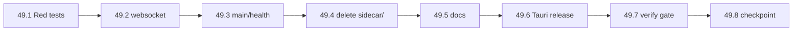

# Task 49 — Sidecar Removal & Native Telemetry Completion Plan

> **For agentic workers:** REQUIRED SUB-SKILL: Use superpowers:subagent-driven-development (recommended) or superpowers:executing-plans to implement this plan task-by-task. Steps use checkbox (`- [ ]`) syntax for tracking.

**Goal:** Cerrar Task 49 eliminando el strategy sidecar y rutas legacy (`/ws/sidecar`, `latest_strategy_frame`), dejando Windows native telemetry como único path de producción (backend + Tauri, 2 procesos).

**Architecture:** S0–S8 ya implementados: `TelemetryReader` online, `telemetry_frame_builder.py`, `snapshot_frame()` @ 20 Hz sin REST, `StateChangeDetector` en backend, `native_telemetry_enabled()` en websocket/health, Tauri skip sidecar por defecto. Este plan cubre **solo el cierre**: guard tests, borrado físico sidecar, limpieza websocket/main/health, release smoke empaquetado, evidencia.

**Tech Stack:** Python 3.12 / FastAPI / `shared-telemetry` / `shared-strategy` / Pytest · Tauri 2 · Windows LMU shared memory

**Prerequisitos:** Task 48 DONE (169 tests crewchief, cutover legacy). Plan completo original: [`2026-06-07-native-windows-no-sidecar.md`](./2026-06-07-native-windows-no-sidecar.md).

**Referencias:** [`.omo/evidence/native-telemetry-smoke.md`](../../.omo/evidence/native-telemetry-smoke.md) · [`.omo/evidence/sidecar-freeze-policy.md`](../../.omo/evidence/sidecar-freeze-policy.md) · [`.omo/evidence/cc-parity-validation-checklist.md`](../../.omo/evidence/cc-parity-validation-checklist.md)

---

## Baseline (ya en repo — no reimplementar)

| Subtask original | Estado | Evidencia |
|------------------|--------|-----------|
| S0 Freeze policy | **DONE** | `.omo/evidence/sidecar-freeze-policy.md`, `AGENTS.md` |
| S1 Platform config | **DONE** | `backend/src/platform/runtime.py`, `test_native_telemetry.py` |
| S2 Online TelemetryReader | **DONE** | `main.py`, `health.py` |
| S3 Shared builder | **DONE** | `shared-strategy/.../telemetry_frame_builder.py`, `test_telemetry_frame_builder.py` |
| S3b Builder gate | **DONE** | `native-telemetry-smoke.md` S3b |
| S4 snapshot_frame @ 20 Hz | **DONE** | `strategy_service.py`, `test_native_telemetry_frame_source.py` |
| S5 StateChangeDetector | **DONE** | `backend/src/services/state_change_detector.py` |
| S6 Strategy sender native | **DONE** | `websocket.py` strategy_sender_loop |
| S7 Dev + LMU smoke | **PARTIAL** | Health/UI OK; A/B sidecar vs native pendiente |
| S8 Tauri skip sidecar | **DONE** | `frontend/src-tauri/src/main.rs` `VANTARE_SIDECAR=1` opt-in |

**Pendiente:** S7 A/B opcional, S8 release smoke empaquetado, **S9 borrado sidecar**.

---

## File map (remaining work)

| Task | Create | Modify | Delete |
|------|--------|--------|--------|
| 49.1 | `backend/tests/test_no_sidecar_endpoint.py` | — | — |
| 49.2 | — | `backend/src/routers/websocket.py` | `sidecar_endpoint`, sidecar branches |
| 49.3 | — | `backend/src/main.py`, `health.py` | `latest_strategy_frame` state |
| 49.4 | — | `AGENTS.md`, `docs/arquitectura-shell-desktop.md` | sidecar dev instructions |
| 49.5 | — | `.omo/evidence/native-telemetry-smoke.md` | — |
| 49.6 | — | `frontend/src-tauri/` (rebuild) | `binaries/sidecar/` if present |
| 49.7 | — | `scripts/verify_alpha_parity.py` | — |
| 49.8 | — | — | `sidecar/` package, `test_sidecar_integration.py` |

---

## Task 49.1: Guard tests (TDD red gate)

**Files:**
- Create: `backend/tests/test_no_sidecar_endpoint.py`

- [ ] **Step 1: Write failing tests**

```python
# backend/tests/test_no_sidecar_endpoint.py
"""Task 49-S9: sidecar route and frame state must not exist post-cutover."""

from fastapi.routing import APIWebSocketRoute


def test_sidecar_ws_route_removed():
    from src.main import app

    ws_paths = [
        getattr(r, "path", "")
        for r in app.routes
        if isinstance(r, APIWebSocketRoute)
    ]
    assert "/ws/sidecar" not in ws_paths


def test_main_has_no_latest_strategy_frame_state():
    import inspect
    import src.main as main_mod

    source = inspect.getsource(main_mod)
    assert "latest_strategy_frame" not in source


def test_websocket_native_only_frame_path():
    import inspect
    import src.routers.websocket as ws_mod

    source = inspect.getsource(ws_mod.telemetry_sender_loop)
    assert "sidecar_frame" not in source
    assert "latest_strategy_frame" not in source
```

- [ ] **Step 2: Run — expect FAIL**

Run: `cd backend && python -m pytest tests/test_no_sidecar_endpoint.py -v`

Expected: FAIL — `/ws/sidecar` still registered.

- [ ] **Step 3: Commit test only (red gate)**

```bash
git add backend/tests/test_no_sidecar_endpoint.py
git commit -m "test: add no-sidecar guard (red gate Task 49)"
```

---

## Task 49.2: Remove sidecar websocket endpoint

**Files:**
- Modify: `backend/src/routers/websocket.py`
- Test: `backend/tests/test_no_sidecar_endpoint.py`

- [ ] **Step 1: Delete `sidecar_endpoint` function** (~L295–327)

Remove entire `@router.websocket("/ws/sidecar")` handler and imports only used by it.

- [ ] **Step 2: Simplify `telemetry_sender_loop`**

Replace sidecar branch with native-only path:

```python
# backend/src/routers/websocket.py — telemetry_sender_loop body
from src.platform.runtime import native_telemetry_enabled

while True:
    state_dict = None
    strategy_service = getattr(app_state, "strategy_service", None)
    if strategy_service and native_telemetry_enabled():
        state_dict = strategy_service.snapshot_frame()
    elif strategy_service and hasattr(strategy_service, "snapshot_frame"):
        state_dict = strategy_service.snapshot_frame()  # offline/tests
    else:
        state = reader.get_state()
        if state is not None:
            state_dict = state.model_dump(mode="json")

    if state_dict is None:
        await asyncio.sleep(0.05)
        continue

    strategy_dict: dict = {}
    if strategy_service:
        advice = strategy_service.get_latest_advice()
        if advice is not None:
            strategy_dict = advice.model_dump(mode="json")
    # spotter + cc_loop.on_frame unchanged...
```

- [ ] **Step 3: Simplify `strategy_sender_loop`**

Remove `latest_strategy_frame` reads; always use `strategy_service.get_latest_advice()` + `latest_frame`.

- [ ] **Step 4: Run tests**

Run: `cd backend && python -m pytest tests/test_no_sidecar_endpoint.py tests/test_native_telemetry_frame_source.py tests/test_config_sync_ws.py -v`

Expected: PASS

- [ ] **Step 5: Commit**

```bash
git add backend/src/routers/websocket.py
git commit -m "refactor: remove sidecar websocket and native-only telemetry loop"
```

---

## Task 49.3: Clean main.py and health.py

**Files:**
- Modify: `backend/src/main.py`
- Modify: `backend/src/routers/health.py`
- Modify: `backend/tests/test_wave9_routers.py` (remove sidecar frame fixtures if any)

- [ ] **Step 1: Remove legacy state from main.py**

Delete:

```python
app.state.latest_strategy_frame = None  # Legacy sidecar hasta Task 49-S9
```

Update startup log — remove "sidecar or simulated" wording; keep offline vs native.

- [ ] **Step 2: Simplify health.py**

Remove `sidecar` block from JSON response. Keep:

```python
telemetry_source = "native" if (native_telemetry_enabled() and shm_status == "connected") else "offline"
```

- [ ] **Step 3: Update tests**

Fix any test that sets `app.state.latest_strategy_frame`:

```python
# test_wave9_routers.py — use strategy_service.snapshot_frame mock instead
app.state.strategy_service = mock_strategy_service
```

- [ ] **Step 4: Run**

Run: `cd backend && python -m pytest tests/test_native_telemetry.py tests/test_wave9_routers.py -v`

- [ ] **Step 5: Commit**

```bash
git add backend/src/main.py backend/src/routers/health.py backend/tests/
git commit -m "chore: drop latest_strategy_frame from app state"
```

---

## Task 49.4: Delete sidecar package

**Files:**
- Delete: `sidecar/` (entire directory)
- Delete: `backend/tests/test_sidecar_integration.py`
- Delete: `frontend/src-tauri/binaries/sidecar/` (if exists)
- Modify: `pyproject.toml` / workspace refs if sidecar is listed

- [ ] **Step 1: Grep for sidecar imports**

Run: `rg -l "sidecar" --glob "!sidecar/**" .`

Fix any remaining imports in docs only (OK) vs code (must fix).

- [ ] **Step 2: Delete directories**

```powershell
Remove-Item -Recurse -Force "C:\Users\isaac\Desktop\Vantare-Ingeniero\sidecar"
Remove-Item -Force "C:\Users\isaac\Desktop\Vantare-Ingeniero\backend\tests\test_sidecar_integration.py" -ErrorAction SilentlyContinue
```

- [ ] **Step 3: Full backend regression**

Run: `cd backend && python -m pytest -q`

Expected: all PASS (no test_sidecar_integration).

- [ ] **Step 4: Commit**

```bash
git add -A
git commit -m "chore: remove strategy sidecar package (Task 49-S9)"
```

---

## Task 49.5: Docs and AGENTS.md

**Files:**
- Modify: `AGENTS.md`, `agents.md`
- Modify: `docs/arquitectura-shell-desktop.md`
- Modify: `.omo/evidence/sidecar-freeze-policy.md` → mark SUPERSEDED
- Modify: `docs/architecture/cc-permanent-ceilings.md`

- [ ] **Step 1: Update AGENTS.md dev startup**

```markdown
## Dev (Windows)

Terminal 1: `cd backend; $env:VANTARE_NATIVE_TELEMETRY='1'; python run_dev.py --no-reload`
Terminal 2: `cd frontend; npm run tauri dev`
Or: `.\scripts\dev.ps1`

No sidecar. Health must show `telemetry.source=native` with LMU running.
```

- [ ] **Step 2: Strike legacy diagrams** in `docs/arquitectura-shell-desktop.md` — remove 3-process sidecar section or mark DEPRECATED.

- [ ] **Step 3: Update cc-permanent-ceilings.md**

Change native telemetry row from "Task 49 pending" to **DONE** post-S9.

- [ ] **Step 4: Commit**

```bash
git add AGENTS.md docs/ .omo/evidence/
git commit -m "docs: native-only dev flow after sidecar removal"
```

---

## Task 49.6: Tauri release smoke (S8 completion)

**Files:**
- Modify: `frontend/src-tauri/src/main.rs` (verify env passthrough)
- Modify: `backend/.env.example`

- [ ] **Step 1: Rebuild backend bundle**

```powershell
cd "C:\Users\isaac\Desktop\Vantare-Ingeniero\backend"
python build_backend.py
cd "C:\Users\isaac\Desktop\Vantare-Ingeniero\frontend"
npm run tauri build
```

- [ ] **Step 2: Release smoke checklist**

In `.omo/evidence/native-telemetry-smoke.md` add section:

```markdown
## Release build (Task 49-S8)
- [ ] Task Manager: only backend.exe + vantare app (no strategy-sidecar.exe)
- [ ] `/health` native + connected with LMU
- [ ] Spotter + FCY audible on packaged build
```

- [ ] **Step 3: Manual verify** — fill checkboxes after install smoke.

- [ ] **Step 4: Commit evidence only**

```bash
git add .omo/evidence/native-telemetry-smoke.md
git commit -m "docs: Tauri release native telemetry smoke"
```

---

## Task 49.7: Extend verify_alpha_parity + optional A/B

**Files:**
- Modify: `scripts/verify_alpha_parity.py`
- Modify: `.omo/evidence/native-telemetry-smoke.md`

- [ ] **Step 1: Add native test gate to verify script**

```python
# scripts/verify_alpha_parity.py — after existing pytest block
subprocess.check_call(
    [
        sys.executable, "-m", "pytest",
        "tests/test_no_sidecar_endpoint.py",
        "tests/test_native_telemetry.py",
        "tests/test_native_telemetry_frame_source.py",
        "-q",
    ],
    cwd=str(backend),
)
```

- [ ] **Step 2: Optional A/B (manual, pre-S9 archive)**

Document in `native-telemetry-smoke.md`:

| Métrica | Sidecar @ 2 Hz | Native @ 20 Hz |
|---------|----------------|----------------|
| Penalty alert latency | ~2 s | <100 ms |
| Spotter frame freshness | stale | live |
| num_penalties on frame | desync risk | SM direct |

Skip A/B if sidecar already deleted.

- [ ] **Step 3: Run full gate**

Run: `python scripts/verify_alpha_parity.py`

- [ ] **Step 4: Commit**

```bash
git add scripts/verify_alpha_parity.py .omo/evidence/native-telemetry-smoke.md
git commit -m "chore: extend alpha parity gate for native-only stack"
```

---

## Task 49.8: Integration checkpoint

- [ ] **Step 1: Full regression**

```powershell
cd "C:\Users\isaac\Desktop\Vantare-Ingeniero\backend"
python -m pytest -q
python -m pytest -k "crewchief" -q
cd "C:\Users\isaac\Desktop\Vantare-Ingeniero\frontend"
npm test -- priorityAudioQueue.crewchief.test.ts --run
cd "C:\Users\isaac\Desktop\Vantare-Ingeniero"
python scripts/verify_alpha_parity.py
```

Expected: all PASS; crewchief ≥ 169.

- [ ] **Step 2: Update checklist**

Mark Task 49 complete in `.omo/evidence/cc-parity-validation-checklist.md`:

```markdown
- [x] Sidecar package removed (Task 49-S9).
- [x] `/ws/sidecar` route removed.
- [x] Dev default: 2-process (backend + Tauri).
```

- [ ] **Step 3: Final commit**

```bash
git commit -m "chore: complete Task 49 native Windows telemetry cutover"
```

---

## Orden de ejecución



**Estimación:** 1 sesión inline (~2–3 h) para S9 code removal + docs; release smoke manual aparte.

---

## Self-review

| Requirement | Task |
|-------------|------|
| Delete `/ws/sidecar` | 49.2 |
| Remove `latest_strategy_frame` | 49.2, 49.3 |
| Delete `sidecar/` package | 49.4 |
| Guard tests | 49.1 |
| Docs / AGENTS | 49.5 |
| Tauri release smoke | 49.6 |
| verify_alpha_parity | 49.7 |
| Evidence checklist | 49.8 |

**Placeholder scan:** none — all steps have concrete paths and code.

**Type consistency:** `native_telemetry_enabled()`, `snapshot_frame()`, `get_latest_advice()` used consistently; no new APIs.

**Gaps intencionales:** Linux dev stays offline mock (no SM); A/B sidecar optional only if recorded before delete.

---

## Execution handoff

Plan saved to `docs/superpowers/plans/2026-06-08-task49-sidecar-removal-completion.md`.

**Two execution options:**

1. **Subagent-Driven (recommended)** — fresh subagent per task 49.1→49.8, review between tasks; checkpoint after 49.4 (delete sidecar).

2. **Inline Execution** — execute in this session using executing-plans, batch with checkpoint after websocket cleanup.

**Which approach?**
