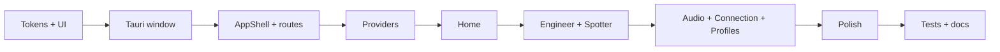

# Vantare Hub — Boro UI Phase 1 Implementation Plan

> **⚠️ OBSOLETO (2026-06-08):** Este plan asumía hub en **Tauri** con tokens **oro Boro**. Las decisiones actuales migran a **Electron**, overlay F1 **A1**, y tokens **A1** del prototipo HTML. Usar en su lugar:
>
> **`docs/superpowers/plans/2026-06-08-electron-hub-overlay-f1.md`**

> **For agentic workers:** REQUIRED SUB-SKILL: Use superpowers:subagent-driven-development (recommended) or superpowers:executing-plans to implement this plan task-by-task. Steps use checkbox (`- [ ]`) syntax for tracking.

**Goal:** Sustituir el hub actual (ventana Tauri 480×520 overlay) por una **app de control completa** estilo Boro UI — ventana desktop normal, navegación por secciones, configuración de ingeniero/spotter/audio/conexión — reutilizando hooks y servicios existentes sin tocar el backend.

**Architecture:** Fase 1 = **una ventana Tauri “hub”** (decorations, tamaño desktop, fondo opaco). Fase 2 (fuera de scope) = **segunda ventana overlay** always-on-top para radio F1. El hub usa un **AppShell** (sidebar + header + content), design tokens Boro en Tailwind v4 `@theme`, y rutas internas por sección. Lógica WS/PTT/audio permanece en `hooks/` y `services/`; solo se reestructura UI y `tauri.conf.json`.

**Tech Stack:** React 19 · TypeScript · Tailwind CSS v4 · Zustand · Tauri 2 · Vitest

**Referencia diseño:** [Boro UI for Apple Watch apps](https://www.figma.com/design/ZNWQ8ggxU9wtQe1YQpQZDP/Boro-UI-for-Apple-Watch-apps--Community-?node-id=0-1) (fileKey `ZNWQ8ggxU9wtQe1YQpQZDP`)

**Fase 2 (deferida):** Overlay radio sobre simulador — el usuario lo desarrolla aparte; este plan solo deja hooks compartidos y contrato de ventana documentado.

---

## Parte A — Análisis de estilo Boro UI (para Vantare)

> Extraído vía Figma MCP (`get_metadata`, `get_design_context`, screenshots) del kit community. **No copiar tamaños watch 184×224** — escalar patrones a desktop.

### ADN visual

| Dimensión | Boro UI | Adaptación Vantare Hub |
|-----------|---------|------------------------|
| **Modo** | Dark skeuomorphic | Fondo `#121212`–`#272727`, capas con grises |
| **Acento** | Amarillo/dorado `#c2a203`, puntos amarillos | Acento primario **oro Boro**; conservar púrpura Vantare solo como secundario opcional (marca) |
| **Tipografía** | Poppins Light/Regular/SemiBold | Sustituir Rajdhani/Inter actuales en hub; mantener Inter solo en overlay F1 si se desea |
| **Jerarquía** | Título blanco → meta `#606060`/`#808080` | Títulos `text-white`, labels `text-neutral-500`, valores `text-neutral-300` |
| **Tarjetas** | `rgba(255,255,255,0.1)`, radius ~18px, barra vertical blanca izquierda | `Card` con borde sutil + glass + accent bar |
| **Sombras** | Multi-capa profunda (`rgba(0,0,0,0.7)`) | Elevación en sidebar y cards; no exagerar en listas densas |
| **CTA** | Botón “Done” con doble rectángulo (relieve) | `Button primary` con borde inferior más oscuro |
| **Iconos** | 12–24px, amarillo en estado activo | Lucide o SVG inline; activo = acento oro |
| **Densidad** | Glanceable (watch) | **Aireado en desktop**: más padding, grid 2-col en settings |
| **Gráficos** | Líneas suaves, mes activo en acento | Reutilizar en “Estado / Telemetría” del hub |

### Tokens propuestos (`frontend/src/styles/tokens/boro.css` o `@theme`)

```css
@theme {
  --color-boro-bg: #141414;
  --color-boro-surface: #272727;
  --color-boro-surface-glass: rgb(255 255 255 / 0.08);
  --color-boro-border: rgb(255 255 255 / 0.06);
  --color-boro-accent: #c2a203;
  --color-boro-accent-muted: #806f00;
  --color-boro-text: #ffffff;
  --color-boro-text-muted: #808080;
  --color-boro-text-subtle: #595959;
  --radius-boro-card: 1.125rem;   /* ~18px */
  --radius-boro-control: 0.55rem;  /* ~8.8px */
  --font-boro: "Poppins", system-ui, sans-serif;
  --shadow-boro-card: 0 21px 214px rgb(0 0 0 / 0.35);
}
```

### Lo que NO importar del kit watch

- Marco Apple Watch, corner radius del chasis, tamaños fijos 184×224
- Tipografía micro (7–14px en watch) — escalar a escala desktop (14–32px)
- Patrones de swipe / Digital Crown
- Skeuomorphism extremo en cada control (solo CTA y cards hero)

### Contraste con hub actual Vantare

| Hoy | Objetivo Fase 1 |
|-----|-----------------|
| 480×520, transparent, alwaysOnTop | **1280×800** (min 1024×640), opaco, decorations |
| Toggle `screen: dashboard \| config` | **Router interno** 6–7 secciones |
| `ConfigTab` monolítico 765 líneas | Páginas por dominio |
| Tema púrpura overlay | Tema Boro dark + oro en hub |
| Dashboard mezclado en misma ventana | Dashboard live → sección “Estado”; overlay F1 → Fase 2 |

---

## Parte B — Mapa de archivos (Fase 1)

| Acción | Ruta | Responsabilidad |
|--------|------|-----------------|
| Create | `frontend/src/app/AppShell.tsx` | Layout sidebar + header + outlet |
| Create | `frontend/src/app/routes.tsx` | Definición de secciones |
| Create | `frontend/src/pages/*.tsx` | Una página por área de config |
| Create | `frontend/src/components/ui/` | Button, Card, Input, Select, Toggle, Badge, SectionHeader |
| Create | `frontend/src/styles/tokens/boro.css` | Tokens @theme |
| Modify | `frontend/src/App.tsx` | Montar AppShell; extraer lógica PTT/WS a providers |
| Modify | `frontend/src/main.tsx` | Router (react-router o state router ligero) |
| Modify | `frontend/src-tauri/tauri.conf.json` | Ventana hub desktop |
| Modify | `frontend/src/store/config.ts` | Quitar `screen`; añadir `activeSection` si hace falta |
| Deprecate | `frontend/src/components/ConfigTab.tsx` | Partir en pages; borrar al final |
| Keep | `hooks/*`, `services/*` | Sin cambios funcionales salvo imports |
| Out of scope | `RadioOverlay.tsx` | Fase 2 overlay |

---

## Parte C — Arquitectura de la app hub

```text
┌─────────────────────────────────────────────────────────────┐
│  Header: Vantare · estado WS/LMU · versión · tray actions   │
├──────────────┬──────────────────────────────────────────────┤
│  Sidebar     │  Content (página activa)                      │
│  · Inicio    │  ┌─────────┐ ┌─────────┐                     │
│  · Ingeniero │  │ Card    │ │ Card    │  ...               │
│  · Spotter   │  └─────────┘ └─────────┘                     │
│  · Audio/PTT │                                               │
│  · Conexión  │  Formularios + save → sendConfigUpdate       │
│  · Perfiles  │                                               │
│  · Avanzado  │                                               │
└──────────────┴──────────────────────────────────────────────┘
```

### Secciones (contenido migrado desde `ConfigTab` + status)

| Sección | Campos / UI | Fuente actual |
|---------|-------------|---------------|
| **Inicio** | Health cards, telemetría resumida, radio mode, último mensaje | `App.tsx` + store connectivity/telemetry |
| **Ingeniero** | personality, verbosity, TTS engineer, sweary, commentary batch | ConfigTab |
| **Spotter** | delays, car length, qualifying, voices spotter, phrases preview | ConfigTab |
| **Audio y PTT** | mic, sensitivity, hotkeys, volume boost, vúmetro | ConfigTab + useHotkey |
| **Conexión** | server port, LLM IP, MQTT, test connection | ConfigTab |
| **Perfiles** | load/save/apply profiles | ConfigTab |
| **Avanzado** | braking zones mute, debug flags | ConfigTab |

---

## Parte D — Tareas (Fase 1)

### Task 1: Design tokens + primitivos UI

**Files:**
- Create: `frontend/src/styles/tokens/boro.css`
- Modify: `frontend/src/styles/index.css`
- Create: `frontend/src/components/ui/Card.tsx`, `Button.tsx`, `Badge.tsx`, `SectionHeader.tsx`

- [ ] **Step 1:** Añadir tokens Boro en `@theme`; importar Poppins (Google Fonts)
- [ ] **Step 2:** Implementar `Card` (glass + left accent bar opcional)
- [ ] **Step 3:** Implementar `Button` variants: primary (oro relieve), ghost, danger
- [ ] **Step 4:** Story visual manual en dev — comparar con screenshot Figma card `168:1273`

**Commit:** `feat(ui): Boro design tokens and base components`

---

### Task 2: Tauri ventana hub (no overlay)

**Files:**
- Modify: `frontend/src-tauri/tauri.conf.json`
- Modify: `frontend/src-tauri/src/main.rs` (solo si hace falta título/tray)

- [ ] **Step 1:** Cambiar ventana `main`: `width: 1280`, `height: 800`, `minWidth: 1024`, `decorations: true`, `transparent: false`, `alwaysOnTop: false`, `center: true`
- [ ] **Step 2:** Verificar `npm run tauri dev` — ventana desktop normal
- [ ] **Step 3:** Documentar en plan Fase 2 placeholder: segunda ventana `overlay` (label separado)

**Commit:** `chore(tauri): desktop hub window profile`

---

### Task 3: AppShell + routing

**Files:**
- Create: `frontend/src/app/AppShell.tsx`, `frontend/src/app/routes.tsx`
- Create: `frontend/src/pages/HomePage.tsx` (stub)
- Modify: `frontend/src/App.tsx`, `frontend/src/main.tsx`
- Modify: `frontend/src/store/config.ts` — remove `screen` / `setScreen`

- [ ] **Step 1:** Instalar `react-router-dom` si no existe (o router mínimo con Zustand `activeSection`)
- [ ] **Step 2:** AppShell con sidebar fija 240px, nav items con icono + label, activo en oro
- [ ] **Step 3:** Header con badges: WS, native telemetry, LMU API (desde store)
- [ ] **Step 4:** Eliminar toggle dashboard/config del App.tsx antiguo

**Commit:** `feat(hub): AppShell layout and section routing`

---

### Task 4: Providers — separar lógica de presentación

**Files:**
- Create: `frontend/src/app/providers/WebSocketProvider.tsx`
- Create: `frontend/src/app/providers/AudioProvider.tsx`
- Modify: `frontend/src/App.tsx`

- [ ] **Step 1:** Mover inicialización `useWebSocket`, `useAudioContext`, `useHotkey`, PTT recognition a providers
- [ ] **Step 2:** App.tsx solo compone providers + AppShell + Router
- [ ] **Step 3:** Tests existentes `useWebSocket.test.ts` siguen pasando

**Commit:** `refactor(hub): extract WS and audio providers`

---

### Task 5: Página Inicio (status dashboard)

**Files:**
- Create: `frontend/src/pages/HomePage.tsx`
- Create: `frontend/src/components/hub/StatusCard.tsx`, `TelemetryStrip.tsx`

- [ ] **Step 1:** Grid 2×2 cards: Backend, Shared Memory, LLM, WebSocket
- [ ] **Step 2:** Strip telemetría: lap, position, speed, fuel (store telemetry)
- [ ] **Step 3:** Card “Radio” — mode IDLE/LISTENING/SPEAKING (sin overlay visual F1)

**Commit:** `feat(hub): home status dashboard`

---

### Task 6: Migrar Ingeniero + Spotter

**Files:**
- Create: `frontend/src/pages/EngineerPage.tsx`, `SpotterPage.tsx`
- Create: `frontend/src/components/hub/forms/*` (field groups)
- Modify: extraer lógica save de `ConfigTab.tsx`

- [ ] **Step 1:** Copiar campos ingeniero a formulario con Card sections
- [ ] **Step 2:** Copiar campos spotter; preview frases vía `spotterPhraseResolver`
- [ ] **Step 3:** Botón “Guardar y aplicar” → `sendConfigUpdate` + toast/badge success
- [ ] **Step 4:** Vitest: `configUpdatePayload.test.ts` sin regresiones

**Commit:** `feat(hub): engineer and spotter settings pages`

---

### Task 7: Migrar Audio/PTT + Conexión + Perfiles

**Files:**
- Create: `AudioPage.tsx`, `ConnectionPage.tsx`, `ProfilesPage.tsx`, `AdvancedPage.tsx`

- [ ] **Step 1:** Audio: mic enum, vúmetro tab logic from ConfigTab
- [ ] **Step 2:** Conexión: test health button, MQTT toggle
- [ ] **Step 3:** Perfiles: API profiles list/create/apply
- [ ] **Step 4:** Avanzado: flags restantes
- [ ] **Step 5:** Delete `ConfigTab.tsx` when all fields migrated

**Commit:** `feat(hub): complete settings migration from ConfigTab`

---

### Task 8: Pulido visual Boro + responsive

**Files:**
- Modify: pages + ui components

- [ ] **Step 1:** Hover/focus states en sidebar y buttons
- [ ] **Step 2:** Grid responsive: 1 col <1024px, 2 col ≥1024px
- [ ] **Step 3:** Empty states y loading skeletons en cards
- [ ] **Step 4:** Captura screenshot hub vs referencia Figma (manual QA)

**Commit:** `style(hub): Boro visual polish and responsive layout`

---

### Task 9: Tests + documentación Fase 2 handoff

**Files:**
- Create: `frontend/src/__tests__/AppShell.test.tsx`
- Modify: `docs/arquitectura-shell-desktop.md`
- Create: `docs/superpowers/plans/2026-06-08-vantare-overlay-f1-phase2.md` (stub)

- [ ] **Step 1:** Test: navegación cambia sección activa
- [ ] **Step 2:** Test: save config dispara payload WS
- [ ] **Step 3:** Doc: dos ventanas Tauri (hub + overlay), qué vive en cada una
- [ ] **Step 4:** Stub plan Fase 2 overlay radio

**Commit:** `docs: hub phase 1 complete; overlay phase 2 stub`

---

## Parte E — Fase 2 (referencia, no implementar ahora)

| Item | Descripción |
|------|-------------|
| Ventana | `label: "overlay"`, 480×520, transparent, alwaysOnTop |
| UI | `RadioOverlay` estilo radio F1, frases ingeniero/spotter |
| Audio | Comparte `priorityAudioQueue` vía store/events Tauri |
| Hub | Botón “Abrir overlay” / auto-launch overlay al conectar |

Plan detallado: `docs/superpowers/plans/2026-06-08-vantare-overlay-f1-phase2.md` (crear en Task 9).

---

## Parte F — Criterios de done (Fase 1)

- [ ] Ventana hub **≥1280×800**, no transparente, no always-on-top
- [ ] Todas las opciones de `ConfigTab` accesibles en secciones
- [ ] Estilo Boro: dark + oro + cards glass + Poppins
- [ ] WS/PTT/config sync funcionan igual que antes
- [ ] `npm test` frontend verde
- [ ] `RadioOverlay` **no** es la UI principal del arranque (preparado para Fase 2)

---

## Parte G — Orden de ejecución



**Estimación:** 3–5 sesiones (visual-first; lógica ya existe).

---

## Nota Figma MCP

Para refinar componentes concretos, pedir links **por frame** (no `node-id=0-1`):

- Ejemplo card: `node-id=168-1273`
- Ejemplo chart watch: `node-id=168-475`

El plan Starter de Figma MCP tiene límite de llamadas; usar links específicos en implementación.
